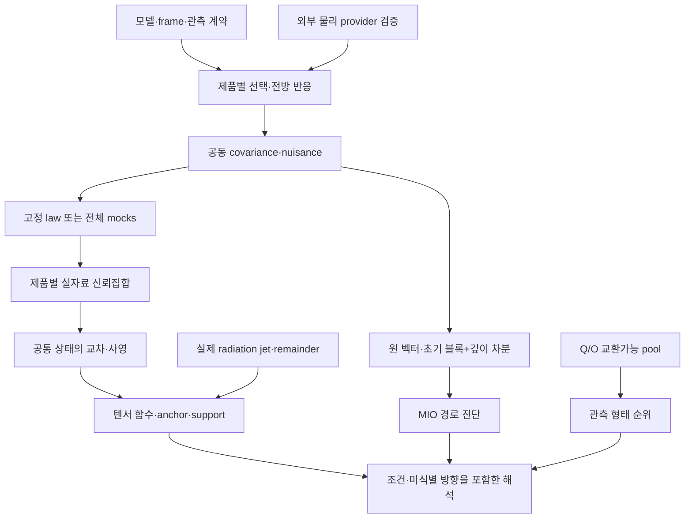

# R9 revision 2 — 모델 검증부터 실자료까지의 설계

기존 R9의 full-Q/O 목표와 공통 상태 추론을 유지하면서 **전체 깊이 공동법칙, 정보를 보존하는 경로 표현, 텐서 함수별 신뢰집합 사상**을 추가한다. 이 문서는 실행 설계이며 실제 관측 분석 완료 보고서가 아니다. 이번에 실행한 것은 `THEORY_EXTENSION.md`의 제한된 수학·통계 실험이다.

기준은 R9 `5e4e899c0dfa2028d81a82ca68ccd11203947470`, 보고서 `d514eabdbd6a464a92ff6e51e1aba91399a054db`, 역할 카탈로그 `9b725899a25fa410e7c3686ce36afaa667d14646`다. 각 분기의 원문을 소비한다는 사실과 해당 코드가 한 브랜치에 병합·검증되었다는 사실을 구별한다. R9 디렉터리는 카탈로그 브랜치에 원본을 이식한 뒤 개정했다.

## 1. 선택한 연구 갈래와 진행 기준

| 연구 갈래 | 이번 진전 | 다음 실행의 성공 기준 | 실패할 때 남길 결과 |
|---|---|---|---|
| 모델·기준계 | 물리 상태/관측 상태/전방 응답의 계약 분리 | 단위·frame·epoch·Einstein/물질 조건과 적용영역, FLRW·무기울기·부호·잔차 검증 | 적용영역 미확정·provider 미적격 |
| 깊이 반응 | 차분의 전체 covariance와 초기 블록 보존 유도 | 같은 estimator의 C 전체와 J, 선택·보정·오차를 묶어 실제 rank/target 확인 | 반응 중첩·식별 불가·law 미확정 |
| 형태·비선형 경계 | 고정 q 수축 섬유의 정확한 선형 support | 실제 q/v 공동영역에서 외부 포함을 인증하고 특이 층 보존 | infeasible·unbounded·unresolved |
| 통계 법칙 | common-set 함수상의 동시 포함과 coverage 대상 구별 | 알려진 law, 추정 covariance law 또는 적격 end-to-end mocks | 정확 추론 대신 명시한 scenario/diagnostic |
| 관측 결합 | shared nuisance 및 anchor를 동일 상태로 유지 | 제품별 수용 후 교차→사영, 물리 provider 있는 함수만 출력 | 일부 제품 부재를 전체 영역으로 보존 |

우선순위는 연구 후보의 개수가 아니라 **빠진 입력을 확보했을 때 실제 관측 질문이 열리는가**다. 172개 구간 전체를 새 정리로 재증명하거나 동치로 합치지 않는다. 물리적 endpoint의 존재, 모든 invariant strata의 분리, entropy-to-temperature, native all-m 전달은 별도 연구 의무로 유지한다.

## 2. 전체 흐름과 소유권

그림의 외부 provider 경로는 물리 전달을 소비하는 경우에만 필요하다. 로컬 boost·관측 형태·거리 보정 경로의 보편적 선행 조건이 아니다. `campaign_dag.json`의 action 조건이 실행 의존성의 정확한 정의다. HTT가 likelihood/posterior와 조건부 모형 비교를, MIO가 law에 맞춘 경로·함수 진단을, obsstat가 추출/전처리/표현을 맡는다. BASS/REC/REI의 식·전달 권한을 HTT가 새로 정의하지 않는다. Rovo의 FED-02는 이 경계의 2026-09-04 조정 기록이며 현재 provider 적격성 증거로 승계하지 않는다.

## 3. 모델 검증의 두 경로

**관측·현상론 경로:** 먼저 β_RO, β_RM, β_MO와 관측 Q/O를 구분한다. radial 설계는 bulk 3·STF gradient 5·expansion 1의 반응을 명시하고 반대칭 회전 성분의 blind sector를 보존한다. 기하학적 가능벡터와 Einstein/물질 제약을 충족하는 해를 동일시하지 않는다. local/source depth kernel의 실제 창과 nuisance 사영을 사용한다. 정규화 L이 가역이어도 rank는 늘지 않으며, 특이값이 작은 방향은 model discrepancy 대비 분리 가능성을 따로 검사한다.

**선택적 물리 전달 경로 R9-29:** 외부에서 제공된 모델의 물질·metric·congruence·입력 초기조건과 전방 연산자를 고정한다. 제한된 Bianchi-I benchmark, 일반 Bianchi model, 현상론적 source template을 각각 다른 family로 둔다. Einstein 제약·보존식·FLRW/무기울기 극한·차원·parity·전단 응력 이력·수치 수렴·remainder·관측 연산자를 검증한다. source monopole/gauge와 Doppler 정규화는 donor의 숨은 재척도까지 해소해야 한다. 이번 작업은 새로운 Boltzmann solver를 구현하지 않는다. `FORMAL_PHYSICS` 또는 provider 관련 증거가 없으면 해당 물리 응답만 막고, 다른 관측 경로를 진행한다.

## 4. 기존 타입을 확장할 계약

| 계약 | 반드시 담을 과학적 의미 | 소비자 |
|---|---|---|
| `SharedStateEmbedding` | frame/epoch/unit, 물리 target·shared eta·제품 nuisance, 실제 incidence | 기존 R9-03/18 |
| `JointDepthLaw` | 정확한 feature 순서·차원, 전체 Cjk, mean/response, covariance 출처·추정/조건부 law, 대상 선택·중복 객체 | R9-24–27 |
| `DepthRepresentation` | 원 Y 또는 (Y0,HY), H/K와 전체 변환 covariance, support/rank, K 학습의 자료 의존성 | HTT likelihood 및 MIO 진단 |
| `JointRegionImage` | 같은 상태·anchor 영역 ID, point/full-set/predictive 대상, exact/outer/inner 보장 | R9-20/28 |
| `TensorFunctionalBundle` | 원 vector/STF, parity, 함수 정의역, 단위, unavailable/undefined/empty/unbounded/unresolved | 구조화된 결과 카드 |
| `PhysicalForwardContract` | source→observer 변환 횟수·전달 family·오차·정칙성·적용영역 | 선택적 R9-29/19 |

새 타입 이름은 제안이다. 구현 시 `common/tensor_functionals.py`, `tensor_departure_statistics.py`, `conditional_exceedance.py`, `depth_path.py`와 HTT adapter의 실제 branch/version을 읽고 기존 타입을 확장한다. 전용 wrapper만 추가해 오래된 scalar 의미를 유지하는 방식은 완료로 보지 않는다.

`x`는 표본×함수 배열, `Q`는 anchor gauge/margin, `F`는 방향별 support, `Pi`는 명시한 law의 초과도 곡면, `G_F`는 구조화된 깊이 경로다. Pi의 통계적 법칙은 MIO matched null과 HTT posterior에서 구별한다. Π 자체는 p-value가 아니다. `NO_MES_ANCHOR`를 반지름 0으로 만들지 않는다.

## 5. 실자료별 입구와 허용 출력

| 제품 | 실제 재사용할 입력·처리 | 먼저 닫을 law/모델 의무 | 허용 출력 / 차단된 해석 |
|---|---|---|---|
| Planck PR3 저차 CMB | 등록된 한 primary component의 지도·mask·beam·pixel·저차 동시 적합; full Q/O와 처리된 mocks | 관측과 각 pseudo-observation의 동일 처리·선택·참조 reuse; covariance와 고차 nuisance; component는 같은 하늘 | full morphology 순위, 별도 local candidate 집합 / 전역 tilt·family 식별 불가 |
| CF4 | 원 거리모듈러스·불확실성·group·위치·깊이·측정법·frame; 이미 변환된 V3k 중복 boost 금지 | selected distance law, 공통 zero point/group 효과, 중첩 창의 전체 covariance, 실제 response rank | 새 방법의 radial 현상론·진단 / 기존 quarantine bulk-flow 수치·radial 와도 측정 금지 |
| JWST CCHP/SH0ES | 권위 있는 실제 anchor/host/method 표, 물리 identity 확인 | 같은 host와 calibration의 공동법칙; CCHP/SH0ES 별도 분석 유지; 위치 match≠동일 물리 객체 | shared calibration 제약 / 거리 신호를 지운 차분을 dipole 측정으로 재해석 금지 |
| DESI | 저장된 적격 release의 BAO 요약·covariance·관측량 정의·fiducial 변환 | 같은 release와 law, 새 release는 별도 변경; 각도 없는 요약과 sky morphology 분리 | 조건부 배경 거리/qiso 집합 / low-ell shape·native tilt 불가 |
| Union3 | 저장된 압축 거리 벡터·covariance·모형별 공통 modulus offset | 압축/근사 Gaussian·선택 모형의 한계; 완전 UNITY law와 구별 | 모형 조건부 scenario / 정확 공동 family에 자동 편입 불가 |
| radiation jet/원격 채널 | 실제 derivative/visibility/선택/광학깊이/provider | 동일 상태·frame·remainder·공동 covariance, 역원천 안정성 | 조건부 물리 image / 단일 작은 C2로 미분 상계 생성 금지 |

이번 작업은 기존 실자료 숫자를 재실행하지 않았다. 외부 release 안내를 확인했어도 입력 버전을 자동 교체하지 않는다. PR4의 기존 전면 skip을 유지한다. CMB full-MV는 같은 Q/O의 좌표이며 독립 자료 채널이 아니다.

## 6. 검증 사다리와 실제 실행 순서

1. **R9-03/05:** 작은 기존 제품부터 단위·frame·row identity·source law를 고정하고 descriptive control을 생성한다. 예산·선택·alpha를 결과 전에 등록한다.
2. **R9-02/04 및 24:** 필요한 명제별 formal admission과 실제 adapter 구현. 현재 연구용 `validate_revision2.py`는 oracle로 사용하며 production 구현과 혼동하지 않는다. 재현해야 할 반례: covariance 부호, 인접 차분 상관, 완전 중복·지지집합 위반, 사라진 공통 모드, stochastic-Q 응답, zero/unknown denominator.
3. **R9-06–11/25:** 제품별 실제 선택법칙·공분산 추정법·공유 nuisance를 확보한다. raw 반복 단위에서 공동 mocks를 만들고 매 반복의 선택·fit·표현을 실제와 같게 수행한다. covariance를 같은 mocks로 추정할 때 생기는 의존을 설명한다. 단순 rank formula나 Hartlap 계수로 law를 대신하지 않는다.
4. **R9-12/14/16/26:** 관측 설계를 고정한 size/coverage/power 실험. target-point와 full identified-set, Gaussian-law 적합성, unresolved 비율, systematic injections를 따로 기록한다. 계산 실패·복원 실패 행도 처리 규칙에 따라 유지한다. 데이터가 이미 탐색되었음을 밝혀 독립 holdout 또는 모든 선택을 재현하는 calibration을 사용한다.
5. **R9-13/15/17/27:** 적격한 제품만 실제 분석한다. 원 Y를 저장하고 MIO 차분 점수를 HTT evidence에 다시 곱하지 않는다. 이력 공통 모드를 식별하려면 Y 또는 (Y0,r)의 전체 law를 사용한다.
6. **R9-18/20/28/23:** 같은 tuple에서 교차 후 함수상 계산. 도메인과 모든 anchor가 유효할 때만 물리 해석한다. directional finite grid는 global supremum이 아니며 후보 최적점은 certified outer bound가 아니다.

통합 family α=0.05는 기존 CMB/CF4/distance-calibration/DESI 각 1/80을 유지한다. CMB morphology와 candidate는 각 1/160. **새 depth 경로는 기본적으로 진단 또는 같은 confidence event의 함수상**이다. 별도 기각 검정으로 추가하려면 해당 제품 예산 안에서 관측 전에 분할하고 전체 scan을 calibration해야 한다. 예산이 빠진 제품에서 사후에 남은 alpha를 가져오지 않는다.

## 7. 실패 독립성과 다음 구현 묶음

CF4의 관측 law가 없으면 CF4 empirical set과 이를 소비하는 depth law만 차단한다. DESI, CMB morphology 및 law-independent 기술 비교는 계속한다. depth covariance가 없으면 경로의 calibrated probability만 차단하고 원 제품의 적격 법칙을 폐기하지 않는다. actual jet가 없으면 empirical σ/ω image를 unavailable로 남기고 형태 순위나 배경 집합을 보고한다. provider 정규화 의무는 그 provider의 물리 image만 막는다.

다음 구현 묶음은 **R9-03 공통 상태 embedding + R9-05 작은 제품 intake + R9-24/25의 전체 covariance adapter**다. source의 `depth_path.py`부터 현재 branch에 가져올 수 있는지 import/API/tests를 확인하고, 교차공분산이 없을 때 명시적으로 unavailable을 반환하도록 한다. law가 확보된 한 제품의 raw→features→joint covariance→mocks→관측 결과를 먼저 끝낸다. 모든 제품을 동시에 요구하거나 새 governance 문서만 반복하지 않는다.

## 8. 하네스와 실제 수행 상태

`physmath-research-loop`의 명시적 선택은 GPT-6 Astra v4.0.0이다. 하지만 이번 세션에는 registry의 연구/코딩 ZIP을 읽는 도구가 없고 첨부에도 없어, GPT-6 원본 패키지를 로드·적용했다는 확인은 **BLOCKED_PACKAGE_UNAVAILABLE**이다. 저장소의 `htt-dag-orchestrator`, `htt-physics-math-audit`, claim firewall/provenance, tensor formalism, local/global, scientific-code-validation, handoff 규칙을 읽고 연구를 수행했다. 두 유도 agent는 GPT-6 Astra로 명시 배정했지만 custom profile/hook 실행은 미인증이다. 이를 원본 하네스 로드나 네 축 CAS 수용으로 포장하지 않는다.

다음 GPT-6 하네스 세션은 등록된 두 ZIP을 확보해 SHA256을 확인하고 START_HERE 및 core instructions를 읽어야 한다. 그 전에도 여기 포함된 공개된 저장소 프로토콜과 reference 코드/설계는 재현·검토할 수 있다. 이번 전달의 연구·설계 상태와 하네스 패키지 활성화 상태를 별도로 보존한다.
