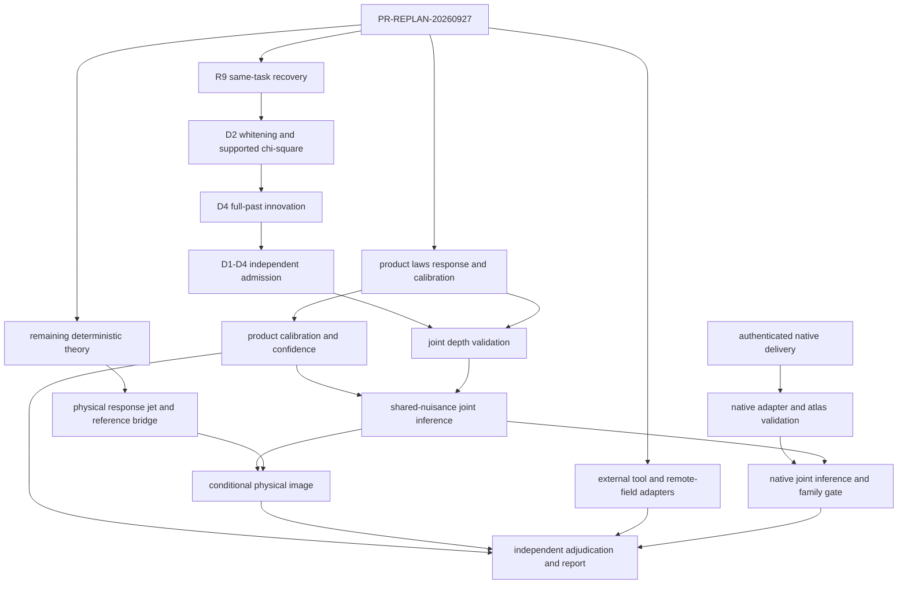

# 현재 코드 기준 잔여 PR 통합 실행 계획

상태 기준일은 2026-09-27이다. 기준 checkout은 원 저장소
`/home/cosmosapjw/Dropbox/bianchi/htt_base`의 `main`, 기준 커밋은
`85e261f49c9df9389946eef74d80c1ccd0509816`, tree는
`f6a72851ff39dbb8db454143c3d547475ac2f2f7`이다. 기존 사용자 변경 일곱 개와
역사적 worktree·실패·예산·검수 기록을 보존한다. 이후 일반 작업도 이 primary
checkout에서 수행하며 새 worktree나 clone을 만들지 않는다.

이 문서는 새 과학 결과나 실행 승인이 아니다. 현재 저장소의 계획 문서를 현재
코드와 연결하는 실행 순서다. 각 원 요구의 구체 대응은
`remaining_pr_crosswalk.csv`가 담당한다.
PR328 handoff 행은 primary checkout에만 있는 local intake의 신원을 기록하며,
committed validator는 다른 checkout에 그 intake가 없다는 이유로 실패하지 않는다.

## 확인된 상태

canonical backlog에는 207개 카드가 있었고 상태는 완료 152, blocked 4,
pending 22, dormant external 28, background 1이었다. 이 55개를 모두 미구현으로
읽지 않는다.

- MES R7 source image는 구현·frozen replay·검수 내용이 존재하며 역사적 child
  종료 수락만 남아 있다.
- R8 PR-247은 24개 node와 52개 handler가 구현·종료되었다. `STOP_INVALID`와
  과학 HOLD는 보존한다.
- PR-172는 반례가 있는 `COMPLETED_FAILED_WITH_RECEIPT`다. PR-184의 후속
  remediation과 함께 소비한다.
- PR-151의 과거 수치는 2026-08-21 지시로 무효화되었지만 1000 EZmock, 25
  AbacusSummit, 관측 record와 audit 입력은 보존되어 있다.
- R9는 D1/D3와 singular Gaussian support component가 컴파일되었다. D2의
  supported pseudoinverse chi-square, D4, 독립 수용은 미완료다.

R9 continuation은 새 task로 바꾸지 않는다. 기존 task는
`R9-D2-D4-REMAINING-FORMALIZATION-20260922`, run은
`R9-D2-D4-CODEX-20260922`, thread는
`01a0c76c-3ca3-7910-b3c0-2398731916c4`다. 2026-09-23 local 기록에 총
2,000,000 token 승인이 있고 730,883 token이 보존되어 있다. 현재 단일 lifecycle
장애는 `OUTCOME_UNKNOWN / EXISTING_CHILD_NOT_CLOSED`다. 같은 task·thread의
지원되는 pre-candidate interrupted-author 재개만 허용한다.

## 통합 DAG

R9와 직접 관계없는 제품 law·보정 작업은 독립 진행할 수 있다. 실제 R9 depth
capability를 요구하는 downstream은 `FORMAL_DEPTH`를 우회하지 않는다. production
writer는 한 명이고 독립 reviewer는 read-only로 같은 checkout을 사용한다.

## 실행 tranche

### T0 — canonical 정합화

`PR-REPLAN-20260927`이 계획 계열과 55개 비완료 카드를 typed disposition으로
연결한다. canonical YAML, JSON, Mermaid, machine-readable mirror를 동기화한다.
strict validation은 PR-119..246의 역사 slice와 명시적으로 등록된 extension card를
따로 센다. PR-247과 namespaced R9/MES/CATALOG/REPLAN 카드를 역사 193개에 억지로
포함하지 않는다.

### T1 — R9 formal continuation

1. 기존 child의 공식 lifecycle 상태를 조회한다.
2. 지원되는 same-task/same-thread resumption이 있을 때만 기존 usage와 source
   digest를 이어받는다.
3. D2는 positive-eigenspace whitening, `z^T V^+ z ~ chi-square(rank V)`,
   rank-zero와 off-support 분기를 닫는다.
4. D4는 full-past conditioning의 range consistency, Schur PSD, conditional law,
   전체 past 독립성과 successive innovation 독립성을 닫는다.
5. D1–D4 전 obligation의 현재 계약과 독립 수용이 끝나기 전 `FORMAL_DEPTH`를
   발행하지 않는다.

복구 API가 없으면 정확한 lifecycle blocker를 유지하고 T2의 독립 작업을 진행한다.
새 task, 새 budget, 다른 thread, 기존 output의 소급 수용은 금지한다.

### T2 — 제품 law와 관측 보정

- **DESI:** PR-151과 PR-203을 하나의 successor-formalism 경로로 실행한다.
  selection/window/weights와 cap, 모든 mock의 nuisance·alpha refit, EZmock과
  Abacus의 역할, 유효 rank를 먼저 고정한다. 무효화된 수치를 재사용하지 않는다.
- **CF4/SDSS:** 선택 전 parent population, FP 생성·적합, group-richness correction,
  CF3 group-level calibration과 전체 교차 covariance가 없으면 PR-201 및 물리
  identified-set 결과를 차단한다.
- **Planck:** 기존 PR3 K1와 BiPoSH mechanics를 재사용한다. PR-198/199에서
  covariance uncertainty, cross-fit, map-product replication과 paired E2E residual을
  먼저 닫고 PR-202의 multi-pipeline 비교로 간다.
- **ACT:** released validated-band 분석과 raw-QE branch를 분리한다. raw filtered
  maps나 QE pipeline이 없으면 그 branch만 typed blocked로 둔다.
- **JWST:** cited-seed linkage를 observed identity나 precision forecast로 승격하지
  않는다. authenticated table과 covariance가 있을 때만 제품 law를 연다.

### T3 — joint 통계와 물리 bridge

PR-155에서 shared sky·foreground·selection·calibration·data overlap의 joint
covariance 또는 정당화된 bound를 만든다. PR-156은 통과한 lane만 사용하여
nuisance projection 뒤 held-out response rank, confusion, coverage와 abstention을
검증한다. PR-181은 systematics를 명시적 competing hypothesis로 두고 FPR을
calibrate한다.

그 뒤 PR-205/206이 실제 공통 state, 전체 dependency와 제품별 집합을 소비한다.
누락 product를 zero response로 채우거나 dependent p-value를 곱하지 않는다.

PR-190..195는 기존 finite witness·sharpness ladder·source attribution·stochastic
bridge를 재사용한다. endpoint attainability, rotating-congruence canonicalization,
OMK 일반 recurrence, non-geodesic MES, observer-boost/matter-tilt response와
finite-window bridge의 일반 요구만 추가한다. 유한 예제나 scalar response를 일반
물리 closure로 부르지 않는다.

### T4 — 판정과 보고

PR-157은 PR-143..156의 terminal receipt를 성공·실패·입력 차단·abandon으로
구분한다. PR-158은 그중 수용된 claim만 generated source로 만든다. PR-178의
과학 dependency에서 manuscript PR-158을 제거하고 검증된 DESI calibration과
covariance를 직접 요구한다. PR-207/208은 독립 재현과 최종 판정 뒤 수행한다.

### T5 — 외부 도구와 native delivery

external-fusion 계획 ID는 `EF3:247`처럼 canonical ID와 구분한다. 현재 toy
remote-field DGP나 plugin probe는 실행된 물리 계산이 아니다. 실제 shell transfer,
lightcone/foreground, kSZ/pSZ remote estimator, response atlas, survey design과
독립 inference는 적격 입력이 있을 때 별도 card로 연다.

PR-159..166과 PR-229..246은 하나의 native 공급 경로로 연결한다. 229–239의 solver
생산 요구는 외부 provider milestone이고 htt_base는 delivery authenticity,
transport/convention, benchmark, atlas, response/error와 consumer conformance만
검사한다. PR-240..246은 수용된 delivery 이후에만 공동 likelihood, cross-track
통합, 외부 재현과 보고를 수행한다.

## 구현 경계

- `common`은 SSoT, anchor, source/response type, finite image, shared state와
  semantic guard를 소유한다.
- `obsstat`은 release row와 observable feature, mock extraction, 처리 response를
  소유한다.
- `htt`는 실제 sampling law, nuisance, likelihood, confidence/identified set을
  소유한다.
- `mio`는 family-independent diagnostic과 상태 표시를 소유한다.
- TSC/Teff는 legacy reproduction 이외의 새 science owner가 아니다.

새 adapter는 frame, order, units, shared latent state, row identity와 full covariance를
검증한다. singular PSD를 PD 전용 함수에 ridge나 clipping으로 통과시키지 않는다.
canonical directional `F`를 수학 gauge의 제곱과 혼합하지 않는다. residual image는
origin-centred MES anchor가 아니다.

## PR별 완료와 중단

각 PR은 다음 중 하나의 terminal evidence를 남길 수 있다.

- 구현·검증 성공
- 실행된 반례 또는 실패 receipt
- 이름이 있는 외부 입력 차단
- authenticated native delivery 대기
- 현재 구조로 대체되었다는 crosswalk

테스트 PASS, source 존재, publication, 독립 검수, lifecycle 수락과 과학적 수용은
각각 다른 상태다. 수치 tolerance와 input identity는 실행 전에 고정한다. MES replay,
SDSS 전체 mock, D3 proof처럼 이미 완료된 실행은 관련 source가 변하지 않으면 반복하지
않는다.

physical source closure, target/source full response, reference `U_R`, optical bridge는
계속 `HOLD`다. empirical MES D는 `HOLD_NOT_COMPUTED`다. missing mean, correlation,
transfer를 zero, identity, independent Gaussian으로 채우지 않는다.
