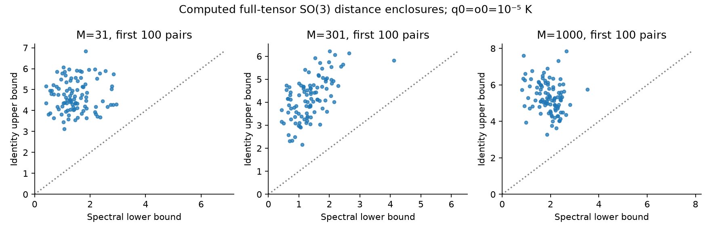
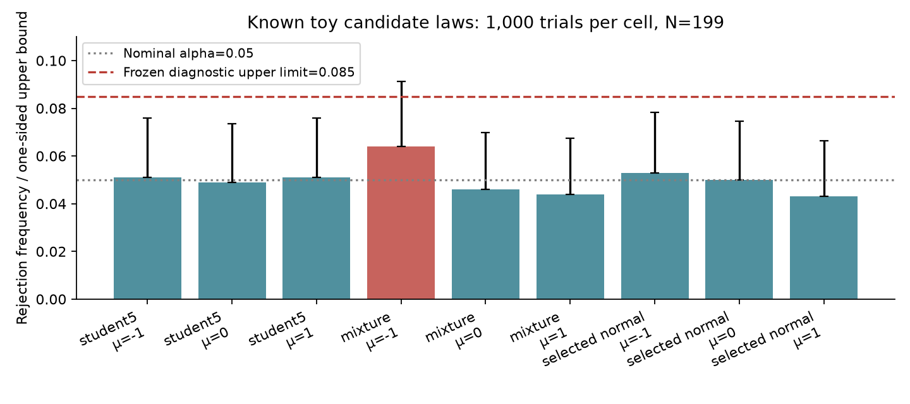

# R8 initial A/C execution — 2026-09-09

This is the first implementation increment from PR #467 at design commit
`c5b991e6ef8e13a28da9a0848da63ded4d52c86f`. It implements conservative tensor
bounds/ranks, structural Gaussian support, partial-law methods, live-law dispatch
and declared toy simulator ranks. **Full R8 and full Units A/C remain incomplete.**
The initial runner emits 24 node / 52 action receipts; receipt settlement does
not mean that an unimplemented action has run or that a scientific claim passed.
R7 production code, numerical records, donor pins and the historical full-plan
STOP_INVALID are preserved.

## Executed results

| Scope | Actual result | Interpretation |
|---|---|---|
| R8 tests | 28 passed | Current target imports; independent implementation review closed |
| Selected R7 regressions | 72 passed | Gaussian, calibration, routing and evidence consumers only |
| Mock 1 | 30 pools: 10 each at M=31,301,1000 | Positive O1 bounds for every non-diagonal pair; all 30 ranks unresolved after one 60 s refinement checkpoint per pool |
| Independent interval reference | 3,000 initial pair enclosures checked | 256-bit independent formula implementation; shares SymPy root isolation engine |
| Mock 3 | 10,000 trials; exact rejects 342, interval rejects 11, unresolved 1,537 | Every exact p was enclosed; exact FPR one-sided 99% upper 0.0386661 |
| Mock 4 | 10,000 trials per rho=-1,0,1 | Fixed marginal budgets; simultaneous one-sided bounds all below .06 |
| Mock 5 | 1,000 outer trials per each of 9 toy cells | Student and selected-normal pass; mixture adapter held because mu=-1 upper 0.0911411 exceeds fixed .085 |
| New CAS | Wolfram/SymPy/Sage all five obligations PASS; Lean two complete, three unresolved | Stored aggregate CAS_CONFLICT; claim promotion false; no counterexample found |
| Actual DESI compression | Conditional qiso CI below, live law re-read | Released syst Gaussian summary only |
| Unchanged resume | 0 new attempts | Source/evidence/input identities unchanged |

The mock-5 mixture failure is preserved without changing the seed, significance
level, cell size, threshold or null family. Passing toys do not admit real
CF4/JWST simulator laws. Mock-1's checkpoint is shorter than the design's maximum
scope resource cap: unresolved ranks are a numerical implementation limitation,
not a physical null rejection or missing-data diagnosis. Local feasible optimizer
starts, persistent resumable pair trees and more efficient large-pool refinement
remain outstanding. Observed CMB ranks were not executed without a product law.

The newly read DESI BGS compressed observation has qiso=0.9828804416839027 and
variance 0.00034950706479147084. The fixed released Gaussian law gives the
outward-enclosed conditional 95% interval
**[0.9462387032298103, 1.019522180137995]**. For qiso=1 the quadratic is
0.838550365535873, below the rank-one threshold 3.841458820694124. The displayed
interval matches the historical R7 value; its new numerical acceptance uses an
exact rational critical-value bracket. This is compatibility with the reference
inside this conditional law, not isotropy, global tilt, a posterior probability,
or verified coverage of the original catalogue. No stat-only likelihood was
multiplied into the selected syst experiment.

## Evidence and reproduction

- [Validation and target imports](validation.json)
- [Scoped campaign summary](campaign/summary.json)
- [Mock 1 summary](mocks/orbit_summary.json), [reference intervals](mocks/orbit_reference_intervals.json)
- [Mock 3](mocks/mock3.json), [Mock 4](mocks/mock4.json), [Mock 5](mocks/mock5.json)
- [Figure inputs and source identities](figure_manifest.json)
- Independent proofs, raw failures, assignments and review:
  `.agent-harness/runs/R8-AC-20260909/` at repository root. The new CAS contract
  hash is `5ff7f84db01b6871f74f7c60b5c36430a4cae93735466e277bd9c4019ab22723`.
  The observed aggregate is `artifacts/observed_cas/adjudication.json`;
  the review is `artifacts/sympy/production_review.json`.

Run from this worktree with the existing environment:

```sh
export PYTHONPATH="$PWD/htt/htt:$PWD/htt/src:$PWD/htt:$PWD"
export PYTHONDONTWRITEBYTECODE=1
PY=/mnt/sn850x2t/htt_base_e2e/venvs/htt_base-py312-20260829/bin/python
"$PY" -B -m pytest -o addopts='' --import-mode=importlib tests/r8 -q
"$PY" -B -m pytest -o addopts='' --import-mode=importlib tests/r7/test_gaussian_law.py tests/r7/test_calibration_scopes.py tests/r7/test_campaign_routing.py tests/r7/test_evidence_binding.py -q
"$PY" -B scripts/observed_runs/run_tensor_joint_r8.py --dag docs/research_program/tensor_joint_r8/campaign_dag.json --run-dir /tmp/r8-inspection --dry-plan
```

R7 evidence-consumer tests require the two historical CAS fixture files at
`.agent-harness/runs/TENSOR-JOINT-R7-20260908/`; exact copies are included as
historical consumer fixtures, not new R8 evidence. The initial missing-file setup
failures and restoration hashes are retained. Neither the old 110,000 Gaussian
trials nor the old R7 CAS science was re-executed.

Bulk mock-1 pool NPZs are retained locally at
`/mnt/sn850x2t/htt_base_e2e/TENSOR-JOINT-R8-20260909/numerical_runs/mock1_{31,301,1000}/`.
Compact results, seeds, hashes and the 3,000 reference comparisons are published.
The exact loaded mock-1 generator/orbit source snapshot is preserved under
`artifacts/mock1_loaded_sources/`; the final STF guard was subsequently improved
for extreme disparate scales without changing the valid mock arithmetic.

## Review, figures and remaining boundaries

Independent review found and confirmed repairs for a scalar quantile boundary,
STF guard overflow/underflow, all-failed capability issuance and malformed-product
sibling suppression. The final reviewed runner SHA256 is
`1b65de91051427efb9f5e0f314ac3aaaf8dd654ee9ca134ae8c78d284a7a32dd`.
The independent reviewer additionally checked 69 critical-value enclosures against
120-digit arithmetic. Review closure is implementation evidence, not four-axis
mathematical or observational admission.

Both PNGs below were opened and visually inspected locally. Labels, axes and
source correspondence were checked; the mixture failure remains visible.
The orbit plot shows **initial** spectral lower/identity upper bounds, not refined
intervals or a measured physical confidence region. No methods PDF was built in
this increment.




The actual native subagent stop hook resolved the old checkout/run. After each
producer repaired its envelope schema, the strict validator and stop consumer
both passed when invoked explicitly in the correct R8 worktree. These are local
consumer checks, not genuine native launch/stop acceptance. The wrong-checkout
routing requires its own minimal operational correction. The original envelopes,
profile startup failures and mutation of timestamped Sage/Lean observed receipts
are disclosed in the producer packaging records; no missing old bytes are claimed
recovered.

Next independent work: repair worktree hook routing, implement complete MV and
same-row ablations, physical jet/region images, owned flow/map controls, restricted
stress/optics channels and final scientific synthesis. Absent laws, missing jets,
unresolved proofs and held simulator families remain separately scoped.
