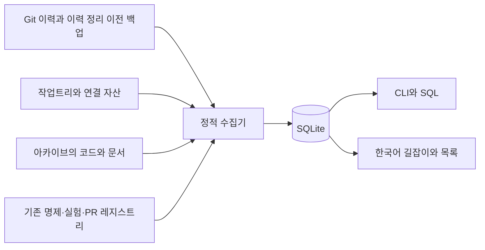

# 구조와 해석 방법

Owner: COMMON. Scope: 정적 프로젝트 탐색. 이 문서와 DB는 non-claim-bearing이다.

## 프로젝트의 주요 소유 경계

| 영역 | 코드 탐색 출발점 | 문서상 역할 |
|---|---|---|
| common | `htt/src/common` | 계약, 의미 구분, 출처와 레지스트리 |
| obsstat | `htt/obsstat` | 관측 특징·저다중극 통계·형태·null 특징 추출 |
| BASS Python | `htt/bass` | transfer·물질·배경·기하 관련 구현과 어댑터 |
| BASS Rust | `src` | Rust 라이브러리 및 Python 연결면 |
| HTT | `htt/htt/htt` | 모델 의존 추론·posterior·PPC·결합 분석 |
| MIO | `htt/mio` | family-independent 진단과 `(x,Q,Pi,F,G)` 보고 |
| legacy | `old_version`, `legacy`, `htt/tsc_legacy` 등 | 구버전 구현·설계·재현·대체 이력 |
| 실행·증명 기록 | `docs/generated`, `formal`, `.agent-harness/runs` | 해당 버전에 한정된 소스와 저장된 근거 |

이 표는 소유와 탐색 경계다. 각 모듈의 현재 호출 연결은 DB의 `imports`, `calls`,
`references`를 확인한다. 정적으로 유일한 후보를 찾아도 실제 dispatch·동적 로딩·
실행 성공이 증명되지는 않는다. Python 루트가 여러 개이므로 모호한 import는
임의의 루트로 결정하지 않는다. 레코드의 owner는 원문에 명시된 값이 있으면
그 값을 보존하고, 없으면 경로 규칙으로 추정한 탐색 분류다. 새 소유권 결정이 아니다.

## 데이터 모델

| 테이블 | 용도 |
|---|---|
| `sources` | 실제 Git 저장소·복제본·설치 의존성·파일시스템 출처 |
| `commits`, `refs`, `trees` | 전체 선언 이력과 각 커밋의 디렉터리 트리 |
| `commit_aliases` | 2026-07-17 이력 정리 전후 커밋 대응. 내용 동일성 선언은 아님 |
| `contents` | 바이트와 파서 문맥으로 중복 제거한 정적 추출 결과 |
| `files` | 경로·내용·출처·아카이브 부모를 갖는 파일 버전 |
| `records` | 코드·기능·이식 언급·분석·명제·계획·근거·업데이트·주석 |
| `edges` | 참조·import·호출·대체 관계와 해석 수준 |
| `snapshots`, `members` | 브랜치 끝·기준 커밋의 빠른 파일 조회 |
| `filesystem` | 물리적 위치, 크기·시각, inode, 링크, 파일 버전 별칭 |
| `gaps` | 미접근·구문 오류·범위 제한·모호성의 위치와 사유 |
| `search`, `catalog` | 전문 검색 인덱스와 통합 조회 view |

같은 내용이 여러 작업트리에 존재하면 파일 버전과 물리 위치를 연결한다.
추적 파일의 원시 바이트를 Git blob과 비교하여 같은 경우 이미 조사한 버전의 별칭으로 다룬다.
Git clean filter나 diff driver는 실행하지 않는다. 필터·줄바꿈 변환으로 바이트가
달라지면 별도 작업트리 버전으로 보존하며 과학적 오류로 판정하지 않는다.
자료의 실제 실행·검증 상태는 이 별칭 연결로 승격되지 않는다.

`observed_commit`은 해당 파일 버전이 발견된 **대표 관찰 커밋**이다. 최초 작성일이나
모든 사용 커밋을 뜻하지 않는다. 동일 파일이 유지되는 동안 그 의존 파일은 바뀔 수
있다. 저장된 참조 연결은 명시된 관찰 버전에 한정해 해석해야 한다.
`refs`와 트리 구조는 다른 수집 커밋의 파일 조합을 별도로 조회할 수 있게 한다.

## 증명·명제와 상태 충돌

같은 P/T/claim ID를 가진 항목이라도 파일·가정·버전이 다르면 병합하지 않는다.
레지스트리의 ACTIVE와 후속 결과의 FAIL이 동시에 존재할 수 있다. 이를 자동
다수결이나 날짜순 덮어쓰기로 해소하지 않고 두 출처를 함께 보여준다.

증명의 확인은 다음을 구별한다.

1. 원문이 증명되었다고 기록함.
2. 증명·유도·검증 결과 파일이 참조됨.
3. 해당 버전에서 그 파일을 찾음.
4. 가정과 명제에 맞는 증명인지 심사하거나 다시 실행함.

이번 작업은 정적 조사이며 4번의 신규 판정을 수행하지 않는다. 원문에 이미 존재하는
심사 기록은 그 버전의 근거로 조회할 수 있다. `show`의 `proof_evidence`는
원문의 증명 주장, 참조 파일 수, 연결된 기록의 명제 ID 일치를 별도로 보여 준다.
ID가 일치해도 가정·정의역의 동등성을 승인하지 않는다. CAS 네 축의 독립 검증이나 native
solver의 scientific admission을 카탈로그가 대신하지 않는다.

## 가능한 분석과 업데이트

분석 항목에는 정적으로 찾은 진입점, 인자, 입출력 코드 표현식, 설계의 입력 조건,
저장된 실행 기록과 caveat를 제공한다. 경로가 있다고 해서 데이터의 완결성·공분산·
null 적합성·관측법칙·transfer 조건까지 충족한 것으로 해석하지 않는다.

업데이트 목록은 스텁 본문, 원문이 지정한 후속 항목, 구체적인 미완성 표시를
출발점으로 한다. `consumer_dependent`는 실제 소비자가 필요한지 먼저 확인한다는
뜻이다. 구버전이라는 이유만으로 오류로 분류하지 않는다. 문법 오류·미지원 자료는
coverage에서 원문을 찾아 별도로 검토할 수 있다.

## 재현의 단위

CLI 조회와 배포 DB 복원은 원래 연구 호스트 없이 가능하다. 전체 재수집은 수집 범위의
Git 객체·작업트리·아카이브·의존성 목록이 필요하다. 논리적 레코드 동일성을 검수하며,
SQLite 페이지 배치나 gzip 바이트의 우연한 동일성을 과학적 재현으로 해석하지 않는다.
