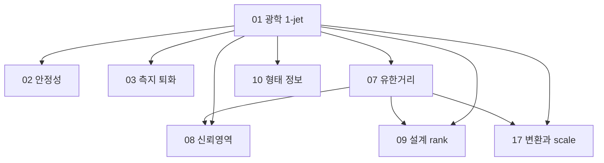
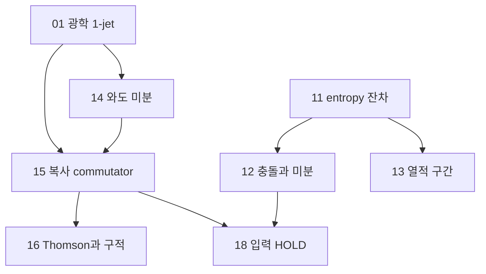

# 모든 식별된 증명 의무의 순차 검증 계획

이 문서의 목표는 이미 게시된 연구를 실제 로컬 증명으로 이어가는 것이다. 이 문서 자체는 새 증명이나 실행 결과가 아니다. 원본 진술·수정 계약·과거 실패를 보존하며, 빈 곳을 수치 예제로 채워 전체 정리 PASS를 만들지 않는다.

## 1. 범위와 기준의 우선순위

1. 현재 사용자 지시와 기존 primary checkout 정책.
2. 현재 `AGENTS.md`, `docs/harness/CURRENT_CODEX_RUNTIME.md`, 실제 설치된 CUH-G authority.
3. 해당 task의 원본/후속 봉인 계약, 허용 입력, 비용·launch·실패 기록.
4. 원문 `CAS_TASKS.json`·`EXECUTION_INDEX.json`과 후속 RETURN·ADJUDICATION·REVIEW.
5. 이 패키지의 Host 실행 계획. 이 문서는 계약·validator·입력 allowlist를 변경하지 않는다.

`GR-CAS-01…18`은 GR·통계 연구의 원 `CAS-01…18`, `PORT-CAS-01…12`는 앞선 이론 이식 문서의 별도 `CAS-01…12`를 뜻한다. 별칭은 이 패키지 안에서만 쓰며 원 contract ID를 바꾸지 않는다. 특히 두 패키지의 CAS-11은 서로 다른 정리다.

## 2. 현재 성과의 정확한 계승

- **C02:** 임의 유한 양의 차원, 모든 rank의 실대칭 PSD Gram에 대해 모든 계수에 대한 부등식으로부터 range 조건과 의사역행렬 ellipsoid 상한을 얻는 순방향 정리. `epsilon=0`, 영행렬·특이행렬 포함. 역방향은 이번 수용 범위가 아니다.
- **C03:** 유한 양의 정부호 실내적 공간의 투영·잔차 직교성·Gram PSD·Cauchy–Schwarz. 영차원, 빈 family, 영·종속 잔차 포함. 두 보조 Wolfram receipt 해시 정정은 기존 `REPAIR_CLOSEOUT.json`과 역사 seal을 함께 유지한다.
- **C04:** 실수 `0<L<=U`, 모든 `x in [L,U]`, 모든 실수 competitor, `L=U`를 포함하는 relative minimax 원자 성분. CAS PASS와 독립 reviewer 미완료를 분리한다.
- C02/C03의 앞 세 축은 임의 차원 해석 증명 + 엔진 대수 인증이고 Lean은 전체 유한 정리의 kernel proof다. 네 축 모두가 완전 형식 증명이라는 뜻은 아니다.
- CAS-03/11/13의 과거 conflict/fail을 삭제하거나 최신 성분 PASS로 덮어쓰지 않는다. 초기 `EXECUTION_INDEX.json`의 NOT_RUN도 최신 반환에 대한 덮어쓰기 권한이 아니다.

## 3. 한 번에 하나의 증명 단위를 끝내는 규칙

각 단위는 기존 로컬 증거 대조 → exact statement/의존 전제 매핑 → 승인된 봉인 계약 → 네 독립 축 순차 작성·실행 → 실제 `run-adjudicate` → 미해결 해석 의무 판정 → 등록 독립 검토 → 지원된 lifecycle 종결 → 관련 파일만 게시·R1 순서다.

기본은 네 축까지 **순차 실행**한다. 네 축은 별개 fresh context와 자기 소스 소유권을 유지하고, adjudication 이전에 형제 축의 소스·유도·결과를 보지 않는다. 동일 스레드의 네 번 역할 연기는 네 독립 축이 아니다. 현재 계약이 다르면 축을 합치거나 비용을 이유로 줄이지 않는다. 엔진 실행의 병렬화가 필요해도 독립성·current router·원 예산을 충족하는 별도 결정이며 이 인계의 기본 실행 방식은 순차다.

기존 task가 있으면 task/run/cost를 계승한다. 등록 성공·dispatch·실제 child runtime·review 완료는 다른 상태다. 실제 Host 모델이 미지원이면 alias나 허위 tier로 바꾸지 말고 공식 지원 경로를 사용한다. 등록된 활성 단위를 처리하는 동안 HEAD를 유지하고, 게시 commit 이후의 다음 단위는 그 새 HEAD에서 등록한다.

이미 PASS한 정확한 성분은 새 finding·명세 변경·seal 불일치가 없으면 재실행하지 않는다. 대신 새 정리가 그 성분을 쓸 때 가정·타입·부호·정규화·domain·양화가 일치하는지 명시한다. 기존 source hash를 새 contract hash의 실행 증거로 바꾸지 않는다.

## 4. 순차 선택과 차단의 전파

첫 로컬 단계는 C01 raw 및 전체 run inventory다. 그 다음 C01 승인·지원 경로가 이미 성립하면 C01 → CAS-11 해석 연결을 먼저 한다. 성립하지 않으면 C01을 HOLD하고 다음 순서를 따른다.

`GR-01 → GR-03 → GR-10 → GR-14 → GR-15 → GR-05 → GR-06 → GR-04 → GR-02 → GR-07 → GR-17 → GR-08 → GR-09 → GR-11 → GR-12 → GR-13 → GR-16`.

이것은 고정 우선순위다. 각 노드를 시작할 때 실제 의존 전제가 닫혔는지 확인하며, 앞 노드가 막히면 독립된 다음 eligible 노드를 고른다. 예를 들어 GR-01의 미해결 전제가 후속 optical/통계 노드를 막더라도 GR-05/06은 독립적으로 진행할 수 있다. GR-11이 막히면 이를 필요로 하는 GR-12/13의 전체 종결은 보류된다. C04 review가 막혀도 GR-01이나 C02/C03 보존을 막지 않는다.

`PROOF_DAG.mmd`의 화살표는 원문의 parent-level 의존성이다. 단순히 앞쪽에 그려졌다는 이유로 모든 분석 의무를 무조건 전파하지 않는다. 실제로 필요한 하위 정리만 사용할 수 있음을 계약/진술에서 사전에 설명한 경우에만 더 좁은 범위를 사용한다. 그렇지 않으면 부모 전체의 해당 범위 완료를 보수적으로 요구한다. 원 의존성을 지우거나 사후에 premise를 바꾸면 안 된다.

광학·통계 경로는 다음과 같다. 숫자는 GR-CAS 번호이며, 도식은 PASS 상태를 표시하지 않는다.

복사·entropy 경로에서 CAS-18은 입력이 없는 보류 목표다. 11은 C01 하나의 별칭이 아니라 유한 성분과 해석 의무를 함께 갖는 부모다.

물질류 경로는 독립된 GR-05와 GR-06을 확인한 뒤 GR-04로 합류한다. GR-04의 EF1/EF4는 원 contract에 독립 하위 목표로 표시되어 있지만 EF6의 존재·반례 해석은 05/06의 해석 의무를 필요로 한다.

## 5. C01·C02·C03에서 연속체 정리까지 남은 연결

C01 v3는 gradient-span 조건의 허용 입력 문제로 막혔다. 외부 brief를 몰래 넣거나 부모 명세의 내용을 prompt로 옮기지 않는다. v4 후보는 선형 moment map과 쌍대 map으로 두 전제를 명시하지만 **아직 사용자 채택이 없다**. 이 게시/전체 인계 요청을 특정 후보 승인으로 기록하지 않는다. 이미 별도 구체적인 채택 기록이 있으면 재승인을 요구하지 않는다. 채택 이후에도 같은 task 이력 보존, 지원된 계약 갱신과 실제 모델 라우팅이 필요하다. 원 v3는 불변이다.

다음 수식들은 미래에 증명할 연결 의무를 설명한다. 이번에 새로 CAS 인증했다는 뜻은 아니다. 공통 측도, 허용된 함수류, 적분가능성과 경계 조건을 고정한 뒤 segment에서 Hessian 하한을 확보해야 한다. 스칼라 경우 양의 weight W에 대해

\[
D_H(f\Vert g)\geq \frac12\int\frac{(f-g)^2}{W}\,d\nu,
\qquad D_H(f\Vert g)\leq\epsilon
\]

를 정당화해야 한다. Taylor 적분 잔차와 미분·적분 교환, endpoint 극한은 별도 증명 대상이다. W가 0·무한인 부분이나 동치류/영집합 처리는 domain에서 명시해야 한다. matrix Hessian이면 scalar 부등식을 그대로 복사하지 말고 연산자 부등식·쌍대 pairing을 정의한다.

retained subspace V에서 moment 오차가 실제로 0이고 `r_j=K_j-P_V K_j`라면, weighted Hilbert 공간에서 모든 실수 a에 대한

\[
\left|\sum_j a_j e_j\right|^2\leq 2\epsilon\sum_{ij}a_iR_{ij}a_j,
\quad R_{ij}=\langle r_i,r_j\rangle_{L^2(Wd\nu)}
\]

를 얻는 연결을 증명한다. **C02의 전제인 all-a 부등식이 여기서 생긴다.** C03만 통과했다고 실제 물리 잔차가 이 전제를 만족하는 것은 아니다. 그 다음 C02를 써서 singular range/ellipsoid를 닫는다. Gram은 관측 잡음 covariance가 아니다. 측정으로 entropy budget ε와 envelope를 확보하는 문제는 조건부 정리의 증명과 별도이며 입력 없으면 조건부 결과로 남긴다.

## 6. GR·통계의 모든 작업 카드

각 항목에서 유한 성분과 해석 의무를 모두 완료했을 때만 해당 **조건부 정리의 명시한 범위**를 닫는다. 물리적 입력 인증·관측 적용·우선권은 별도다. 아래 원문 target은 Host의 범위 대조용이며 축별 허용 입력을 대체하지 않는다.

### GR-CAS-11 — Bregman·moment 잔차 ellipsoid

원 claim: `TEFF-A0, TEFF-A1, TEFF-A2`. 선행: 없음.

원 준비 계약: [CAS-11.json](../cas/contracts/CAS-11.json); SHA-256 `6588ac42ca6724e58b2f673b0ee2c3234b7a3a6ab1df35a6d1f942c03f860025`. 후속 local seal이 있으면 원본을 덮지 말고 그 계보를 사용한다.

과거 부모 raw aggregate: `CAS_FAIL`. 현재 부모 미종결.

- **CAS-11-C01:** Verify the Bregman three-point expansion with symbolic function and gradient values, and cancellation when the gradient difference lies in the span of matched linear moments.
- **CAS-11-C02:** In an arbitrary finite-dimensional real inner-product space verify residualized Gram PSD and that |a.e|^2<=2epsilon a^T R a for all real a implies e in range(R) and e^T Rdagger e<=2epsilon, including singular and zero R.
- **CAS-11-C03:** Give the corresponding finite weighted projection/Cauchy certificate. The continuum Hessian-envelope/Taylor integral bound is a separate prerequisite, not an output of finite discretization.

남은 해석 의무:

- Integral Taylor and endpoint limits
- Hilbert projection and weighted Cauchy
- Bregman integrability/momentmatching

경계·negative control:

- ENT-R0 allretained->e0
- ENT-SINGULAR duplicatekernels impose range
- ENT-MISMATCH add momenterror
- ENT-DOMAIN boundary/infinite divergence excluded

금지할 확대 해석: Gram not noise covariance; No epsilon from fittedentropy alone; No wholemanuscript recertification.

### GR-CAS-01 — 광학 역산·가속도·국소 1-jet

원 claim: `OPT01, OPT02, OPT03, OPT04`. 선행: 없음.

원 준비 계약: [CAS-01.json](../cas/contracts/CAS-01.json); SHA-256 `9f1bbb018e211b4d50c50532b57cf708acffdd6a01f06a24f5cb8cbb21709b57`. 후속 local seal이 있으면 원본을 덮지 말고 그 계보를 사용한다.

- **CAS-01-C01:** For unit future u and symmetric covariant S, B=S+(u^T S u)g obeys u^T B u=0 and is invariant under S -> S+a g; a symmetric form vanishing on every K=(-1,n), n.n=1 is proportional to g.
- **CAS-01-C02:** For b=B u and spatial skew covariant W, Q=B+b u_flat^T-u_flat b^T+W obeys Q u=0, sym(Q)=B and c Q^T u=2c b. Derive theta and STF spatial symmetric projection with the stated units.
- **CAS-01-C03:** For observer-rest u=(1,0,0,0), B(K,K)=theta/3+sigma_ij n_i n_j-A_i n_i/c. General S gives h0+h1.n+h2:nn.
- **CAS-01-C04:** Differentiate v^b=u^b+c^(-1)g^(bd)Q_ad x^a and v/sqrt(-g(v,v)) at x=0; recover the value and first derivative. This check is at the jet, not an existence theorem.

남은 해석 의무:

- Jacobi vertex Taylor order/screen invariance require geometric ODE argument
- Smooth timelike neighborhood/local flow and source extension not proved by origin algebra

경계·negative control:

- OPT-C-SCALE: if B defined from ∇u then A=2c^2 B u
- OPT-ACCEL-DIPOLE: u=o gives h1=-A/c
- OPT-PAST-BRANCH: negative unit branch unphysical
- OPT-ZERO-SLOPE: W remains arbitrary

금지할 확대 해석: No fixed Einstein matter realization; No finite catalogue/vorticity recovery; No sourceward/propagation sign exchange.

### GR-CAS-03 — 측지 고유공간·퇴화·임의 shear 역산

원 claim: `OPT07, OPT08, OPT09`. 선행: GR-CAS-01.

원 준비 계약: [CAS-03.json](../cas/contracts/CAS-03.json); SHA-256 `e12189010d0da32212c45a3371001058da368a086527945a121e03a74f6526c1`. 후속 local seal이 있으면 원본을 덮지 말고 그 계보를 사용한다.

과거 부모 raw aggregate: `CAS_CONFLICT`. 현재 부모 미종결.

- **CAS-03-C01:** With g(u,u)=-1, Bu=0 is equivalent to (g^-1 S)u=s_t u and B=S-s_t g. Parameterize the zero-expansion rest kernel and check normalization, without inferring a timelike eigenline exists for every Lorentz-self-adjoint S.
- **CAS-03-C02:** Contract the B_epsilon_chi family with K and verify the exact stated slope difference; check the r zero-eigenvalue controls.
- **CAS-03-C03:** For arbitrary invertible D=H I+sigma, verify the linear relation h1=-2D beta and inverse beta=-D^-1 h1/2; the truncated inverse has defect sigma^2 beta/H^2. Verify the rational diagonal negative control. An O(beta^2) remainder needs a separate bounded Taylor argument.

남은 해석 의무:

- Timelike orthogonality and rest spectral theorem
- Limit/countersequence and asymptotic remainder constants

경계·negative control:

- GEO-ZERO-EIG: diag(0,0,b2,b3)
- GEO-REPEATED-NONZERO: D=bI,b≠0
- GEO-NOTIMELIKE: self-adjoint alone insufficient
- GEO-EQ37: sigma/H=diag(1/2,-1/4,-1/4),beta=(epsilon,0,0) yields3epsilon/4 with truncated inverse

금지할 확대 해석: No uniform lost-gap inverse; No author-confirmed erratum; No dust Einstein realization.

교정 후 계약 7개는 별도로 연결한다. 원 CAS-03을 무조건 재실행하지 않는다.

| 후속 계약 | SHA-256 |
|---|---|
| [CAS03-C01-GENERAL-REST](../cas_corr_followup_20260930/intake/contracts/CAS03-C01-GENERAL-REST.json) | `b8337089103fe80ccd4bb70dd0ecb4b034595211e642aa189231a6d56ee7c975` |
| [CAS03-C02-GEODESIC-FAMILY](../cas_corr_followup_20260930/intake/contracts/CAS03-C02-GEODESIC-FAMILY.json) | `8786a9d615b7aa37055f051213384e4578e9dc914fc8e94cc7596a9aa1e1023f` |
| [CAS03-C02-WRONG-FAMILY-CONTROL](../cas_corr_followup_20260930/intake/contracts/CAS03-C02-WRONG-FAMILY-CONTROL.json) | `be9a2af4a2500451d3523aa7c733dda034b3f18ed669966dc92a44f8dc32df55` |
| [CAS03-C03-EXACT](../cas_corr_followup_20260930/intake/contracts/CAS03-C03-EXACT.json) | `2b8d0d00e0fafe6962afee3529feb2a2b862129532bacb89119689287659b300` |
| [CAS03-C03-POLYNOMIAL](../cas_corr_followup_20260930/intake/contracts/CAS03-C03-POLYNOMIAL.json) | `ec0382f15990622cb0983681442565cdef1cd686843b98f56ba22d5f9f927607` |
| [CAS03-C03-REMAINDER-TRANSFER](../cas_corr_followup_20260930/intake/contracts/CAS03-C03-REMAINDER-TRANSFER.json) | `639592847ca66c6120e31863b06d3ef1eecd3e0a48c54d3bae07cd7fceb4ac89` |
| [CAS03-C03-TRUNCATED](../cas_corr_followup_20260930/intake/contracts/CAS03-C03-TRUNCATED.json) | `e6530fc867b2acfa9ab3bd556a86a23d2be32941c557a988b6a1cbc88880c861` |

링크는 원격에 게시된 byte-identical intake 사본이다. 당시 반환의 원 로컬 경로는 PROOF_DAG.json의 historical_local_path에 보존했다. 실제 활성 계약의 경로·입력 권한을 이 링크로 자동 교체하지 않는다. 일반 rest expansion은 STF 5성분이 아닌 대칭 6성분이다. wrong-family control과 올바른 geodesic family를 구분하고, truncated inverse 오차와 물리적 Taylor remainder를 섞지 않는다. 현재 확보한 교정 반환은 일부 재검증과 미완료 Sage/Lean 범위를 기록하므로 전체 PASS를 계승하지 않는다.

### GR-CAS-10 — 형태 정보·스칼라 보완·cutout 한계

원 claim: `STAT-INFO-1, STAT-INFO-2, STAT-INFO-3, STAT-INFO-4, STAT-INFO-5`. 선행: GR-CAS-01.

원 준비 계약: [CAS-10.json](../cas/contracts/CAS-10.json); SHA-256 `03dd5c3c8e3d8c30cf75058b48138a5208ac5f664a51533fb5d945ffee06f43f`. 후속 local seal이 있으면 원본을 덮지 말고 그 계보를 사용한다.

- **CAS-10-C01:** Recompute both rational morphology tuples, equal separate-sector powers, first A=0 and second b^2=87525 H^2/16384.
- **CAS-10-C02:** Verify Jgeo=(Su)^T g^-1(Su)+(u^T S u)^2=A^2/(4c^2), with positivity and zero iff A=0 on the physical mass shell.
- **CAS-10-C03:** Verify the finite Gaussian equal-covariance KL expression 225 H^2/(64 sigma_p^2) and blockwise rotation invariance of the compression; probability-law conclusions must cite/prove their separate measure-theoretic step.
- **CAS-10-C04:** Verify quintic cutoff endpoint derivatives and exact extrema 15/8 and 10/sqrt(3), and the rational bound 1147/1152<1. Mollifier existence and two-point probability bounds remain analytical obligations.

남은 해석 의무:

- Restspace positivity and Gaussian invariance
- Mollifier smoothness/derivative bound and radial smooth extension
- Two-point union/triangle probability bound

경계·negative control:

- INFO-CROSS combined radial powers distinguish
- INFO-ANISOTROPIC noise invalidates equal-law proof
- INFO-RECEIVER varying receiver changes data
- INFO-INNER auxiliary information breaks premise

금지할 확대 해석: Not all scalars fail; No same-matter realization; No real-survey equal-law; No minimax sharpness.

### GR-CAS-14 — 두 방향 미분에 의한 와도 복원

원 claim: `DP01, DP02`. 선행: GR-CAS-01.

원 준비 계약: [CAS-14.json](../cas/contracts/CAS-14.json); SHA-256 `bbf1f726083ec577016a3fe73223c669b83fd52aa30e303bbaa7c6094237c15d`. 후속 local seal이 있으면 원본을 덮지 말고 그 계보를 사용한다.

- **CAS-14-C01:** With W_ij=epsilon_ijk omega_k verify W x=-omega cross x, y=-W x, x cross y=(I-xx^T)omega for unit x, and G=sum w(I-xx^T).
- **CAS-14-C02:** Prove the finite PSD kernel/intersection identity, positive definiteness for two nonparallel directions, and inverse formula.
- **CAS-14-C03:** Verify least-squares singular-value error and perturbed-operator inequalities under stated lower singular-value and amplitude bounds, plus ||delta W||F=sqrt(2)|delta omega|. This does not establish an observed velocity-derivative channel.

남은 해석 의무:

- Least-squares/SVD bound
- Calibrated derivative observation and finitebaseline remainder external

경계·negative control:

- OMEGA-PARALLEL kernel
- OMEGA-E1E2 componentformula
- OMEGA-DERROR residual contribution
- OMEGA-NOAMP no operatorerror bound withoutamplitude

금지할 확대 해석: No propermotion=J assertion; No staticremote derivative; No tetradspin confusion.

### GR-CAS-15 — 복사 weak residual·commutator·복수 채널

원 claim: `DP03, DP04, DP05`. 선행: GR-CAS-01, GR-CAS-14.

원 준비 계약: [CAS-15.json](../cas/contracts/CAS-15.json); SHA-256 `eccc10a3f5105970a46a73412d8c82a27a1e82a6116013bc0abc6656816f8eee`. 후속 local seal이 있으면 원본을 덮지 말고 그 계보를 사용한다.

- **CAS-15-C01:** Derive the local photon direction/energy contractions from the specified normalized velocity jet and source-forward null L=U+c e, with the same vorticity sign.
- **CAS-15-C02:** Verify the pointwise sphere polynomial/divergence weights that yield the displayed weak quadrupole residual after an independently justified integration-by-parts step.
- **CAS-15-C03:** Given the commutator relation R=[M,W], prove the component inverse, exact rank/kernel, gap bound and bounded-amplitude perturbation estimate.
- **CAS-15-C04:** For a stack of symmetric M matrices verify its 3-column rotation-response Gram; prove two nonisotropic axisymmetric matrices with nonparallel axes have zero common skew commutant. No spacetime derivative is synthesized from a fitted W.

남은 해석 의무:

- Sphereintegration byparts
- Photontransport and energyboundary contract
- Gap/SVD and perturbation; remoteresponse needslowerbound

경계·negative control:

- COMM-ISOTROPIC zero
- COMM-AXIS oneunknown
- COMM-PARALLEL twochannelsstillfail
- COMM-CIRCULAR trialW-derivedT2 forbidden
- COMM-BAND boundaryflux required

금지할 확대 해석: No T2 from staticCMB; No highrankhierarchy certification; Momenttensor withoutresidual insufficient.

### GR-CAS-05 — 자유 물질류의 conformal·cubic metric germ

원 claim: `EF2, EF3`. 선행: 없음.

원 준비 계약: [CAS-05.json](../cas/contracts/CAS-05.json); SHA-256 `424bc10c2ef40c1d718d35fddc21e54d0c7e50d265b9485967b2feb4577fc197`. 후속 local seal이 있으면 원본을 덮지 말고 그 계보를 사용한다.

- **CAS-05-C01:** From g=exp(2phi)eta derive the displayed Einstein tensor and evaluate the stated conformal polynomial jets, stress, gap and acceleration. Do not assume the displayed tensor formula as an axiom.
- **CAS-05-C02:** Verify the finite jet/ray expression kappa(epsilon+p2)=exp(b s^2)(6b-2lambda s) on the stated slice.
- **CAS-05-C03:** For the supplied cubic H polynomial compute the linear Einstein jet, all twelve basis images, j^2H=0, and the explicit right inverse producing delta G_0i=q_i x0+M_ij xj. Verify relevant differentiated Bianchi identities. Neighborhood existence and DEC persistence are excluded from this component.

남은 해석 의무:

- Lorentzian neighborhood and strictDEC continuity
- Smooth isolated eigenframe via IFT; radius member-dependent

경계·negative control:

- EF-LAMBDA0 baseline
- EF-RADIUS s=3b/lambda loses strictDEC/gap
- EF-12BASIS every k basis
- EF-NOT-EOS nonzero pressure gradient with zero density gradient

금지할 확대 해석: No fixed EOS/action; No common neighborhood; Rank-only not realizability.

### GR-CAS-06 — 고정 EOS TOV·고정 P(X) 작용

원 claim: `EF5a, EF5b, EF5c`. 선행: 없음.

원 준비 계약: [CAS-06.json](../cas/contracts/CAS-06.json); SHA-256 `5b1ec8f1fa8d033039d21678b685ae76a630547cf3dfd679333cef5ea7b59ced`. 후속 local seal이 있으면 원본을 덮지 말고 그 계보를 사용한다.

- **CAS-06-C01:** Compute Christoffel, Riemann and Einstein expressions from the static spherical metric and reduce all independent components using the stated TOV differential-jet substitutions.
- **CAS-06-C02:** At the matched event verify every displayed curvature component, A magnitude and vanishing other rates; verify the pointwise Weyl cancellation and nonzero derivative case under the stated specialization.
- **CAS-06-C03:** With X=-g^(ab)psi_a psi_b/2>0, P=Pstar X^s, s=(1+alpha)/(2alpha), psi=q x0, Pstar(q^2/2)^s=p0 fixed, verify stress, scalar current divergence, epsilon=(2s-1)P and cs^2/c^2=alpha.
- **CAS-06-C04:** Derive the algebraic divergence expression in y=sqrt(C)r0 in (0,1); do not treat the endpoint F=0 or alpha=0 as admissible. Local ODE existence is not checked by these substitutions.

남은 해석 의무:

- Local smooth ODE existence on r>0,F>0,epsilon>0
- StrictDEC persistence and normal-coordinate2jet theorem
- Divergence is limit of distinct local germs

경계·negative control:

- TOV-DUST alpha0 excluded
- TOV-HORIZON F0=0 excluded
- TOV-CENTER r0=0 excluded
- TOV-WEYL point only
- TOV-ACTION Pstar,q cannot vary by member

금지할 확대 해석: No global star/regular center/common domain; No fixed EOS all12; No global or UV stability.

### GR-CAS-04 — 에너지계 rate budget·Euler 제약

원 claim: `EF1, EF4, EF6`. 선행: GR-CAS-05, GR-CAS-06.

원 준비 계약: [CAS-04.json](../cas/contracts/CAS-04.json); SHA-256 `139c4b5bce3069b3f8e265f3fcf7f74992be6fc6b1b535d68d2bf9cdcce40895`. 후속 local seal이 있으면 원본을 덮지 말고 그 계보를 사용한다.

- **CAS-04-C01:** Differentiate and project T u=-epsilon u with normalized u to obtain (S_T+epsilon I) nabla_X U=-c h(nabla_X T)u.
- **CAS-04-C02:** In a rest eigenbasis verify the 4x3 derivative decomposition and exact weighted sum theta^2/3+||sigma||F^2+2|omega|^2+|A|^2/c^2=c^2 sum D_mu_i^2/(epsilon+p_i)^2.
- **CAS-04-C03:** With all |epsilon+p_i|>=delta>0, prove the finite sum-of-squares upper bound and equality support condition.
- **CAS-04-C04:** Project perfect-fluid conservation to recover A=-c^2 Dp/(epsilon+p); for cs^2=c^2 dp/depsilon verify the barotropic formula and positive-density dust A=0.

남은 해석 의무:

- Smooth eigenfield existence/IFT and spectral norm
- EF6 local existence inherited only once CAS05/06 analytic obligations close

경계·negative control:

- EF-GAP0: exclude zero enthalpy gap
- EF-DUST: acceleration prohibited
- EF-EOS-GRADIENT: sound speed bound alone insufficient
- EF-EQUALITY: minimal-gap support

금지할 확대 해석: No T-only derivative budget; No fixed-matter all12; No arbitrary tracer reidentified with total energy frame.

### GR-CAS-02 — 광학 역산의 유한 안정성

원 claim: `OPT05, OPT06`. 선행: GR-CAS-01.

원 준비 계약: [CAS-02.json](../cas/contracts/CAS-02.json); SHA-256 `71283a74d0fc4a0f632e13b7361c407bdddaf9fa4486044dd30a64cb68b057a3`. 후속 local seal이 있으면 원본을 덮지 말고 그 계보를 사용한다.

- **CAS-02-C01:** Verify ||delta S||F^2=delta h0^2+|delta h1|^2/2+||delta h2||F^2 and ||g||F=2.
- **CAS-02-C02:** Verify delta(u^T S u)=u2^T(S2-S1)u2+(u2-u1)^T S1 u2+u1^T S1(u2-u1), and the swapped-anchor identity.
- **CAS-02-C03:** For u(d)=(sqrt(1+|d|^2),d), verify the exact Jacobian, (Du)^T Du=I+dd^T/(1+|d|^2), and its eigenvalues. For |d|<=sinh R, the largest is <=1+tanh(R)^2.
- **CAS-02-C04:** Derive the stated finite inverse bound from explicit finite-dimensional triangle/Cauchy inequalities, assumed amplitude/rapidity bounds and the preceding exact identities; projection nonexpansiveness and regularity remain separately tracked.

남은 해석 의무:

- Triangle/Cauchy and operator norms
- Nonexpansive projection, derivative/mean-value and rapidity monotonicity

경계·negative control:

- STAB-R0: zero rapidity
- STAB-AMPLITUDE: scaling S requires rate factor L
- STAB-OFFSHELL: projection does not establish raw compatibility

금지할 확대 해석: Not sharp or statistically calibrated; No rate-amplitude-independent stability.

### GR-CAS-07 — 유한거리 Jacobi·Taylor 인증

원 claim: `GR-FD`. 선행: GR-CAS-01.

원 준비 계약: [CAS-07.json](../cas/contracts/CAS-07.json); SHA-256 `f95739683fefa13b40cf29e20d0b6aa0f3449663fc769834cda2cd8959eda808`. 후속 local seal이 있으면 원본을 덮지 말고 그 계보를 사용한다.

- **CAS-07-C01:** For Kc>0 verify f=sinh(sqrt(Kc)s)/sqrt(Kc), f(0)=0, fprime(0)=1, fsecond=Kc f and the comparison integral identity; give the Kc=0 limit separately.
- **CAS-07-C02:** Conditional on the explicitly supplied majorization ||D-sI||<=s eta, eta<1, verify the 2x2 singular-value/determinant consequence s(1-eta)<=sqrt(detD)<=s(1+eta), with positive determinant branch.
- **CAS-07-C03:** From the explicitly supplied Taylor bound |Z-Z0-H0 s/c|<=M2 s^2/2, derive the finite dA error envelope and FD2/FD3 algebra. The two supplied analytic bounds are prerequisites, not results of this CAS component.

남은 해석 의무:

- Volterra majorization/convergence
- Singular values and determinant sign continuity
- Integral Taylor remainder/monotonicity

경계·negative control:

- FD-KC0 flat
- FD-ETA1 inconclusive not caustic
- FD-POINTBOUND insufficient
- FD-INTERCEPT extra c(Z0-1)/dA

금지할 확대 해석: No bound from one event; No catalogue endpoint identification.

### GR-CAS-17 — orbit tilt·scale·conformal·관측자 변환

원 claim: `DP07, N-SCALE`. 선행: GR-CAS-01, GR-CAS-07.

원 준비 계약: [CAS-17.json](../cas/contracts/CAS-17.json); SHA-256 `123c73d56cf1c4d85acfce8536161011d4cb42b91f93e7bc0e3e67780296877e`. 후속 local seal이 있으면 원본을 덮지 말고 그 계보를 사용한다.

- **CAS-17-C01:** For a positive Gram matrix of three spacelike vectors, verify v.e_i=0, g(v,v)=-detGram, normalized future N, gamma=-u.N and beta^2=1-gamma^-2 with the timelike branch.
- **CAS-17-C02:** Verify constant metric/velocity scaling of normalized contractions, B, A, local optical slope, dA, calibration offset, Kc,M2,L. Optical distance scaling presumes the specified affine normalization.
- **CAS-17-C03:** Derive the conformal connection-difference identity and A_prime=exp(-2phi)(A+c^2 h gradphi); derive endpoint redshift scaling from the declared null and observer rescalings.
- **CAS-17-C04:** Verify tensor contraction invariance under a common invertible coordinate change, distinguishing a passive synchronization map from replacing the physical observer. Operational calibration availability is a scope condition, not a theorem proved here.

남은 해석 의무:

- ReverseLorentzCauchy/futurebranch
- Conformalconnection and affine/area scaling
- AB-T6 calibration is scope condition not identity

경계·negative control:

- TILT-GRAM nonspacelikeinvalid
- TILT-BOOST u/o differsfromu/N
- SCALE-FIXEDBOUND canbreakdomaininvariance
- CONF-GRAD nullpaths equal butA differs
- SCALE-INF null-exclusion neednotpositive norminf

금지할 확대 해석: No orbit/Bianchi inference; No generalconformal samecalibrateddata claim; No scale-independent positiveA floor.

### GR-CAS-08 — 신뢰영역 coverage·측지성 판정

원 claim: `N1, N1a, N2, N-GENERAL`. 선행: GR-CAS-01, GR-CAS-07.

원 준비 계약: [CAS-08.json](../cas/contracts/CAS-08.json); SHA-256 `3a89149e4e025298b35e5db550142c5b25351dc5aef5ee1071f29977030f8d3e`. 후속 local seal이 있으면 원본을 덮지 말고 그 계보를 사용한다.

- **CAS-08-C01:** For known SPD C and a fixed possibly rank-deficient F, construct whitening W and orthogonal projector P=I-(WF)(WF)^+ onto range(WF)^perp; prove symmetry, idempotence, annihilation and rank formula.
- **CAS-08-C02:** Prove the exact GLS residual minimization identity and that whitened projected covariance is P; diagonalize it into nu ones and zeros.
- **CAS-08-C03:** Express the four-way geodesicity decision as finite set-containment implications, preserving full-model feasibility. Gaussian law, quantile coverage and measurable projection/union theorems remain outside this component.

남은 해석 의무:

- Gaussian invariance and chi-square quantile
- Measurability/containment proof
- Future numerical optimization certificate separately required

경계·negative control:

- CONF-RANK0 coverage1
- CONF-EMPTYMODEL not acceleration
- CONF-ESTIMATEDC no exactchi2
- CONF-OPTFAIL not certified infeasibility

금지할 확대 해석: No actualsurvey covariance valid; No Wilks law; Inner sample set not confidence enclosure.

### GR-CAS-09 — 설계 rank·radial alias·잔차 여유

원 claim: `N3, N4`. 선행: GR-CAS-01, GR-CAS-07.

원 준비 계약: [CAS-09.json](../cas/contracts/CAS-09.json); SHA-256 `4913de308fc006f3658a45a88cd1d8400b1aaf3d1249927e677cca74842e4a3b`. 후속 local seal이 있으면 원본을 덮지 말고 그 계보를 사용한다.

- **CAS-09-C01:** Verify the rank-of-concatenation intersection identity for E4,D E9; prove the two-radius 9+4 unisolvent construction by coefficient elimination under the declared nonzero determinants.
- **CAS-09-C02:** Compute the future-mass-shell intercept chart Jacobian and verify physical rank12 from full rank13.
- **CAS-09-C03:** For constant radius and r=R/(1+epsilon n_z), clear only positive nonzero denominators and verify the rank9 alias by exact basis identities.
- **CAS-09-C04:** Substitute the supplied rho_i transformation into native means to verify their equality; strict-slack continuity and physical spacetime realizability are not inferred.

남은 해석 의무:

- General subspace rank theorem
- Inverse-function/continuity argument; enlarged remainder domain not spacetime realizability

경계·negative control:

- DESIGN-R1R2 equal fails
- DESIGN-ANGULAR rank deficient
- DESIGN-RADIALALIAS
- SLACK-BOUNDARY no neighborhood conclusion

금지할 확대 해석: Fullrank not precision; Oracle not latent-distance inference; Rank deficiency alone not nonlinear nonidentifiability.

### GR-CAS-12 — 충돌 adjoint·BE envelope·미분 경계

원 claim: `TEFF-A3, TEFF-A4, TEFF-H1`. 선행: GR-CAS-11.

원 준비 계약: [CAS-12.json](../cas/contracts/CAS-12.json); SHA-256 `5a6827166fe318e37ac9e503a91d6f729155cbef48f450cd9daf0896e47fa6ae`. 후속 local seal이 있으면 원본을 덮지 말고 그 계보를 사용한다.

- **CAS-12-C01:** Verify exact finite-dimensional adjoint/moment annihilation identities for a fixed linear operator.
- **CAS-12-C02:** Integrate the scalar elastic Thomson kernel moments and obtain p0=1,p2=1/10 and vanishing remaining coefficients.
- **CAS-12-C03:** Verify the formal small-E expansion of W=exp(bE)/(exp(bE)-1)^2 and E^2 W leading coefficient 1/b^2; record separately the analytic limit and UV integrability obligations.
- **CAS-12-C04:** Differentiate the explicit f_n=g+a sin(nx)q example and verify moment orthogonality algebra. Weighted derivative Cauchy is checked conditional on finite positive norms; constructing the continuum q and differentiating its integral are separate obligations.

남은 해석 의무:

- Weighted adjoint existence
- BE integrability/dominated limits
- q existence and derivative integral conditions

경계·negative control:

- COLL-NONLINEAR no fixedadjoint
- BE-REF bothstates required
- DERIV-STATIC notspacetime
- COLL-TAU energy-dependenttau changes retainedkernel

금지할 확대 해석: No nonlinear/polarizedCompton guarantee; No cosmological identification.

### GR-CAS-13 — 열적 cubic 응답·number-conditioned 구간

원 claim: `TEFF-B1, TEFF-B2`. 선행: GR-CAS-11.

원 준비 계약: [CAS-13.json](../cas/contracts/CAS-13.json); SHA-256 `4e8bdb6c3d0c789e8dc7fbb647a982849ac13653bcabe41820c41be0c360b89b`. 후속 local seal이 있으면 원본을 덮지 말고 그 계보를 사용한다.

과거 부모 raw aggregate: `CAS_CONFLICT`. 현재 부모 미종결.

- **CAS-13-C01:** Verify the value, first and second derivative matching at y=1 for q=c0+c3 y^3+c4 y^4, and compute psi third derivative minus q third derivative.
- **CAS-13-C02:** Using TEFF_INTERVAL_SPEC, verify two-node moment equations and weight/target formulas, including Dirac and endpoint degeneracies.
- **CAS-13-C03:** For p=5 and p=6 independently construct Hermite residuals and certify their signs on [a,b] under the declared node inequalities; preserve u=a and d=b limiting branches without division by zero.
- **CAS-13-C04:** For 0<L<=U prove the positive-interval relative minimax formula 2LU/(L+U) and worst-case error (U-L)/(U+L). General real p>4 and integrated bandpass Taylor guarantees remain named analytical obligations.

남은 해석 의무:

- C3 Taylor/integration and kernel domination
- Node existence/uniqueness/feasibility
- Generalrealp>4 extremizer theorem needs own analytic proof

경계·negative control:

- MOM-RETAINED exactspan
- MOM-ZEROWIDTH collapse
- MOM-NOTC3 invalid
- MOM-PRIOR samecomparisonprior
- MOM-BOUNDARY indeterminateform forbidden

금지할 확대 해석: No numericalpercentages certified; No everybandkernel sharpminimax; No p5p6 automatically CMBobservable.

C04는 새 finding 없이 재실행하지 않는다. `cl_000fce20034122657b6cdf509703df23`를 보존하고 지원된 identity 해결 기능이 새로 확인된 때만 inspect 후 첫 dispatch를 검토한다. 임의의 일반 p>4 정리, bandpass 적분 보장, 적용할 [L,U]의 실제 포함성과 floating-point enclosure는 C04 원자 정리 밖이다.

### GR-CAS-16 — 제한된 Thomson norm·곱 구적

원 claim: `DP06`. 선행: GR-CAS-15.

원 준비 계약: [CAS-16.json](../cas/contracts/CAS-16.json); SHA-256 `c8c5c20c2d470a53dcf79dc8c3504e7a59874fed88a48917b8547755b37486cb`. 후속 local seal이 있으면 원본을 덮지 말고 그 계보를 사용한다.

- **CAS-16-C01:** Verify P_e=I-ee^T is an orthogonal projector and the finite matrix contraction used by the declared coherence collision norm estimate.
- **CAS-16-C02:** Verify the angular polynomial degree accounting Dstar=max(L+4,LC+2,LT+2), the Fourier nonaliasing condition Nphi>=Dstar+1, and 2Nmu-1>=Dstar.
- **CAS-16-C03:** For (L,LC,LT)=(4,6,4), Dstar=8, verify all sphere monomials through degree8 using Nmu=5 Gauss-Legendre nodes and Nphi=9 equally spaced azimuths. Show the degree8 underresolution controls Nmu=4 or Nphi=8 can fail. This finite check does not prove all quadrature orders or the Hilbert-space collision norm bound.

남은 해석 의무:

- Integral Cauchy/projectorcontraction
- Gauss-Legendre/Fourier exactness theorem

경계·negative control:

- THOM-POL intensityinsufficient
- THOM-TILT transformedoperator needed
- QUAD-PRODUCT roundtripinsufficient
- QUAD-MASK outsidebandlimit

금지할 확대 해석: No optimality; No spinquadrature generalization; No fullBoltzmann.

### GR-CAS-18 — 비선형 CMB 식별 목표의 입력 HOLD

원 claim: `TEFF-H2`. 선행: GR-CAS-12, GR-CAS-15.

실행 계약 없음. 입력 HOLD이며 가짜 CAS target을 만들지 않는다.

남은 해석 의무:

- New boundedphysics and measurement contract needed before proof target exists

경계·negative control:

- HOLD-NONLINEAR fixedlinearadjoint insufficient
- HOLD-FORWARD upperbound not injectivity

금지할 확대 해석: No automaticpromotion or solver.

## 7. 이론 이식의 12개 의무와 중복 제거

원 `theory_inference_port_20260930/CAS_CONTRACT.json`은 실행기 schema-v2 계약이 아닌 이식 단계의 의무 목록이다. 이것을 `run-adjudicate`에 그대로 넣지 않는다. 필요한 항목만 현재 지원 방식으로 봉인하고, 이미 존재하는 동치 정리를 실제로 재사용할 때 대응을 증명한다. 아래 관련 GR은 동치가 이미 성립했다는 뜻이 아니다.

| 고유 표기 | 검증할 항목 | 관련 GR / 추가 핵심 조건 |
|---|---|---|
| PORT-CAS-01 | Lorentz metric and inverse, absolute redshift intercept mass shell | GR-CAS-01; |beta|<1; future timelike branch |
| PORT-CAS-02 | Hubble null-form and geodesic lift | GR-CAS-01, GR-CAS-03; q trace free; unique timelike eigenline; geodesic U; no omega recovery |
| PORT-CAS-03 | Velocity-jet physical kinematics | GR-CAS-01; D_ab=nabla_a u_b; D*u=0; u.u=-1 |
| PORT-CAS-04 | Fluid and Codazzi arithmetic | 별도 의무; single fluid w>0; K=-hh nabla n; inverse length; no multi-fluid converse |
| PORT-CAS-05 | Spacelike orbit curvature and invariant tensor derivative | 별도 의무; n symmetric; n*a=0; homogeneous invariant T and simple spectrum |
| PORT-CAS-06 | Endpoint optical invariants | GR-CAS-17; same physical ray; aberration mapping; no polarization assertion |
| PORT-CAS-07 | Finite measure with undefined atoms | 별도 의무; strict >; original normalized joint mass; no survivor renormalization |
| PORT-CAS-08 | Ellipsoid quotient and affine fiber | GR-CAS-11; compatible support; interior eta<1; exact algebra separate from numeric rank rule |
| PORT-CAS-09 | Signed joint depth transform | 별도 의무; same full joint law and all cross blocks; fixed transport |
| PORT-CAS-10 | Conditional P2/W1 | GR-CAS-04; positive stress gap; supplied derivatives; finite remainder integral and k bound |
| PORT-CAS-11 | Dense Gaussian GLS and deterministic remainder | GR-CAS-08, GR-CAS-09; known SPD C; rank13 X; fixed independent distances/selection; |r|<=b |
| PORT-CAS-12 | Two-state full Gaussian law comparison | GR-CAS-10; same finite measurement space; same conditioning; states separately admissible |

특히 PORT-04의 Codazzi 부호·single-fluid 역산, PORT-05의 공간 orbit 곡률·단순 spectrum, PORT-06의 동일 ray aberration, PORT-07의 undefined mass 보존, PORT-08의 affine fibre, PORT-09의 전체 cross covariance는 GR 계약의 이름이 비슷하다는 이유로 완료 처리할 수 없다. PORT-11의 GLS 실행 테스트와 GR-08의 confidence theorem도 구별한다. 실제 구현과 증명의 대응 검사는 해당 코드 경로·입력 가정에 국한한다.

## 8. Loop2·초기 체크포인트의 계승

I1/I2의 702개 파일은 보존 대상으로 유지한다. 역사 bundle 복원 작업을 모든 증명마다 반복하지 않는다. I2는 DEFENDED_CONDITIONAL, I3는 HOLD_INPUT_INCOMPLETE다. I3의 관측 미입력은 대수 증명으로 보충되지 않는다.

| bridge | 닫아야 할 정확한 차이 | 연결 후보 |
|---|---|---|
| LOOP2-W1 | 유한 variation-space kernel 포함 정리와 affine/curved feasible-domain 구분; bounded fibre를 전공간 정리로 바꾸지 않는다. | PORT-CAS-08 |
| LOOP2-P2P3 | spectral·geometric bridge와 local-germ 존재. 단일 열 Lean 보조정리를 전체 tensor 정리로 확대하지 않는다. | GR-CAS-04, GR-CAS-05, GR-CAS-06, PORT-CAS-10 |
| LOOP2-S2S4 | 측도·measurability·통계법칙·typed-unavailable 분기; event inclusion과 scalar union bound의 정확한 범위를 유지한다. | GR-CAS-08, GR-CAS-10, PORT-CAS-07, PORT-CAS-12 |

역사 Loop2 엔진들은 서로 다른 claim을 다뤘으며 공통 계약의 독립 네 축 PASS가 아니다. 좁은 kernel proof와 수기 증명을 보존하면서 부족한 부분만 검증한다. 전체 통계법칙·measurability·calibration이 `event inclusion` 보조정리 안에서 이미 증명되었다고 쓰지 않는다. R9의 현재 task/lifecycle/비용·OUTCOME_UNKNOWN은 이 계획으로 재개하지 않는다.

## 9. 종료 조건과 반환

각 노드의 raw aggregate, 실제 진술 범위, 해석 의무, 독립 심사, lifecycle, 게시, 과학적 admission을 분리해서 기록한다. `CAS_4AXIS_PASS` 하나로 모든 열을 채우지 않는다. runner가 유효한 반례를 내면 최소 반례를 보존하고 해당 명제만 실패 처리한다. 구현/엔진/서비스 오류는 수학적 반례와 다르게 적는다.

모든 실행 가능한 노드에 실제 완료 또는 정확한 차단 사유가 있고 다음 독립 노드가 없으면 최종 반환을 작성한다. 이는 반드시 “모든 정리 증명 완료”일 필요가 없다. CAS-18, C01 채택 미정, C04 lifecycle, 실제 ε·Hessian envelope·source derivative·관측 calibration·문헌 우선권 등의 남은 항목을 구체적으로 남긴다. 관측 fit, production mutation, 신규 Bianchi/native solver, manuscript scientific promotion은 이 증명 캠페인의 작업이 아니다.
