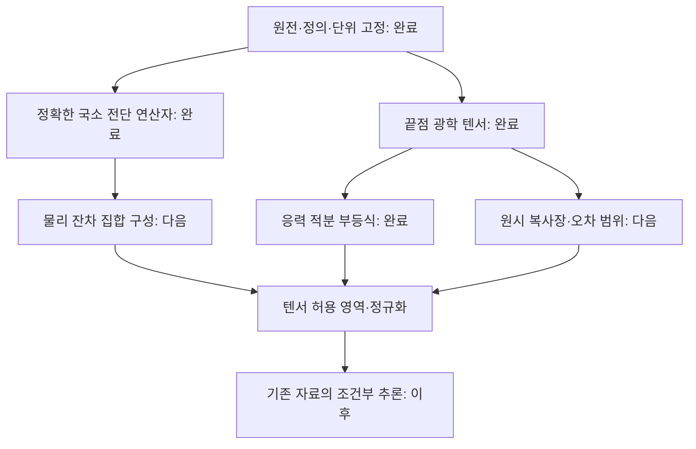

# 원래 MES 직관에서 다시 시작한 이론 연구 — 첫 루프

2026-09-20 · `MES_FRESH_OPTICAL_TENSOR_R1`

## 1. 이번 연구의 답

원래 직관은 **명시한 물리 조건 아래에서 CMB로 운동학적 양의 허용 영역을 만들고, 그 양을 같은 조건의 상한에 대해 정규화한다**는 연구로 살릴 수 있다. morphology를 보존하려면 먼저 텐서 허용 영역을 만들고, percentage는 그 영역의 한 요약량으로 계산하면 된다.

이번 루프에서는 두 가지를 실제로 유도했다.

1. 일반 시공간의 한 사건에서, 복사 수송 방정식의 전단 부분을 정확한 양의 정부호 **5×5 연산자**로 썼다. 약한 각방향 비등방성 가정 없이 성립한다. 필요한 미분·다른 운동학적 항은 별도로 제한해야 할 잔차 집합으로 남긴다.
2. 별도의 Bianchi I 예제에서는 CMB 온도장의 **끝점 광학 텐서**를 정확히 복원하고, 이를 현재 전단과 연결하는 **응력 잔차 부등식**을 얻었다. 미분방정식의 수치 진화 없이 대수, 행렬 로그, 정적 적분으로 표현된다.

이는 관측으로 이미 전단을 측정했다는 결과가 아니다. 첫 결과는 “어떤 추가 정보가 어느 식에 필요한가”를 정확히 드러내고, 두 번째는 팽창 이력과 응력 예산을 주었을 때의 해석적 연결식을 제공한다. 전역 almost-FLRW 정리나 모든 운동학적 양에 대한 MES 확장은 아직 증명하지 않았다.

사용자가 지정한 GPT-6 Astra 연구 하네스 v4.0.0을 읽고, 원전 조사·광학 유도·독립 판정 역할을 분리했다. 새 연구 에이전트는 `gpt-6-astra`, `ultra`로 명시해 호출했다. 주 세션의 실제 모델 식별자는 별도로 검증하지 않았다. 과거의 부정적 판정이나 native checkout 차단을 이 연구의 전제로 사용하지 않았다. 기존 자료에서는 기호 정의와 광학 식만 취했다. 저장소 변경·push와 수치 우주 진화는 수행하지 않았다.

## 2. 처음부터 다시 던진 질문

- **목표는 무엇인가?** CMB의 모양, 빛이 누적해서 경험한 변형, 현재 관측자의 전단, 영역 전체의 almost-FLRW 성질은 서로 다른 목표다. 원래 동기를 위해서는 이들의 연결식을 명시해야 한다.
- **정말 필요한 가정은 무엇인가?** 모든 multipole 미분을 각각 작게 제한하는 대신, 목표 운동학적 양에 들어가는 특정 수송 잔차 조합만 유한하게 제한할 수 있는가?
- **방향 정보는 어디서 사라지는가?** 삼각부등식과 norm을 너무 일찍 취하면 사라진다. 텐서 방정식을 먼저 풀고 마지막에 scalar를 취하면 보존할 수 있다.
- **dynamics는 꼭 수치 진화를 뜻하는가?** 적분 인자, 보존량, 적분 부등식, 정적 응답 연산자에도 실제 dynamics가 들어 있다.
- **percentage의 분모는 무엇인가?** 증명된 상한인가, 실제 달성 가능한 최대값인가, 편의를 위한 기준값인가? 이 세 가지는 구분해야 한다.

| 경로 | 얻는 대상 | 필요한 추가 입력 | 이번 상태 |
|---|---|---|---|
| 국소 복사 수송의 텐서 연산자 | 한 사건의 전단 허용 집합 | 시간·공간 미분 등을 묶은 잔차 집합 | 정확한 식·양성 증명 및 독립 검산 |
| Bianchi I 끝점 광학 | 누적 기하학적 변형 텐서 K | 공통 방출면, 등방·균일 방출, 충돌 없는 전파 | 정확한 역변환 및 약한 극한 검산 |
| 적분 인자를 이용한 dynamics | 현재 전단의 조건부 구간/영역 | 팽창 이력과 전체 비등방 응력의 범위 | 유한 응력 부등식 유도 |
| 저적색편이 방향별 거리법칙 | 현재의 국소 전단 | 거리·적색편이 자료와 속도·보정 오차 | 문헌상 보완 경로 확인 |
| CMB morphology 자체 | 온도 STF multipoles와 정렬 | 관측 지도·오차 모형 | 운동학과의 연결 없이 단독 목표로 삼지는 않음 |
| weak-form 또는 유한 기저 수송 | 평균된 운동학량/유한 계수 | 경계·시험함수·응답 가정 | 다음 후보로 보존, 정리 미완료 |

## 3. 일반적인 출발점: 정확한 전단 연산자

한 사건에서 관측자의 정규직교 공간틀을 정한다. 광자의 진행 방향을 e라 하고, 방향별 bolometric 복사 에너지 밀도를 B(e)≥0라 한다. 총량은 ρ=∫B dΩ이다. 관측 하늘 방향 n은 −e이므로 짝수 모멘트에는 차이가 없다. B는 잡음이 더해진 마스크 지도가 아니라 물리적인 전천 복사장이다.

방향별 흑체라면

\[
B(e)=\frac{a_R}{4\pi}T(e)^4,
\qquad a_R=\frac{\pi^2k_B^4}{15\hbar^3c^3}.
\]

온도 multipole과 B의 multipole은 같은 양이 아니다. 비섭동 식에서는 T⁴를 먼저 취해야 한다.

전단 S는 대칭·무흔적 3×3 텐서이고 단위는 s⁻¹이다. 국소 bolometric Liouville 연산자의 전단 부분은

\[
\mathcal A_S B
=-[(I-ee^T)Se]\cdot\nabla_{S^2}B
+4(e^TSe)B.
\]

첫 항은 방향의 이동, 두 번째는 적색편이 효과다. 계수 4는 ∫E³f dE를 에너지에 대해 부분적분할 때 나온다. 다른 운동학 항이나 시공간 미분을 0으로 두지 않는다.

E(e)=eeᵀ−I/3로 두고 이 식의 STF 이차 모멘트를 취한다. 구면 부분적분으로

\[
\boxed{
\mathcal L_B(S)=\int B\left[(Se)e^T+e(Se)^T
-(e^TSe)ee^T-\frac{e^TSe}{3}I\right]d\Omega
}
\]

를 얻는다. 이는 다섯 전단 성분에 작용하는 선형 연산자다. 적분 핵이 방향의 4차 이하 다항식이므로 **B의 ℓ=0,2,4만** 들어간다. 전체 Boltzmann hierarchy를 유한하게 닫았다는 뜻은 아니다.

M₂=∫BeeᵀdΩ라 하면

\[
S:\mathcal L_B(S)
=\int B\{2|Se|^2-(e^TSe)^2\}d\Omega
\ge\lambda_{\min}(M_2)\|S\|_F^2.
\]

또한 서로 다른 STF 텐서 S,T에 대해 T:𝓛_B(S)=S:𝓛_B(T)이므로 자기수반이다. 비음수 L¹ 함수 B가 양의 총 에너지를 가지면 M₂는 양의 정부호다. 따라서 물리적인 보통의 복사장에서는 𝓛_B의 역연산자가 존재한다. 등방 극한은 𝓛_B=(8ρ/15)I이다. 특이한 각방향 측도로 확장하는 경우는 별도 증명 노트에서 구분했다.

완전 수송식의 나머지를 보존하여

\[
\mathcal A_\sigma B+\mathcal T_{\rm rest}B=C_B,
\qquad
r=\int E(C_B-\mathcal T_{\rm rest}B)d\Omega
\]

로 정의하면

\[
\boxed{\mathcal L_B(\sigma)=r.}
\]

따라서 물리적으로 허용한 잔차 집합이 𝓡일 때

\[
\boxed{\mathcal S(B,\mathcal R)=\mathcal L_B^{-1}\mathcal R,}
\qquad
\|r\|_F\le r_*
\Longrightarrow
\|\sigma\|_F\le\frac{r_*}{\lambda_{\min}(\mathcal L_B)}.
\]

M₂의 최소 고윳값으로 바꾸면 더 간단한 보수적 상한을 얻는다. 잔차 공은 전단 타원체가 되며, 방향별 허용 폭과 성분 사이 관계를 남길 수 있다. 비볼록 잔차 집합도 직접 역상으로 다룰 수 있지만 support function만 쓰면 그 닫힌 볼록껍질만 표현한다.

**이 식이 MES 확장에 주는 실제 진전:** 약한 비등방성 없이 정확한 전단 응답을 남기고, 기존의 강한 전제를 목표 잔차 집합을 정하는 가정으로 분리할 수 있다. 다만 이것이 MES보다 무조건 약한 가정을 가진 전역 정리라는 결론은 아니다. 새 잔차 클래스와 MES 클래스의 포함관계도 증명해야 한다.

정적인 CMB는 B와 𝓛_B를 정하지만 r의 시간·공간 미분까지 정하지 않는다. 𝓡가 전 공간이면 전단 허용 집합도 전 공간이다. 따라서 다음 이론 과제는 **자료와 분석적 물리 조건으로 유용한 크기의 𝓡를 구성하는 것**이다. 전단 응답의 역행렬 존재를 관측 식별성으로 오인해서는 안 된다. 잔차가 다른 미지 운동학량에 의존하면 결합된 조건부 문제로 다뤄야 한다.

## 4. 광학과 dynamics를 실제로 연결한 해석적 예제

별도 예제로 Bianchi I 계량을

\[
ds^2=-c^2dt^2+h_{ij}(t)dx^idx^j
\]

라 한다. 방출과 관측은 동반·측지 관측자, 방출은 같은 시간면의 균일·등방 흑체, 이후 전파는 collisionless라고 가정한다. 국소 관측자 boost를 처리해야 한다. 비등방성의 크기는 작다고 가정하지 않는다.

공간 병진 대칭 때문에 광자의 공변 공간 운동량이 보존된다. 관측자 coframe B_o가 h_o=B_oᵀB_o를 만족하면

\[
Y(n):=T_o(n)^{-2}=n^TMn,
\qquad M=T_*^{-2}B_oh_*^{-1}B_o^T\succ0.
\]

따라서 이상적인 온도장으로부터

\[
\boxed{M=\langle Y\rangle I+\frac{15}{2}
\left\langle Y\left(nn^T-\frac I3\right)\right\rangle,}
\]

\[
\boxed{K=\frac12\log\!\left[\frac{M}{(\det M)^{1/3}}\right],
\qquad\operatorname{tr}K=0.}
\]

K는 보정 배율에 불변인 다섯 성분의 끝점 변형 텐서다. 현재 전단과는 다른 대상이다. 이때 Y의 ℓ≥3 성분은 0이고 T는 짝함수다. 실제 하늘에서 이를 검사하려면 원시 온도 비등방성, 운동학적 boost, 전경·마스크·잡음을 함께 다뤄야 한다.

대각 계량 h=a²diag(e²ᵝⁱ), Σβ_i=0이며 축이 고정된 경우

\[
K=\beta_o-\beta_*=\int_{t_*}^{t_o}\sigma(t)dt.
\]

고정된 주축 조건은 이 간단한 적분식의 충분조건이다. 일반적으로 회전하는 전단 이력에 동일한 식을 자동 적용하지 않는다.

이하 σ,K,π의 성분과 적분은 동일한 고정 주축 틀에서 비교한다. Einstein 방정식의 전단 부분은

\[
\dot\sigma+3H\sigma=P,
\qquad P=\frac{8\pi G_N}{c^2}\pi,
\]

이고 π는 전체 물질·복사의 비등방 응력이며 압력·에너지 밀도 단위(Pa=J m⁻³)이다. a_o=1로 정규화하고

\[
I=\int_{t_*}^{t_o}a^{-3}dt,
\quad W(s)=a(s)^3\int_{t_*}^{s}a(t)^{-3}dt,
\quad J=\int_{t_*}^{t_o}W(s)P(s)ds
\]

라 하면 적분 인자를 통해 정확히

\[
\boxed{\sigma_o=\frac{K+J}{I}.}
\]

따라서 ‖P(s)‖≤p(s)라는 응력 예산에서

\[
\boxed{\left\|\sigma_o-\frac KI\right\|_F
\le\frac1I\int_{t_*}^{t_o}W(s)p(s)ds.}
\]

수치 ODE를 적분하지 않으면서도 실제 동역학 법칙과 그 불확실성이 식에 남는다. 다만 a(t) 자체를 정하려면 팽창 이력의 모형·관측 범위 또는 해석적 해가 필요하며, 임의의 a(t),π 조합이 전체 Einstein 방정식을 만족한다는 보장은 없다.

P=0이면 σ_o=K/I이지만, 자기중력을 가진 비등방 CMB는 일반적으로 비등방 응력을 만든다. 따라서 P=0을 일반적인 정확한 현실 모형으로 채택하지 않는다. 이번 확장에서는 유한한 응력 범위를 가진 식이 중심이다.

온도 순방향 적색편이 자체는 이미 알려진 결과다. 이번 노트는 그 역표현·정규화와 응력 잔차를 현재 목적에 맞게 연결한 것이다. 신규성은 주장하지 않는다. [Fleury–Pitrou–Uzan, 2015, §IV.A](https://arxiv.org/pdf/1410.8473).

## 5. morphology와 원래 통계량을 함께 보존하기

K 또는 σ를 scalar 하나로 먼저 줄이지 않는다. 예를 들어

\[
I_2=\operatorname{tr}K^2,
\qquad
\chi=\frac{\sqrt6\operatorname{tr}K^3}{(\operatorname{tr}K^2)^{3/2}}
\in[-1,1]
\]

는 크기와 고유값 형태를 나눠 보여 준다. χ는 K≠0에서만 정의된다. diag(1,−1,0)와 diag(1,1,−2)/√3은 I₂=2가 같지만 χ는 각각 0,−1이다. 방향은 전체 텐서 또는 고유틀에 남아 있다. K²만 보존하면 K와 −K의 차이를 잃는다. 고윳값 중복 때 축이 유일하지 않다는 점도 유지한다.

기존 x는 Σ_std²−W_std²+Ω_tilt+Ω_k,aniso라는 여러 성분의 결합이다. 이번의 전단 부분 x_σ를 전체 x로 바꾸어 부르지 않는다. 전체 tensorization은 각 성분을 나타내는 텐서·벡터 묶음과 **원래 x를 회복하는 수축 규칙**을 함께 정의해야 한다. 음의 vorticity 항과 부호가 있는 곡률 항을 포함한 x에 전단의 양수 정규화를 그대로 적용해서는 안 된다.

이번에 구체화한 전단 부문의 승격은

\[
\Sigma=\sigma/H,\quad x_\sigma=\frac16\operatorname{tr}\Sigma^2,
\qquad
\boxed{A_\sigma=\frac{\Sigma}{\sqrt{6U_\sigma}},
\quad Q_\sigma=\operatorname{tr}A_\sigma^2=\frac{x_\sigma}{U_\sigma}.}
\]

원래 Q=N(x)/U의 numerator 정책을 이 양수 부문에서는 N(x_σ)=x_σ로 제한했다. 텐서 A_σ와 scalar Q_σ를 함께 저장한다.

| 기존 통계량 | 이번에 구체화한 연결 | 지켜야 할 조건 |
|---|---|---|
| x | 전단 부문 x_σ=trΣ²/6, 전체 Σ도 보존 | 원래 다성분 x와 구별 |
| Q | Q_σ=trA_σ² | 분모 U_σ>0, 분자 정책 명시 |
| F | 유효한 상한이 있을 때 F_σ=Q_σ∈[0,1] | 단순 기준값이면 bounded F로 부르지 않음 |
| Π(q) | P_ν(F_σ>q), 동시에 A_σ의 결합 분포 유지 | 자료·prior·상관관계가 있는 확률법칙 ν 필요 |
| G_F | 두 상태 F_a/F_b와 텐서 차이·정렬을 함께 보고 | F_b>0, 실제 두 상태와 물리적 틀 비교 필요 |

예를 들어 공통 틀로 옮기는 물리적 회전 R이 주어졌을 때

\[
\Delta A=A_a-RA_bR^T,\qquad
\rho_{ab}=\frac{\operatorname{tr}(\Sigma_aR\Sigma_bR^T)}
{\|\Sigma_a\|_F\|\Sigma_b\|_F}
\]

를 G_F와 함께 보존하면 같은 크기에서 모양·축이 변하는 경우를 구별한다. 한 번의 CMB 마지막 산란면 관측만으로 두 시점의 국소 전단이 측정되지는 않는다.

관측 하늘의 Q^T_ab, O^T_abc도 별도로 유지한다. 이번 등방 방출 Bianchi I 예제의 기하학적 온도장에는 홀수 multipole이 없지만, 실제 octupole이 있다는 사실만으로 작은 전단 기여까지 배제되는 것은 아니다.

## 6. deviation percentage의 정확한 뜻

MES의 동일한 상태에 대한 상한을 ‖σ‖_F/θ≤B_σ, θ=3H>0로 쓰면

\[
\boxed{U_\sigma=\frac32B_\sigma^2.}
\]

원전의 간단한 1차 표현은

\[
B_{\rm lin}=\frac53\epsilon_1+3\epsilon_2+\frac37\epsilon_3.
\]

이 식에는 팽창하는 열린 시공간 영역, dust와 collisionless radiation, geodesic 동반 관측자, 모든 관련 관측자의 작은 multipole 및 미분, 추가적인 시간·공간 변화 척도 가정이 들어간다. ε_ℓ은 온도 PSTF 텐서 norm의 상한이며 sky RMS와 같지 않다. ε₁=0도 자동 조건이 아니다. 엄밀한 유한 오차 상한으로 쓰려면 B_σ=B_lin+Δ_σ처럼 remainder를 제어해야 한다. Δ_σ가 없으면 U_lin은 leading-order 기준 예산이고 비율이 정확히 [0,1]에 든다고 보장하지 못한다. [MES, PRD 51 (1995), Eqs. (1)–(6), (24), (31)](https://harvest.aps.org/v2/journals/articles/10.1103/PhysRevD.51.5942/fulltext).

유효한 U_σ>0가 확보되면

\[
100F_\sigma=100\frac{x_\sigma}{U_\sigma}
\]

는 **전단의 제곱 크기가 허용 상한의 얼마인가**를 나타낸다. 전단 norm의 상한 대비 비율은 100√F_σ이다. 예를 들어 norm 상한의 절반은 50%의 norm 비율이며 25%의 quadratic 비율이다. 우주 전체의 몇 %가 비-FLRW인지 나타내는 값은 아니다.

이 표현에는 세 가지 장점이 있다. 원래 동기를 그대로 유지하고, 물리 전제의 변경을 분모와 허용 영역의 변경으로 드러내며, A_σ를 함께 보고하여 방향·형태를 잃지 않는다. 다만 관측된 온도 multipole을 운동학적 x_σ로 바꾸는 연결식과 오차가 필요하다. 단지 관측 숫자를 같은 데이터에서 만든 상한으로 나눈다고 운동학적 측정이 새로 생기지는 않는다.

부등식의 상한은 달성 가능한 최댓값과 다를 수 있다. 그러므로 sharpness가 증명되기 전의 명칭은 “해당 조건의 상한 대비 비율”이 정확하다. U_σ=0인 유효 상한은 σ=0을 뜻하지만 0/0 percentage는 정의되지 않는다.

새로운 텐서 허용 영역의 방향별 gauge도 만들 수 있으나, 이는 원래 F와의 축약 관계를 증명해야 하는 별도 통계량이다. 비구형 허용 영역에서 morphology를 살린 정규화를 연구할 좋은 다음 주제다.

## 7. 관측으로 넘어갈 때 필요한 최소 연결

해석적 온도 역변환은 이상적 지도에 대한 정리다. 잡음이 있는 픽셀에 곧바로 T⁻²를 적용해 unbiased 추정량이라고 부르지 않는다. 온도 공간에서

\[
T_{\rm model}(n)=\frac{A}{\sqrt{n^Te^{2K}n}}
\]

를 fit하고 원시 비등방성·boost·전경·마스크·beam·잡음을 처리하는 방법이 적절한 후보이다. 원시 비등방성을 임의로 허용하면 기하학적 K와 분리되지 않으므로, 그 공분산 또는 유한 범위를 물리적으로 정해야 한다. 기존에 검증된 응답·공분산을 입력으로 사용할 수 있으며, 새 Boltzmann solver를 반드시 만들 필요는 없다. 이것도 선택한 입력에 대한 조건부 추론이다.

현재 전단을 더 직접적으로 보려면 국소 거리법칙을 보완 자료로 쓸 수 있다. 물리적 4-가속도의 공간 성분을 a_phys(단위 m s⁻²)라 하고, 하늘 바깥 방향 n에 대해

\[
\mathcal H(n)=H-\frac{a_{\rm phys}\cdot n}{c}+\sigma:nn,
\qquad D_L(z,n)=\frac{cz}{\mathcal H(n)}+O(z^2).
\]

이 경우 충분한 저적색편이 거리 자료에서 monopole·dipole·quadrupole을 분리한다. 임의의 비등방 우주 진화를 수치적으로 풀 필요는 없지만, peculiar velocity·보정·유한 z 나머지를 제어해야 한다. 해당 방향의 𝓗가 0이 아니고 적색편이에 대한 국소 역함수가 존재하는 영역에서 쓰는 급수이다. 이는 CMB-only 추론이 아니라 현재 운동학에 대한 보완 관측이다. [Heinesen, JCAP 05 (2021) 008, Eqs. (2.11), (3.10)](https://arxiv.org/pdf/2010.06534).

## 8. 실제 검증과 독립 판정

| 항목 | 실행 결과 | 해석 범위 |
|---|---|---|
| 구면 이차·삼차 적분, M 역변환 | Wolfram 기호 잔차 0 | 대수 항등식 |
| 응력 적분 인자 예제 | ODE 항등식·끝점·적분 잔차 0 | 수치 진화 없이 해석적 식의 부호 확인 |
| 유한 비등방 K에서 광학 역변환 | 상대 오차 1.40×10⁻¹⁵ | 합성 지도, 실제 관측 아님 |
| 행렬 로그·보정 불변성 | 오차 4.71×10⁻¹⁵, 4.22×10⁻¹⁵ | 부동소수점 검산 |
| 약한 극한의 2차 온도 전개 | 진폭을 절반으로 줄일 때 잔차 약 8배 감소 | 3차 remainder와 일치 |
| B=(1+3e_z²)²의 L_B | 다섯 고윳값 양수, λmin=176/105 | 각평균으로 정규화한 합성 예제 |
| 별도 reviewer의 직접 수송식 대 모멘트식 | 5×5 모든 원소의 정확한 잔차 0 | ℓ=1,6 추가에도 L_B 불변 확인 |

첫 Wolfram 호출에는 실행 환경의 undefined-global 경고가 있었다. 원시 응답을 보존했으며 후속 독립·Module 기반 검산과 분리했다. 초기 호출의 hardcoded 모양 값은 검증으로 세지 않고 후속 계산값을 사용했다. 이번 작업에는 실제 CMB fit, 관측 percentage, posterior Π 계산이 없다.

후보 작성과 초기 검증 설계에 참여하지 않은 reviewer가 증명·원시 결과·최종 해시를 검토했다. 판정은 **다음 이론·통계 방법 연구로 진행 가능(PROMOTE)**이다. 관측 추론, 전역 MES 확장, 출판 신규성, 기존 저장소의 scientific admission은 그 판정 범위에 포함되지 않는다. 영분모·매끄러운 B의 특이 M₂·비볼록 support function 표현을 수정했으며 필수 정정은 남지 않았다.

## 9. 다음 루프의 연구 DAG

아래는 이번에 실행한 이론 연구와 그 다음 단계이다. 이전 native 실행 DAG와 독립이다.

다음 루프에서 가장 가치 있는 질문은 **얼마나 작은 𝓡를 어떤 가정만으로 증명할 수 있는가**이다. 먼저 dust/geodesic, 작은 비등방성, 모든 개별 미분의 작음이라는 조건을 한꺼번에 제거하지 않는다. 목표 전단 식에 필요한 잔차 조합을 정하고, 각 조건의 제거가 허용 영역을 얼마나 넓히는지 정량화한다.

구체적인 다음 명제는 다음과 같다.

1. **잔차 클래스 포함관계:** 기존 MES 미분 조건으로부터 얻는 𝓡_MES를 명시하고, 개별 미분은 커도 필요한 결합 잔차가 유한한 클래스가 실제로 더 넓은지 구성적 예제로 보인다. 물리적으로 실현 가능한 해와 단순 대수 입력은 구별한다.
2. **유한 오차 정리:** 약한 극한의 MES 계수와 정확한 L_B 역연산자 사이 오차를 명시한다. 관측 가능한 B 모멘트와 잔차 예산으로 Δ_σ를 제한할 수 있는지 증명한다. 지금 Δ_σ의 값은 얻지 않았다.
3. **통제된 dynamics 예제:** 알려진 팽창 이력 범위와 비등방 응력 범위에서 (K,I,J)의 결합 허용 집합을 만든다. 배경과 응력의 일관성을 유지하며, P=0 예제에만 머물지 않는다.
4. **tensorized 통계량:** 전단 pilot의 A_σ,Q_σ,Π,G_F를 완성한 뒤, 원래 x의 vorticity·tilt·곡률 성분을 정확히 회복하는 텐서 묶음과 수축 규칙을 정한다. 전체 x의 승격이 이미 완료되었다고 보지 않는다.

이번에 새로 확인한 한계는 다음 연구의 입력이다. 끝점 K만으로 현재 전단은 유일하지 않으며, 원시 온도장의 자유도를 무제한 허용하면 기하학적 기여는 분리되지 않는다. 이 두 사실은 목표를 포기할 이유가 아니라, 어떤 dynamics·source 범위를 부등식에 명시해야 하는지 알려 준다.

## 10. 자료와 재현성

직접 대조한 Ellis–Maartens–MacCallum, *Relativistic Cosmology* (Cambridge, 2012)의 인쇄면은 pp.156–158의 광자 적색편이, p.168의 온도 전달, p.169의 intensity, p.172의 관측량, p.287의 almost-EGS 전제이다. 책의 geometrical units를 본 노트에서는 c,ℏ,k_B를 표시하여 복원했다. 원본 PDF는 재배포하지 않는다.

원전의 all-observer·영역 조건은 [Stoeger–Maartens–Ellis, ApJ 443 (1995)](https://articles.adsabs.harvard.edu/pdf/1995ApJ...443....1S), 관측 multipole norm 변환은 [Stoeger–Araujo–Gebbie, 1999](https://arxiv.org/pdf/astro-ph/9904346)를 확인했다. 상세 식 번호와 접근 범위는 `agent_mes_sources.md`에 있다. 일부 문헌의 특수화된 hierarchy 계수와 직접 유도 사이 차이는 미해결 문헌 확인 사항으로 남겼으며, 해당 인쇄식을 새 연산자의 계수 근거로 쓰지 않았다.

묶음에는 직접 증명 `DERIVATIONS.md`, `TENSOR_RESIDUAL_THEOREM.md`, 독립 검토, 합성 검산 코드·결과, source identity, DAG와 상태 기록을 포함한다. 입력 하네스와 책 전체, 기존 저장소 checkout은 포함하지 않는다. `checks.py`는 NumPy로, 독립 다항식 검산은 Python 표준 라이브러리의 정확한 유리수 계산으로 재현할 수 있다. 원시 Wolfram 응답도 포함한다.
