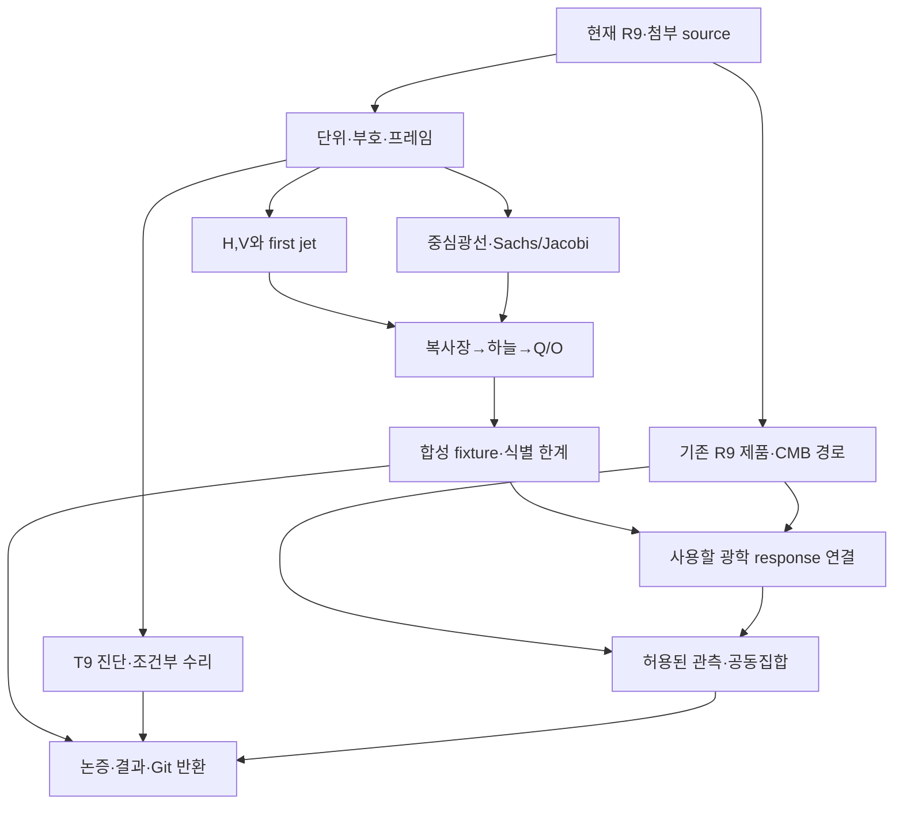

# HTT R10 광학 사상 통합 연구계획

## 1. 목표와 현재 기준

전체 low-ell Q/O 형태를 보존한 채, local observer response·source radiation·곡률·공유 보정·관측법칙이 물리적 운동학의 어떤 조합을 제약하는지 연구한다. 추가 ZIP의 first-jet → ray generator, curvature → Sachs/Jacobi, radiation → endpoint → Q/O 연결을 R9의 실제 law/response·식별·공동집합 연구에 결합한다. 광학 변수를 정의한 것만으로 그 변수가 관측됐다고 간주하지 않는다.

**현재 기준은 PR468 R9 `5e4e899c...`다.** PR463/464/465는 과학 질문과 이력, R7/R8은 구현·검증·실패의 선행 근거다. 새 계획은 후속 실행이 이미 존재하는 R7/R8을 미구현 상태로 되돌리지 않는다. R9의 실제 bounded research evidence는 해당 fixture 범위로 재사용한다. R9의 production/observational 노드는 아직 source-bound 실행근거를 별도로 요구한다.

이 턴에서 읽은 범위는 PR463/464 계획·reuse, PR466–468 metadata/changed files, R9 README/설계/계약/DAG/인계/검토, R8 final review, R9 root/BASS AGENTS와 T9 관련 네 source 파일이다. 전체 8,499 tree entry 목록을 취득한 것은 모든 파일 본문을 읽었다는 뜻이 아니다. 상세 identity는 SOURCE_PROVENANCE에 기록한다.

## 2. 요구사항과 적용 경계

필수 결과:

- observer/congruence, ray orientation, energy, 시간·단위, vorticity dual, Riemann, screen/tetrad convention의 실행 가능한 연결.
- first-jet 12성분에 대한 ideal full-sky map과 range constraints, 실제 처리·nuisance 후 target별 식별 가능성.
- central ray와 Jacobi derivative를 함께 쓰는 collisionless radiation → temperature/STF forward fixture.
- source-sealed T9 diagnosis와 영향 목록. 결함이 확인될 때만 격리 candidate의 최소 repair 및 독립 oracle.
- R9의 fixed full-Q/O rank, 확률 CMB candidate, selected-product laws, shared calibration tuple과 같은 상태의 conditional MES image를 그대로 소비하는 접점.
- 정상·퇴화·모형불충분·계산미해결 결과를 모두 반환하는 Git 결과와 재시작 prompt.

기술 기반은 이미 있는 Python/NumPy 및 source-bound HTT/R7/R8 모듈이다. 기존 Rust/Fortran/native solver, 패키지 설치나 rewrite는 전제하지 않는다. Wolfram+xAct/SymPy/Sage+Singular/Lean은 해당 mathematical admission에 필요한 기존 네 축을 따른다. 실제 engine 부재는 그 축의 blocker이지 다른 연구 결과의 실패가 아니다. 수치 크기·시간은 작은 pilot에서 측정하고 기존 명시적 cap을 보존한다.

이번 계획의 비목표는 새 native Bianchi solver, 11-family atlas, REC/REI collision implementation, 새 원격 kSZ/pSZ 확보, general nonlinear almost-EGS, 기존 보고서 재조판, canon/merge/공개설정 변경이다. 파일명에 BASS가 들어간 대형 archive를 모두 풀거나 1.5 TB 자산을 재해시하지 않는다. 첨부 설치 파일은 과학 source가 아니며 실행하지 않는다.

## 3. 하나의 DAG, 독립적인 관측 경로

`campaign_dag.json`은 기존 R9 노드 24개의 내용·의존성·alpha를 그대로 포함하고 optical action을 덧붙인다. 기존 노드의 성공 이력은 역사적 범위에서만 사용한다. 새 optical capability는 생성자 receipt에 해당 명제·source·method·input이 결합되기 전까지 존재하지 않는다. 아래 그림은 가독성을 위한 축약이며 실행 SSOT는 JSON이다.

그림의 B→O는 **광학 candidate를 선택할 때만** 적용한다. 기하 모델을 사용하지 않는 R9 관측 경로는 B 없이 진행한다. T9는 T9 hierarchy를 실제로 호출하는 candidate에만 영향 준다. 독립 characteristic fixture를 T9 repair 대기열에 묶지 않는다.

## 4. 실행 묶음과 종료 기준

### Iteration 1: 작은 완전한 광학 경로

| 작업 | 입력·의존성 | 산출물과 정확한 종료 기준 | 검토 초점 |
|---|---|---|---|
| OP-00 Source 재개 | 이 계획, R9 base, 첨부 manifest, 현재 local 상태 | 사용 checkout·donor·source/parameter 의미, 기존 결과 재사용 목록; 잘못된 경로를 실제 source와 구분 | fresh SHA, source subset/full checkout, local pending work |
| OP-01 Convention adapter | OP-00 | c를 유지한 기호표, vorticity dual와 n=-e adapter, tetrad와 curvature convention | 같은 기호의 sign/units 충돌 |
| OP-02 Local ray map | OP-01 | 12 basis forward/inverse, H/V range constraint, 순수 expansion/acceleration/shear/rotation oracle | 20개 coefficient를 20개 physical parameter로 오인하지 않음 |
| OP-03 Sachs/Jacobi | OP-01 | regular observer initial condition, central-ray/Jacobi 차이, affine/z patch, caustic·turning point 처리 | 미정의 L_IJ 식의 조용한 채택 방지 |
| OP-04 Radiation endpoint | OP-02/03 | source field→geodesic endpoint→redshifted intensity/T→Q/O의 작은 실행; 무충돌 invariant와 angular remapping | intensity에 inverse-square를 곱하지 않음; spectral closure |
| OP-05 Independent fixtures | OP-04 | exact limits, rotation/parity, observer boost, masking/rank null, two-temperature counterexample와 residual plot | 공통 계수 oracle, wrong-frame·wrong-sign mutation |

OP-03은 flat/FLRW와 지정된 optical tidal fixture로 충분하다. global Einstein solution으로 증명되지 않은 kinematic fixture는 그 한계를 표시한다. 제한된 R8 ray/history source를 재사용할 경우 18개 coarse FAIL과 36개 tighter 설정의 범위를 보존하고, 432 comparison을 전부 admitted optics로 세지 않는다. 기존 288 admitted ray case 범위도 새 일반명제로 확대하지 않는다.

Iteration 1의 value는 '수학적으로 정의한 사상이 실제 하늘 계수까지 이어지는가'에 대한 작고 재현 가능한 답이다. 전체 관측법칙이나 신규 데이터를 기다릴 필요가 없다.

### Iteration 2: source 부호 진단과 실제 R9 연결

| 작업 | 입력·의존성 | 산출물과 종료 기준 |
|---|---|---|
| OP-06 T9 source diagnosis | OP-01, 현재 terms/packed/RHS/mixing, 원 hierarchy convention | 독립 kinetic oracle와 정규화 adapter; confirmed mismatch/already-fixed/convention-equivalent/source-unresolved 중 근거 있는 판정 |
| OP-07 Candidate repair | mismatch가 확인된 OP-06 | 영향 파일 allowlist, 보존 RED, 최소 diff, code-to-oracle GREEN, deliberate sign mutation FAIL, affected-only 영향표 |
| OP-08 Model-to-data binding | OP-05와 R9 tuple/intake | 어떤 측정이 H,V/jet에 응답하는지 수식·nuisance·단위·rank로 연결; 없으면 explicit null/whole-domain 결과 |
| 기존 R9-03–18 | 기존 R9의 각 action admission | shared tuple, CF4/JWST/DESI law, full-Q/O와 stochastic CMB response·mocks·관측·joint outer sets |

OP-07은 `htt/bass/hierarchy/terms.py`, `mode_mixing_blocks.py`, 실제로 영향받는 doc/spec/test를 출발 allowlist로 삼는다. `packed_operators.py`는 T9에서 operator를 생성하므로 독립 oracle가 아니다. RHS의 `-a sum_T`를 반대로 바꾸어 다른 항까지 뒤집는 수정은 허용하지 않는다. 다른 파일이 필요하면 실제 소비 경로를 따라 scope를 기록하고, 관계없는 refactor를 섞지 않는다. source mapping이 결정되지 않으면 production repair만 보류하고 연구·독립 관측 경로를 계속한다.

R9 data/model 선택을 광학 제목 아래 새로 발명하지 않는다. 특히:

- CMB rank와 local boost candidate는 별개. noisy observed Q를 known deterministic source로 고정하지 않는다. reverse mixing, high multipoles, source/noise/foreground joint law를 포함한다.
- CF4는 원 거리모듈러스·group·selection·calibration 기반 새 law만 연다. P0 headline은 계속 격리한다. JWST same-host contrast는 shared method/anchor calibration 정보를 주며 직접 distance dipole 측정은 아니다.
- DESI exact eligible compressed law와 Union3 approximate scenario를 구별한다. 각도 없는 요약으로 tilt를 식별하지 않는다.
- 같은 nuisance tuple에서 교차한 뒤 사영한다. 다른 law는 union, 누락 제품은 whole domain이다. 결측 branch의 alpha를 기부하지 않는다.

### Iteration 3: 검증된 범위의 과학 결과

OP-08의 optical response를 실제 CMB candidate에 쓸 때 OP-09가 production mathematical admission과 product law를 확인해 R9 `CMB_RESPONSE` 접점으로 내린다. 이 경우에도 `CMB_CANDIDATE_LAW`, `RESPONSE_METHOD`, 실제 injection/coverage가 별도로 필요하다. OP-05 synthetic success만으로 observed sky를 해석하지 않는다.

R9-19 observation-to-jet는 source time/spatial derivatives, 같은 상태의 remainder·closure, product likelihood가 있을 때만 `JET_RESPONSE_LAW`를 생성한다. ideal H/V inversion은 이 capability를 생성하지 않는다. R9-20은 실제 jet가 없으면 empirical sigma/omega image를 unbounded/whole-domain으로 남긴다. finite physical image가 원래 불가능하다는 일반정리를 주장하지 않는다.

OP-10은 optical explanatory section, 연결 가능한/불가능한 observables 표, novelty comparison, 결과·원 실패·재시작 정보를 묶는다. 기존 55쪽 판본은 유지하고 새 optical revision 후보를 따로 둔다. 이번 Local campaign의 우선 산출물은 연구·코드·결과이며 완전한 새 PDF 제작은 별도 요청 전에는 필수 경로가 아니다.

## 5. M1/M2/M3의 현재 대응

이전 M1/M2/M3를 세 번의 신규 MAIN 승인 회의로 재생성하지 않는다. R9 action별 모델 동결이 구체화한 대응을 사용한다.

| 이전 계약 | 현재 소비 경로 | 광학 보완 |
|---|---|---|
| M1_CMB_MODEL | R9-09,11,14,15 | OP-04/05/08/09: full endpoint map·spectral closure·joint stochastic response |
| M2_REDSHIFT_MODEL | R9-03–08,16–18 | OP-03/08: redshift chart, generator/drift distinction, 실제 distance/selection law |
| M3_EXPERIMENT | R9-10–18 및 각 qualification | 고정 fixtures, 기존 alpha·rows·conditioning, 실제 error containment와 wrong-sign/frame controls |
| THEORY_FREEZE | method/input별 pre-existing admission | 선택 target/law/processing/alpha/approximation/source가 실제 기록된 뒤 해당 consumer만 실행 |

현재 user 요청은 Local 연구를 허용한다. 그러나 계획 문서의 존재는 위 freeze의 증거가 아니다. 연구 중 scientific counterexample가 나오면 원 명제·반례·영향 범위를 반환한다. 단순 parsing·units adapter·ordinary implementation defect는 범위 안에서 수정·재검증한다. 사용자가 이미 승인한 범위를 새로운 gate로 반복 확인받지 않는다.

## 6. 구체적인 검증·예산·실패 처리

신규 synthetic fixture의 수학적 입력과 acceptance는 SCIENTIFIC_CONTRACT에 있다. 구현 전에 단위·source·metric별 tolerance/scale을 확정한다. 고정 seed/rows/null/alpha가 있는 옛 실험은 수정하지 않는다. R9 alpha는 family=1/20, CF4/distance-calibration/DESI 각 1/80, CMB morphology/candidate 각 1/160이다. optical synthetic diagnostics를 새 co-primary observational test로 추가하지 않는다.

Plan budget: 최초 exact fixtures와 작은 full-sky grid부터 시작한다. run별 wall/CPU/peak memory와 누적 작업량을 기록한 뒤 확대한다. 기존 R8 60-second cap overrun은 보존한다. 새 checkpoint scheduler는 명시적 hard cap이면 outer-process interruption과 재개 가능한 원자 단위를 갖추고, cooperative 종료를 strict wall-time PASS로 쓰지 않는다. 실행 횟수보다 남아 있는 오류 원인과 소비자 위험을 기준으로 검증 범위를 정한다.

실패는 physical/mathematical, numerical, implementation, environment, service transport, source unavailable, model inadequacy를 구분한다. `UNIDENTIFIED`, `NULL_CONSISTENT`, `PARTIAL_LAW`, `UNRESOLVED`는 process crash가 아니다. 자동 재시도는 첫 transport failure 뒤 최소 probe 1회, 두 번 연속이면 해당 경로 `DEGRADED`로 보존한다. Python/C++는 독립적으로 actual current-turn probe를 사용한다.

어느 node/action도 downstream 성공을 기다려야 실패를 반환하는 구조가 아니다. JSON의 `return_from:any_terminal_or_checkpoint`는 모든 중단/부분 결과의 durable return을 허용한다. 집계율은 계획 파일 수가 아니라 actual scientific action의 achieved/qualified/blocked 범위를 분모와 함께 보고한다.

## 7. 병렬 실행과 장기 재개

초기 source mapper는 하나다. first-jet/screen, radiation/T9, R9 products/rank는 독립 입력이 준비된 뒤 나눌 수 있다. canonical context build와 assignment 생성은 repo script로 실행하고 각 agent에 RUN_ID/ASSIGNMENT_ID/CONTEXT_VERSION/INDEPENDENCE_MODE를 준다. 최대 동시 4 subagents, 총 8, depth 2 및 single shared writer를 지킨다. 네 CAS 축이 필요하면 그 슬롯을 먼저 확보한다. 같은 결과를 읽은 reviewer를 blind라고 부르지 않는다.

긴 스레드에서는 active action, source IDs, frozen decisions, 새 evidence paths, exact next command만 재주입한다. 큰 로그·도식·논문 전문은 한 번 저장하고 targeted read로 소비한다. next action 직전 해당 source/method가 바뀌었는지만 확인하며 전체 연구 요약·DB 조사를 반복하지 않는다. 기존 global harness가 있으면 사용하고 이 작업을 global harness migration으로 바꾸지 않는다.

각 의미 있는 실행 묶음 뒤 non-force Git checkpoint와 immutable return을 남긴다. source/results가 이미 Git에 보존되면 WORK_THREAD나 수동 ZIP relay를 요구하지 않는다. owner의 기존 cloud-backup 설정이 local에서 확인될 경우 그 승인 범위에서 사용하고 두 provider의 성공 응답이 있을 때만 dual backup이라고 기록한다. 이번 plan push를 Google Drive/Dropbox 이중백업으로 표현하지 않는다.
