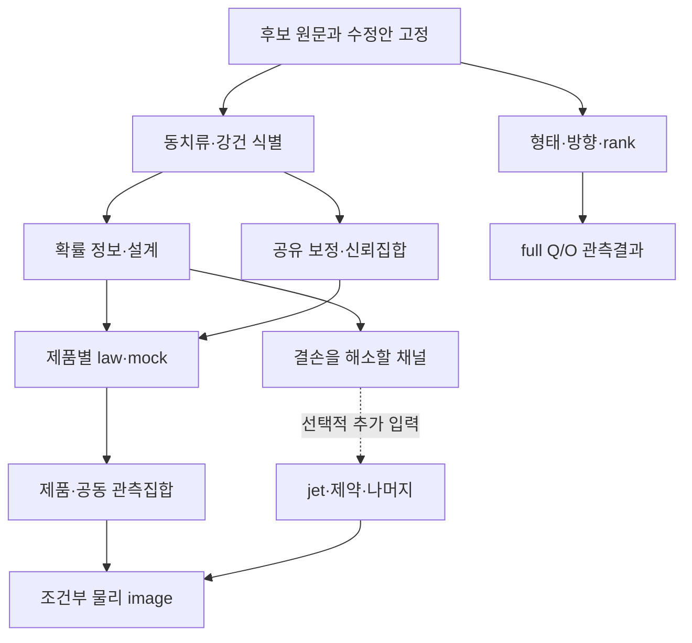

# HTT R9 — 이론 후보를 연결한 연구계획 개정안 v1

기준: `5e4e899c` 연구계획 × `9b725899` 역사적 명제 역할 목록. 작성일: 2026-09-12 UTC / 2026-09-13 KST.

**결론.** R9는 충분히 발전시킬 수 있다. 가장 효과적인 개정은 기존 24개 노드에 **어떤 물리량을 어떤 가정 아래 식별하는가, 어떤 추가 관측이 실제로 퇴화를 해소하는가, 얻은 집합의 끝점이 어디까지 물리적으로 실현되는가**라는 이론적 목표를 연결하는 것이다. 기존의 공통 상태·응답·관측법칙 경로는 유지하고, 역사적 후보를 여섯 개의 연구 묶음으로 선별한다. 명제 목록 자체를 연구 완료도로 사용하지 않는다.

이번 산출물은 원문 대조, 세 가지 반례, 조건부 수학적 확장 및 실행 가능한 연구계획이다. 기존 생산 코드·관측 결과·증명 레지스트리를 변경하지 않았다. 아래 `R9T-*`는 이 문서의 제안 작업명이며 저장소에 이미 등록되거나 실행된 작업 ID가 아니다.

## 1. 근거와 적용 범위

| 기준 | 고정 identity | 의미 |
|---|---|---|
| R9 연구계획 | commit `5e4e899c0dfa2028d81a82ca68ccd11203947470`; tree `dbfcdc9abc2298534b65f50ae6a19ab0012aa999` | 실행·설계 상태의 기준 |
| 역할별 목록 | commit `9b725899a25fa410e7c3686ce36afaa667d14646`; tree `508500f4eadeafcdfb316978c4a05a6b238a13f7` | 역사적 후보의 출처·의도·구간을 찾는 기준 |
| R9 DESIGN | blob `0bda94ffc6040e17c719d9f476d3acd64c7d73f7` | 연구 목표·관측 분기 |
| R9 THEORY | blob `a2ae9a7e0bcd549db8e2f18cbfb2703af84de589` | 깊이 응답·집합 추론·MES bridge |
| R9 CMB_RESEARCH | blob `e21d8466bf75d757e7d0824a2f4fc3a0d25ffcfd` | rank와 확률적 boost의 구분 |
| 후보 전체 JSON | blob `0ad118ed8974c43b2de78ddeff952379e9369a51` | 172개 원문 구간과 context |

[R9 원문](https://github.com/cosmosapjw-quantum/htt_base/tree/5e4e899c0dfa2028d81a82ca68ccd11203947470/docs/research_program/tensor_joint_r9), [역할별 길잡이](https://github.com/cosmosapjw-quantum/htt_base/blob/9b725899a25fa410e7c3686ce36afaa667d14646/docs/project_catalog/proofs/roles/README.md), [후보 JSON](https://github.com/cosmosapjw-quantum/htt_base/blob/9b725899a25fa410e7c3686ce36afaa667d14646/docs/project_catalog/proofs/roles/research_proposals.json).

R9의 핵심 문서 10개, 역할별 목록·메타데이터 6개, 원문 문서 2개를 취득했고, 총 18개 파일의 텍스트 바이트로 계산한 Git blob이 원격 identity와 일치했다. 172개 목록의 제목·출처와 구조를 검토하고, 우선 후보의 원문 구간·제안 문맥을 읽었다. 아카이브 내부 후보는 이 커밋의 JSON에 보존된 원문 발췌와 문맥을 근거로 삼았으며 모든 원본 압축파일을 다시 추출·정독한 것은 아니다. 독립 검토자는 별도로 선택한 출처와 유도를 검토한다.

172는 독립 정리 수가 아니다. 93개 내부 보조명제와 1개 명시적 문헌 이식도 연구 신규성의 수가 아니다. 39,072개 역할 보류 묶음에 대한 전수 의미 분류를 이번 계획의 선행 조건으로 요구하지 않는다. 기존 카탈로그의 `NOT_ESTABLISHED_FOR_THIS_PROPOSAL`을 유지하며, 원문의 “Provable”, “완전 증명”, 과거 숫자를 현재 증명·실행 사실로 승계하지 않는다.

기본 물리 규약은 signature \((-+++ )\), \(\beta=v/c\), \(\zeta=\operatorname{artanh}|\beta|\)이다. 아래 Gaussian 검산은 무차원 whitened 좌표를 쓴다. \(Q,O\)는 실제 자료 적용 시 Kelvin scale 및 STF 정규화를 유지한다. 물질 congruence, 관측자, tetrad, 적색편이·거리 정의는 제품별로 고정해야 한다.

## 2. R9에서 이미 있는 것과 새로 강화할 것

R9의 장점은 full Q/O morphology, processed CMB response, CF4/JWST calibration, DESI background control, 조건부 MES를 각기 다른 과학 질문으로 구별한 점이다. 또한 공유 nuisance를 동일 상태에서 교차하고, deterministic boost map과 확률적 하늘의 likelihood를 구분하며, 수치 미해결과 공집합을 분리한다. 이 뼈대를 다시 만들 필요는 없다.

현재 부족한 것은 **후보 명제의 완료 조건과 실제 제품의 대응**이다. 예를 들어 “adapter 구현”만으로는 어떤 target이 식별되는지, 숫자가 좁아진 이유가 자료인지 보정 제약인지, 유한한 comparator 구간이 실제 GR 해의 구간인지가 드러나지 않는다. 다음 여섯 묶음은 이 결손을 직접 겨냥한다.

| 제안 묶음 | 역사적 후보의 대표 출처 | R9 연결 | 핵심 산출물 |
|---|---|---|---|
| **R9T-A: 관측 동치와 강건 식별** | T-A1, T-A3; T2-RESPONSE-QUOTIENT; T-P4, T-P7 | 03–04, 18, 21 | 관측 동치류, target별 null/약식별 방향, discrepancy를 포함한 구별 가능성 |
| **R9T-B: 확률법칙의 정보와 관측 설계** | NT2-A1/A2; T-P5, T-P12 | 04, 09, 14, 16, 21 | processed-law Fisher, nuisance 제거, 추가 채널의 실제 정보 증가 |
| **R9T-C: 공유 보정과 유한 표본 집합** | T-P18; T2-COMMON-MODEL; T2-ESTCOV-PID; T2′, T4′ | 03, 06–08, 16–18 | 공유 보정 incidence와 law별 coverage, signed joint support |
| **R9T-D: 형태·방향·rank** | T-P1/P2/P6/P11; T2-CLUSTER-RANK; NT2-A3 수정 | 10–13, 23 | full-tensor 형태와 방향 불확실성의 병행 보고, 교환가능 단위와 rank 인증 |
| **R9T-E: 관측량에서 조건부 물리상으로** | T2-DEFECT-BUNDLE; T2-MES-BRANCH; T2-PHYSICAL-SHARPNESS; T3-lin 수정 | 19–21 | 동일 frame의 radiation jet → sector/comparator image, 끝점 실현성의 단계별 판정 |
| **R9T-F: 퇴화를 해소할 다음 관측** | T-P8/P9/P12/P13; T2-BULK-BRIDGE; G3 radial/transverse | 05, 09, 16, 19의 후속 | null 방향을 겨냥한 depth/anchor/transverse/remote 채널 비교 |

이 표는 여섯 개의 새로운 정리가 증명됐다는 뜻이 아니다. 동일 ID가 여러 문서에 있으므로 아래 부록의 source-qualified anchor를 함께 사용한다. A–D는 기존 R9의 가까운 실행 경로다. E는 물리 해석의 핵심 이론 경로이며, F는 A–C가 밝힌 정보 결손에 따라 필요한 채널만 고른다.

## 3. 먼저 분리해야 할 세 가지 명시적 오류

### 3.1 NT2-A2: 감소하는 응답만으로 Fisher 꼬리합은 수렴하지 않는다

원문은 \(r_\ell\to0\)이면 \(\sum_{\ell>3}(2\ell+1)r_\ell^2/2\)가 수렴한다고 서술한다. 그러나 \(r_\ell=1/\ell\)이면

\[
\frac{2\ell+1}{2}r_\ell^2=\frac1\ell+\frac1{2\ell^2},
\]

이므로 조화급수 비교로 발산한다. 이는 해석적 반례이며 유한 합의 수치적 증가만을 근거로 하지 않는다. \(r_\ell=O(\ell^{-p})\), \(p>1\)은 이 이상적 모형에서 충분조건이다. 실제 유한 \(\ell_{\max}\)에서는 cutoff 밖 정보량의 오차 예산이 필요한 것이지 무한급수 수렴이 자동 보장되는 것이 아니다.

또한 작은 Fisher tail은 **국소 정보 손실**의 후보 척도다. 이것만으로 \((a_2,a_3)\)의 전역적·근사적 충분성을 증명하지 않는다. 우도, 관측 영역, target 및 nuisance에 대한 별도 손실 기준이 필요하다. 상태: **반례로 기존 일반 진술 기각; 수정된 정보손실 문제는 unresolved**. [NT2-A2 원문 구간](https://github.com/cosmosapjw-quantum/htt_base/blob/9b725899a25fa410e7c3686ce36afaa667d14646/docs/project_catalog/proofs/roles/evidence.md#role-ac63913e9a4082d8).

### 3.2 NT2-A3: global p값은 최대 local p값보다 항상 크지 않다

동일 세 모의행을 \((0.5,0.5),(0.6,0.6),(0.7,0.7)\), 관측 tail-score를 \((0.99,0.1)\)로 둔다. 각 열과 행별 maximum에 동일한 \(+1\) 순위식을 적용하면

\[
(p_1,p_2)=(1/4,1),\qquad p_{\mathrm{global}}=1/4.
\]

따라서 원문의 \(p_{\mathrm{global}}\ge\max_i p_i\)는 틀리다. 독립 uniform null의 정확한 분포에서도 관측 최대값 0.99에 대해 global tail은 \(1-0.99^2=0.0199\)이고 local tail들은 0.01, 0.9다.

유효한 목표는 **고정 max-score와 그 전체 모의행의 교환가능성에 따른 super-uniformity**이다. 위 반례는 올바르게 구성한 max-rank 검정을 무효로 하지 않는다. R9의 기존 inclusive rank 인증도 이 잘못된 부등식에 기대지 않는다. 상태: **부등식 기각; 적절한 rank 유효성 문제 유지**. [NT2-A3 원문 구간](https://github.com/cosmosapjw-quantum/htt_base/blob/9b725899a25fa410e7c3686ce36afaa667d14646/docs/project_catalog/proofs/roles/evidence.md#role-93d992474af4a17c).

### 3.3 강화 T2′: signed numerator에서는 joint/naive 끝점 판별을 고쳐야 한다

원문은 \(D>0\)만 요구하고, \(c_{N,j}c_{D,j}\le0\)이면 joint와 naive 상한이 같다는 필요충분조건을 주장한다. \(s\in[0,1]\)에서

\[
N(s)=-2+s,\quad D(s)=2-s,\quad N(s)/D(s)=-1
\]

을 택하자. 계수 곱은 \(-1\le0\)이지만 joint 상한은 \(-1\), 독립적으로 numerator/denominator를 고르는 naive 상한은 \((-1)/2=-1/2\)이다. 원문의 판별과 모순된다.

집합 포함 \(\mathrm{joint}\subseteq\mathrm{naive}\)는 유지된다. 수정안은 positive/negative/zero numerator를 구분하거나, \(D\ge d_{\min}>0\)인 compact domain에서 \(\sup_s[N(s)-qD(s)]\)의 부호로 실제 ratio supremum을 인증하는 것이다. 독립 interval rectangle의 범위는 네 corner ratio의 최솟값·최댓값으로 구한다. \(N_{\max}=0\) 같은 퇴화점도 별도로 처리한다. 상태: **일반 iff 진술 기각; 포함정리 유지; 부호별 정밀 판별 재유도 필요**. [강화 정리 원문 §2](https://github.com/cosmosapjw-quantum/htt_base/blob/9b725899a25fa410e7c3686ce36afaa667d14646/docs/audits/external_2026-07-09/referee_fortification/06_strengthened_theorems_ko.md).

세 반례의 유리수 계산은 Python 표준 `fractions.Fraction`으로 실제 실행했다. 이전 FORT02·모의시험의 실행 사실을 부정하는 것이 아니라, 해당 시험의 성공이 명시된 전체 정의역을 증명하지 못함을 지적한다. 원문과 기존 proof status를 조용히 덮어쓰지 않는다.

## 4. R9T-A — 식별성에서 오차를 견디는 구별 가능성으로

고정 선택·설계, 알려진 공분산 및 Gaussian 법칙이 정당화된 R9 모형을 쓴다.

\[
z=A\theta+N\eta+b+\epsilon,\quad \epsilon\sim N(0,I),\quad b\in\mathcal B.
\]

\(U\)가 nuisance 열공간의 직교여공간 기저이고 \(D=U^TA\), \(\mathcal B'=U^T\mathcal B\)이면, nuisance를 제거한 attainable mean set은

\[
\mathcal M_\theta=D\theta+\mathcal B'.
\]

**목표 A1.** 실제 공통 상태 \(x\)와 전체 관측법칙에 대해 \(x\sim x'\iff P_x=P_{x'}\)를 정의하고, 보고할 함수 \(g(x)\)가 동치류 위에서 일정한지 판정한다. 평균의 kernel만 쓰는 판정은 공분산·선택법칙이 상태에 의존하지 않는 제한된 선형 실험에만 적용한다. 물리적 제약이 있으면 \(\ker D\) 전체가 아닌 constrained fibre를 검사한다.

**목표 A2.** 두 상태 차이 \(\Delta\theta\)에 대해

\[
\delta(\Delta\theta)=\inf_{b_0,b_1\in\mathcal B'}
\|D\Delta\theta+b_1-b_0\|
\]

를 계산한다. compact \(\mathcal B'\)에서 \(\delta=0\)이면 두 상태의 admissible mean sets가 겹치므로 동일한 noise law를 갖는 구별 불가능한 쌍이 존재한다. 예를 들어 \(D=1\), \(\mathcal B'=[-\rho,\rho]\)이면

\[
\delta(\Delta\theta)=\max(|\Delta\theta|-2\rho,0).
\]

행렬 rank가 완전해도 discrepancy보다 작은 차이는 최악의 경우 구별할 수 없다. 반대로 \(\delta>0\)만으로 원하는 검정력이 보장되지는 않는다. 고정된 두 Gaussian 평균의 단순가설 검정에서는 거리가 \(d\)일 때 size \(\alpha\)의 최적 단측 검정력이 \(1-\Phi(z_{1-\alpha}-d)\)이다. 복합가설에서는 이 수식을 자동 적용하지 않고 set geometry와 nuisance를 포함해 다시 정당화한다.

여기서는 한 단계 더 구체화할 수 있다. 두 고정 물리 상태의 \(\mathcal M_0,\mathcal M_1\)가 비어 있지 않은 compact convex 집합이고 공통 whitened Gaussian covariance를 가지며 \(\delta>0\)이면, 최근접 평균을 잇는 단위벡터로 분리한다. 볼록집합의 최근접점 조건으로 두 집합의 사영 간격은 \(\delta\) 이상이고 최근접 쌍에서 정확히 \(\delta\)다. 중점 threshold는 양쪽 최악 오류 \(\Phi(-\delta/2)\)를 달성하며, 최근접 단순가설 쌍이 같은 하한을 주므로 minimax maximal error도 이 값이다. \(\delta=0\)이면 겹치는 평균이 오류 하한 1/2을 주고, 무작위 검정을 허용할 때 독립적인 공정 동전 선택이 이를 달성한다. 따라서 \(0<\alpha,\gamma<1/2\)인 type-I \(\alpha\), type-II \(\gamma\)의 uniform 분리를 위한 조건은

\[
\delta\ge z_{1-\alpha}+z_{1-\gamma}.
\]

이 식을 target별 관측 설계의 목적에 연결한다. 비볼록 discrepancy, 상태별로 다른 covariance, 여러 물리 상태를 함께 포함하는 복합 모형에는 위 결론을 자동 전파하지 않는다. \(Y=0.01\theta+b+\epsilon\), \(\theta=0\) 대 \(1\), 단위 Gaussian noise에서는 rank가 1이어도 \(b=0\)의 균형 오류가 약 0.498005다. \(|b|\le0.006\)이면 \((\theta,b)=(0,0.005),(1,-0.005)\)가 같은 평균 0.005를 만들므로 uniform 균형 오류 하한은 1/2다. 이는 실제 survey의 예측값이 아닌 구별 가능성의 반례다.

**실제 연구 기여.** T-A1의 signed cancellation은 sector-space에서 가능하지만 모든 cancellation ray가 GR 해라는 보장은 없다. 따라서 출력은 `관측 동치`, `bounded discrepancy에 따른 모호성`, `물리 제약이 허용한 fibre`의 세 층으로 나눈다. 작은 \(x_C\)와 작은 총 비등방성의 동치를 주장하려면 허용 sector domain에서 cancellation 배제 조건을 별도로 증명해야 한다.

완료 조건: 실제 제품별 \(A,N,\mathcal B\)와 target을 지정하고, 적어도 하나의 aliasing witness 또는 구별 가능성 certificate를 제시한다. 단순 SVD 출력만으로 완료하지 않는다. 일반 법칙에서 \(\delta\)가 대체할 통계적 거리가 정의되지 않으면 Gaussian 범위에 한정한다.

## 5. R9T-B — deterministic response rank를 확률법칙의 정보로 연결

매끄러운 Gaussian 실험 \(Y\sim N(\mu(\psi),C(\psi))\), \(C\succ0\)에서 Fisher 행렬은

\[
\mathcal I_{ij}=
\mu_{,i}^TC^{-1}\mu_{,j}
+\frac12\operatorname{tr}(C^{-1}C_{,i}C^{-1}C_{,j}).
\]

이는 표준 Gaussian 결과다. 그 식 자체를 새 정리로 주장하지 않는다. [Tegmark–Taylor–Heavens, §2.3, 식 (15)](https://arxiv.org/pdf/astro-ph/9603021).

\(\psi=(\theta,\eta)\)에서 nuisance score를 제거하면, 정칙이고 해당 블록이 가역인 경우

\[
\mathcal I_{\theta\cdot\eta}=
\mathcal I_{\theta\theta}-\mathcal I_{\theta\eta}
\mathcal I_{\eta\eta}^{-1}\mathcal I_{\eta\theta}.
\]

singular한 경우 score Hilbert 공간에서 nuisance span에 직교 사영해 정의하고 estimable target에 제한한다. 데이터와 무관한 고정 연산으로 자료를 압축할 때 score는 조건부 기댓값으로 바뀌므로 정보가 증가하지 않는다. 변환이나 선택이 모수에 의존하면 그 의존성을 likelihood에 포함해야 한다. 선택을 조건으로 한 새로운 실험의 정보와 원 실험의 정보를 단순 비교하지 않는다.

R9 C3의 두 multipole 블록을 직접 사용하면 더 강한 판별식이 나온다. \(q\in\mathbb R^5\), \(o\in\mathbb R^7\), \(C_0=\operatorname{diag}(C_2I_5,C_3I_7)\), \(C_2,C_3>0\), centred independent Gaussian source, \(d=1\) full-sky infinitesimal generator의 블록을

\[
G_i=\begin{pmatrix}0&-B_i^T\\ B_i&0\end{pmatrix}
\]

로 둔다. \(C_{,i}=G_iC_0+C_0G_i^T\)를 Fisher 식에 대입하면 \(\beta=0\)에서

\[
\boxed{\mathcal I^{(2,3)}_{ij}=
\frac{(C_2-C_3)^2}{C_2C_3}\operatorname{tr}(B_i^TB_j).}
\]

따라서 \(C_2=C_3\)에서는 이 두 블록의 1차 covariance 정보가 0이다. 고정 source \(B_Q\)의 rank가 3인 사실과 양립한다. 이 취소를 모든 multipole·평균·잡음·처리까지 포함한 CMB 실험 전체의 비식별성으로 확장해서는 안 된다. \(d=1\) unitary boost의 전제는 [Dai–Chluba, §§II–III](https://arxiv.org/pdf/1403.6117)에 근거하고, 위 Fisher 표현은 R9의 조건부 법칙에서 직접 유도한 결과다.

NT2-A1은 이 경로로 개정한다. 이상적 full-sky 독립 multipole·zero-mean·오직 variance에만 의존하는 단일 양의 \(F_{\rm shear}\) 모형에서는 \(r_\ell=\partial\ln C_\ell/\partial\ln F_{\rm shear}\)가 주는 합산식을 얻는다. 실제 처리에서는 mask·noise·selection·shared nuisance를 거친 \(\mu,C\)의 미분을 사용한다. \(f_{\rm sky}\) 곱은 일반적인 cut-sky exact theorem이 아니다. 고차 \(r_\ell>0\), shear가 모든 해당 multipole에 측정 가능한 정보를 준다는 주장도 실제 transfer로 검증해야 한다. 정칙 CR 하한을 boundary \(F_{\rm shear}=0\), 전역 검출한계, Bayesian evidence 또는 모든 비선형 scalar의 동일 fractional floor로 읽지 않는다.

다음 관측 설계는 sample/bin 개수 대신 **target을 정규화한 뒤 nuisance를 제거한 정보**로 비교한다. 조건이 맞는 고정 독립 Gaussian design에서는 E-optimal criterion을 쓸 수 있지만, nuisance와 선택법칙이 design에 따라 바뀌는 경우 원래 score 모형을 다시 조립한다. T-P12의 “SDP”는 이 구성이 affine information과 convex design을 실제로 만족할 때만 사용한다.

Full tensor를 쓴다는 선택도 정보 손실로 검증한다. 고정 statistic \(T(Y)\)와 정칙한 동일 모형의 full score \(s(Y)\)에 대해

\[
\mathcal I_Y-\mathcal I_T=E[\operatorname{Cov}(s(Y)\mid T)]\succeq0.
\]

이는 score의 조건부 기댓값과 전체 공분산 분해에서 나온다. full \((Q,O)\), joint orbit summary, pole, scalar power를 각각 같은 target에 대해 비교하는 ablation을 설계한다. 절대 방향을 지우는 것이 허용되는 nuisance 선택인지, physical target의 정보를 버리는 선택인지도 함께 판정한다. nuisance를 제거한 정보는 각 summary에서 다시 계산한다. 이 local identity만으로 모든 상태에 대한 충분성을 선언하지 않는다.

완료 조건: deterministic rank·joint Fisher·nuisance-adjusted Fisher의 차이를 실제 또는 출처가 명시된 response로 보여주고, 같은 깊이·같은 보정 방향의 행 추가와 독립적인 새 응답의 추가를 대조한다. 추가 데이터의 정보 증가가 strict한 조건을 쓴다. 작은 Fisher 고유값은 국소적 약정보, 0인 Fisher tangent는 국소 1차 정보 부재로 기록한다. `unidentified`는 동일한 admissible law를 갖는 서로 다른 target 상태 또는 해당 constrained-fibre witness가 있을 때 사용한다. 예를 들어 \(Y\sim N(\theta^3,1)\)는 \(\theta=0\)에서 Fisher가 0이지만 법칙의 사상은 일대일이다. 실제 관측값을 본 뒤 design을 최적화했다면 exploratory로 기록하고 새 confirmatory 자료/실험을 분리한다.

## 6. R9T-C — 공유 보정의 이득과 추정 공분산의 적용 조건

R9 T3의 \(\mathrm{proj}(\cap_j C_j)\subseteq\cap_j\mathrm{proj}(C_j)\)와 union bound는 출발점으로 재사용한다. T-P18에서 강화할 부분은 무조건적인 “더 sharp”가 아니라 **언제 등호이고 언제 엄격한가, 어떤 물리·보정 동일성이 그 차이를 만드는가**이다. 단일 shared nuisance를 제품마다 복제해 projection하면 정보가 소실될 수 있으나, 실제로 다른 zero point들을 동일하게 묶는 것은 부당한 정보 증가다.

제품별 law는 다음 세 수준으로 분기한다.

| 법칙 수준 | 허용하는 추론 | 필요한 확인 |
|---|---|---|
| 고정 covariance와 정당화된 Gaussian 선택법칙 | R9 fixed-design pivot·support | covariance의 대상, frame, 선택조건, 고정 A/N/B |
| 독립 Gaussian 모의자료로 추정한 covariance, 고정 projection | 범위가 맞는 Wishart/F pivot | 모의행 독립성, 데이터와 독립, 고정 부분공간·rank, 추정 평균 처리 |
| estimated/random design, selection, cluster, 부분 법칙 | 따로 입증된 finite-sample 또는 asymptotic/outer-set 방법 | 같은 자료로 whitening·rank·nuisance를 정했는지, 법칙의 조건부 대상 |

강화 T4′의 독립 Wishart projected pivot은 고정 부분공간에서 검토할 가치가 있다. 하지만 Euclidean orthogonality만으로 일반 \(\Sigma\) 아래 두 projected Gaussian block의 독립성이 성립하지 않는다. 두 블록 \(B_1^TX,B_2^TX\)의 독립성에는 \(B_1^T\Sigma B_2=0\)이 필요하다. 같은 추정 covariance로 projection을 골랐다면 별도 법칙이 필요하다. joint family 유효성이 필요할 때, 입증되지 않은 block 독립성에 기대는 대신 유효한 marginal set과 사전 alpha 배분을 이용할 수 있다.

CF4는 원 modulus·group·selection·frame을 포함한 새 법칙이 필요하고, 기존 quarantine 결과로 건너뛰지 않는다. JWST same-host contrast는 소거한 거리 신호와 보존한 calibration 신호를 함께 출력한다. DESI 각도 없는 요약으로 tilt를 추정하지 않으며 Union3는 기존 approximate scenario 지위를 유지한다. 이 범위는 R9 DESIGN §§3–5의 요구를 구체화한 것이다.

완료 조건: 하나의 실제 공유 nuisance incidence graph를 고정하고, `공유`, `복제`, `잘못 공유` control에서 추론 차이를 보인다. signed ratio에는 §3.3 반례와 denominator 0 접근을 포함한다. finite/unbounded/empty/unresolved를 분리하고, 실제 law가 없는 제품은 scenario 또는 정당한 outer set에 머문다. empirical rejection·coverage를 주장하려면 그 제품의 qualification을 별도로 충족해야 한다.

## 7. R9T-D — full morphology와 방향 추론의 연결

공통 회전으로 나눈 \([Q,O]\)는 내부 형태를 보존하지만 절대 하늘 방향을 지운다. 따라서 외부 dipole·bulk-flow와 방향을 비교하려면 같은 coordinate frame의 \((Q,O)\) 및 처리 연산을 함께 보존해야 한다. 서로 다른 자료를 각각 독립 회전으로 quotient한 뒤 원래의 상대 방향을 복원할 수 없다. 이는 R9의 full-morphology 우선순위와 양립한다.

T-P1의 pole 공변성은 power tensor의 simple eigenvalue 영역에서 검토하고, T-P2/P6는 작은 eigengap에서 단일 축 대신 axis confidence set 또는 전체 eigenspace를 반환하도록 발전시킨다. exact degeneracy에서 유일한 방향을 산출하는 것은 정보가 추가된 것이 아니라 선택 규칙이 만든 방향일 수 있다. 전체 tensor carrier는 이런 퇴화에서도 입력으로 남길 수 있다.

mask와 noise는 좌표변환과 함께 변환해야 하는 실험의 일부다. 좌표 표기를 함께 회전하는 공변성과, 실제 sky만 고정 mask에 대해 회전시키는 대조 실험은 다르다. latter의 법칙이 동일하다고 가정하지 않는다. pole uncertainty를 도입한 새 통계량을 기존 frozen rank 실험에 사후 대입하지 않는다.

rank 분기는 R9의 strict/inclusive 비교·unsquared quotient metric·certified enclosure를 유지한다. cluster 자료의 행은 어떤 단위에서 exchangeable한지 밝혀야 한다. “cluster”라는 이름만으로 임의 pooled row rank가 exact해지지 않는다. 같은 sky/noise 복사본을 독립 mock 개수로 세지 않는다.

완료 조건: rotation covariance, eigenvalue degeneracy, sign quotient, mask-frame 변환, ties, 관측행과 모의행 permutation을 판별한다. 원래 full-Q/O statistic과 새 axis sensitivity 분석은 별도로 보고한다. 기존 R8 pool의 budget·seed·STOP_INVALID·unresolved는 수정하지 않는다.

## 8. R9T-E — 통계적 집합의 끝점과 물리적 실현성

관측된 작은 low-\(\ell\) multipole만으로 radiation jet의 시간·공간 미분이 작다고 결론내릴 수 없다. almost-EGS의 관련 전제는 이미 문헌에서도 별도로 강조된다. [Clarkson–Maartens, §2.2](https://arxiv.org/pdf/1005.2165). 따라서 E의 첫 대상은 더 많은 scalar 요약이 아니라 **실제 측정·유도·가정으로 공급되는 jet 성분과 remainder의 구별**이다.

| 물리 해석 단계 | 증명할 것 | 아직 이 단계로 읽을 수 없는 것 |
|---|---|---|
| 대수적 outer image | 선언한 sector cone·box·관측집합에서의 포함·끝점 | 모든 점의 GR 실현 가능성 |
| 제약을 만족하는 초기자료 | Hamiltonian/momentum, frame/congruence, 물질 조건, 경계조건 | 시간 진화 전체의 허용성 |
| 국소 해의 실현 | 진화방정식·정칙성·제약 전파와 유효시간 | 전역 지속·전체 관측 lightcone 적합성 |
| 관측창에 맞는 해/전역 branch | 필요한 시간·영역의 해와 관측 연산 일치 | 다른 family·다른 closure로의 무조건 전파 |

강화 T3-lin에서는 \(\sigma,\omega,\beta=O(\varepsilon)\)일 때 \(\sigma^2,\omega^2,\Omega_{\rm tilt}=O(\varepsilon^2)\)이다. 1차 제약식만 맞춘 것으로 이 2차 sector들의 독립적 조준과 endpoint 실현성을 보증할 수 없다. \(O(\varepsilon^2)\) 제약·교차항을 유지하거나, 요구 정확도와 나머지 bound를 포함한 제약 충족 구성을 제공해야 한다. local observer boost와 global matter tilt는 동일시하지 않는다. hypersurface normal과 vortical matter congruence도 명시적으로 구분한다.

최소 실현 문제는 이미 정의된 제한적 물리 branch 하나에서 시작한다. Bianchi-I 같은 analytic branch는 선택지지만 vorticity·모든 sector의 독립성까지 그 branch로 증명할 수는 없다. 필요한 물리 관계를 analytic solution이나 외부 response로 제공할 수 있으면 이용하고, BASS 전체 benchmark 완료를 R9 공통 선행조건으로 다시 만들지 않는다.

정규화는 R9의 \(\Theta=3H\), \(S_H=(\sigma:\sigma)/(6H^2)=3s_2\)를 유지한다. signed comparator와 denominator를 같은 물리 상태·frame에서 평가한다. \(x_C\)의 보수적 outer interval은 유효할 수 있어도, 최적화 끝점이 실현되지 않으면 physically sharp interval이라고 부르지 않는다.

완료 조건: 하나의 정해진 branch에서 jet→sector→comparator map의 정의역·단위·근사차수·remainder를 명시하고, 가능한 끝점의 실제 초기자료 또는 불가능성의 근거를 제시한다. 일반적인 physical sharpness가 막히면 conditional outer result와 blocker를 남기며 관측 통계의 독립 분기는 진행한다.

## 9. R9T-F — 추가 관측은 드러난 null 방향을 겨냥한다

우선순위는 “데이터가 많다”가 아니라 A–C가 찾은 미식별 방향을 실제로 바꾸는가로 정한다.

| 현재 결손 | 우선 비교할 추가 정보 | 남는 주의점 |
|---|---|---|
| 같은 depth의 observer/source response aliasing | 더 넓은 depth와 다른 kernel ratio | 낮은 z의 작은 분리, 선택·보정 nuisance |
| 공통 distance scale/zero point aliasing | 실제로 연결된 independent anchor 또는 방법별 calibration contrast | same-host 차이만으로 공통 scale이 정해지지 않음 |
| radial velocity의 antisymmetric gradient null | transverse velocity/적절한 spin channel | 다른 물리 source 및 측정 law도 포함해야 함 |
| local multipole의 derivative 결손 | remote dipole/quadrupole, 물리적으로 정당화된 시간·깊이 관계 | optical depth, window, selection 및 낮은 SNR |
| candidate model들이 같은 평균 반응 | covariance·cross-channel 또는 다른 transfer observable | 실제 후보별 법칙이 먼저 필요 |

일반 affine velocity gradient에서 \(n^T\Omega n=0\)이므로 radial 측정은 antisymmetric 부분을 직접 보지 못한다. transverse channel이 모든 vorticity를 자동 분리한다는 주장은 angular support·nuisance·response rank를 따로 확인해야 한다. finite-window bulk를 homogeneous mode나 global tilt로 바꾸는 bridge도 별개다.

F는 새 대형 survey 분석을 즉시 추가하는 작업이 아니다. 출처가 확인된 후보 response를 공통 단위·cost·오차 기준으로 비교하고, 미식별 target 하나를 가장 명확히 개선하는 채널을 선택하는 연구다. 대안이 모두 같은 null을 갖는다는 결과도 완료 가능한 결론이다.

## 10. 실행 순서와 기존 DAG의 개정 방식

기존 24노드를 늘어놓는 대신 다음과 같이 **각 노드의 입력 명제·오류 사례·완료 조건**을 보강한다. 아래는 제안 overlay이며 저장소의 canonical DAG를 변경하거나 실행한 결과가 아니다.

| 순서 | 범위 | 그 단계에서 닫을 질문 | 통과/중단 기준 |
|---|---|---|---|
| 0 | 선택 후보의 statement amendment | 과거 어느 진술을 어떤 가정으로 사용하나? | 세 반례 보존, source-qualified 수정문. 전체 39,072개 재분류는 요구하지 않음 |
| 1A | A+B의 최소 이론 묶음 | rank가 좋아도 실제 정보가 없는 경우, discrepancy가 가리는 경우는 무엇인가? | 동일 정의역의 정보·null·오차 판별식. 조건을 만족 못 하면 제한된 명제로 닫음 |
| 1B, 병행 | C의 공유 상태 구조 + 제품 intake | 어떤 calibration이 실제로 공유되며 어떤 법칙을 사용할 수 있나? | 실제 incidence·선택법칙·fixed/estimated 분기 확보 또는 정확한 gap |
| 1C, 병행 | D의 기존 rank 경로 | morphology 계산의 미해결을 줄이면서 통계량을 보존할 수 있나? | 현재 코드의 threshold/pivot 증거와 고정 실험 qualification |
| 2 | R9-03–18의 제품별 구현·mock·관측 | 각 제품에서 얻는 target과 coverage는 무엇인가? | 현재 저장소의 scoped formal/implementation/law 요건 충족. 독립 branch는 독립 진행 |
| 3 | E의 최소 조건부 물리 branch | 관측집합을 어느 물리량까지 읽을 수 있나? | jet/constraint/remainder 충족 범위의 outer image 또는 불가능성 |
| 4 | F + 다음 연구 선택 | 어떤 추가 관측이 남은 동치류를 나누나? | target 정보/구별 가능성의 개선 또는 명시적 no-go |

그림은 연구 결과가 어디에 쓰이는지를 보여주는 overlay다. 화살표를 새 전역 gate로 추가하지 않는다. 특히 J는 이미 입증된 jet 관계·자료로도 공급될 수 있으며 F의 완료를 기다릴 필요가 없다. 후보 수정 역시 각 분기가 실제로 사용하는 진술에만 적용한다.

**가장 먼저 할 구체적 묶음은 `R9T-FIRST`다.** (i) T-A3·NT2-A1·T-P18을 정확한 source identity로 고정하고, (ii) R9 deterministic map/processed-law Fisher 비교와 한 가지 shared-nuisance counterfactual을 완성하며, (iii) 실제 CF4/JWST embedding의 공통 보정 incidence를 읽어 target 1개에 연결한다. 산출물은 수정된 명제 3개, 그 정의역·증거 상태, 하나의 response/law/target 표, 최초 실패·미해결 기록이다. 데이터 추론 이전에도 이론 부분을 완결할 수 있다. 전 후보를 증명한 뒤 adapter를 시작하는 순서를 요구하지 않는다.

후속 계획 문서에 넣을 acceptance case는 다음과 같다.

- constant H / same depth, depth 추가지만 nuisance column이 같아 이득이 없는 경우.
- \(C_2=C_3\), \(C_2\ne C_3\), nuisance가 covariance derivative를 흡수하는 경우.
- full-rank mean response이지만 bounded discrepancy로 attainable mean sets가 겹치는 경우.
- 공유 calibration을 복제한 경우와 실제로 다른 calibration을 잘못 합친 경우.
- fixed covariance / independent estimated covariance / 같은 covariance로 projection을 고른 경우.
- signed numerator, denominator의 0 접근, feasible witness와 certified infeasibility의 구분.
- eigengap 0, ties, correlated/clustered rows, 처리 frame 불일치.
- 1차 amplitude/2차 invariant 혼동, jet derivative 부재, constrained endpoint 불가능성.

기존 R9의 scoped 생산 수학 검증 요구와 empirical qualification은 그대로 필요한 범위에 적용한다. 이 문서의 대수·수치 검산이 네 축 CAS나 production admission을 대체하지 않는다. 같은 영향이 없는 과거 toy 시험의 반복 실행을 새 이론 진척으로 세지 않는다.

alpha는 기존 새 R9 family 정의에 맞춰 보존한다: CMB rank/candidate 각각 1/160, CF4·distance-calibration·DESI 각각 1/80. 빠진 branch의 alpha를 나누어 쓰지 않는다. 새 pole·remote·transverse 결과를 co-primary로 넣으려면 새 보고 family와 배분을 관측 전 정한다. 이는 NT2-A3의 오류를 고치는 과정과 별개다.

## 11. 과학적 가치와 주장 범위

이 개정의 과학적 중심은 **서로 다른 원인이 같은 관측을 만드는 범위와, 그 범위를 줄이는 조건을 tensor 형태·공유 보정·물리 제약을 함께 써서 정량화하는 것**이다. 원래의 low-\(\ell\) morphology, local boost와 global tilt의 구별, signed departure와 sector cancellation이라는 동기를 유지한다.

논문 후보로는 두 결과가 먼저 성립할 수 있다. 첫째, 실제 처리와 nuisance 아래 deterministic 역문제의 rank와 stochastic 정보가 갈라지는 조건 및 target별 한계다. 둘째, 출처가 정당화된 공통 calibration을 유지했을 때의 joint region과 signed comparator image다. 둘 다 일반 Fisher·Bonferroni·support-function 공식을 새 수학으로 포장할 필요가 없다. 실제 HTT 관측 연산에서의 조건·반례·개선량이 contribution 후보이며, 선행문헌과의 완전한 novelty 판정은 아직 하지 않았다.

물리 해석이 제한되어도 제대로 된 비식별성·오류 하한·관측 설계 결과는 의미가 있다. 다만 한정된 response 모형의 no-go를 우주 전체의 no-go로, 공유 집합의 공집합을 특정 대체 이론의 증거로, rank anomaly를 global tilt의 검출로 확장하지 않는다.

## 부록 A. 우선 후보의 source-qualified mapping

아래 anchor는 모두 `9b725899`의 [evidence.md](https://github.com/cosmosapjw-quantum/htt_base/blob/9b725899a25fa410e7c3686ce36afaa667d14646/docs/project_catalog/proofs/roles/evidence.md)에 있다. 아카이브 내부 경로도 JSON의 `source.path`, `content_id`, `excerpt_sha256`로 구별한다.

| ID | source-qualified anchor | 이 문서의 처리 |
|---|---|---|
| T-A1 | `role-cec19bb33424924a` | 대수적 cancellation과 physical realization 분리 |
| T-A3 | `role-7f7d9023cba5b5c4` | 선택·공분산·discrepancy·physical template를 포함하는 강건 식별로 확장 |
| NT2-A1 | `role-61db4486cf9c9245` | 실제 processed-law Fisher로 개정 |
| NT2-A2 | `role-ac63913e9a4082d8` | 꼬리합 반례, sufficiency 주장 제한 |
| NT2-A3 | `role-93d992474af4a17c` | 잘못된 global/local 부등식 분리 |
| T-P1 / T-P2 / T-P6 | `role-14e0eaea8a4d4aa4` / `role-3e5ea17c2b08403a` / `role-1bda2ebc3b4f17dc` | 공변성·퇴화·방향 집합 |
| T-P5 / T-P12 | `role-fb115ecca130a85b` / `role-954d5028c58233c4` | nuisance-aware information·design |
| T-P18 | `role-2547259daf5ad54c` | shared region 포함과 strictness의 조건 |
| T2-RESPONSE-QUOTIENT | `role-f8486acfcdb96895` | law equivalence와 constrained fibre |
| T2-ESTCOV-PID | `role-5c06085a18fc989e` | fixed/estimated/random-law 분리 |
| T2-DEFECT-BUNDLE | `role-74824318453d1667` | same-frame physical map |
| T2-PHYSICAL-SHARPNESS | `role-115cfcf017fdd1a5` | 대수·제약·국소·관측창 실현성 사다리 |
| 강화 T2′ / T4′ / T3-lin | `role-1df684ccd0112e30` / `role-23bc0ad168e0e8f7` / `role-d5077977ee82eac0` | signed ratio 반례 / projection 법칙 / 2차 invariant 조건 |

## 부록 B. 이번 검토의 증거 상태

- **source-verified:** 두 commit/tree, 18개 text Git blob identity, 172개 후보 구조 및 선별 구간·문맥, R9 기존 목표와 hold 상태.
- **derived:** 세 반례, Gaussian two-block Fisher, nuisance-adjusted 정보의 적용 조건, compact mean-set의 강건 구별 정의.
- **numerically checked / exact-arithmetic checked:** 본문에 수록한 세 반례의 Fraction 계산; 별도 유도 작업의 Gaussian block 계산은 아래 검수 기록에 명시한다.
- **합성 수치 유도 보조:** Python 3.12.14 / NumPy 2.3.5, seed 20260913의 임의 정수 \(7\times5\) 행렬 세 개에서 두 방식의 Fisher 차이 최대 \(7.11\times10^{-15}\), equal-power derivative 0. 실제 process exit 0. 고정 noisy projection 뒤 정보 감소와 nuisance score 제거도 확인했다. 해당 decrement의 최소 고유값 \(-4.32\times10^{-16}\)은 부동소수점 오차 수준이며 exact PSD certificate로 표시하지 않는다. 물리 boost 구현·관측 pipeline 검증은 아니다.
- **literature-supported:** Gaussian Fisher의 표준식, Doppler weight 1의 full-sky unitary premise, almost-EGS의 multipole derivative 전제. 문헌 전체 신규성 조사는 미실시.
- **unresolved:** 실제 processed-law/selection/covariance admission, physical transfer·jet 공급, nonlinear GR sharpness, 실제 정보 개선량과 관측 결과.
- **실행하지 않은 것:** 생산 함수 수정·이식, 기존 R9 전체 수치시험 재실행, 새 실자료 추론, CAS/Lean formal admission, 39,072개 재분류, remote commit/push.

전체 후보의 참·거짓 분류를 완료했다는 주장은 하지 않는다. 이 문서는 R9 연구계획을 발전시키기 위한 출처 기반 개정안이다.
