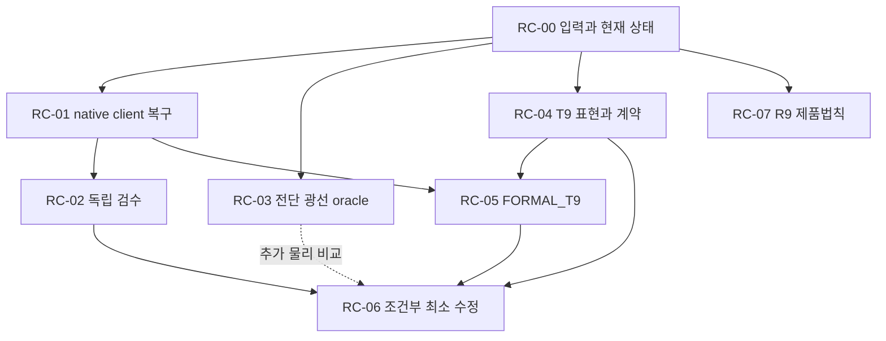

# R10 부분 checkpoint 검토와 다음 연구 DAG

Owner: HTT research. 상태: **PROPOSED continuation / DIAGNOSTIC_ONLY**.
Transfer source: none. 이 문서는 연구 재개 계획이며 과학·production admission이 아니다.

## 1. 기준과 MAIN 판정

| 구분 | 고정 identity |
|---|---|
| 반환 commit | `748dbdeec56ac58ed0b440f04eb4d492ab2cb185` |
| 반환 tree | `cfd5849e7f61a2d1ac7dbbd69783dd93eaa8f274` |
| 실제 코드·결과 source commit | `dcc5c7c215c671dc8036771e520bcafa4056cd65` |
| source tree | `ef6bb19ea87c0fd6fcc0a45d1f46522be39c567c` |
| 원 R10 계획 | `c8bd214a61088b684cad1d08873f05227cf5bfb0` |
| 재사용 R9 donor | `870bd67af159993ccde4ede9923424a475c01375` |

반환 commit은 source commit의 자식이며 `MAIN_CONTINUATION_PROMPT.md`만 추가했다.
두 identity는 충돌하지 않는다. source commit은 원 R10 계획에 22개 실행 파일을
추가했고 반환 commit까지 합쳐 23개이다. production 코드는 이 두 commit에서 변경되지 않았다.

**MAIN 판정: 부분 연구 checkpoint에는 Caution, production/관측 승격에는 Block.**
기존 결과를 보존하고 다음 연구에 재사용한다. 로컬 독립 검수와 네 축 admission은
여전히 미완료이며, 이번 MAIN 문서 검토·자체 계산은 그 자리를 대신하지 않는다.

이번에 직접 읽은 근거는 `../local_execution/`의 conventions, 세 실행 스크립트,
test, 반환·복귀 문서, 결과 JSON, 실행 로그, validation/runtime, blocker 요약,
그리고 고정 production의 terms/RHS/packed/mixed 경로이다. R9 selected-law donor
결과 본문도 읽었다. 다른 donor 계산 전체와 PNG 시각 검사는 재수행하지 않았다.
Git 본문 15개를 blob identity로 대조하고 네 스크립트의 기록된 SHA-256 일치를 확인했다.
기존 pytest나 R8/R9 실험을 여기서 재실행하지 않았다.

## 2. 무엇이 추가됐으며 무엇을 아직 식별하지 못하는가

| 대상 | 확인된 범위 | 정확한 한계와 다음 consumer |
|---|---|---|
| 광선→복사장→STF | 기록된 85개 residual의 최대값 `5.998090912839871e-12`, 고정 허용오차 `1e-10`; 코드·결과 hash 일치 | 유한 합성 fixture. 연속 구면·실제 mask·관측 역문제의 전역 인증은 아님 |
| Milne 연결 예제 | `H=1/tau`, 적색편이 인자 2, 평균 1.35 K, `Qxy=0.0005`, `Oxyz=0.0005/6` | 전단 0. Q/O는 입력 방출 무늬이며 등방 redshift는 정규화된 Q/O에서 소거됨. 전단이 Q를 생성하는 경로는 아직 연결되지 않음 |
| T9 | 처음 등방인 `ell=2` brightness에서 public photon RHS가 독립 kinetic oracle과 반대 부호; 5 STF 기저 × `a=1,2` | 10개 독립 결함이 아니라 같은 source coupling의 10개 probe. mixed CG 정규화·일반 ell·모든 neutrino 경로를 실험한 것은 아님 |
| Q/O 공분산 예제 | `G=[[0,-B^T],[B,0]]`, `R=exp(.01G)`, `C=I`에서 residual `3.33e-16` | 임의 B에도 성립하는 직교대수 확인. 실제 Lorentz/CMB 응답 또는 물리적 C2=C3 소거법칙으로 승격할 수 없음 |
| 공유 보정 | 같은 signal/nuisance 열의 quotient rank 0 | 식별불능의 유한 선형 예제. 실제 선택 관측법칙·공동 공분산을 제공하지 않음 |
| R9 재사용 | CF3–SDSS rule-based 294-row/depth descriptive 결과와 D3 compile 근거 | CF4 selected law가 아님. D2/D4, 공통 state/jet/anchor coverage, 독립 검수는 미완료 |

T9의 convention을 고정하면 `partial_s f=epsilon(sigma:ee)F'`이고
`integral epsilon^4 F'=-4 Pi0`이므로 direct STF에서
`dPi2/deta=-4 a sigma Pi0`이다. 현재 `terms.py:642`의 음의 T9 계수를
`hierarchy_rhs.py`의 `-a sum_T`가 다시 반전한다. packed operator는 이 term으로부터
생성되므로 둘의 일치는 독립 물리 검증이 아니다. 공유 neutrino 경로는 영향 조사
대상이지 이번 실행으로 전부 검증된 경로가 아니다.

리뷰 finding/제약:

- **P1 — 알려진 T9 source 부호 불일치:** 위 scope의 물리 소비를 차단한다.
  full/packed/public path의 물리 reference를 유지하고, FORMAL_T9와 소비 범위가
  일치할 때만 최소 candidate를 만든다. 전체 RHS 부호 반전은 금지한다.
- **P2 — 다음 검증 명령의 coverage:** 현재 5 pytest는 기저 역변환, 정적 endpoint,
  parity, inverse/chart domain을 검사한다. Milne redshift ODE와 Jacobi ODE는
  `optical_fixture.py`의 실행 로그 근거이다. 그 셀을 수정한 뒤 pytest만 통과시켜
  전체 연결 경로가 재검증됐다고 쓰지 않는다. 수정한 계산을 호출하는 좁은 검증을 추가한다.
- **P2 — 공분산 예제의 해석:** 새 물리 response라 쓰려면 실제 기하/boost에서
  유도한 generator와 Q/O metric을 결속해야 한다. 현재 예제는 직교대수 control로 재사용한다.
- **검수 blocker:** `review_blocker.json`은 hook 차단의 보고된 요약이다.
  MAIN은 로컬 native launch 기록을 열지 못했다. RC-01에서 원 registration/receipt로
  실제 상태를 확인하며 요약만으로 hook 수리 완료를 선언하지 않는다.

## 3. 목표와 실행 경계

이번 slice의 목표는 (a) 실행되지 않은 독립 검수 1회를 올바른 client worktree에서
완료하고, (b) 실제 전단→방사장→STF의 독립 연구 oracle을 얻고,
(c) T9의 표현/부호/시간 adapter를 formal consumer 범위까지 해소하며,
(d) 광학과 독립적인 R9 product/law 연구를 이어 가는 것이다.

Python/NumPy/SciPy의 기존 연구 경로를 쓴다. 저장소의 BASS production ownership과
`bass/runtime` admission 소유권을 유지한다. 새 Einstein/Bianchi solver를 만들지 않는다.
`../campaign_dag.json`의 36 nodes와 canonical DAG/status는 그대로 둔다.
아래 RC ID는 한 번의 재개 작업을 순서화하는 overlay이며 새로운 과학 gate가 아니다.
machine-readable 순서는 [continuation_dag.json](continuation_dag.json)에 있다.

원 dirty checkout, EXTERNAL-FUSION active run, 기존 실패 로그와 결과는 보존한다.
새 출력은 별도 attempt 디렉터리에 쓴다. archived runner의 고정 OUT을 원본 경로에서
재실행해 RED/결과를 덮어쓰지 않는다. 작업 시작 때 고정 snapshot과 현재 HEAD 차이를
확인하고 이후 변경은 자동으로 무효화하거나 자동으로 승인하지 말고 영향을 판정한다.

## 4. 재개 DAG

RC-08은 **어느 terminal/부분 checkpoint에서도** 반환할 수 있다. 그림의 모든
노드가 성공해야 반환하는 AND gate가 아니다. 점선은 선택적 추가 근거이며 RC-03은
원 OP-07의 기존 독립 oracle을 대체하는 새 필수 gate가 아니다.

| 작업 | 입력·의존성 | 실행과 산출물 | 완료 기준 / 막히는 범위 |
|---|---|---|---|
| RC-00 | 고정 반환 및 현재 checkout | HEAD/tree, dirty 상태, 기존 출력, pending launch, 적용되는 AGENTS/skills 확인 | 위 source와 현재 차이를 기록. hash 검사만으로 연구 완료 선언 금지 |
| RC-01 | RC-00 | 정확한 isolated worktree에서 native client를 열고 미전달 registration과 frozen source를 정상 절차로 reconcile | 실제 client/source identity와 dispatch 가능 상태 확인. prompt/cwd spoof, hook 비활성화, 원 active run 교체 금지 |
| RC-02 | RC-00, RC-01 | 기존 미실행 독립 reviewer 1회 재개 또는 정상 supersession. 원 4개 script/결과와 T9 consumer trace 검토 | 근거를 가진 review envelope와 미해결 finding. 음성 결과를 보존했다는 이유만으로 review 실패로 간주하지 않으며 과학 admission과 분리 |
| RC-03 | RC-00 | 아래 평탄 전단 oracle: source energy→occupation/intensity→full STF Q/O와 derivative limit | 고정 실험안, 수렴 표, sign/power/parity negative control. 사용한 원리와 미실행/실행 상태 구분. native review 부재는 exploratory 주 실행을 막지 않음 |
| RC-04 | RC-00 | Cartesian direct Pi ↔ packed ↔ mixed 5m ↔ intensity moment의 명시적 adapter; mixed caller의 LHS/RHS·시간·shear 입력 추적; CAS_CONTRACT 초안 | 현재 consumer마다 도메인/정규화/방향표와 실제 counterexample. mixed 표현이 제한된 경우 불가능한 전역 동형사상을 가정하지 않음 |
| RC-05 | RC-01, RC-04 | 선택한 T9 proposition의 네 축 독립 실행과 `cas_gate.py run-adjudicate` | 동일 현재 contract/source를 갖는 실제 eligibility. 미설치/timeout/누락 축은 해당 component HOLD. preflight·stored adjudicate는 통과 아님 |
| RC-06 | RC-02 finding 해소, RC-04의 PATCH_REQUIRED, RC-05의 해당 scope eligibility | 격리 candidate에서 T9 최소 수정, cache 재생성, independent RED/GREEN, old-sign mutation과 영향 소비자 검증 | 실제 바뀐 term의 전체 적용범위를 증명/검증해야 함. ell2 결과만으로 모든 ell 계수를 뒤집지 않음. production/canonical 승격은 자동 부여하지 않음 |
| RC-07 | RC-00; 각 R9 원 action의 자체 dependencies | donor와 현재 local 결과를 먼저 재사용. 준비된 product 하나의 selected law/response를 실제 계산에 결속하거나 구체적 식별불능 산출물 작성 | 범위가 명시된 과학 산출물. CF3/SDSS 진단을 CF4 law로 변경하지 않음. 광학/T9를 공통 대기조건으로 추가하지 않음 |
| RC-08 | terminal 또는 부분 checkpoint | 새 코드/결과/최초 실패/review 상태/다음 action을 non-force push하고 MAIN 반환 | 새 commit/tree와 tested source를 구분. 실패한 소비자만 HOLD; 전체 계획 완료로 포장하지 않음 |

RC-00 뒤 RC-01, RC-03, RC-04, RC-07은 논리적으로 병렬 가능하다. 실제 subagent는
먼저 `build_context_pack.py`와 `new_assignment.py`를 사용하고 네 필수 header,
assignment-first read, 소유 result path, repo의 4 concurrent/8 total/depth 2 제한을
지킨다. RC-05 실행 때 네 CAS 축에 슬롯을 우선 배정하고 범용 reviewer를 종료한다.
물리·production·공유 문서는 주 작성자 1명이 통합한다.

## 5. RC-03: 새 전단 광선 실험안 — 아직 실행하지 않음

이 실험은 Milne에서 빠진 전단 source를 독립적인 flat characteristic으로 검사한다.
물리 길이 좌표 `x0=c t`, 대칭 무흔적 상수 행렬 S [length^-1]를 택하고,
`u(x)=gamma(x)(1,S x)`, `gamma=(1-|S x|^2)^(-1/2)`로 정의한다.
관측점은 `(x0,x)=(h,0)`, 초기 방출면은 `x0=0`이다. h는 초가 아닌 길이이다.
무차원 계산에서는 `h/L*`, `L*S`를 함께 사용한다.

방출면의 각 점에서 local u에 대해 등방인 `F(epsilon_src)=exp(-epsilon_src/E*)`를
초기 조건으로 준다. 관측자의 future propagation e에 대한 정확한 광선 교점은
`x_src=-h e`이고, 직접 내적 `epsilon_src=-c u_src.p`에서

\[
g_h(e)=\frac{\epsilon_{src}}{\epsilon_{obs}}
=\frac{1+h\,e^TSe}{\sqrt{1-h^2 e^TS^2e}},\qquad
\Pi_h(e)=\Pi_0g_h(e)^{-4},\qquad T_h(e)=T_0g_h(e)^{-1}.
\]

전체 구면에서 `h ||S||op < 1`을 지킨다. 원점에서 A=theta=omega=0,
sigma=S이다. 원점 밖에서 congruence는 일반적으로 가속하며 방출면은 u에
직교하는 면이라고 가정하지 않는다. Stationary u가 stationary radiation을 뜻하지 않는다.

직접 STF coefficient로 추출하면 예상하는 국소 극한은

\[
\lim_{h\to0^+}\Pi_{2,ij}(h)/h=-4\Pi_0 S_{ij},\qquad
\lim_{h\to0^+}\Theta_{2,ij}(h)/h=-S_{ij}.
\]

등방 초기조건과 이 S에서는 모든 홀수 multipole이 유한 h에서도 0이다.
`n=-e`는 사중극자 부호 수리의 근거가 될 수 없다. 이것은 가정된 초기 복사장의
국소 전단 응답이며 cosmological initial condition이나 Bianchi transfer가 아니다.

실행 전에 h 범위, 구면 해상도, 허용오차와 truncation/roundoff 창을 정한다.
에너지 내적과 occupation 보존에서 구한 수치 경로를 위 닫힌식과 비교한다.
동일 식을 두 함수로 복사해 독립 oracle이라 부르지 않는다. h를 줄이는 극한과
고정 h에서 구면 해상도/적분 스텝을 줄이는 수렴을 구분한다. S=0, 5 STF 기저,
적어도 한 혼합 S, 원 부호 반전, brightness power 4→1 오류를 검사한다.
출력은 `continuation_execution/shear_ray/attemptNN/` 같은 새 경로에 둔다.
이 결과만으로 일반 ell hierarchy 또는 FORMAL_T9를 승인하지 않는다.

## 6. RC-04..06: 수리 전에 닫아야 할 과학 문제

1. `Pi_l`가 direct coefficient인지 적분 moment인지, packed basis metric 및
   intensity의 `Delta2/Delta0=2/15`를 실제 API와 결속한다. brightness와 temperature의
   -4/-1을 구별한다. 시간은 `ds=a d eta`, physical second는 c를 포함한다.
2. `mode_mixing_blocks.py`의 5m 배열은 단순 Cartesian 5-vector와 동일하다고 가정하지
   않는다. 실제 소비자의 m ordering, phase, normalization, valid subspace,
   LHS/RHS 적용 부호와 scale factor를 읽는다. 해결하지 못한 표현에는 eligibility를 주지 않는다.
3. 후보가 공통 `-(ell+2)` 계수를 수정한다면 영향을 받는 일반 ell의 kinetic/STF
   계수까지 FORMAL_T9에 포함한다. 현재 ell2 실험만으로 shared implementation 전체를
   정당화할 수 없다. 물리식은 유지하고 implementation을 비교한다.
4. full/packed를 위한 scope와 mixed scope를 명시한다. mixed 미해결이 독립 optical/R9
   연구를 막아서는 안 된다. mixed를 건드리는 후보 또는 이를 사용하는 consumer는
   해당 adapter가 해결될 때까지 차단한다. 공유 코드의 실제 영향은 좁게 라벨링한다고 사라지지 않는다.
5. 초기 `t9_attempt03.log`와 `t9_results.json`은 immutable RED로 남긴다.
   기존 diagnosis runner는 mismatch를 의도적으로 assert하고 exit 1을 내므로
   그대로 GREEN test로 재사용하지 않는다. 별도 candidate regression은 물리 reference와
   일치해야 pass하고 old-sign mutation에서 실제 code-to-oracle 비교가 fail해야 한다.
6. neutrino의 공유 massless path 및 파생 consumer, 캐시, 해당 문서·회귀테스트만
   영향에 맞춰 검증한다. historical results를 일괄 무효화하거나 재작성하지 않는다.

현재 local source가 이미 수정돼 `NO_PATCH_NEEDED`가 입증되면 원 OP-07의 reuse
분기를 사용한다. 동일 scope의 formal eligibility는 필요하며 두 번째 부호 반전은 하지 않는다.

## 7. 검증과 중단·반환

기존 optical 5 tests와 실행 로그는 위 범위로 재사용한다. optical 함수를 수정할 때만
해당 test를 재실행하고, Milne/Jacobi 계산을 수정했다면 그 계산 경로도 새 output
directory에서 검사한다. T9 candidate는 별도 targeted regression을 필수로 갖는다.
R8/R9 archived pools, full mocks, 원 55p 보고서 build는 이 slice의 반복 대상이 아니다.

다음 보호 상태는 그대로 유지한다: canonical T9 v4/30 및 candidate40,
R8 STOP_INVALID와 25 unresolved pools, CF4 P0 quarantine, PR284 deferred,
PR4/NPIPE exclusion, original alpha allocation 및 재분배 금지. 이번 overlay의
alpha spend는 0이다. static Q/O만으로 `JET_RESPONSE_LAW`를 만들지 않는다.
실제 provider/remainder/공통 상태가 없으면 physical image는 whole-domain이다.

이 계획의 구조 검증은 JSON DAG의 참조·비순환성·조건부 수리·실패 격리·terminal 반환을
검사한다. 원 36-node graph와 canonical DAG/status는 수정하지 않으므로 계획 성공이
그 node 완료 또는 scientific PASS를 뜻하지 않는다. 문서 delivery는 자체 검토로
진행하고, 실행 checkpoint의 독립 검수 HOLD는 계속 남긴다.

진행은 `keystone:change-review → task-creation → shipping`의 문서 delivery이다.
다음 Local event는 정확한 worktree의 native client에서 RC-00/01을 수행하는 것.
MAIN 환경에는 그 로컬 client/registration이 없어 해당 조치는 [handoff](LOCAL_CODEX_HANDOFF.md)에
명시했다. 이 한계는 수리된 것으로 처리하지 않는다. 후속 실패 시 같은 checkpoint를
보존하고 해당 action만 막힌 상태로 반환한다.

## 문서 delivery 검증 기록

MAIN의 `python3` 구조 검사 결과: **PASS_PLAN_STRUCTURE_ONLY** — 9개 RC node,
원 36-node graph의 node/action 참조, 비순환성, 6개 실패 격리 scenario,
repair/reuse 배타 분기, 선택 oracle의 비필수성, terminal 반환, Markdown link/fence와
공백 검사를 통과했다. 첫 검사는 prompt의 축약 `RC-01/02` 표기가 RC-02를 명시하지
않음을 검출했고 각 ID를 풀어 쓴 뒤 통과했다. 이는 과학 실행 검증이 아니다.

변경은 이 디렉터리의 계획·handoff·DAG 3개와 PR248 delta 추가분뿐이다.
MAIN 자체 문서 검토는 통과했으며 실행 checkpoint의 native independent review는
계속 pending이다. 이 두 review 대상을 합치지 않는다. CI 실행은 이 문서 delivery의
근거로 사용하지 않았다. 원격 tree와 파일 본문은 push 단계에서 대조한다.
복구는 이 문서 commit의 변경만 되돌리는 것으로 충분하며 데이터/production migration은 없다.
승인된 delivery 범위는 사용자 요청인 “DAG를 포함한 계획안을 push하고 handoff prompt를
제공”하는 것이다. merge/release나 scientific admission은 수행하지 않는다.
