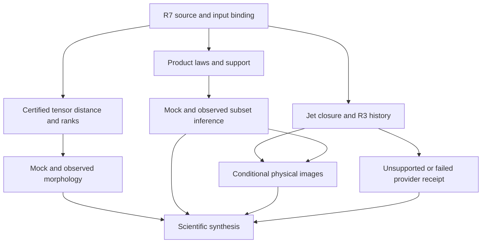

# R8 implementation design

## Decision and ownership

Choose a successor layer over R7, not a wholesale rewrite. Three alternatives were considered: require every exact distance/full covariance before any inference (unnecessarily blocks conservative science); substitute point estimates/diagonal covariance (invalidates guarantees); retain certified outer results and progressively admit stronger product laws (**selected**). R8 changes scientifically meaningful capabilities: computable full-tensor ranks, honest physical remainder sets, and additional observed-law execution. Evidence repair is reused, not the main research output.

obsstat owns tensors, distances and descriptive fields; `htt/htt/htt/infer` owns rank tests, laws and confidence images; common owns typed state; BASS adapters own restricted/external physical predictions; MIO consumes diagnostics only. A support function is not a likelihood. A posterior sample bank is not an exchangeable null pool.

## Interfaces: data structures and exact behavior

New modules below use existing R7 types as inputs where compatible. A canonical JSON-serializable `ScopeKey` contains `experiment_id, law_id, model_id, dataset_ids, convention_id, method_id, method_config_id, domain_id, conditioning_id`; ordered input identities and source binding are additional consumed evidence. Missing uncertainty cannot be repaired by inventing an ID. `RegionMembership` is `ACCEPT|REJECT|UNRESOLVED`; unresolved membership is included in outer confidence sets. `Bound(lo,hi,certificate)` has finite ordered endpoints or explicit extended infinities for set projections; orbit pair endpoints must be finite, nonnegative and certified. Input validation rejects NaN.

| New path | Interface and responsibility | Existing donor |
|---|---|---|
| `htt/obsstat/r8_orbit_bounds.py` | `invariant_lower(X,Y,precision)->Bound`; `refine_pair(X,Y,prior,budget)->Bound`; exact dyadic input identity, SO(3) chart cells, monotone bounds | `r7_tensor_orbit.py` rational rotations, covers, feasible local upper witnesses |
| `htt/htt/htt/infer/r8_interval_rank.py` | `rank_envelope(pair_bounds,observed,k,alpha)->RankEnvelope`; integer possible/certain counts, status and p interval | `r7_calibration.rank_pool_pvalue` as exact-score oracle |
| `htt/obsstat/r8_multipole_vectors.py` | `tensor_to_mv(tensor,l)->MVResult`; `mv_to_tensor(amplitude,vectors,l)->Tensor`; zero/multiple-root status and reconstruction bounds | current STF extraction, Krylov donor for separate packet comparison |
| `htt/htt/htt/infer/r8_support.py` | `factor_support(B,V,provenance)->SupportLaw`; `contains_residual(law,r)->RegionMembership`; exact reduced Gaussian coordinates | `r7_gaussian_law` conditioning and normalization |
| `htt/htt/htt/infer/r8_partial_law.py` | `marginal_acceptance(blocks,x,allocation)->RegionMembership`; `moment_acceptance(y,mu,v,alpha)`; uncertainty ladder | CF4/JWST affine/host design and original selected block |
| `htt/htt/htt/infer/r8_law_registry.py` | `admit_product(product,sidecar)->AdmittedLaw|ScopedRefusal`; `run_scope(live_law,method,x_or_domain)->ScopeResult` | `JointObservationLaw`, factory and same-object calibration binding |
| `htt/htt/htt/infer/r8_simulator_calibration.py` | `candidate_rank(law,x,N,seed,procedure)->RankResult`; whole procedure applied symmetrically; output domain qualification | existing calibration records, new non-Gaussian method adapter |
| `htt/src/common/r8_jet_set.py` | `jet_image(j0,L,rho,remainder,theta,domain)->TensorImage`; `support(image,a)->Bound` | signed rate map in `r7_radiation_jet` |
| `htt/htt/htt/infer/r8_confidence_image.py` | `outer_region(measurements,admitted_tuples,allocation)->PhysicalRegion`; `project(region,target)->BoundCertificate`; `closure_frontier(region_factory,target,value,rho_grid)` | `r7_confidence`, `r7_mes_region`, positive-denominator GF code |
| `htt/obsstat/r8_field_controls.py` | `evaluate_field(product,positions,frame,depth)->FieldControl`; no inferred covariance from grid RMSE | existing PR319 neural radial-velocity evaluator |
| `htt/bass/transfer/r8_restricted_history.py` | `stress_history(initial,domain,accuracy)->History`; `predict(history,events,observer,channels)->Prediction` | exact dust, kinetic/archive stress, photon and Jacobi mechanics |
| `scripts/observed_runs/run_tensor_joint_r8.py` | product-keyed DAG executor with subset continuation and scoped outputs | repaired R7 evidence binding; no hardcoded R7-19 or qiso-only result path |

`RankEnvelope` stores M,k, alpha numerator/denominator, certain/possible reference exceedances, p_lower,p_upper, exact-target hash, law-admission status, pair-bound receipt and `REJECT|NON_REJECT|UNRESOLVED`. The mathematical result can be valid while observational law admission is absent; report these as separate fields. It must not create a scientifically eligible p-value from an inventory-only simulation set.

`MVResult` stores amplitude, unit vectors modulo signs/permutation, l, reconstruction enclosure and conversion status. Reconstruction is the full-MV comparison metric; normalized alignment is a separate lossy method ID. Roundtrip error enters the enclosure or remains descriptive and cannot change the tensor reference rows.

`TensorImage` stores the shared jet domain, parameterized Θ if uncertain, joint remainder set and support certificates. It cannot expose central tensors as if they were the full physical confidence region. A separate central prediction may be returned with that explicit label. Projections may be finite, unbounded or unresolved independently for each target.

**JetBoundary:** R8's restricted provider admits sky and distance channels independently. The coupled history also supplies its directly defined normal/dust kinematics, but optical validation does not supply a radiation derivative jet. The current R8 action `record_radiation_jet_unavailable` emits only a status receipt, never `R3_JET_CHANNEL` or a jet-qualified likelihood. A future derivative channel must specify all P1 derivative components, event/congruence/rate normalization, independent derivative/limiting/convergence tests and a joint remainder domain before it can produce such a capability. In this bounded R8 design its status is explicitly INPUT_UNAVAILABLE; generic closure sensitivity and validated distance-model inference continue without it.

Finite-domain image qualification uses V07 alone. V08 is required only for recession/nonidentification claims. Failure of the latter cannot suppress a certified compact-domain support image; a target needing an unavailable global/recession certificate retains an unresolved outer result.

## Numerical algorithm and fixed initial budget

Freeze method ID `R8_SO3_INTERVAL_KNN_V1`. Use dyadic interpretation of input tensor coordinates. Start 128-bit interval arithmetic; permit 256 and 512 bits for unresolved root/sign bounds. Root isolation must retain repeated eigenvalues. Use four quaternion cubes and their outward cell radii; rational chart centers give exactly orthogonal rotations via homogeneous quaternion formulas. Initially evaluate identity and the inherited feasible local fit. The optimizer is never a lower-bound oracle.

Initialize **every unordered pair**, with no 1,024-pair cliff. The scheduler targets ambiguous observed comparisons and their kth-order-relevant pairs. Split a cell along its widest side (lexicographic tie break); prioritize lowest certified cell lower bound, then pair IDs. Budget per campaign block is 1,000,000 cell splits or 60 seconds of computation per checkpoint, whichever is first; checkpoint permits continuation. Initial whole-pool cap is 100,000,000 splits and 4 worker-hours per scope. These are resource limits, not success criteria. Exhaustion emits the current valid p interval; it does not shrink the bank or auto-promote an endpoint rank. A subsequent longer run resumes the same fixed target. Performance beyond these caps is a measured research outcome.

## Product and law sidecars

Only store fields consumed by a decision:

| Decision | Required sidecar |
|---|---|
| CMB rank law | product/release, realization IDs, signal/noise mapping, observed/simulated processing, units, beam/pixel/mask/fit and monopole/dipole/kinetic corrections, law assumptions |
| Distance/CF4/BAO likelihood | ordered source/group/measurement IDs, value semantics/units/frame, mean operator, selection and conditioning, covariance/marginal-law provenance |
| Shared analysis | latent/calibration/overlap IDs, design/loadings, measurement-noise relationships; same-host contrast map or duplicate map |
| Singular support | structural factor B, reduced covariance V, input provenance and support/rounding semantics |
| Physical image | event, congruence, rate-normalized jet, closure/remainder domain and provenance, Θ support, target definitions |
| Simulator calibration | candidate law, exact procedure/fit/selection, fixed domain or grid, seeds, N, complete row receipts, reference test/error criteria |

Unknown values produce a specific refusal or weaker route. No default independent covariance, unknown dipole=0, all-zero absent measurement or silently fitted simulator law is permitted. Fitting nuisance from observed data requires a justified composite-null method, not IID simulation at the fitted value labeled exact.

## DAG execution and branch settlement

`campaign_dag.json` is the successor scientific graph. It does not rewrite the older canonical PR counts or declare R7 accepted. Register these tasks through the local canonical PR machinery at implementation intake; the graph is the scientific specification for that formal replan. Nodes list `after` **terminal receipt** dependencies, not success dependencies. Each action rule names only the capabilities it consumes. If these are absent, it emits a typed scoped receipt and its independent action rules still run. Pending dependencies are settled before dependent action rules; stale/missing evidence is not a successful receipt.

Nodes with many products iterate each fixed product independently. No one missing CF4 covariance can suppress an admitted DESI law, and no R3 optical failure can suppress P0/P1 model comparisons. P0/P1 still require their own admitted response and calibration; they do not inherit success by default. The synthesis consumes every node, even if all observational products are unavailable. An entirely unavailable run can finish a methods/limitations report, not an observational discovery.

## Research outcomes and manuscript route

The methods article can conclude interval-rank validity, tested computation and representation/summary comparisons even if the physical provider fails. The observations article needs product-qualified results and joins only admitted common states. The model-specific article needs actual response/likelihood validation. A CMB anomaly rejects the conjunction of its sky, processing and stochastic law, not automatically FLRW geometry. A finite MES image is conditional on the admitted jet/remainder domain. A nonidentification certificate names the unmeasured direction. If no new observed result is qualified, preserve the old qiso result with its exact historical scope and report why the new data routes remained unavailable.

## Operational harness separation

The actual b7172ad evidence consumer remains authoritative for its old scope. R8 does not broaden that contract by renaming old axis results. New CAS obligations use a new shared contract and four current observed axes. This connector design session has no registered native checkout/hook run; its analytical independent reviews are portable research reviews, not native hook acceptance. Local execution must bind the right checkout/run and obey current local controls. HARNESS_UPDATE proposes a fix for the reproduced wrong-checkout failure without editing or bypassing those controls here.
