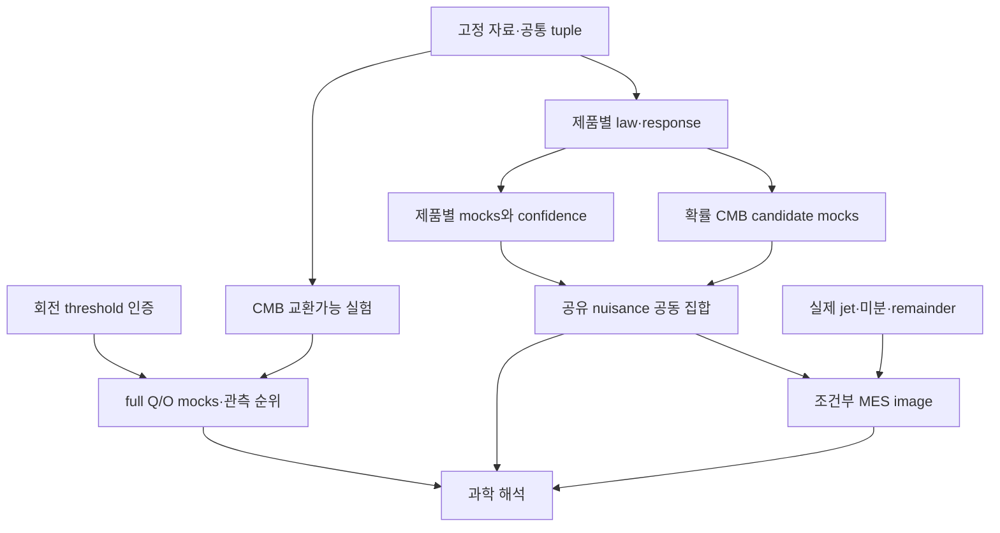

# R9 — 관측 응답에서 공동 물리 해석까지

목표는 **전체 Q/O 형태, 관측자·source 방향 응답, 자료 간 보정과 조건부 물리 집합을 같은 연구 질문에 연결하는 것**이다. R8의 실행 성과와 실패를 출발점으로 삼는다. BASS의 물질–복사–광학 벤치마크를 진행하거나 HTT 선행 조건으로 요구하지 않는다.

이번에 수행한 것은 직접 유도, 판별 가능한 mock/대수 계산, 독립 연구 검토와 설계다. `campaign_dag.json`의 미래 production·관측 노드를 실행한 것은 아니다. 현재 원문 준비에서 확보한 42개 주장 카드와 세 보고서의 구분을 유지한다.

## 1. 가장 짧은 경로와 그 과학 질문

| 경로 | 실제로 묻는 질문 | 먼저 완성할 연결 | 관측 결과의 허용 범위 |
|---|---|---|---|
| Full Q/O | 특정 관측 형태가 고정 null에서 얼마나 드문가? | C1의 threshold witness 구현과 실제 처리에 맞는 교환가능 pool | 순위 구간·기각/비기각/미해결. 원인·물리 모수는 별도 |
| Processed CMB response | 선언한 local boost 또는 candidate response가 관측을 설명하는가? | 확률적인 Q/O의 **공동** 법칙과 처리·고차 nuisance | local beta 또는 명시한 조건부 candidate 집합 |
| CF4 + JWST calibration | 거리 자료의 방향·깊이 패턴을 보정 오차와 구별할 수 있는가? | 원 거리모듈러스 법칙, 실제 선택·group·보정 및 공유 eta adapter | 새 방법의 현상론적 radial bulk/STF 조합과 식별 한계 |
| DESI / Union3 | 배경 거리·공통 보정과 일관적인가? | DESI 기존 조건부 법칙 재사용; Union3 approximate label 보존 | 배경 비교·민감도. 각도 없는 요약량의 tilt는 불가 |
| Conditional MES | 동일한 관측·미분·remainder 집합이 어떤 물리 상태를 허용하는가? | 실제 observation-to-jet 관계와 미분 조건 | 조건부 finite/unbounded/unresolved image |

첫 구현 묶음은 **공유 tuple adapter + target별 응답/오차 집합 + 제품별 실제 law intake**다. CMB full-distance 계산은 threshold 비교로 집중하고 별도 진행한다. DESI·JWST 보정·CF4 새 방법의 작업이 CMB의 큰 회전 탐색이나 MES 미분 입력을 기다릴 이유는 없다. 즉시 읽고 계산 가능한 descriptive product controls는 formal inference gate와 분리한다. 가장 빨리 숫자가 나오는 배경 요약을 원래 full-morphology 연구의 완료로 바꾸지 않는다.

## 2. 이번 연구가 추가한 판별 결과

- **깊이 분리 조건:** 기존 FLRW kernel 비의 도함수는 H'I다. 일정 H에서는 어떤 깊이에서도 observer/source가 정확히 퇴화한다. 낮은 z에서 분리는 z²부터 시작한다. 실제 6방향·2깊이 fixture에서는 shallow design의 조건수가 약 97,928, 깊이를 넓힌 [0.1,0.5] fixture에서는 약 116이었다. 이는 실제 survey 오차·선택 검증과 별개다.
- **공유 보정 결합:** 각 자료에서 eta를 따로 제거하면 없어지는 정보가, 동일 eta를 공유하여 제약을 교차한 뒤 theta로 사영하면 남을 수 있다. 실제 r7 CF4/JWST adapter는 fitted coefficients를 theta로 보내고 jacobian_eta를 비워 두므로 공통 좌표 embedding을 구현해야 한다.
- **오차와 신뢰집합:** bounded discrepancy의 방향별 support를 식별 가능한 target에 직접 전파한다. toy Gaussian cells에서 오차를 무시하면 coverage가 약 79–84%였고, 보수적 오차 집합을 포함하면 약 99.2–99.7%였다. 과도한 보수성도 함께 드러난다. 실제 데이터의 bound가 없으면 이 숫자를 이식할 수 없다.
- **CMB joint-law 응답:** 고정 source boost와 관측 Q 조건부 response는 다르다. 이상적 Gaussian full-sky에서 factor 1-C3/C2를 포함한다. 기존 B_Q의 algebraic rank만으로 noisy-sky likelihood를 승인하지 않는다.
- **CMB 순위 계산:** 정확한 모든 거리 대신 순위 부등식을 결정하는 행의 witness 수를 인증한다. metric pivot propagation과 strict/inclusive threshold를 보존한다. 계산 가속 폭은 실제 SO(3) mock에서 아직 검증하지 않았다.

식과 증명은 `THEORY.md`, `CMB_RESEARCH.md`; 실제 코드와 결과는 `validate_research.py`, `validate_cmb_research.py`, `evidence/`에 있다. 독립 분야별 유도는 `reviews/`에 보존한다. 문헌적 신규성은 미확정이다.

## 3. CF4 새 방법과 JWST의 정확한 역할

기존 quarantine 대상 bulk-flow 출력을 재사용하지 않는다. 별도 방법에서 관측 거리모듈러스 mu와 원 오차·group·보정 구조를 유지한다. 낮은 z 현상론의 예는

\[
w=n\cdot B+r(H+n^T S n),\quad
r=\frac{w-n\cdot B}{H+n^T S n},\quad K=5/\ln10.
\]

S는 선언한 STF 기저의 속도 기울기, B는 radial bulk 성분이다. 회전의 antisymmetric 부분은 n^T Omega n=0이므로 radial 자료에서 직접 식별되지 않는다. 양의 분자·분모와 d_L≈r의 적용 범위를 선언한다. 기준점에서 modulus 반응은 bulk에 -K n/w, STF에 -K n^T E_a n/H, H에 -K/H다. 거리 Gaussian을 속도 Gaussian으로 바꾸지 않는다. V3k처럼 이미 CMB frame으로 옮긴 열에는 observer boost를 중복 적용하지 않는다.

u=n·B/w, q=(deltaH+n^T S n)/H0에 대해 |u|<=rho_u<1, |q|<=rho_q<1이면 logarithm 선형화의 rowwise 오차는

\[
|R_\mu|\le\frac K2\left[\frac{u^2}{1-\rho_u}+\frac{q^2}{1-\rho_q}\right].
\]

여기에 실제 finite-redshift distance와 선택·보정 오차를 더해야 한다. 위 식만으로 실제 CF4 law가 완성되지 않는다. 동일 shell의 bulk dipole은 sky-dipole 보정과 정확히 겹칠 수 있으므로 실제 깊이·방향·측정법 incidence를 포함한 행렬을 비교한다. 공통 H scale과 공통 zero point의 퇴화는 JWST same-host 차이만으로 사라지지 않는다.

JWST contrast가 거리 신호를 지워도, 다른 제품과 실제로 공유하는 방법별 calibration 차이를 제한할 수 있다. 그 연결은 실제 anchor graph·관측법의 동일성으로 정당화해야 한다. 공유 nuisance를 편의상 선언하거나 서로 다른 zero point를 동일하게 묶지 않는다.

## 4. 구현 인터페이스와 재사용

| 입력/구현 | 재사용 또는 추가 변경 | 소비자 |
|---|---|---|
| `r7_depth_response.py` | kernel·frame 검사를 재사용; 전체 truncation/processing discrepancy 추가 | R9 response/condition audit |
| `boost_response.py`, WU-011 processed response | 고정 source map 재사용; 확률 source이면 joint covariance/conditional law부터 구성 | CMB candidate likelihood |
| `r8_orbit_bounds.py`, `r8_interval_rank.py` | rational/outward bounds 유지; threshold-directed pair selector·pivot constraints 추가 | full-Q/O rank |
| `r7_cf4_law.py`, `r7_jwst_law.py` | `theta/eta` 글로벌 좌표 embedding, 실제 source-selected law 분리 | common tuple product constraints |
| `r8_law_registry.py`, `r8_partial_law.py` | 법칙·모멘트·전체 영역 반환 유지; 제품별 typed output | joint outer region |
| `r8_jet_set.py`, `r8_confidence_image.py` | existing set propagation 재사용; 실제 관측 jet와 normalization mapper 필요 | physical image |
| 이전 Teff error result | actual approximation consumer가 있을 때만 목적 kernel/error set으로 연결 | 해당 response branch만 |

생산용 제안 데이터형은 `SharedStateEmbedding`(물리 target, shared nuisance, product nuisance의 단위·frame·incidence map), `SelectedProductLaw`(선택법칙/조건부 대상/행/오차/qualification), `ResponseWithDiscrepancy`(matrix 또는 candidate map, remainder set와 적용영역), `OuterRegion`(포함·배제·미해결 판정과 bound)이다. 새 filename은 implementation에서 저장소 기존 타입과 중복 여부를 읽은 뒤 정한다. 현재 타입에 단순 wrapper를 더해 관측 의미를 누락시키지 않는다.

## 5. 검증 사다리

1. 현재 source와 정확히 대응하는 scoped 수학 명제를 정한다. 필요한 production formal gate는 Wolfram+xAct / SymPy / Sage+Singular / Lean의 관측 실행을 요구한다. 이번 Wolfram·Fraction·mock 증거는 이를 대체하지 않는다.
2. 위 반례와 독립 analytic oracle를 production 함수에 연결한다. 실제 forward chain을 재사용하더라도 oracle의 공유 계수·처리 경로는 표시한다.
3. 고정 실제 설계에서 선택·group·calibration·noise를 포함한 model mocks를 수행한다. truth target별 coverage/FPR, unresolved fraction과 원인을 기록한다. 동일 simulation의 가중 복사본을 독립 draw로 세지 않는다.
4. selected law와 response를 각각 수락한 product만 empirical set으로 승격한다. 법칙이 부분적으로만 확인되면 정당한 marginal/moment outer set 또는 명시한 scenario로 제한한다.
5. 동일 tuple에서 교차하고 physical relation이 정당한 범위만 pushforward한다. empty에 대한 증명, unbounded 방향, unresolved 연산을 별도 출력한다.

Gaussian fixture가 실패하지 않았다는 이유로 실제 선택법칙을 승인하지 않는다. nuisance를 동일 fit에서 추정하거나 covariance를 추정한 경우 exact fixed-design pivot을 그대로 쓰지 않는다. source/target mismatch, rank threshold, wrong sign/frame, missing bias, independent-calibration clone과 double-counted sky는 필수 적대적 사례다.

## 6. DAG와 실패 독립성

`campaign_dag.json`은 24개 노드의 실행 계획이다. capability는 process 종료가 아니라 해당 acceptance evidence로만 발생한다. 한 node의 독립 action 중 일부만 성공할 수 있다. OR/AND 요구와 각 action의 법칙을 분리한다.

CF4 law 부재는 DESI·CMB 진행을 막지 않는다. CMB rank unresolved는 별도로 qualified된 candidate response를 막지 않는다. MES nonidentifiability certificate 실패는 finite image를 막지 않는다. actual jet 부재는 empirical MES만 막는다. BASS와 목적상 쓰이지 않는 Teff의 완료는 어느 공통 gate에도 들어가지 않는다.

R8 alpha와 과거 frozen 실험은 그대로 보존한다. **새 R9 보고 family**는 CMB/CF4/distance-calibration/DESI에 각 1/80을 유지하되, CMB rank와 candidate confidence를 동시에 주장할 때 CMB 내부에서 각 1/160로 사전 분할한다. 빠진 branch의 alpha는 재배분하지 않는다. Beta comparator와 Union3 approximation은 기본적으로 이 exact family의 co-primary 결과가 아니다. 모든 유의 수준은 protocol과 실제 보고 대상에 결합한다.

## 7. 원래 과학 목표까지 남는 최소 이론 작업

공통 원인에 대한 첫 결과는 같은 상태·calibration·response를 공유한 feasible set의 공집합 여부나 식별 가능한 방향/깊이 조합일 수 있다. 충분한 법칙과 지지되는 response가 있다면 BASS solver 없이도 이 결과를 낼 수 있다. 다만 이 결과를 matter congruence의 전역 tilt 또는 signed departure로 읽으려면 local observer/source-frame 관계와 물리 미분·closure가 필요하다. 이 후속 해석을 관측 통계의 자동 출력으로 만들지 않는다.

원래 목표는 전체 low-ell 형태에서 tensorized MES와 여러 관측의 공통 원인으로 나아가는 것이다. 현재 shortest path는 그 사이의 **법칙·응답·식별 관계**를 실제 product에서 닫는 것이며, 새로운 scalar summary나 배경 fit만 반복하는 것으로 대체하지 않는다.
