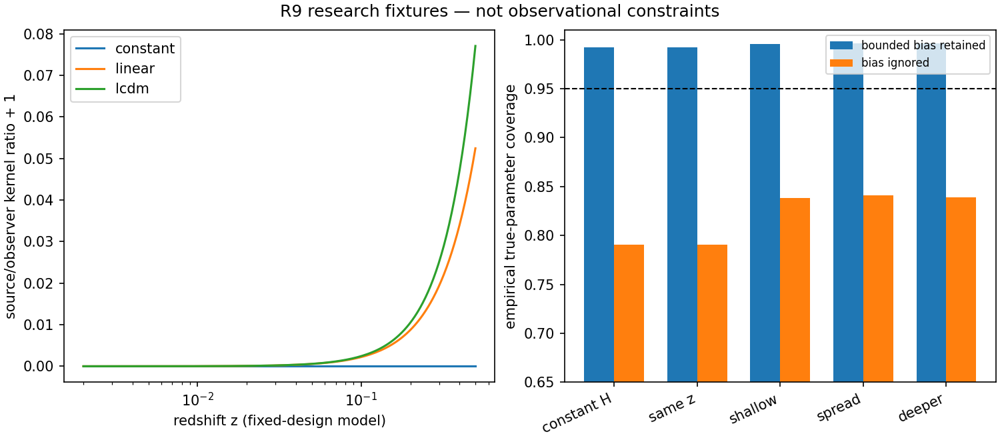

# HTT R9 — 관측 응답·공유 보정·조건부 물리 추론

> **Current revision 2**: report-seeded upgrade from `5e4e899c` on the `d514eabd` catalog base. Read [model-to-data design](revision2/MODEL_TO_DATA.md), [new derivations](revision2/THEORY_EXTENSION.md), and [revision review](revision2/REVIEW.md) first. The 30-node DAG preserves R9-00…23 and adds R9-24…29. Original R9 evidence below remains historical. This revision ran reference experiments, not production or observations; the original session had no GPT-6 archive. Research-only package acquisition/application was completed on 2026-09-13; see [current activation](revision2/harness_activation/STATE.md). The coding package and historical whole-run aggregate remain separate.

R8 `efc5f30666b96782f946375551f0068bb3a30f74`와 catalog 기반 42개 주장 카드를 시드로 수행한 GPT‑6 Astra v4.0.0 연구·설계다. **실제 유도·bounded mock 계산은 완료했으며, production 구현·formal CAS·새 실자료 추론은 후속 DAG에 남아 있다.**

가장 짧은 후속 경로는 자료별 selected law와 공통 물리/보정 tuple을 실제 response에 연결하는 것이다. Full Q/O 관측 순위와 processed CMB candidate inference는 별도 과학 질문으로 진행한다. BASS matter–radiation–optics benchmark는 이 프로그램의 선행 조건에서 제외한다.

## 읽기 순서

1. [DESIGN.md](DESIGN.md): 과학 질문, 최소 구현, 실제 제품 연결과 24개 노드의 의미.
2. [THEORY.md](THEORY.md): 깊이 응답, nuisance/오차 집합, 공동 영역, MES normalization 유도.
3. [CMB_RESEARCH.md](CMB_RESEARCH.md): threshold rank 인증과 stochastic-Q 응답의 차이.
4. [campaign_dag.json](campaign_dag.json): 모델 검증→제품 law→mock→관측→해석의 action별 실행 계획.
5. [HANDOFF_PROMPT.md](HANDOFF_PROMPT.md): Local Codex 인계.
6. [REVIEW.md](REVIEW.md): 독립 심사와 수락 범위.

## 이번 계산에서 확인한 것

| 검산 | 결과 | 한계 |
|---|---|---|
| 기존 depth kernel | 일정 H 또는 같은 z에서는 rank 3; 변화하는 H의 여러 깊이에서는 fixture rank 6 가능 | 실제 survey geometry·nuisance와 다름; low-z 조건수가 매우 큼 |
| 5개 bounded-bias Gaussian cells | cell별 20,000회, bias 포함 coverage 0.99215–0.99655; bias 무시 0.7903–0.8411 | true-parameter pivot 계산; production response 전체 검증 아님 |
| 3개 상관 calibration cells | 공유 tuple Bonferroni coverage 0.98225–1; 독립성 가정 control은 rho=-0.8에서 0.87925 | 알려진 Gaussian marginal fixture; 실제 calibration law 아님 |
| 9개 rank witness cases | known metric truth를 모두 포함; coincident ties 포함 | 실제 SO(3) runtime 가속은 미평가 |
| 이상적 CMB projection fraction | Beta(3/2,2) 꼬리식 일치; 20,000회 중 1,021 기각 | full-sky isotropic conditional null 한정 |
| 확률 CMB joint response | C2=C3에서 1차 응답 0; 비동일 spectrum에서는 중앙차분 2차 수렴 | synthetic skew-generator fixture |
| DAG 구조·실패 격리 | 24개 node, 11개 failure-isolation scenarios | 과학 노드의 실행 또는 수락을 뜻하지 않음 |

실제 명령:

```sh
python3 docs/research_program/tensor_joint_r9/validate_research.py
python3 docs/research_program/tensor_joint_r9/validate_cmb_research.py
python3 docs/research_program/tensor_joint_r9/validate_dag.py
```

첫 Python 실행은 SymPy 부재로 중단됐다. `evidence_initial_failure.log`를 보존하고, 저차원 정확 대수는 표준 Fraction으로, symbolic depth 식은 실제 연결된 Wolfram 실행으로 확인했다. 이는 SymPy 또는 네 축 CAS의 성공을 의미하지 않는다. CMB 별도 PRNG stream은 첫 실행 전에 20260913으로 고정했고, response/calibration은 20260912다. 결과를 보고 seed나 alpha를 바꾸지 않았다. 실행 로그와 JSON은 `evidence/` 및 `*_execution.log`에 있다.



그림은 합성 조건과 과도한 보수성을 표시한다. 수치의 binomial 불확실성은 원 JSON에 있으며, 하나의 관측 자료도 이 그림으로 수락하지 않는다.

## 보존한 과거 결과와 미해결 범위

R8의 STOP_INVALID, 25개 unresolved pool, 기존 CAS 미충족, CF4 quarantine, DESI conditional qiso와 Union3 approximate scenario는 원문 상태를 유지한다. 신규 empirical beta, global matter tilt, x_C/F/G_F, Bianchi family 또는 native solver 결과를 보고하지 않는다. 목적 커널이 없는 Teff 정보손실은 실제 관측 오차로 번역하지 않는다. DB 압축해제본을 복원하지 않았다.

이번 결과는 known statistical machinery를 HTT의 구체적인 response와 연결한 연구·구현 인계다. 출판 신규성이나 실자료 결과의 출판 준비도를 확정하지 않는다.
