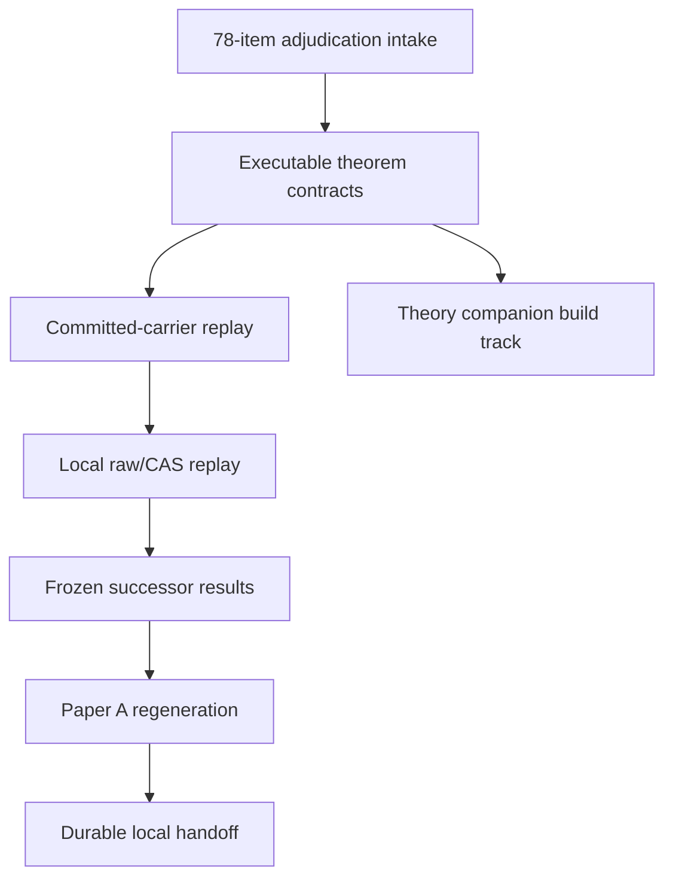
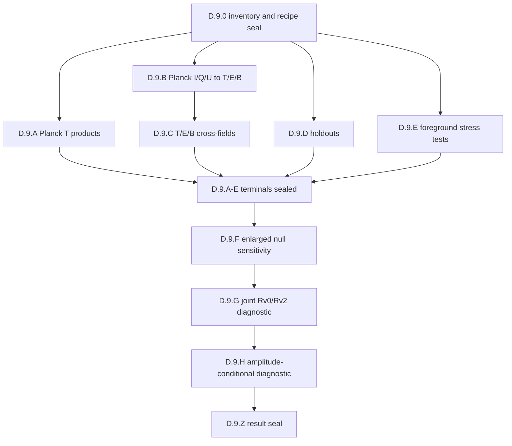

# PMG-WU-009 full replay and theorem reconciliation design

Status: design revised with critical I/Q/U-to-T/E/B audit; implementation pending written-spec approval  
Date: 2026-08-30 UTC  
Repository: `cosmosapjw-quantum/htt_base`  
Exact base branch: `changeset/planck-mes-wu008-injection-power-20260829`  
Exact base commit: `5e81ed1635b8fe6fc944829a9fab7ab8d5b8c654`  
Exact base tree: `be66c70662802930723f49f6d0cb2f678367d0c0`  
Design branch: `changeset/planck-mes-wu009-full-replay-theorem-reconciliation-20260830`

## 1. Decision and source precedence

The selected route is a full replay design. It reconciles the new 78-item theorem audit with the latest completed observation-side work, replays every stage that can be executed from committed carriers, prepares a fail-closed local replay for raw Planck/FFP10 and Wolfram/xAct inputs, and regenerates the first-observation paper only after the corrected outputs are frozen.

The controlling source order is:

1. the user's explicit choice of the full replay route;
2. the exact PMG-WU-008 terminal and artifacts at the base commit above;
3. the submitted `OVERNIGHT SCIENCE EXECUTION QUEUE / LOW-ELL FULL-STOKES / T-E-B ROBUSTNESS CAMPAIGN`, as critically corrected in section 8;
4. the user-supplied 78-item theorem adjudication summary in the current conversation;
5. repository proof ledgers, CAS receipts, code, tests, and generated artifacts reachable from the base commit;
6. older PR-324/Paper-A planning documents and transcript-only historical claims.

The original `MES_78_THEOREM_PROOFS_20260830_1be8c03c0c` package is not present in the uploaded files, scratch workspace, or GitHub code search. Therefore, the user-supplied summary may control correction semantics, but it cannot be represented as an exact replay of the missing 27-section proof dossier. Until that package is supplied and validated, formal-proof provenance remains `FORMAL_DOSSIER_PENDING` and no claim may be promoted solely from a reconstructed summary.

## 2. Existing authority and preserved results

PMG-WU-008 is the latest complete scientific authority discovered in the repository. Its reviewed terminal states:

- `state = SUCCEEDED`;
- `replay_status = MATCH`;
- `fresh_review = PASS` with `P0_remaining = P1_remaining = 0`;
- `real_host_execution = true`;
- `observation_used_for_power = false`;
- `raw_maps_reopened = false` and `raw_data_mutation = false`;
- `claim_promotion = false`;
- `next_executable_action = PMG-WU-009`.

WU-009 must preserve the byte identity and interpretation of WU-007/WU-008 outputs. Corrected results go to new paths; prior artifacts are never overwritten. A correction may change a conclusion, rank, or admissibility status only through an explicitly replayed successor result.

GitHub connector routing has already been exercised by isolated PR #439, which performed a one-file push, pull request, expected-head merge, and readback only between `connector-smoke/*` branches. This is sufficient as the requested mock push/PR/merge capability proof. WU-009 must not create another canary or merge a scientific branch.

## 3. Scientific conventions and claim ceiling

- Metric signature is `(-,+,+,+)`.
- Keep `c`, `G`, `\hbar`, and `k_B` explicit unless a local module declares natural units.
- Distinguish the normal, electron, matter, CMB, and local-observer frames.
- Distinguish a local Lorentz boost, global matter-frame tilt, and Bianchi/background anisotropy.
- Harmonic and STF normalization, stored-real conventions, frequency/temperature measure, sky mask, and frame must be carried as metadata.
- `obsstat` owns observable carriers, invariant features, null scores, and finite-rank calibration; it does not infer a Bianchi family.
- HTT owns model-dependent likelihoods and identified sets. MIO diagnostics remain diagnostic only.
- Before a native low-ell morphology atlas, the maximum empirical claim is conditional morphology compatibility. No scalar, invariant, boost-compatible, or quadratic-sky result identifies a Bianchi geometry or family.

The first-observation paper remains an MES-centred, finite-null, observation-analysis paper. Generic anomaly coordinates are controls or diagnostics and cannot replace the MES endpoint.

## 4. Architecture

The WU-009 gate seals are serial: A -> B -> C -> D -> E -> F -> G. The separately buildable theory companion may begin only after Gate B seals, but it is an implementation track, not a parallel gate; it cannot authorize a Gate-F publication result or a Gate-G handoff before their serial predecessors seal. Gate D contains the predeclared local I/Q/U-to-T/E/B robustness sub-DAG below: a typed terminal outcome in one product or sub-lane does not authorize a fallback claim and does not block an otherwise independent declared Gate-D sub-lane. Gate E may seal only after every declared Gate-D sub-lane has an exact manifest-bound terminal record.

### Gate A — typed theorem adjudication intake

Create one machine-readable adjudication ledger containing all A01-A14, B01-B22, C01-C18, D01-D08, and E01-E16 rows. Every row records:

- the corrected verdict (`PROVED`, `STRENGTHENED`, `CORRECTED`, `REFUTED`, or `UNDEFINED`);
- exact assumptions and domain;
- old claim text that is withdrawn or narrowed;
- replacement statement;
- proof reference when available;
- executable test IDs;
- affected repository files and manuscript claims;
- evidence status and release status.

The ledger must distinguish mathematical truth, evidence materialization, replay, and release. Missing proof files lower evidence/replay status without changing a theorem statement explicitly supplied and accepted by the user. The ledger is the correction source of truth; generated projections and manuscript tables are derived from it.

### Gate B — executable theorem contracts

Implement bounded modules rather than one monolithic theorem file:

1. `obsstat` orbit layer: stored-real harmonic/STF conversion checks, chirality-aware invariants, generic `det K != 0` separation domain, and abstention on unstable/degenerate strata.
2. MES geometry layer: sharp cubic inequality, moment Gram matrix, Cayley-Hamilton closure, chirality/discriminant inequality, and noncommuting endpoint bounds.
3. boost/inverse layer: the `Q -> O` response, least-squares inverse, sharp `5/3` condition bound, orthogonal residual projection, unrestricted-octupole nonidentifiability witness, and positive-quadratic-sky round trip.
4. statistics layer: superuniform finite rank under a row-equivariant complete pipeline, full outer adaptation replay, increasing/decreasing transformation rules, selection-symmetry examples, and shared-data e-value conditionality.
5. likelihood guard layer: direct-temperature likelihood contract and an explicit refusal of unweighted inverse-square fitting under untruncated Gaussian direct-temperature noise.

These modules expose pure functions and typed diagnostics. They do not generate physical vectors from scalar ceilings, infer a cause from a representation, or silently regularize a failed domain.

### Gate C — committed-carrier replay

Use only committed, manifest-bound observation/null carriers already present on the WU-008 branch:

- paired-300 primary observation-inclusive pool;
- CMB-only-999 robustness pool;
- WU-008 observation-blind injection/power artifacts;
- retained real-harmonic/irrep carriers where available.

Replay the complete endpoint selection and score construction once per candidate row. Do not select a feature, handedness, tail, reducer, mask, frame, or nuisance convention from the real observation and reuse it unchanged for pseudo-observations. Store both legacy and corrected results; legacy ranks remain historical controls.

Required new diagnostics are:

- mirror-pair collision under old O(3)-only features and separation by chirality-aware features;
- numerical quotient-rank and generic-stratum checks;
- `det K` margin/abstention tables for all rows;
- full-adaptation and broken-equivariance negative controls;
- tail-swap tests for decreasing transformations;
- boost orthogonal-residual and unrestricted-nuisance profiles;
- whether the retained carrier contains the monopole/dipole and absolute positive temperature required by the quadratic-sky inverse.

If the committed carrier lacks information required by a test, the result is typed `NOT_IDENTIFIED_FROM_COMMITTED_CARRIER`; it is not imputed from scalar features.

### Gate D — local raw Planck/FFP10 and CAS replay

This gate runs only on the user's local host. It must use explicit roots and never recursively scan or write beneath raw-data roots. It performs:

1. exact input/predecessor/preflight validation;
2. materialization and SHA-256 validation of the missing theorem dossier when supplied;
3. Python exact-algebra replay and Wolfram/xAct replay using the declared `XACT_PARENT`;
4. raw Planck PR3 component-separated and ordered FFP10 reconstruction only from already-held, manifest-bound inputs, and only when (a) a correction changes carrier extraction, frame/mask convention, or required retained information, or (b) the declared I/Q/U-to-T/E/B robustness sub-DAG below requires the admitted product; all new results go to successor output roots;
5. corrected paired-300 and CMB-only-999 construction in new output directories;
6. observation-blind injection/power replay;
7. independent figure inspection at registered output sizes;
8. fresh-context scientific, statistical, numerical, software, and claim review.

Planck component-separated maps normally remove or make unusable an absolute monopole and the physical dipole needed by the exact positive-quadratic `T^{-2}` inverse. The local gate must test this prerequisite explicitly. If absent, it must terminate the empirical inverse lane as `NOT_ADMISSIBLE_MISSING_ABSOLUTE_T_MONOPOLE_DIPOLE`; a synthetic round trip may still pass, but it cannot be promoted to a Planck inference.

#### Gate D.9 — declared I/Q/U-to-T/E/B robustness sub-DAG

This is an execution subgraph of Gate D, not a new research programme, governance layer, or standalone planning document. It reuses existing temperature/map-free analysis lanes and treats every raw product as a D.9.0 inventory candidate until content, fields, conventions, and route are admitted. It uses installed environments, immutable raw-data roots, and manifest-bound successor output roots. It must not create an intermediate PR, consume GitHub Actions, broadly download data, duplicate large datasets, or alter WU-006/WU-007/WU-008 artifacts. The campaign uses I/Q/U linear-polarization data, not Stokes V, so it must not be described as full-Stokes inference.

Before any new observed-value computation, seal one D.9 recipe manifest containing the source inventory, product/split identities, units, masks/fills, beams, pixel windows, coordinate frame, I/Q/U and E/B conventions, harmonic normalization, transfer functions, calibration and bandpass/color conventions, monopole/dipole and kinematic-quadrupole treatment, field/parity law, frozen statistic version, null identity, output root, and code/environment identities. The manifest also freezes the product-stability metric, missing-product rule, cross-statistic candidate generator, null eligibility rule, conditioning rule, stopping rule, and report endpoint registry.

`WU006_LEGACY_FROZEN` is replayed exactly for the Planck-T cross-product table: `OBSERVABLE_IRREP_ORBIT_V1`, ell=2,3, frozen tails, reducers, family membership, typed-absence policy, finite-pool scoring, and row disposition. Its SMICA paired-300 values — family `27/301` under both reducers and local `R_v0=R_v2=4/301` — remain historical reference values. They are never overwritten, retuned, described as a family-level `4/301` result, or used to evade the Gate-B/C corrected full-adaptation replay. Corrected WU-009 outputs, if applicable, are separately named and retain the Gate-B/C successor recipe.

The declared sub-DAG is:

The exact lanes are:

- D.9.0: read-only source inventory, product admission, convention receipts, recipe freeze, and output-root reservation;
- D.9.A: frozen Planck-T replay on admitted SMICA, Commander, NILC, SEVEM, and split products;
- D.9.B: Planck I/Q/U validation, spin-2 T/E/B estimation, operator validation, and single-field deterministic morphology;
- D.9.C: predeclared T-E, T-B, and E-B descriptive morphology;
- D.9.D: WMAP/CosmoGlobe/CLASS product candidates, each executed as a separate robustness/systematics lane only if D.9.0 host inspection admits it;
- D.9.E: foreground-sensitive product candidates and foreground-response stress tests, executed only if D.9.0 admits them and never interpreted as foreground exclusion;
- D.9.F: eligible additional-null sensitivity for an unchanged frozen statistic, without heterogeneous-pool concatenation;
- D.9.G: design-pool-frozen or outer-row-equivariant joint `R_v0/R_v2` diagnostic;
- D.9.H: design-pool-frozen, exact-conditional, or outer-row-equivariant amplitude-conditional diagnostic;
- D.9.Z: sealed manifests, machine-readable outputs, plots, and a generated concise science report.

D.9.A through D.9.E record product-local typed outcomes rather than substituting a different mode, field, convention, source, or null. A terminal limitation permits the next declared lane to run when it does not consume the failed product or shared prerequisite; it does not count as evidence. D.9.F begins only after D.9.A through D.9.E have terminal manifests. D.9.G and D.9.H cannot alter the frozen primary statistic.

Q/U are never treated as scalar sky fields and are used directly only for spin-covariant map, convention, split, foreground, and null diagnostics. Every polarization science path uses a convention-checked spin-2 transform or admitted equivalent. The manifest freezes tangent-basis handedness, sky normal, coordinate orientation, IAU/COSMO U convention, spin-harmonic phase and reality conditions, the exact E/B synthesis equation, harmonic normalization, library mapping, and spacetime Levi-Civita orientation; metric signature alone fixes none of these.

On the full sky, T and E have scalar parity `(-1)^ell`, while B has pseudoscalar parity `(-1)^(ell+1)`; under proper rotations their ell blocks carry equivalent `SO(3)` irreps, but B is the determinant-twisted representation under improper rotations. Thus the ell=2 B tensor is pseudo/axial-odd and the ell=3 B tensor is pseudo/axial-even. Every signed contraction, including any `K_v` analogue, derives and tests its parity from its actual B-carrier and Levi-Civita count rather than inheriting a T/E label. Harmonic-to-STF round trip validates representation plumbing only, not recovery of the true sky through a mask.

To prevent a Stokes/tensor name collision, raw Stokes Q is serialized as `Q_stokes`; ell=2 and ell=3 representation carriers are `Q_irrep[X]` and `O_irrep[X]` for `X in {T,E,B}`. The B objects carry pseudo-STF metadata. All such tensors remain observer-space representation carriers, never aliases for spacetime shear, vorticity, electric/magnetic Weyl tensors, or Bianchi parameters.

The cut-sky estimator must therefore bind and test its full linear operator, including mask/fill, beam, pixel window, filtering, retained/unretained multipoles, nuisance marginalization, and E-to-B/B-to-E leakage. A naive masked spin transform produces pseudo-E/B rather than identified full-sky ell=2,3 coefficients. Synthetic pure-E and pure-B injections must produce a response, covariance, leakage matrix, out-of-band alias test, rank, and condition diagnostics. All 24 real E/B target modes at ell=2,3 must be identified for full `(V2+V3)_E + (V2+V3)_B` STF-orbit morphology. An unidentified subspace may be projected out only as a separately named reduced-space/operator diagnostic. It must not be zero-filled, prior-filled, mapped into the registered full-STF orbit, or described as frame-free unless its projector commutes with the full `SO(3)` action and is a direct sum of complete irreducible blocks. Otherwise the full-STF lane terminates `CUT_SKY_LOWELL_NOT_IDENTIFIED`. A power-spectrum transfer matrix must never be divided into or represented as a correction for individual `a_lm` without a separately validated coefficient-level operator. An algebraic STF round trip cannot override a rank-deficient, ill-conditioned, or systematics-limited sky estimator. In that case pseudo-E/B outputs are mask/fill-dependent product diagnostics only. Normalized B-shape coordinates are withheld when B amplitude, covariance perturbations, eigen-gaps, `det K` margins, or operator conditioning make their direction unstable.

A T-conditioned Wiener reconstruction, constrained realization, inpainting prior, or joint posterior can mechanically imprint the assumed T-E relation into E. Cross-field inference therefore uses a separately named polarization-matched T carrier and an E/B estimator with no undeclared dependence on the observed frozen T map. Any declared conditioning must be reproduced identically in every joint null row. The polarization-matched T carrier is robustness evidence and never substitutes for `WU006_LEGACY_FROZEN`.

No T null ensemble calibrates E/B merely because the row count matches. Each E/B or cross-field finite rank requires rows with the required polarization realization, T-E covariance, stated B-mode null, polarization noise, mapmaking/systematic effects, component-separation processing, mask leakage, beam, and transfer treatment. Without that matched bundle, deterministic coordinates may be emitted only as `MORPHOLOGY_COMPUTED_NULL_CALIBRATION_UNAVAILABLE`; no local rank, family rank, p-value, or significance language is emitted.

Separate single-field orbit coordinates do not identify the joint orbit: generically the T/E/B quotient has dimension `36-3=33`, whereas three separate nine-dimensional quotients carry only 27 dimensions and omit six relative-orientation degrees of freedom. A T/E pair similarly omits three. Cross-field contractions are therefore bounded diagnostics, not a complete joint morphology atlas. Bilinear rotational scalars occur naturally between equal-ell irreps; mixed ell=2/3 scalars require an explicitly specified higher-order Clebsch-Gordan singlet.

New T-E, T-B, and E-B contractions must be analytic, symmetry-defined, or chosen with an independent design pool before observation values are inspected. Each records its explicit contraction/CG graph, representation, parity, normalization, degeneracy domain, and candidate-set identity. A procedure learned from the calibration nulls is valid for a finite rank only if the complete learning and selection procedure is rerun with every row as pseudo-observation. Every cross-field statistic not previously frozen remains `EXPLORATORY_ONLY` and cannot be promoted to a same-run confirmation. Nonzero B is not by itself evidence of parity violation; every parity test states its cosmological, foreground, noise, mask, transfer, and systematic null.

Algebraic carrier parity does not certify a sky-parity result through a parity-asymmetric mask, fill, filter, scan, or estimator. Every parity-sensitive statistic replays that exact operator in the matched joint null. If its induced odd response is unmodeled or exceeds the frozen budget, the result is `SYSTEMATICS_LIMITED` or `EB_LEAKAGE_UNCONTROLLED`, and no parity-inference language is permitted.

### Gate E — frozen successor results and claim adjudication

Freeze a successor result only if:

- exact row identities and ordering are complete;
- every candidate row runs the same adaptive pipeline;
- required generic-stratum checks pass or abstentions are reported;
- replay matches from sealed inputs;
- all figures have external inspection receipts;
- a fresh reviewer leaves no P0/P1 findings;
- the artifact manifest binds code, inputs, outputs, conventions, and claim tier;
- every D.9 sub-lane has a sealed manifest and typed terminal state; for an admitted science path, all applicable convention, operator, null, and round-trip receipts are present, while an unmet prerequisite is represented by its corresponding typed terminal state and carried into the claim tier rather than omitted.

Rank extremeness cannot promote a claim. A positive quadratic sky identifies a representation only; a boost-compatible component identifies only membership in a response image under stated nuisances; MES ceilings remain one-way consequences of specified premises.

### Gate F — Paper A regeneration and theory split

The Paper A builder, rather than hand-edited TeX numbers, consumes the corrected frozen result. It must:

- withdraw O(3)-only completeness, global full-frame, ordinary-bispectrum completeness, orthogonal-nuisance nonidentifiability, unconditional Wasserstein, and selection-independence claims;
- state finite-rank validity as superuniform under joint exchangeability and row equivariance;
- state the tail-swap rule;
- preserve the distinction between finite-pool exact rank and empirical Planck/FFP10 exchangeability;
- treat the positive-quadratic inverse as representational, conditional, and unavailable empirically when absolute temperature prerequisites fail;
- keep WU-007/WU-008 results diagnostic and non-causal;
- report corrected results and abstentions without hiding legacy differences;
- preserve `WU006_LEGACY_FROZEN` ranks as historical controls; report enlarged-null results as pool-specific calibration sensitivity; report amplitude-conditional outputs only at their admitted tier, including `CONDITIONAL_CALIBRATION_APPROXIMATE`; and keep the new joint `R_v0/R_v2` score and every D.9 cross-field statistic `EXPLORATORY_ONLY` in this execution;
- treat component maps, splits, and WMAP/CosmoGlobe/CLASS products as same-sky robustness axes only: never call them independent cosmic replications, multiply marginal p-values, or promote similar marginal ranks without predeclared paired or joint calibration;
- print E/B or cross-field rank language only with a matched, dependence-preserving polarization null and complete row-equivariant pipeline; otherwise emit deterministic coordinates or typed limitations only, with full polarization results routed primarily to the polarization companion;
- restrict foreground language to named registered stress tests or injection-derived bounds; prohibit “foreground ruled out,” inference from pure-map non-match to absence of small residual leakage, and causal or cosmological attribution;
- enforce the L7 ceiling: without a native Bianchi forward transfer/morphology atlas and nuisance-aware HTT likelihood or identified set, Paper A may not claim a Bianchi geometry or family, shear/vorticity, or local/global attribution.

Only the theory needed to justify the empirical endpoint stays in Paper A. Full invariant-ring proofs, sharp MES/moment geometry, noncommuting-history proof, boost inverse, quadratic-sky existence/uniqueness, finite-rank generalizations, and inverse-square counterexamples form a separately buildable theory/methods companion package.

### Gate G — durable local handoff

Produce a self-contained handoff package with:

- exact repository/branch/commit/tree bindings;
- package manifest and SHA-256;
- theorem-dossier locator and validation contract;
- read-first document and exact execution prompt;
- environment and dependency checks;
- staged commands with expected terminal schemas;
- raw-data immutability and output-root guards;
- restart/checkpoint policy;
- tests, figure audit, and fresh-review matrices;
- explicit stop codes and recovery instructions;
- a remote readback checklist after the local branch is pushed.

The handoff must be sufficient to resume after scratch loss. It may not contain raw Planck data, private paths beyond documented placeholders, credentials, or reconstructed proof files represented as originals.

## 5. Error handling and stop states

All gates fail closed. Required terminal states include:

- `BLOCKED_BY_MOVED_AUTHORITY` — base commit/tree or accepted predecessor differs;
- `BLOCKED_BY_MISSING_THEOREM_DOSSIER` — exact formal replay requested but package/locator absent;
- `BLOCKED_BY_DOSSIER_IDENTITY_MISMATCH` — package or manifest hash differs;
- `NOT_IDENTIFIED_FROM_COMMITTED_CARRIER` — retained carrier lacks required information;
- `NOT_ADMISSIBLE_MISSING_ABSOLUTE_T_MONOPOLE_DIPOLE` — empirical quadratic inverse prerequisites fail;
- `BLOCKED_BY_NON_EQUIVARIANT_ADAPTATION` — row-equivariance negative control detects privileged observation handling;
- `BLOCKED_BY_DEGENERATE_STRATUM` — a requested generic reconstruction is unstable or outside `det K != 0`;
- `BLOCKED_BY_NULL_EXCHANGEABILITY_FAILURE` — processing identities or empirical null diagnostics differ materially;
- `BLOCKED_BY_REPLAY_MISMATCH` — sealed replay differs;
- `BLOCKED_BY_REVIEW_FINDING` — P0/P1 remains;
- `SUCCEEDED_NO_CLAIM_PROMOTION` — all requested work passed with the claim ceiling preserved.

Gate-D.9 tracks lifecycle and outcome separately. `phase_state` is `READY` or `EXECUTED`; `READY` is never a terminal result. `terminal_state` is one of:

- `PRODUCT_NOT_PRESENT` — absent from the already-held admitted inventory; no broad download is attempted;
- `EXTERNAL_SOURCE_BLOCKED` — a separately authorized small authoritative retrieval could not be resolved;
- `CONVENTION_UNRESOLVED` — any required unit, ordering, frame, Q/U sign, E/B convention, harmonic normalization, mask, beam, pixel window, transfer function, or split identity is unresolved;
- `TRANSFER_FUNCTION_UNRESOLVED` — the requested ell=2,3 inference is outside a verified transfer domain;
- `TRANSFER_UNSUPPORTED_L2_L3` — a known product transfer is validated only outside the requested ell=2,3 modes;
- `SPIN2_TRANSFORM_INVALID` — stop affected polarization morphology; Q/U scalar substitution is forbidden;
- `POLARIZATION_BASIS_COVARIANCE_FAILURE` — local tangent-basis rotation changes recovered physical E/B;
- `PARITY_CONVENTION_FAILURE` — improper-rotation or signed-invariant tests disagree with the declared T/E versus B representation;
- `CUT_SKY_LOWELL_NOT_IDENTIFIED` — the mask/filter response is rank deficient or the requested low-ell subspace is not identified;
- `EB_LEAKAGE_UNCONTROLLED` — E/B or out-of-band leakage exceeds a budget frozen without the observation;
- `BLOCKED_BY_T_CONDITIONED_POLARIZATION` — an E/B carrier has undeclared or unreplayed dependence on the observed T map;
- `HARMONIC_STF_ROUNDTRIP_FAILURE` — stop the affected field/product morphology;
- `STF_INTERTWINER_FAILURE` — the harmonic/STF map fails proper-rotation covariance even if its algebraic round trip passes;
- `MODE_UNUSABLE_PRODUCT_LIMITATION` — emit no replacement ell or silently substituted mode;
- `NULL_CALIBRATION_UNAVAILABLE` — deterministic coordinates only, with no ranks or significance;
- `MORPHOLOGY_COMPUTED_NULL_CALIBRATION_UNAVAILABLE` — result-level label for the preceding state;
- `NULL_BUNDLE_DEPENDENCE_UNRESOLVED` — correlated products/fields/instruments lack a joint simulation-row identity;
- `NULL_NOT_JOINTLY_MATCHED` — available rows omit a required joint sky/field, noise, mapmaking, component-separation, leakage, or split process;
- `ROW_EXCHANGEABILITY_UNPROVEN` — the observation-inclusive bundle or complete analysis lacks an auditable exchangeability/equivariance justification;
- `CONDITIONAL_CALIBRATION_APPROXIMATE` — conditioning lacks an exact or demonstrated conditional-coverage construction and remains sensitivity-only;
- `MORPHOLOGY_COMPUTED_UNCERTAINTY_DOMINATED` — a deterministic normalized coordinate exists but is unstable under admitted covariance or crosses a degeneracy boundary;
- `SYSTEMATICS_LIMITED` — retain descriptive robustness evidence only;
- `SAME_SKY_ROBUSTNESS_ONLY` — the lane compares correlated views of one cosmic realization and cannot count as replication;
- `EXPLORATORY_ONLY` — descriptive cross-field, joint, or selected output with no same-run claim promotion;
- `SUCCEEDED_WITH_TYPED_LIMITATIONS_NO_CLAIM_PROMOTION` — aggregate D.9 completion only when every declared sub-lane has a sealed terminal record and all limitations are preserved.

The global blocking states remain hard kill switches for every affected successor result. `BLOCKED_BY_MISSING_THEOREM_DOSSIER` blocks exact formal/CAS replay and theorem-based claim promotion, but it does not erase or prevent independently declared D.9 robustness outputs; their aggregate remains no-promotion.

Partial outputs and logs are preserved outside raw roots. A failed gate never falls back to a smaller smoke result while retaining the original claim.

## 6. Verification design

### Algebra and geometry

- exact mirror counterexample for O(3) versus SO(3);
- random proper-rotation invariance of the separating set;
- generic reconstruction and near-stratum abstention;
- quotient Jacobian rank 9 on generic samples;
- uniaxial saturation of the cubic bound and random interior tests;
- Gram-PSD, Cayley-Hamilton, discriminant, and chirality inequalities;
- random noncommuting histories plus fixed-direction saturation controls.

### Boost and quadratic inverse

- exact `B_Q^* B_Q = 3 M_Q` and contraction identities;
- condition-number maximization at spectrum proportional to `(5,-4,-1)`;
- boost injection/recovery;
- orthogonal-residual invariance;
- unrestricted intrinsic-octupole nonidentifiability;
- finite-boost/SPD forward-inverse round trip;
- strict-positivity boundary refusal and monopole/dipole ablation.

### Statistics and likelihood

- exhaustive finite-pool rank superuniformity on small discrete cases with ties;
- complete outer-adaptation permutation tests;
- broken-equivariance negative control;
- increasing invariance and decreasing tail swap;
- symmetric data-dependent selection example;
- Wasserstein threshold counterexample and valid alternative conditions;
- conditional versus marginal e-increment counterexample;
- inverse-square divergence stress test and direct-temperature likelihood recovery.

### I/Q/U, E/B, and cross-field admissibility

| Test ID | Mechanical test | Pass condition | Failure disposition |
|---|---|---|---|
| `POL-CONV-01` | convention manifest schema | U sign, tangent basis, sky normal, spin harmonics, E/B equation, coordinate/Levi-Civita orientation, units, and library mapping are all explicit | `CONVENTION_UNRESOLVED` |
| `POL-SPIN-02` | unit pure-E/pure-B synthesis and recovery | correct coefficient/sign; cross-channel response within a tolerance frozen from synthetic data | `SPIN2_TRANSFORM_INVALID` |
| `POL-BASIS-03` | local tangent-basis rotation | recovered physical E/B is invariant | `POLARIZATION_BASIS_COVARIANCE_FAILURE` |
| `POL-STF-04` | harmonic-STF inverse, trace/symmetry, Parseval | frozen numerical tolerance passes for T, E, and pseudo-STF B | `HARMONIC_STF_ROUNDTRIP_FAILURE` |
| `POL-ROT-05` | proper rotations | Wigner-D action equals Cartesian STF rotation | `STF_INTERTWINER_FAILURE` |
| `POL-PAR-06` | improper reflection | T/E obey the polar law, B obeys the determinant-twisted law, and every signed invariant has its derived parity | `PARITY_CONVENTION_FAILURE` |
| `POL-RESP-07` | end-to-end target-mode response | every requested complete E/B ell=2,3 irrep block is identified after nuisance marginalization; any projected reduced-space result is separately typed and does not pass the full-STF lane | `CUT_SKY_LOWELL_NOT_IDENTIFIED` |
| `POL-LEAK-08` | E-to-B, B-to-E, and out-of-band injections | leakage is corrected/marginalized and within a null-only frozen budget | `EB_LEAKAGE_UNCONTROLLED` |
| `POL-TCOND-09` | reconstruction dependency audit | no undeclared dependence on observed T; any declared conditioning is identically replayed rowwise | `BLOCKED_BY_T_CONDITIONED_POLARIZATION` |
| `POL-DEG-10` | covariance perturbation of norms/eigen-gaps/`det K` | normalized morphology stays within its admissible stratum | `MORPHOLOGY_COMPUTED_UNCERTAINTY_DOMINATED` |
| `POL-NULL-11` | matched bundle identity | every row carries the declared joint sky, polarization noise, processing, transfer, leakage, and estimator | `NULL_CALIBRATION_UNAVAILABLE` |
| `POL-EXCH-12` | complete row permutation/outer replay | selector, estimator, missingness, statistic, tail, conditioning, and family score are row-equivariant | `BLOCKED_BY_NON_EQUIVARIANT_ADAPTATION` |
| `POL-CROSS-13` | contraction registry | every candidate has an explicit CG/tensor definition, parity, normalization, domain, and pre-observation selection identity | deterministic `EXPLORATORY_ONLY` output |
| `POL-CLAIM-14` | generated claim-language tests | no parity violation, Bianchi, shear/vorticity, causal, likelihood, or foreground-exclusion promotion | `SUCCEEDED_NO_CLAIM_PROMOTION` |

### Integration and publication

- exact carrier/manifest identity tests;
- paired-300, CMB-only-999, and WU-008 replay tests;
- no raw-map access in map-free stages;
- no observation use in power calibration;
- generated-number-to-manuscript binding;
- LaTeX build, citations/references, figure existence/provenance, and banned-language checks;
- clean archive extraction and handoff replay.

Fresh verification evidence must include commands, working directory, exit code, result counts, environment, and exact artifact identities. Tests that cannot run in this environment are recorded as local handoff gates, not reported as passes.

## 7. Delivery and GitHub policy

Implementation occurs on the planned branch from the exact WU-008 base. Commits are coherent code+tests+docs increments. Before publication, the candidate is sealed, independently reviewed, and verified against the remote base/head inventory.

The authorized delivery for this task is:

- push the implementation branch;
- open a draft PR targeting `changeset/planck-mes-wu008-injection-power-20260829`;
- provide branch, commit, tree, PR, artifact, and handoff links.

The scientific PR is not merged. The already merged isolated PR #439 is the mock merge proof. A real merge requires a later explicit decision after all local-only gates and remote checks are complete.

Rollback is a new revert commit or closure of the unmerged draft PR. WU-007/WU-008 artifacts remain unchanged, so no data rollback is needed.

## 8. Critical audit and admission contract for the I/Q/U-to-T/E/B campaign

### 8.1 Disposition and authority normalization

The submitted overnight plan is `ACCEPTED_WITH_MAJOR_REVISIONS`. Its scientific questions are relevant, but the original queue overstates data readiness, treats a plumbing round trip as too close to an E/B sky-recovery validation, and leaves dependence, conditioning, multiplicity, and matched-null requirements underspecified. “Overnight” is a scheduling target, not a scientific acceptance criterion. The revised D.9 sub-DAG computes every admitted lane and records typed limitations for the rest without creating a second programme.

The numerical authorities must not be conflated:

| Authority | Exact role | Frozen result | Permitted interpretation |
|---|---|---|---|
| PMG-WU-006 paired-300 | Primary historical T carrier and registered family | family `27/301` under both reducers; local `R_v0=4/301`, `R_v2=4/301` | Conditional finite-pool/methods diagnostic, subject to empirical exchangeability; local ranks do not replace the family result |
| PMG-WU-007 CMB-only-999 | Separate null-ensemble sensitivity | family `61/1000` and `55/1000` | Null-ensemble robustness only; not an independent replication or primary replacement |
| PMG-WU-008 | Observation-blind injection/power study | reviewed `SUCCEEDED`, observation unused | Method power only; no observational or causal promotion |
| PMG-WU-009 corrected successor | Full row-equivariant theorem-corrected replay | not yet executed | May supersede a legacy interpretation only after Gate E seals it |

The paired-300 family fraction is `27/301 ~= 0.0897`, above a conventional 0.05 threshold; each `4/301 ~= 0.0133` value is a local coordinate rank, not the family result. Interpreting the three null exceedances as a binomial Monte Carlo estimate gives an exact 95% interval of approximately `[0.0021, 0.0289]`, so tail precision is limited. Freezing the endpoint now does not turn a retrospective search into prospective confirmation. A prospective label additionally requires a timestamped pre-observation recipe, candidate-search history, and complete row-equivariant replay. The repository's current WU-006 result labels itself `METHODS_DIAGNOSTIC_ONLY`; a stronger `CONDITIONAL_OBSERVATIONAL_MORPHOLOGY_RESULT` label requires the successor release gates rather than a wording-only change.

### 8.2 Current data and code feasibility

At the exact WU-008 base, the portable inventory records observed SMICA and Commander IQU-named product candidates, common temperature/polarization masks, the SMICA paired-300 inputs, and the separate 999-row SMICA CMB-only suite. The committed and replayable science carrier is temperature-only. Commander has three complete CMB simulation rows and four partial rows, so it supports deterministic/sanity comparison but no calibrated finite rank. NILC, SEVEM, Planck splits, WMAP, CosmoGlobe, CLASS, QUIJOTE, frequency foreground maps, and NPIPE are not admitted by the current inventory; NPIPE is explicitly empty.

These feasibility statements are bound to `docs/codex_handoff/planck_mes_extended_data_execution/DATA_AVAILABILITY_SNAPSHOT.yaml`, its `DATA_ROUTE_MATRIX.yaml`, `docs/codex_handoff/planck_mes_irrep_global_formalism_execution/DATA_ROUTE_MATRIX.yaml`, the WU-006/WU-007 reviewed terminals/results, and the current temperature operator/code at the exact base commit. Public product availability does not override this local admission authority.

The current observation code reads a temperature field with `pol=False`; it does not implement an admitted Q/U convention validator, spin-2 transform, cut-sky E/B operator, T/E/B carrier schema, or matched polarization-null pipeline. Accordingly:

- committed-carrier WU-006/WU-007 replays and map-free theorem/statistical diagnostics are immediately executable;
- new joint `R_v0/R_v2` and amplitude-conditional analyses are implementable map-free but remain new exploratory code;
- raw SMICA/Commander inspection and every polarization lane are local-host work;
- an `IQU` product name is only an inventory candidate; readable I/Q/U fields and their conventions must be verified before any E/B admission;
- all other named datasets enter D.9.0 as inventory candidates and terminate `PRODUCT_NOT_PRESENT` unless exact host inspection admits them.

No result may infer availability from a directory name, old transcript, or desired execution order. Admission requires a content identity, semantic header receipt, license/source identity where applicable, readable fields, and a declared route. Partial inputs remain quarantined.

### 8.3 Lane admission matrix

| Lane | Minimum prerequisite | Output if admitted | Maximum evidence tier | Required stop if missing |
|---|---|---|---|---|
| Planck SMICA T | committed carrier or admitted raw recipe | exact frozen replay and corrected companion | historical primary plus conditional robustness | `BLOCKED_BY_REPLAY_MISMATCH` |
| Commander/NILC/SEVEM/splits T | observed product plus product-matched operator; joint matched null if a rank is quoted | stability coordinates; rank only with matched rows | same-sky pipeline robustness | `PRODUCT_NOT_PRESENT` or `NULL_CALIBRATION_UNAVAILABLE` |
| Planck E or B | validated I/Q/U convention, spin-2 and cut-sky operator, stable ell=2,3 transfer | deterministic morphology and operator receipts | descriptive until matched null exists | `CUT_SKY_LOWELL_NOT_IDENTIFIED`, `EB_LEAKAGE_UNCONTROLLED`, or `NULL_CALIBRATION_UNAVAILABLE` |
| T-E/T-B/E-B | admitted fields plus candidate rule frozen independently or replayed rowwise | parity-aware descriptive contractions | `EXPLORATORY_ONLY` in this run | `NULL_BUNDLE_DEPENDENCE_UNRESOLVED` |
| WMAP/CosmoGlobe/CLASS | admitted product, instrument/reprocessing identity, coefficient-level transfer valid at ell=2,3 | cross-instrument/reprocessing stability | robustness, not a new cosmic sky | `PRODUCT_NOT_PRESENT`, `TRANSFER_FUNCTION_UNRESOLVED`, or `TRANSFER_UNSUPPORTED_L2_L3` |
| foreground-sensitive products | admitted frequencies/components and predeclared coherence metrics | bounded foreground stress tests | falsification axis only | `PRODUCT_NOT_PRESENT` |
| null enlargement | common null-generating law and frozen eligibility/stopping rule | pool-specific rank/uncertainty | calibration sensitivity | `BLOCKED_BY_NULL_EXCHANGEABILITY_FAILURE` |
| joint `R_v0/R_v2` | paired rowwise coordinates and null-defined score | dependence table and future candidate | exploratory | `EXPLORATORY_ONLY` |
| amplitude conditioning | exact conditional simulation, prespecified exchangeable strata, or independently frozen adjustment | conditional/sensitivity table with effective support | secondary; approximate if coverage unproved | `CONDITIONAL_CALIBRATION_APPROXIMATE` |

Product absence blocks only its dependent node. A shared convention/operator/null failure blocks every descendant that consumes it. D.9.Z waits for a sealed terminal from all nodes, not for all nodes to succeed.

### 8.4 Statistical validity and dependence contract

A finite-pool p-value or rank is printable only when the observation and simulation rows are jointly exchangeable under the stated null and the complete map from the row bundle to scores is row-equivariant. The complete map includes preprocessing, masks, transfer correction, nuisance fitting, candidate generation, statistic and reducer selection, tail choice, typed absences, row disposition, conditioning, family aggregation, and any selection of the “best” field, product, split, mask, or instrument. Weak rank inequalities handle ties conservatively; randomized tie-breaking must itself be row-symmetric. A decreasing transformation reverses the tail.

Selection independence is not required. If a choice uses the calibration collection, either use a separately held design pool to freeze it or replay the entire choice with each row treated as pseudo-observation. “Null-only” learning that uniquely excludes the real observation is not by itself row-equivariant. The morning report's “most important result” is selected only among bounded robustness descriptions and cannot create a new uncalibrated significance search. `NO_ADMISSIBLE_NEW_RESULT` is an explicitly valid headline outcome.

Each joint null row must preserve the dependence relevant to its lane:

- component maps and splits share one latent simulated sky and correlated processing/noise/systematics;
- T/E/B rows preserve T-E covariance, the explicit B hypothesis, polarization noise, mapmaking effects, transfer, and mask leakage;
- cross-instrument rows share a simulated sky and add instrument-specific processing when a cosmological-rarity statement is attempted;
- fixed-sky reprocessings and posterior samples quantify conditional processing/model uncertainty, not independent null rows or independent confirmations.

Component products, splits, DAs, posterior samples, and instruments observe the same cosmic realization. Do not multiply marginal p-values, apply an independence formula, count them as replicated skies, or select the smallest result without joint rowwise calibration. A robust cross-product result is a predeclared stability/difference summary or a jointly simulated bundle, not a list of nominally independent ranks.

Null enlargement locks suite eligibility, exclusions, and ordering before exceedances are inspected, and either fixes the target row count in advance or uses a sequential procedure with a finite-sample proof that the reported p-value remains superuniform. Merely preregistering an observation-dependent stopping rule is insufficient. Paired CMB+noise and CMB-only suites remain separate sensitivity pools unless an exact construction proves superuniformity for the resulting pooled, weighted, or conditional rank; small Wasserstein distance is not such a construction. Report pool-specific Monte Carlo resolution and uncertainty.

The observed dual local rank motivated the joint `R_v0/R_v2` question, so any new combined score is a future-confirmation candidate. Its first pass preserves paired dependence and fixes “simultaneously extreme” numerically using a design pool or analytic rule. The amplitude-conditional lane must not merely center a kernel at the observed `(q2,o2)`. An exact conditional claim requires exact conditional simulations or predeclared strata with demonstrated conditional exchangeability and adequate minimum support. A row-equivariant outer procedure that reselects neighbors or bandwidth for every pseudo-observation can produce a superuniform finite rank for the compound procedure under joint exchangeability, but row-equivariance alone does not establish coverage conditional on the observed amplitudes. Unless conditional coverage is separately demonstrated, report effective sample size and bandwidth sensitivity and assign `CONDITIONAL_CALIBRATION_APPROXIMATE`; do not use exact conditional-coverage language.

### 8.5 Claim ladder and manuscript routing

| Level | Evidence required | Permitted wording | Prohibited promotion |
|---|---|---|---|
| L0 typed limitation | missing product, convention, transfer, carrier, or null | “not evaluated” with exact terminal | absence treated as a negative result |
| L1 deterministic morphology | scientifically admissible sky estimator, convention/response validation, controlled leakage, and stable harmonic-STF representation | “coordinates were computed for this admitted estimator/product” | treating pseudo-alms as recovered sky; rank, null consistency, anomaly, detection |
| L2 calibrated finite pool | matched rows and complete row-equivariant pipeline | “rank r/(N+1) in this pool; superuniform under stated conditions” | unconditional empirical exactness, likelihood/posterior significance |
| L3 same-sky pipeline robustness | predeclared paired agreement/difference statistic across products/splits and joint same-sky simulations | “stable under the registered agreement criterion across tested pipelines/splits” | stability from similar marginal ranks; independent confirmation or combined p-value |
| L4 instrument/reprocessing robustness | admitted transfers, masks, and instrument/posterior identities; preregistered paired agreement/difference metric plus same-latent-sky joint simulations or an instrument-specific posterior/noise covariance | “stable under the registered criterion across tested instrument/reprocessing axes” | stability from marginal-rank similarity; independent-sky replication |
| L5 matched polarization calibration | L2 plus field-matched polarization realization, applicable T-E covariance, explicit B hypothesis, noise, product-specific processing, mask/fill leakage, mapmaking/systematics, and coefficient-level transfer | “field-specific rank in the named matched pool”; for a prospectively frozen jointly calibrated cross-statistic, “value/rank under the named joint null” | same-run cross-field confirmation; causal or mode-by-mode “correspondence”; universal zero-B assumptions; parity-violation language; reusing an unverified T ensemble or treating B parity as E parity |
| L6 bounded foreground falsification | registered frequency/coherence tests on named products; injection/template-projection response if residual leakage is bounded | “tested foreground maps did not match under the registered metric” or the exact injection-derived residual bound | “foreground ruled out,” inferring no small residual leakage from pure-map non-match, or causal attribution |
| L7 Paper A observational ceiling | frozen successor, replay, figures, claim tests, and zero P0/P1 | conditional observational morphology compatibility | discovery, Bianchi detection, shear/vorticity, local/global attribution |
| L8 model identification | native Bianchi forward transfer/morphology atlas and nuisance-aware HTT likelihood or identified set | only the model-specific statement actually identified | deriving geometry or cause from scalar/invariant/representation evidence |

Paper A may include mandatory theorem corrections, a corrected frozen T endpoint, admitted T pipeline/split robustness, and bounded null/foreground sensitivity. Deterministic or calibrated polarization results belong primarily in a polarization companion, with at most a compact bounded Paper A summary. Same-run cross-field statistics and the new joint score remain exploratory companion/appendix material and cannot alter the abstract, headline result, or conclusion. The full algebraic and inverse theorems remain in the theory/methods companion with `FORMAL_DOSSIER_PENDING` until the exact dossier is supplied and validated.

### 8.6 Resource, execution, and reporting contract

Use runtime hardware discovery rather than the plan's hard-coded RTX 3090. No GPU model or memory capacity is established by the pinned repository; the execution receipt controls. The implemented low-ell pipeline is currently CPU NumPy/healpy and I/O bound; no GPU backend is assumed. Safe parallelism is limited to read-only product inventory/header/checksum checks and independent CPU preprocessing with immutable inputs, isolated output roots, and no shared mutable harmonic cache. If a future admitted transform actually uses the GPU, run one GPU-heavy worker at a time.

Existing WU-007/WU-008 lanes are checkpointed and resumable; every new D.9 raw-execution lane must implement content-bound checkpoints before execution. The bounded overnight priority is D.9.0, map-free Planck-T replay, and D.9.Z. Polarization and foreground candidates may proceed only through admission/validation and otherwise terminate with typed limitations; no polarization or foreground product is presently admitted at this base. Any remaining lane that has begun execution resumes only from its sealed checkpoints; unstarted lanes require their checkpoint contract before raw execution and do not displace these core deliverables. Do not reinstall working environments, scan or duplicate the 910-GiB raw tree, start broad downloads, or use GitHub Actions. A permitted small retrieval still requires an explicit authoritative locator, content identity, destination outside raw roots, and separate admission; otherwise return `EXTERNAL_SOURCE_BLOCKED`.

D.9.Z adds outputs to the existing WU-009 manifest and layout rather than creating another audit stack:

- Planck-T cross-product stability table with frozen coordinates, both reducers where valid, typed degeneracies, and limitations;
- Stokes/convention and cut-sky operator receipts for each admitted polarization lane, or its typed admission/identifiability limitation; pure-E/pure-B leakage tests only where an operator is implemented and admitted;
- T/E/B outputs for each admitted field, explicitly labeled deterministic or calibrated with parity/null receipts, or the field's typed limitation;
- explicitly exploratory cross-field table;
- split, holdout, and foreground stress-test tables;
- pool-specific enlarged-null uncertainty;
- design-pool-frozen or outer-row-equivariant joint diagnostics, and exact-conditional or explicitly approximate amplitude-conditioned diagnostics;
- plots with source/result hashes and inspection receipts;
- one generated science report containing the requested status headings, exact claim ceiling, forbidden claims, the most important bounded robustness result or `NO_ADMISSIBLE_NEW_RESULT`, and the next executable action.

The report must expose stale-state inconsistencies rather than hide them. In particular, WU-007/WU-008 reviewed terminals say `SUCCEEDED` while some corresponding result payloads retain `EXECUTED_PENDING_REVIEW`; terminal authority governs completion, and the stale result field is a reconciliation item.

## 9. Acceptance criteria

This design is implemented when:

1. the 78-row ledger is complete and schema-validated;
2. executable theorem contracts and negative controls pass locally;
3. every map-free replay possible from committed carriers is complete;
4. impossible or unavailable empirical lanes fail with the typed stop states above;
5. the Paper A builder and claim tests reflect the corrected theorem boundary;
6. the theory companion and local full-replay handoff are complete and manifest-bound;
7. the candidate diff receives independent review and fresh verification;
8. the branch and draft PR are published without merging;
9. the final response identifies every unrun local gate and provides its exact command and expected terminal.
10. the D.9 source inventory and recipe are sealed before new observed-value inspection;
11. every D.9 lane has a manifest-bound terminal and no absent or invalid product is silently substituted;
12. every quoted E/B or cross-field rank has a matched, dependence-preserving polarization null and a row-equivariant complete pipeline;
13. cut-sky E/B leakage/transfer validation passes at ell=2,3 or the affected lane abstains;
14. heterogeneous null suites and same-sky products are not treated as independent or concatenated without a valid design;
15. exploratory joint, conditional, and cross-field outputs cannot modify the Paper A headline claim in this execution.

Scientific success does not require a more extreme observed rank. It requires that the corrected representation, nuisance model, likelihood, adaptation, and claim semantics remain valid under the full replay or produce an explicit abstention.
