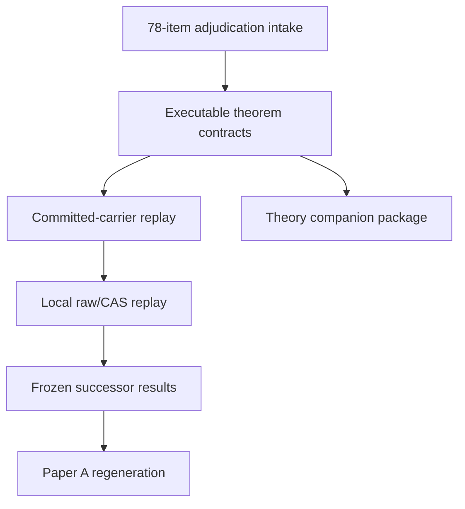

# PMG-WU-009 full replay and theorem reconciliation design

Status: design approved in chat; implementation plan pending written-spec review  
Date: 2026-08-30 UTC  
Repository: `cosmosapjw-quantum/htt_base`  
Exact base branch: `changeset/planck-mes-wu008-injection-power-20260829`  
Exact base commit: `5e81ed1635b8fe6fc944829a9fab7ab8d5b8c654`  
Exact base tree: `be66c70662802930723f49f6d0cb2f678367d0c0`  
Planned branch: `changeset/planck-mes-wu009-full-replay-theorem-reconciliation-20260830`

## 1. Decision and source precedence

The selected route is a full replay design. It reconciles the new 78-item theorem audit with the latest completed observation-side work, replays every stage that can be executed from committed carriers, prepares a fail-closed local replay for raw Planck/FFP10 and Wolfram/xAct inputs, and regenerates the first-observation paper only after the corrected outputs are frozen.

The controlling source order is:

1. the user's explicit choice of the full replay route;
2. the exact PMG-WU-008 terminal and artifacts at the base commit above;
3. the user-supplied 78-item theorem adjudication summary in the current conversation;
4. repository proof ledgers, CAS receipts, code, tests, and generated artifacts reachable from the base commit;
5. older PR-324/Paper-A planning documents and transcript-only historical claims.

The original `MES_78_THEOREM_PROOFS_20260830_1be8c03c0c` package is not present in the uploaded files, scratch workspace, or GitHub code search. Therefore, the user-supplied summary may control correction semantics, but it cannot be represented as an exact replay of the missing 27-section proof dossier. Until that package is supplied and validated, formal-proof provenance remains `FORMAL_DOSSIER_PENDING` and no claim may be promoted solely from a reconstructed summary.

## 2. Existing authority and preserved results

PMG-WU-008 is the latest complete scientific authority discovered in the repository. Its reviewed terminal states:

- `state = SUCCEEDED`;
- `replay_status = MATCH`;
- `fresh_review = PASS` with `P0_remaining = P1_remaining = 0`;
- `real_host_execution = true`;
- `observation_used_for_power = false`;
- `raw_maps_reopened = false` and `raw_data_mutation = false`;
- `claim_promotion = false`;
- `next_executable_action = PMG-WU-009`.

WU-009 must preserve the byte identity and interpretation of WU-007/WU-008 outputs. Corrected results go to new paths; prior artifacts are never overwritten. A correction may change a conclusion, rank, or admissibility status only through an explicitly replayed successor result.

GitHub connector routing has already been exercised by isolated PR #439, which performed a one-file push, pull request, expected-head merge, and readback only between `connector-smoke/*` branches. This is sufficient as the requested mock push/PR/merge capability proof. WU-009 must not create another canary or merge a scientific branch.

## 3. Scientific conventions and claim ceiling

- Metric signature is `(-,+,+,+)`.
- Keep `c`, `G`, `\hbar`, and `k_B` explicit unless a local module declares natural units.
- Distinguish the normal, electron, matter, CMB, and local-observer frames.
- Distinguish a local Lorentz boost, global matter-frame tilt, and Bianchi/background anisotropy.
- Harmonic and STF normalization, stored-real conventions, frequency/temperature measure, sky mask, and frame must be carried as metadata.
- `obsstat` owns observable carriers, invariant features, null scores, and finite-rank calibration; it does not infer a Bianchi family.
- HTT owns model-dependent likelihoods and identified sets. MIO diagnostics remain diagnostic only.
- Before a native low-ell morphology atlas, the maximum empirical claim is conditional morphology compatibility. No scalar, invariant, boost-compatible, or quadratic-sky result identifies a Bianchi geometry or family.

The first-observation paper remains an MES-centred, finite-null, observation-analysis paper. Generic anomaly coordinates are controls or diagnostics and cannot replace the MES endpoint.

## 4. Architecture

The work is one WU-009 program with seven serial gates. A later gate may start only from the exact sealed output of its predecessor.

### Gate A — typed theorem adjudication intake

Create one machine-readable adjudication ledger containing all A01-A14, B01-B22, C01-C18, D01-D08, and E01-E16 rows. Every row records:

- the corrected verdict (`PROVED`, `STRENGTHENED`, `CORRECTED`, `REFUTED`, or `UNDEFINED`);
- exact assumptions and domain;
- old claim text that is withdrawn or narrowed;
- replacement statement;
- proof reference when available;
- executable test IDs;
- affected repository files and manuscript claims;
- evidence status and release status.

The ledger must distinguish mathematical truth, evidence materialization, replay, and release. Missing proof files lower evidence/replay status without changing a theorem statement explicitly supplied and accepted by the user. The ledger is the correction source of truth; generated projections and manuscript tables are derived from it.

### Gate B — executable theorem contracts

Implement bounded modules rather than one monolithic theorem file:

1. `obsstat` orbit layer: stored-real harmonic/STF conversion checks, chirality-aware invariants, generic `det K != 0` separation domain, and abstention on unstable/degenerate strata.
2. MES geometry layer: sharp cubic inequality, moment Gram matrix, Cayley-Hamilton closure, chirality/discriminant inequality, and noncommuting endpoint bounds.
3. boost/inverse layer: the `Q -> O` response, least-squares inverse, sharp `5/3` condition bound, orthogonal residual projection, unrestricted-octupole nonidentifiability witness, and positive-quadratic-sky round trip.
4. statistics layer: superuniform finite rank under a row-equivariant complete pipeline, full outer adaptation replay, increasing/decreasing transformation rules, selection-symmetry examples, and shared-data e-value conditionality.
5. likelihood guard layer: direct-temperature likelihood contract and an explicit refusal of unweighted inverse-square fitting under untruncated Gaussian direct-temperature noise.

These modules expose pure functions and typed diagnostics. They do not generate physical vectors from scalar ceilings, infer a cause from a representation, or silently regularize a failed domain.

### Gate C — committed-carrier replay

Use only committed, manifest-bound observation/null carriers already present on the WU-008 branch:

- paired-300 primary observation-inclusive pool;
- CMB-only-999 robustness pool;
- WU-008 observation-blind injection/power artifacts;
- retained real-harmonic/irrep carriers where available.

Replay the complete endpoint selection and score construction once per candidate row. Do not select a feature, handedness, tail, reducer, mask, frame, or nuisance convention from the real observation and reuse it unchanged for pseudo-observations. Store both legacy and corrected results; legacy ranks remain historical controls.

Required new diagnostics are:

- mirror-pair collision under old O(3)-only features and separation by chirality-aware features;
- numerical quotient-rank and generic-stratum checks;
- `det K` margin/abstention tables for all rows;
- full-adaptation and broken-equivariance negative controls;
- tail-swap tests for decreasing transformations;
- boost orthogonal-residual and unrestricted-nuisance profiles;
- whether the retained carrier contains the monopole/dipole and absolute positive temperature required by the quadratic-sky inverse.

If the committed carrier lacks information required by a test, the result is typed `NOT_IDENTIFIED_FROM_COMMITTED_CARRIER`; it is not imputed from scalar features.

### Gate D — local raw Planck/FFP10 and CAS replay

This gate runs only on the user's local host. It must use explicit roots and never recursively scan or write beneath raw-data roots. It performs:

1. exact input/predecessor/preflight validation;
2. materialization and SHA-256 validation of the missing theorem dossier when supplied;
3. Python exact-algebra replay and Wolfram/xAct replay using the declared `XACT_PARENT`;
4. raw Planck PR3 SMICA and ordered FFP10 reconstruction only if the correction changes carrier extraction, frame/mask convention, or required retained information;
5. corrected paired-300 and CMB-only-999 construction in new output directories;
6. observation-blind injection/power replay;
7. independent figure inspection at registered output sizes;
8. fresh-context scientific, statistical, numerical, software, and claim review.

Planck component-separated maps normally remove or make unusable an absolute monopole and the physical dipole needed by the exact positive-quadratic `T^{-2}` inverse. The local gate must test this prerequisite explicitly. If absent, it must terminate the empirical inverse lane as `NOT_ADMISSIBLE_MISSING_ABSOLUTE_T_MONOPOLE_DIPOLE`; a synthetic round trip may still pass, but it cannot be promoted to a Planck inference.

### Gate E — frozen successor results and claim adjudication

Freeze a successor result only if:

- exact row identities and ordering are complete;
- every candidate row runs the same adaptive pipeline;
- required generic-stratum checks pass or abstentions are reported;
- replay matches from sealed inputs;
- all figures have external inspection receipts;
- a fresh reviewer leaves no P0/P1 findings;
- the artifact manifest binds code, inputs, outputs, conventions, and claim tier.

Rank extremeness cannot promote a claim. A positive quadratic sky identifies a representation only; a boost-compatible component identifies only membership in a response image under stated nuisances; MES ceilings remain one-way consequences of specified premises.

### Gate F — Paper A regeneration and theory split

The Paper A builder, rather than hand-edited TeX numbers, consumes the corrected frozen result. It must:

- withdraw O(3)-only completeness, global full-frame, ordinary-bispectrum completeness, orthogonal-nuisance nonidentifiability, unconditional Wasserstein, and selection-independence claims;
- state finite-rank validity as superuniform under joint exchangeability and row equivariance;
- state the tail-swap rule;
- preserve the distinction between finite-pool exact rank and empirical Planck/FFP10 exchangeability;
- treat the positive-quadratic inverse as representational, conditional, and unavailable empirically when absolute temperature prerequisites fail;
- keep WU-007/WU-008 results diagnostic and non-causal;
- report corrected results and abstentions without hiding legacy differences.

Only the theory needed to justify the empirical endpoint stays in Paper A. Full invariant-ring proofs, sharp MES/moment geometry, noncommuting-history proof, boost inverse, quadratic-sky existence/uniqueness, finite-rank generalizations, and inverse-square counterexamples form a separately buildable theory/methods companion package.

### Gate G — durable local handoff

Produce a self-contained handoff package with:

- exact repository/branch/commit/tree bindings;
- package manifest and SHA-256;
- theorem-dossier locator and validation contract;
- read-first document and exact execution prompt;
- environment and dependency checks;
- staged commands with expected terminal schemas;
- raw-data immutability and output-root guards;
- restart/checkpoint policy;
- tests, figure audit, and fresh-review matrices;
- explicit stop codes and recovery instructions;
- a remote readback checklist after the local branch is pushed.

The handoff must be sufficient to resume after scratch loss. It may not contain raw Planck data, private paths beyond documented placeholders, credentials, or reconstructed proof files represented as originals.

## 5. Error handling and stop states

All gates fail closed. Required terminal states include:

- `BLOCKED_BY_MOVED_AUTHORITY` — base commit/tree or accepted predecessor differs;
- `BLOCKED_BY_MISSING_THEOREM_DOSSIER` — exact formal replay requested but package/locator absent;
- `BLOCKED_BY_DOSSIER_IDENTITY_MISMATCH` — package or manifest hash differs;
- `NOT_IDENTIFIED_FROM_COMMITTED_CARRIER` — retained carrier lacks required information;
- `NOT_ADMISSIBLE_MISSING_ABSOLUTE_T_MONOPOLE_DIPOLE` — empirical quadratic inverse prerequisites fail;
- `BLOCKED_BY_NON_EQUIVARIANT_ADAPTATION` — row-equivariance negative control detects privileged observation handling;
- `BLOCKED_BY_DEGENERATE_STRATUM` — a requested generic reconstruction is unstable or outside `det K != 0`;
- `BLOCKED_BY_NULL_EXCHANGEABILITY_FAILURE` — processing identities or empirical null diagnostics differ materially;
- `BLOCKED_BY_REPLAY_MISMATCH` — sealed replay differs;
- `BLOCKED_BY_REVIEW_FINDING` — P0/P1 remains;
- `SUCCEEDED_NO_CLAIM_PROMOTION` — all requested work passed with the claim ceiling preserved.

Partial outputs and logs are preserved outside raw roots. A failed gate never falls back to a smaller smoke result while retaining the original claim.

## 6. Verification design

### Algebra and geometry

- exact mirror counterexample for O(3) versus SO(3);
- random proper-rotation invariance of the separating set;
- generic reconstruction and near-stratum abstention;
- quotient Jacobian rank 9 on generic samples;
- uniaxial saturation of the cubic bound and random interior tests;
- Gram-PSD, Cayley-Hamilton, discriminant, and chirality inequalities;
- random noncommuting histories plus fixed-direction saturation controls.

### Boost and quadratic inverse

- exact `B_Q^* B_Q = 3 M_Q` and contraction identities;
- condition-number maximization at spectrum proportional to `(5,-4,-1)`;
- boost injection/recovery;
- orthogonal-residual invariance;
- unrestricted intrinsic-octupole nonidentifiability;
- finite-boost/SPD forward-inverse round trip;
- strict-positivity boundary refusal and monopole/dipole ablation.

### Statistics and likelihood

- exhaustive finite-pool rank superuniformity on small discrete cases with ties;
- complete outer-adaptation permutation tests;
- broken-equivariance negative control;
- increasing invariance and decreasing tail swap;
- symmetric data-dependent selection example;
- Wasserstein threshold counterexample and valid alternative conditions;
- conditional versus marginal e-increment counterexample;
- inverse-square divergence stress test and direct-temperature likelihood recovery.

### Integration and publication

- exact carrier/manifest identity tests;
- paired-300, CMB-only-999, and WU-008 replay tests;
- no raw-map access in map-free stages;
- no observation use in power calibration;
- generated-number-to-manuscript binding;
- LaTeX build, citations/references, figure existence/provenance, and banned-language checks;
- clean archive extraction and handoff replay.

Fresh verification evidence must include commands, working directory, exit code, result counts, environment, and exact artifact identities. Tests that cannot run in this environment are recorded as local handoff gates, not reported as passes.

## 7. Delivery and GitHub policy

Implementation occurs on the planned branch from the exact WU-008 base. Commits are coherent code+tests+docs increments. Before publication, the candidate is sealed, independently reviewed, and verified against the remote base/head inventory.

The authorized delivery for this task is:

- push the implementation branch;
- open a draft PR targeting `changeset/planck-mes-wu008-injection-power-20260829`;
- provide branch, commit, tree, PR, artifact, and handoff links.

The scientific PR is not merged. The already merged isolated PR #439 is the mock merge proof. A real merge requires a later explicit decision after all local-only gates and remote checks are complete.

Rollback is a new revert commit or closure of the unmerged draft PR. WU-007/WU-008 artifacts remain unchanged, so no data rollback is needed.

## 8. Acceptance criteria

This design is implemented when:

1. the 78-row ledger is complete and schema-validated;
2. executable theorem contracts and negative controls pass locally;
3. every map-free replay possible from committed carriers is complete;
4. impossible or unavailable empirical lanes fail with the typed stop states above;
5. the Paper A builder and claim tests reflect the corrected theorem boundary;
6. the theory companion and local full-replay handoff are complete and manifest-bound;
7. the candidate diff receives independent review and fresh verification;
8. the branch and draft PR are published without merging;
9. the final response identifies every unrun local gate and provides its exact command and expected terminal.

Scientific success does not require a more extreme observed rank. It requires that the corrected representation, nuisance model, likelihood, adaptation, and claim semantics remain valid under the full replay or produce an explicit abstention.
