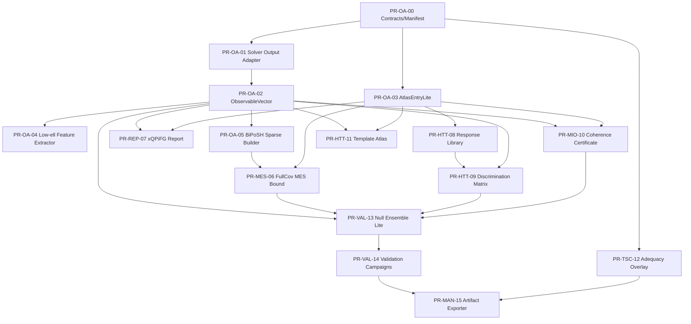

# BASS / HTT / MIO / TSC Thin Observable Atlas Upgrade

## SDD 기반 WBS 및 PR 실행계획

**버전**: v1.0-observable-atlas  
**작성일**: 2026-04-20  
**목표**: 기존 BASS/HTT/MIO/TSC stack을 크게 다시 쓰지 않고, low-\(\ell\) solver와 통계 framework 확장을 이용해 단기 novelty와 검증 가능한 결과 산출량을 최대화하는 PR 단위 실행계획을 정의한다.  
**문서 성격**: self-contained SDD/WBS/PR list. 이 문서는 코드 작성 프롬프트, issue tracker, PR description, manuscript result-pack 계획의 공통 원본으로 사용한다.

---

## 0. 한 문장 목표

이 upgrade의 핵심은 다음이다.

\[
\boxed{
\text{새 solver를 대규모로 더 짓지 말고, 기존 low-}\ell\text{ output을 full-covariance / morphology / report-card layer로 승격한다.}
}
\]

구체적으로는 다음 얇은 layer를 추가한다.

\[
\text{SolverCoreOutput}
\longrightarrow
\text{ObservableVector}
\longrightarrow
\text{AtlasEntryLite}
\longrightarrow
\begin{cases}
\text{HTT model-dependent inference},\\
\text{MIO model-independent certificate},\\
\text{TSC source/admissibility overlay},\\
\text{Full-covariance MES bound report},\\
\text{local/global discrimination report}.
\end{cases}
\]

이 layer는 solver-core의 수리물리 구조를 변경하지 않고, 이미 생산 가능한 \(a_{\ell m}\), \(C_\ell\), deterministic template, sparse anisotropic covariance, BiPoSH coefficient, low-\(\ell\) morphology statistics를 같은 artifact protocol로 묶는다.

---

## 1. Scope, non-scope, 우선순위

### 1.1 Scope

이 문서는 다음을 구현 대상으로 삼는다.

1. 공통 artifact / claim-tier / ownership contract.
2. solver output을 observer-side 통계량으로 바꾸는 `ObservableVector`.
3. BASS theory output, template, covariance response를 담는 `AtlasEntryLite`.
4. 기존 diagonal MES bound와 full-covariance / BiPoSH MES extension을 비교하는 `FullCovMESReport`.
5. \((x,Q,\Pi,F,G)\) report-card generator.
6. local boost / global tilt / Bianchi geometry / survey-axis systematics를 구분하는 response-overlap discriminator.
7. MIO directional/depth coherence certificate.
8. HTT template-fit morphology atlas와 Bianchi family equivalence-class map.
9. TSC source adequacy / admissibility / no-overclaim overlay.
10. null ensemble lite, injection recovery, validation campaign registry, manuscript-ready artifact exporter.

### 1.2 Non-scope

다음은 이 upgrade의 직접 목표가 아니다.

1. 모든 Bianchi type에 대한 full exact production solver 완성.
2. high-\(\ell\) precision CAMB/CLASS 동등 solver.
3. TSC/Teff로 full spin-2 polarization 또는 Bianchi family identification을 수행한다는 claim.
4. MIO certificate를 HTT posterior/evidence와 합산하는 단일 점수.
5. scalar amplitude만으로 Bianchi geometry detection을 주장하는 path.
6. covariance, mask, null mocks 없이 production-grade p-value나 PPP를 산출하는 path.
7. figure-first 결과 생산. 모든 figure/table은 artifact manifest 이후에만 생성된다.

### 1.3 최적화 기준

이 plan의 최적화 목적함수는 다음이다.

\[
\text{Novelty density}
=
\frac{\text{new physics-facing claims that survive audit}}{\text{new solver-core code and numerical burden}}.
\]

따라서 우선순위는 다음 순서다.

1. **Thin common contracts**: artifact, owner, scope, claim tier.
2. **Observable exploitation**: \(a_{\ell m}\), BiPoSH, morphology vector, template fit.
3. **Bound/discrimination reports**: MES full-covariance, local/global, \((x,Q,\Pi,F,G)\).
4. **Validation lite**: null ensembles, injection recovery, no-promotion gates.
5. **Manuscript artifact export**: result cards, tables, figures.

---

## 2. Architecture constitution

### 2.1 Package ownership

| Package | Role | Owns | Does not own |
|---|---|---|---|
| `BASS` / `bass_py` | low-\(\ell\) forward substrate and validation-facing solver output | solver-core output, transfer/template/covariance substrate, route/denominator validation labels, source/propagation labels | posterior/evidence truth, MIO certificate truth, local patch interpretation |
| `HTT` | model-dependent inference and discrimination | likelihood, posterior, evidence, template-fit, local boost/global tilt/Bianchi/systematics response comparison, null competition | model-independent truth certificate, BASS runtime allow/block |
| `MIO` | model-independent observatory and certificate layer | direct diagnostic extraction, directional coherence, depth-gap reports, FLRW tension diagnostics, caveat-rich `MioCertificate` | posterior/evidence, truth adjudication, single merged score with HTT |
| `TSC` | trace/intensity source-semantics and admissibility controller | chart admissibility, source adequacy overlay, one-field/two-field warning, no-overclaim checks | full solver, full spin-2 propagation, BB/family identification, runtime allow/block |
| `common` | semantic firewall and artifact protocol | dataclasses, artifact manifests, claim tiers, owner/scope constraints, sky support metadata | physics computation, posterior inference, certificate truth |

### 2.2 Two-layer solver/statistics split

The solver-core is allowed to output:

\[
T(\hat n),\quad Q(\hat n),\quad U(\hat n),
\]

or equivalently

\[
a^T_{\ell m},\quad a^E_{\ell m},\quad a^B_{\ell m},
\]

and optionally deterministic templates

\[
t^X_{\ell m}(\lambda),\qquad X\in\{T,E,B\},
\]

or anisotropic covariance

\[
C^{XY}_{\ell m,\ell' m'}.
\]

The observer/statistics layer then computes:

\[
\widehat C_\ell,
\quad
S_{1/2},
\quad
A_{23},
\quad
P_\ell,
\quad
A_{\rm parity},
\quad
A_M,\hat p,
\quad
A^{LM,XY}_{\ell\ell'},
\quad
\Delta\chi^2_{\rm template},
\quad
\text{response-overlap matrices}.
\]

No statistic is privileged by default. Every statistic carries its definition, multipole range, mask/support, covariance assumption, scan volume, and claim tier.

### 2.3 SDD rule

Every PR must include an SDD block before code review. In this document, **SDD** means **Solver/Statistics Design Delta**. It must answer:

1. What object is introduced?
2. Which package owns it?
3. What physical or statistical semantics does it own?
4. What semantics does it explicitly not own?
5. Which equations, response maps, or validation gates define it?
6. What artifact schema does it produce?
7. Which claim tier can it support?
8. What rollback / kill criterion blocks promotion?

### 2.4 TDD rule

Every PR must have tests before or with implementation. Minimum test classes:

1. schema tests,
2. ownership firewall tests,
3. dimension/sign/normalization tests,
4. isotropic-limit tests,
5. injection-recovery tests,
6. null-ensemble false-promotion tests,
7. manifest/provenance tests,
8. caveat / no-overclaim vocabulary tests.

### 2.5 Promotion rule

A result can move from exploratory to conditional to validated only if it satisfies:

| Tier | Required evidence | Allowed language |
|---|---|---|
| `exploratory` | schema + smoke tests | diagnostic, pilot, suggests, illustrates |
| `conditional` | null mocks + injection recovery + covariance/mask declared | supports under assumptions, conditional evidence |
| `validated` | calibrated covariance/nulls + manifest + independent regression + no-overclaim audit | production-grade within stated domain |

Any figure without a manifest is quarantined. Any geometry claim without \(a_{\ell m}\), BiPoSH, or validated morphology path is blocked.

---

## 3. Core data contracts

This section is the minimum schema layer. Exact field names may change, but semantic content should not.

### 3.1 Common enums

```python
from typing import Literal

Owner = Literal["BASS", "HTT", "MIO", "TSC", "COMMON"]
ClaimTier = Literal["exploratory", "conditional", "validated"]
ImplementationScope = Literal[
    "bass_py", "bass_rs", "canonical_BASS", "htt", "mio", "tsc", "common"
]
ProductionStatus = Literal[
    "diagnostic_only",
    "production_candidate",
    "production_validated",
    "blocked_missing_covariance",
    "blocked_missing_null_mocks",
    "blocked_missing_atlas",
    "blocked_owner_violation",
]
ObservableMode = Literal[
    "isotropic_compressed",
    "deterministic_template",
    "anisotropic_covariance",
    "mixed_template_covariance",
]
```

### 3.2 Artifact manifest

Every output artifact, including intermediate JSON/NPZ/CSV/figure/table, must be wrapped by an `ArtifactManifest`.

```python
from dataclasses import dataclass, field
from typing import Any

@dataclass(frozen=True)
class ArtifactManifest:
    artifact_id: str
    artifact_path: str
    owner: Owner
    implementation_scope: ImplementationScope
    claim_tier: ClaimTier
    production_status: ProductionStatus
    created_by: str
    git_commit: str | None
    config_hash: str
    input_hashes: list[str]
    code_version: str
    schema_version: str
    caveats: list[str] = field(default_factory=list)
    required_gates: list[str] = field(default_factory=list)
    passed_gates: list[str] = field(default_factory=list)
    failed_gates: list[str] = field(default_factory=list)
    statistics_definitions: dict[str, Any] = field(default_factory=dict)
```

Hard rule:

\[
\boxed{\text{No manifest} \Rightarrow \text{No manuscript figure/table}.}
\]

### 3.3 SolverCoreOutput

```python
@dataclass(frozen=True)
class SolverCoreOutput:
    alm_T: object | None
    alm_E: object | None
    alm_B: object | None
    map_T: object | None
    map_Q: object | None
    map_U: object | None
    deterministic_template: dict | None
    anisotropic_covariance: object | None
    metadata: dict
    manifest: ArtifactManifest
```

Required metadata:

- Bianchi type and algebra convention,
- tetrad-to-sky orientation convention,
- harmonic basis convention,
- \(E/B\) sign convention,
- multipole cutoff,
- deterministic/stochastic/mixed output label,
- tilt enabled/disabled label,
- Thomson scattering exact/approximate/disabled label,
- recombination/reionization treatment,
- source/propagation status.

### 3.4 ObservableVector

```python
@dataclass(frozen=True)
class ObservableVector:
    ell_max: int
    channels: tuple[str, ...]              # e.g. ("TT", "TE", "EE", "BB")
    cl: dict[str, object]                  # C_ell summaries
    alm_features: dict[str, object]        # axis, planarity, parity, etc.
    biposh: dict[str, object] | None       # sparse A^{LM}_{ell ell'} vector
    template_fit: dict[str, object] | None # Ahat, Delta chi2, scan volume
    covariance_features: dict[str, object] | None
    scan_volume: dict[str, object]
    sky_support: dict[str, object]
    manifest: ArtifactManifest
```

This object is descriptive. It does not infer a model. It is the common substrate for HTT, MIO, MES extension, and template atlas.

### 3.5 AtlasEntryLite

```python
@dataclass(frozen=True)
class AtlasEntryLite:
    atlas_id: str
    theory_family: str                  # FLRW, FLRW_tilt, BianchiI, BianchiVIIh, etc.
    geometry_params: dict[str, float]
    kinematic_params: dict[str, float]
    tilt_params: dict[str, float]
    solver_output_ref: str
    observable_vector_ref: str
    response_blocks: dict[str, object]  # R_sigma, R_omega, R_accel, R_beta_loc, R_beta_tilt, R_k
    validity_domain: dict[str, object]
    interpolation_status: str
    manifest: ArtifactManifest
```

The atlas entry is neither empirical data nor posterior. It is theory-side substrate with provenance.

### 3.6 DepartureReport for \((x,Q,\Pi,F,G)\)

```python
@dataclass(frozen=True)
class DepartureReport:
    comparator_policy: str
    bundle_B: dict[str, float]          # Sigma2, W2, Omega_tilt, Omega_k_aniso
    x_value: float
    numerator_policy: str              # signed, positive-part, absolute
    denominator_policy: str            # MES, atlas, nonperturbative, empirical ceiling
    U_value: float
    Q_value: float
    F_value: float | None
    F_status: str                      # certified_occupancy, proxy_score, invalid_...
    Pi_curve_ref: str | None
    G_values: dict[str, float]         # e.g. logG_F(z0,zstar), ratio, difference
    component_filling: dict[str, float]
    channel_filling: dict[str, float]
    caveats: list[str]
    manifest: ArtifactManifest
```

Hard distinction:

\[
Q = \text{generic normalized score},
\qquad
F = \text{certified occupancy only after sector/admissibility gates}.
\]

### 3.7 FullCovMESReport

```python
@dataclass(frozen=True)
class FullCovMESReport:
    parameter_block: str                # sigma, omega, accel, beta_loc, beta_tilt, k_aniso
    diagonal_bound: float
    covariance_bound: float | None
    dynamical_bound: float | None
    final_bound: float
    information_gain: float
    response_rank: int
    singular_values: list[float]
    nuisance_projection_status: str
    observable_set: list[str]
    covariance_assumption: str
    validity_radius: float | None
    manifest: ArtifactManifest
```

Recommended final bound:

\[
B_j^{\rm final}
=
\min\{B_j^{\rm diag},B_j^{\rm cov},B_j^{\rm dyn}\}.
\]

Morphology information gain:

\[
\mathcal I_j^{\rm morph}
=
\frac{B_j^{\rm diag}}{B_j^{\rm final}}.
\]

If the projected response is rank deficient, the output is **no-claim**, not a weak detection.

### 3.8 DiscriminationMatrix

```python
@dataclass(frozen=True)
class DiscriminationMatrix:
    hypotheses: tuple[str, ...]         # local_boost, global_tilt, bianchi_shear, survey_axis, etc.
    overlap_matrix: object              # rho_ij
    response_norms: dict[str, float]
    degeneracy_flags: dict[str, bool]
    recommended_next_observable: dict[str, str]
    claim_tier_by_pair: dict[str, str]
    manifest: ArtifactManifest
```

The basic response overlap is

\[
\rho_{ij}
=
\frac{R_i^\dagger N^{-1}R_j}
{\sqrt{(R_i^\dagger N^{-1}R_i)(R_j^\dagger N^{-1}R_j)}}.
\]

\(|\rho_{ij}|\simeq1\) means degeneracy. \(|\rho_{ij}|\ll1\) means morphology has discrimination power.

### 3.9 MioCertificate

```python
@dataclass(frozen=True)
class MioCertificate:
    report_type: str                    # directional_coherence, depth_gap, flrw_tension, residual_atlas
    probe_names: tuple[str, ...]
    diagnostic_quantities: dict[str, float]
    adequacy_indicators: dict[str, bool]
    consistency_metrics: dict[str, float]
    reduction_status: str               # theory-direct, theory-approximate, diagnostic-only
    domain_caveats: list[str]
    channel_caveats: list[str]
    htt_cross_check_suggested: dict[str, str] | None
    manifest: ArtifactManifest
```

Hard rule:

\[
\boxed{\text{MioCertificate is not posterior, not evidence, not truth certificate}.}
\]

### 3.10 TscAdequacyOverlay

```python
@dataclass(frozen=True)
class TscAdequacyOverlay:
    source_status: str                  # adequate, inadequate, pending
    propagation_status: str             # pending, validated, blocked
    chart_status: str                   # one_field_ok, two_field_recommended, invalid_domain
    admissibility_flags: dict[str, bool]
    no_overclaim_flags: dict[str, bool]
    labels: list[str]
    manifest: ArtifactManifest
```

Hard rule:

\[
\boxed{\text{TSC may flag source/chart adequacy; it may not identify Bianchi family or solve spin-2 propagation}.}
\]

---

## 4. Scientific result packs enabled by this plan

### Pack A — Scalar-to-morphology upgrade

Question:

\[
\text{How much information is lost by diagonal }C_\ell\text{-only compression?}
\]

Artifacts:

- `fullcov_mes_report_<block>.json`
- `fig_diag_vs_fullcov_mes_bound.pdf`
- `fig_morphological_information_gain.pdf`
- `table_bound_gain_by_model_family.md`
- `table_claim_tier_before_after_morphology.md`

Claim ceiling:

> Full covariance / BiPoSH morphology can sharpen or falsify scalar-amplitude anisotropy interpretations under declared covariance and nuisance assumptions.

Forbidden claim:

> Off-diagonal covariance alone proves Bianchi geometry.

### Pack B — Local boost vs global tilt discrimination

Question:

\[
\text{Is a dipole-like anomaly local peculiar velocity, global tilt, Bianchi geometry, or survey/systematics?}
\]

Artifacts:

- `discrimination_matrix_<observable_set>.json`
- `fig_response_overlap_local_global.pdf`
- `fig_G_depth_gap_localboost_vs_globaltilt.pdf`
- `table_discrimination_conditions.md`

Claim ceiling:

> Scalar amplitude alone cannot separate local boost from global tilt; depth evolution, directional coherence, and off-diagonal morphology form the minimal discrimination basis.

### Pack C — \((x,Q,\Pi,F,G)\) report cards

Question:

\[
\text{How much of the admissible anisotropy budget is occupied, under which semantic status?}
\]

Artifacts:

- `departure_report_<scenario>.json`
- `fig_Q_vs_F_status.pdf`
- `fig_G_depth_gap.pdf`
- `table_claim_tier_by_scenario.md`

Claim ceiling:

> \(Q\) is a normalized score; \(F\) is a certified filling fraction only after sector/admissibility gates; \(G_F\) tracks redshift/depth filling evolution.

### Pack D — MIO observatory certificates

Question:

\[
\text{Which probes show model-independent directional/departure coherence, and where do caveats block stronger claims?}
\]

Artifacts:

- `mio_certificate_planck_lowell.json`
- `mio_certificate_dipole_catalogs.json`
- `mio_certificate_depth_bins.json`
- `fig_mio_certificate_dashboard.pdf`

Claim ceiling:

> MIO reports model-independent diagnostic structure and caveats; it does not adjudicate posterior truth.

### Pack E — Bianchi equivalence classes

Question:

\[
\text{Which Bianchi/tilted families are distinguishable by current low-}\ell\text{ morphology?}
\]

Artifacts:

- `template_fit_grid_<atlas>.json`
- `fig_template_fit_delta_chi2_grid.pdf`
- `fig_family_equivalence_graph.pdf`
- `table_identifiability_failures.md`
- `table_needed_observable_to_break_degeneracy.md`

Claim ceiling:

> Current observable sets determine equivalence classes and degeneracy-breaking requirements, not necessarily a unique geometry.

---

## 5. WBS wave plan

### Wave 0 — semantic substrate and safety rails

**Objective**: no scientific artifact can escape without owner/scope/claim-tier/provenance.

**Inputs**: none.

**Outputs**:

- `common/contracts.py`
- `common/artifact_manifest.py`
- `common/claim_tier.py`
- `docs/claim_ledger.md`
- `docs/status_matrix.md`

**Exit gates**:

- all artifacts require manifest;
- MIO certificate cannot be passed where posterior is expected;
- HTT evidence cannot be passed where MIO certificate is expected;
- TSC overlay cannot emit full-solver/family-identification labels.

### Wave 1 — observable vectorization

**Objective**: turn solver output into a common morphology vector.

**Inputs**:

- `SolverCoreOutput`
- maps or \(a_{\ell m}\)
- optional deterministic template
- optional anisotropic covariance

**Outputs**:

- `ObservableVector`
- low-\(\ell\) feature JSON
- feature manifest

**Core features**:

\[
\widehat C_\ell,
S_{1/2},
A_{23},
P_\ell,
A_{\rm parity},
A_M,\hat p,
A^{LM}_{\ell\ell'},
\Delta\chi^2.
\]

### Wave 2 — theory atlas lite

**Objective**: register BASS/template/covariance outputs as theory objects, not data.

**Outputs**:

- `AtlasEntryLite`
- response block registry
- validity-domain metadata

**Critical rule**: atlas membership is not posterior evidence.

### Wave 3 — full-covariance MES extension

**Objective**: compare diagonal MES ceilings with covariance/BiPoSH-aware bounds.

**Outputs**:

- `FullCovMESReport`
- morphology information gain
- rank/no-claim diagnostics

**Key equations**:

\[
B_j^{\rm final}=\min\{B_j^{\rm diag},B_j^{\rm cov},B_j^{\rm dyn}\},
\qquad
\mathcal I_j^{\rm morph}=B_j^{\rm diag}/B_j^{\rm final}.
\]

### Wave 4 — \((x,Q,\Pi,F,G)\) report-card layer

**Objective**: separate normalized score, certified filling, threshold exceedance, and depth gap.

**Outputs**:

- `DepartureReport`
- \(Q\) vs \(F\) status table
- \(G_F\) / log-gap report

**Critical rule**: \(F\) is invalid unless certified.

### Wave 5 — local/global discrimination

**Objective**: build morphology response comparisons among local boost, global tilt, Bianchi geometry, and systematics.

**Outputs**:

- `DiscriminationMatrix`
- response-overlap heatmaps
- degeneracy-breaking recommendation table

**Critical rule**: scalar amplitude alone cannot promote geometry claim.

### Wave 6 — MIO certificates

**Objective**: produce model-independent diagnostics with caveats.

**Outputs**:

- `MioCertificate`
- directional coherence report
- depth-gap report
- diagnostic-only or production-grade status

**Critical rule**: no covariance/null mocks means diagnostic-only.

### Wave 7 — template-fit morphology atlas

**Objective**: quantify which deterministic anisotropic morphologies are identifiable.

**Outputs**:

- template-fit grid,
- family equivalence graph,
- degeneracy table,
- needed-observable table.

### Wave 8 — TSC overlay and hostile audit

**Objective**: attach source/admissibility/no-overclaim status to every result card.

**Outputs**:

- `TscAdequacyOverlay`
- source vs propagation status table
- no-overclaim audit log

### Wave 9 — validation campaigns and manuscript exporter

**Objective**: make every result reproducible and manuscript-ready.

**Outputs**:

- validation campaign registry,
- null ensemble outputs,
- injection recovery reports,
- artifact-to-figure/table exporter,
- manuscript caveat snippets.

---

## 6. PR dependency graph



---

## 7. Detailed PR list

## PR-OA-00 — Common contracts, artifact manifest, claim ledger

**Track**: OA / common substrate  
**Priority**: P0  
**Depends on**: none

### Goal

Freeze the semantic firewall before any new result-producing module is written.

### SDD delta

Introduce common dataclasses and enums that distinguish owner, scope, claim tier, production status, and artifact provenance. This PR owns no physics. It owns the language in which physics artifacts are allowed to exist.

### Files

```text
src/common/contracts.py
src/common/artifact_manifest.py
src/common/claim_tier.py
src/common/status_snapshot.py
src/common/owner_scope.py
docs/claim_ledger.md
docs/status_matrix.md
tests/common/test_contracts_schema.py
tests/common/test_artifact_manifest_required.py
tests/common/test_owner_scope_firewall.py
tests/common/test_claim_tier_transitions.py
```

### WBS

1. Define `Owner`, `ClaimTier`, `ImplementationScope`, `ProductionStatus` enums.
2. Define `ArtifactManifest`.
3. Define minimal protocol hooks for `manifest.validate()` and `manifest.quarantine_reason()`.
4. Add owner/scope firewall tests.
5. Add status snapshot skeleton.
6. Add `docs/claim_ledger.md` with allowed and forbidden claims.
7. Add CI check that manuscript-facing artifact directories contain manifests.

### TDD gates

- `test_manifest_requires_owner_scope_claim_tier`
- `test_manifest_requires_config_and_input_hashes`
- `test_mio_certificate_not_accepted_as_posterior`
- `test_htt_evidence_not_accepted_as_mio_certificate`
- `test_tsc_overlay_not_full_solver_label`
- `test_no_manifest_no_public_artifact`

### Success criteria

- Every downstream PR can import common contracts without circular dependencies.
- No artifact can be marked production without owner, scope, claim tier, input hashes, and caveats.
- Type-level separation of HTT, MIO, TSC outputs exists.

### Rollback / kill criterion

Reject merge if common contracts include physics computation or if owner distinctions are encoded only as comments.

### Immediate novelty enabled

None directly. This PR buys claim hygiene, which is necessary for all novelty downstream.

---

## PR-OA-01 — SolverCoreOutput adapter

**Track**: OA / solver bridge  
**Priority**: P0  
**Depends on**: PR-OA-00

### Goal

Create a single adapter from solver-core outputs into the observer/statistics layer.

### SDD delta

The solver may output maps, \(a_{\ell m}\), deterministic templates, or anisotropic covariance. The adapter must not infer physics; it only normalizes conventions, metadata, and manifest structure.

### Files

```text
src/common/solver_output.py
src/common/harmonic_metadata.py
src/common/channel_conventions.py
src/bass/bridge/solver_core_output_adapter.py
tests/common/test_solver_output_schema.py
tests/common/test_harmonic_conventions_required.py
tests/bass/test_solver_adapter_metadata.py
```

### WBS

1. Implement `SolverCoreOutput` dataclass.
2. Add required metadata checks: harmonic convention, coordinate frame, \(E/B\) sign, \(\ell_{\max}\), output mode.
3. Add adapter for existing `alm_T/E/B` or template/covariance outputs.
4. Add optional sparse covariance reference field rather than forcing dense arrays.
5. Add metadata validation errors with clear caveats.
6. Emit manifest with `owner="BASS"` or `owner="COMMON"` depending on adapter location.

### TDD gates

- `test_missing_eb_sign_convention_blocks_adapter`
- `test_missing_tetrad_to_sky_metadata_blocks_adapter`
- `test_sparse_covariance_ref_allowed`
- `test_template_output_marked_deterministic`
- `test_mixed_output_mode_marked_mixed`

### Success criteria

- Existing solver outputs can be wrapped without changing solver-core code.
- Observer modules never read raw arrays without metadata.

### Rollback / kill criterion

Reject if adapter silently assumes coordinate frame, harmonic normalization, or \(E/B\) sign.

### Immediate novelty enabled

Makes existing BASS outputs consumable by all thin-observable reports.

---

## PR-OA-02 — ObservableVector feature container

**Track**: OA / observer substrate  
**Priority**: P0/P1  
**Depends on**: PR-OA-01

### Goal

Create the common morphology vector consumed by HTT, MIO, MES extension, and template atlas.

### SDD delta

`ObservableVector` is a descriptive object. It is not a likelihood, not a posterior, and not a certificate. It records the statistics extracted from a sky-facing solver output.

### Files

```text
src/common/observable_vector.py
src/common/observable_definitions.py
src/common/sky_support.py
tests/common/test_observable_vector_schema.py
tests/common/test_observable_vector_no_inference.py
tests/common/test_sky_support_required.py
```

### WBS

1. Implement `ObservableVector` dataclass.
2. Add statistic definition registry with names, formula labels, multipole ranges, and caveats.
3. Add sky support object: mask, coordinate frame, pixelization, completeness, mock coverage.
4. Add channel support: TT, TE, EE, BB, TB, EB.
5. Add scan-volume metadata for orientation/template/statistic scans.
6. Add manifest generation.

### TDD gates

- `test_observable_vector_requires_statistic_definitions`
- `test_scan_volume_required_when_orientation_scan_used`
- `test_sky_support_required_for_directional_stats`
- `test_no_posterior_fields_in_observable_vector`
- `test_channel_labels_are_explicit`

### Success criteria

- Any low-\(\ell\) feature extraction output can be transported as one object.
- Missing sky/covariance information downgrades status rather than disappearing.

### Rollback / kill criterion

Reject if `ObservableVector` contains model posterior, evidence, or truth labels.

### Immediate novelty enabled

Provides the base object for scalar-to-morphology upgrade and local/global discrimination.

---

## PR-OA-03 — AtlasEntryLite and response block registry

**Track**: OA / theory atlas  
**Priority**: P1  
**Depends on**: PR-OA-00, PR-OA-01

### Goal

Store theory-side BASS/template/covariance outputs as versioned atlas entries with validity domains and response blocks.

### SDD delta

An atlas entry is not data and not posterior. It is a theory-side record connecting Bianchi/tilt parameters to predicted low-\(\ell\) observables or linear response maps.

### Files

```text
src/common/atlas_entry.py
src/common/response_blocks.py
src/bass/atlas/atlas_entry_lite.py
src/bass/atlas/response_registry.py
tests/common/test_atlas_entry_schema.py
tests/common/test_atlas_not_empirical_data.py
tests/bass/test_response_block_registry.py
```

### WBS

1. Implement `AtlasEntryLite`.
2. Define response block names: `R_sigma`, `R_omega`, `R_accel`, `R_beta_loc`, `R_beta_tilt`, `R_k_aniso`, `R_survey_axis`.
3. Add validity-domain fields: perturbative radius, \(\ell_{\max}\), channel set, geometry family, tilt status.
4. Add interpolation status: none, nearest-neighbour, linear, emulator, invalid.
5. Add tests that atlas entries cannot be consumed as empirical observations.
6. Add minimal JSON serializer.

### TDD gates

- `test_atlas_entry_requires_theory_family`
- `test_atlas_entry_requires_validity_domain`
- `test_atlas_entry_forbidden_as_data_input`
- `test_response_blocks_have_parameter_block_labels`
- `test_rank_metadata_optional_but_supported`

### Success criteria

- Theory predictions can be compared across families without rerunning solver.
- Response overlap and MES modules can consume common response block names.

### Rollback / kill criterion

Reject if atlas entries infer posterior weights or empirical truth status.

### Immediate novelty enabled

Enables Bianchi equivalence-class maps and covariance-aware MES bounds.

---

## PR-OA-04 — Low-\(\ell\) feature extractor

**Track**: OA / observer statistics  
**Priority**: P1  
**Depends on**: PR-OA-02

### Goal

Implement the first morphology features from \(a_{\ell m}\) or maps.

### SDD delta

This PR makes diagonal and non-diagonal morphology comparable by defining reproducible low-\(\ell\) feature extraction. It does not perform model selection.

### Files

```text
src/observables/lowell_features.py
src/observables/angular_momentum_axis.py
src/observables/planarity.py
src/observables/parity.py
src/observables/hemispherical_modulation.py
src/observables/s12_statistic.py
tests/observables/test_cl_power.py
tests/observables/test_s12_definition.py
tests/observables/test_axis_rotation_invariance.py
tests/observables/test_planarity_definition_manifest.py
tests/observables/test_parity_weights_manifest.py
```

### WBS

1. Implement \(\widehat C_\ell\) extraction.
2. Implement \(S_{1/2}\) for declared \(L\) and monopole/dipole policy.
3. Implement angular-momentum dispersion axis with orientation scan metadata.
4. Implement quadrupole-octopole alignment \(A_{23}\).
5. Implement planarity score with convention label.
6. Implement parity statistic with weight/multipole metadata.
7. Implement hemispherical modulation diagnostic skeleton.
8. Export all results into `ObservableVector`.

### TDD gates

- `test_isotropic_simulation_axis_distribution_smoke`
- `test_rotation_invariant_norms`
- `test_s12_changes_when_lrange_changes_and_records_it`
- `test_planarity_requires_convention_label`
- `test_hemispherical_modulation_is_diagnostic_not_model_claim`

### Success criteria

- A single solver output can produce a manifest-backed low-\(\ell\) feature JSON.
- Every feature records definition and scan volume.

### Rollback / kill criterion

Reject if preferred axes are exported without coordinate frame and scan-volume metadata.

### Immediate novelty enabled

Creates morphology vector for Pack A, B, D, and E.

---

## PR-OA-05 — Sparse BiPoSH / off-diagonal covariance builder

**Track**: OA / covariance morphology  
**Priority**: P1  
**Depends on**: PR-OA-02, PR-OA-04

### Goal

Represent off-diagonal covariance or empirical covariance morphology using sparse BiPoSH-like feature vectors.

### SDD delta

Diagonal \(C_\ell\) compression discards anisotropic covariance. This PR introduces a sparse vector of \(A^{LM,XY}_{\ell\ell'}\) or equivalent off-diagonal covariance features for low \(\ell\).

### Files

```text
src/observables/biposh_sparse.py
src/observables/covariance_vector.py
src/observables/wigner_cache.py
src/observables/rotation_covariance_checks.py
tests/observables/test_biposh_isotropic_limit.py
tests/observables/test_biposh_parseval_smoke.py
tests/observables/test_biposh_rotation_covariant_norm.py
tests/observables/test_sparse_covariance_psd_guard.py
```

### WBS

1. Define sparse index set \(\mathcal I=(X,Y,\ell,\ell',L,M)\).
2. Implement conversion from covariance matrix to sparse BiPoSH vector.
3. Implement low-\(\ell\) restricted mode, default \(\ell\le 8\), configurable.
4. Add rotation-covariant norms \(\sum_M |A^{LM}_{\ell\ell'}|^2\).
5. Add isotropic covariance recovery test: only scalar diagonal sector survives.
6. Add PSD / Cauchy-Schwarz guard for covariance blocks.
7. Export into `ObservableVector.biposh`.

### TDD gates

- `test_flrw_covariance_has_zero_L_gt_0_within_tolerance`
- `test_biposh_norm_rotation_invariant`
- `test_sparse_indices_are_unique`
- `test_covariance_psd_guard_catches_bad_block`
- `test_biposh_requires_harmonic_convention_metadata`

### Success criteria

- Off-diagonal information is available as a reproducible feature vector.
- Full-covariance MES and discrimination modules can consume it without knowing map internals.

### Rollback / kill criterion

Reject if individual frame-dependent \(M\) components are reported as invariant bounds without invariant norm/caveat.

### Immediate novelty enabled

Makes MES off-diagonal extension operational.

---

## PR-MES-06 — Full-covariance MES bound engine

**Track**: MES / bounds  
**Priority**: P1  
**Depends on**: PR-OA-03, PR-OA-05

### Goal

Compute morphology-aware bound candidates and compare them with diagonal MES ceilings.

### SDD delta

The bound engine takes response blocks and covariance/BiPoSH feature noise assumptions, computes singular-value or nuisance-projected bounds, and returns a `FullCovMESReport`. It does not replace the baseline MES theorem; it extends the observable layer.

### Files

```text
src/htt/statistics/mes_cov_bound.py
src/htt/statistics/response_svd.py
src/htt/statistics/nuisance_projection.py
src/htt/statistics/morphology_information_gain.py
tests/htt/test_mes_cov_no_nuisance_bound.py
tests/htt/test_mes_cov_nuisance_projection.py
tests/htt/test_mes_cov_rank_failure_no_claim.py
tests/htt/test_mes_information_gain_nonnegative.py
tests/htt/test_mes_final_bound_min_rule.py
```

### WBS

1. Implement whitened response \(\widetilde R=N^{-1/2}R\).
2. Implement no-nuisance bound
   \[
   \|p_j\|\le \rho_\alpha/s_{\min}(\widetilde R_j).
   \]
3. Implement nuisance-projected bound using \(P_n^\perp\widetilde R_j\).
4. Detect rank deficiency and emit no-claim status.
5. Combine with existing diagonal and dynamical bounds by min rule.
6. Compute \(\mathcal I_j^{\rm morph}\).
7. Emit `FullCovMESReport` with caveats and manifest.

### TDD gates

- `test_bound_decreases_when_response_singular_value_increases`
- `test_rank_deficient_response_returns_no_claim`
- `test_nuisance_projection_never_strengthens_illegally`
- `test_final_bound_is_min_of_available_bounds`
- `test_information_gain_equal_one_when_no_improvement`
- `test_dimensionless_parameters_only`

### Success criteria

- Diagonal-only MES and full-covariance MES can be compared in one artifact.
- Rank/noise/covariance assumptions are explicit.

### Rollback / kill criterion

Reject if covariance bound is reported without noise/covariance assumption or if rank failure is treated as evidence.

### Immediate novelty enabled

Pack A: scalar-to-morphology upgrade and anisotropic covariance information gain.

---

## PR-REP-07 — \((x,Q,\Pi,F,G)\) departure report-card generator

**Track**: Report / model-independent formalism  
**Priority**: P1  
**Depends on**: PR-OA-00, PR-OA-03

### Goal

Generate manifest-backed report cards that separate \(x\), \(Q\), \(\Pi\), certified \(F\), and depth-gap \(G\).

### SDD delta

This PR enforces the semantic separation:

\[
Q=\text{normalized score},
\quad
F=\text{certified occupancy},
\quad
G_F=\text{depth/redshift filling gap}.
\]

### Files

```text
src/mio/reports/departure_report.py
src/mio/reports/filling_fraction.py
src/mio/reports/depth_gap.py
src/common/budget_policy.py
src/common/comparator_policy.py
tests/mio/test_departure_report_schema.py
tests/mio/test_F_requires_certification.py
tests/mio/test_Q_not_called_filling_when_uncertified.py
tests/mio/test_G_ratio_floor_and_loggap.py
tests/mio/test_component_filling_anatomy.py
```

### WBS

1. Implement comparator policy object.
2. Implement denominator/budget policy object \(U_C\).
3. Implement numerator policies: signed, positive-part, absolute.
4. Implement \(x_C\) and component bundle \(\mathbf B_C\).
5. Implement \(Q_{C,U,N}\).
6. Implement certified \(F_{S,C,U}\) with status field.
7. Implement \(\Pi_Q(q)\) / \(\Pi_F(q)\) curve references.
8. Implement robust \(G\): ratio gap, log gap, difference gap.
9. Export `DepartureReport`.

### TDD gates

- `test_negative_sector_blocks_F_occupancy_language`
- `test_uncertified_F_downgrades_to_proxy_score`
- `test_Q_and_F_can_have_same_number_but_different_status`
- `test_G_ratio_handles_near_zero_denominator_with_caveat`
- `test_log_gap_antisymmetry`
- `test_component_filling_sums_to_total_when_valid`

### Success criteria

- Reports can be generated for model-dependent HTT posterior summaries and model-independent MIO diagnostics without merging their semantics.
- \(F\) and \(Q\) cannot be conflated in code output.

### Rollback / kill criterion

Reject if code labels any uncertified normalized score as filling fraction.

### Immediate novelty enabled

Pack C and the depth/redshift part of Pack B.

---

## PR-HTT-08 — Response library for local boost, global tilt, Bianchi, and systematics

**Track**: HTT / discrimination  
**Priority**: P1  
**Depends on**: PR-OA-03, PR-OA-05

### Goal

Create a common response-template library for competing physical/systematic hypotheses.

### SDD delta

The hypotheses are not merged into one model. Each hypothesis supplies response vectors in a declared observable basis.

### Hypothesis blocks

\[
\mathcal H_0: \text{FLRW isotropic sky + noise/nulls},
\]

\[
\mathcal H_{\rm LB}: \text{local peculiar velocity / local boost},
\]

\[
\mathcal H_{\rm GT}: \text{global matter-frame tilt relative to geometry frame},
\]

\[
\mathcal H_{\rm BG}: \text{Bianchi background geometry anisotropy},
\]

\[
\mathcal H_{\rm SYS}: \text{survey axis / mask / beam / foreground / scanning law}.
\]

### Files

```text
src/htt/discrimination/response_library.py
src/htt/discrimination/hypothesis_blocks.py
src/htt/discrimination/observable_basis.py
src/htt/discrimination/systematics_templates.py
tests/htt/test_response_library_schema.py
tests/htt/test_hypothesis_blocks_do_not_merge.py
tests/htt/test_local_boost_response_metadata.py
tests/htt/test_global_tilt_response_metadata.py
```

### WBS

1. Define hypothesis block registry.
2. Define response vector basis: scalar, direction, depth, BiPoSH, TE/EE/BB, template-fit.
3. Add local boost toy response templates.
4. Add global tilt toy/atlas response templates.
5. Add Bianchi shear/curvature/vorticity response block hooks.
6. Add survey/systematics null template slots.
7. Add metadata: validity domain, amplitude normalization, orientation convention.

### TDD gates

- `test_response_vector_basis_declared`
- `test_response_templates_have_units_and_normalization`
- `test_local_boost_marked_observer_side`
- `test_global_tilt_marked_source_background_side`
- `test_systematic_template_not_physics_claim`

### Success criteria

- Competing hypotheses can be compared in the same observable basis.
- Degeneracy can be measured before full posterior inference.

### Rollback / kill criterion

Reject if local boost and global tilt are represented as one unlabeled beta field.

### Immediate novelty enabled

Pack B: local/global response discrimination.

---

## PR-HTT-09 — Response-overlap discrimination matrix

**Track**: HTT / discrimination  
**Priority**: P1  
**Depends on**: PR-HTT-08, PR-OA-02

### Goal

Compute response overlaps, degeneracy flags, and next-observable recommendations.

### SDD delta

This is not a Bayesian model comparison. It is a pre-inference identifiability audit. Its output is a `DiscriminationMatrix`.

### Files

```text
src/htt/discrimination/response_overlap.py
src/htt/discrimination/discrimination_matrix.py
src/htt/discrimination/degeneracy_flags.py
src/htt/discrimination/next_observable.py
tests/htt/test_response_overlap_symmetry.py
tests/htt/test_response_overlap_bounds.py
tests/htt/test_degeneracy_flag_thresholds.py
tests/htt/test_next_observable_recommendation.py
```

### WBS

1. Implement whitened inner product.
2. Implement overlap matrix \(\rho_{ij}\).
3. Implement degeneracy threshold policy.
4. Implement pairwise claim tiers.
5. Implement recommended next observable: depth, TE/EE/BB, BiPoSH, sky support, null mocks.
6. Emit `DiscriminationMatrix`.
7. Produce heatmap-ready CSV/JSON artifact.

### TDD gates

- `test_rho_ii_equals_one_for_nonzero_response`
- `test_rho_abs_le_one_with_psd_noise`
- `test_zero_response_returns_blocked_status`
- `test_degeneracy_flag_for_abs_rho_near_one`
- `test_discrimination_matrix_manifest_required`

### Success criteria

- Local boost/global tilt/Bianchi/systematics separability is quantified before expensive inference.
- Degenerate pairs are explicitly downgraded.

### Rollback / kill criterion

Reject if response-overlap output is used as posterior odds.

### Immediate novelty enabled

Pack B and equivalence-class pruning.

---

## PR-MIO-10 — Directional and depth coherence certificate

**Track**: MIO / observatory certificate  
**Priority**: P1  
**Depends on**: PR-OA-02, PR-REP-07

### Goal

Produce MIO certificates for directional coherence and depth-dependent filling gaps.

### SDD delta

MIO reports what is visible in the data or diagnostic vectors without selecting the true model. It records caveats and whether the output is production-grade or diagnostic-only.

### Files

```text
src/mio/interface/mio_certificate.py
src/mio/coherence/directional.py
src/mio/coherence/depth_binned.py
src/mio/coherence/probe_resultant.py
src/mio/diagnostics/caveats.py
src/mio/reports/mio_dashboard.py
tests/mio/test_certificate_schema.py
tests/mio/test_directional_coherence_diagnostic_only_without_covariance.py
tests/mio/test_depth_gap_requires_bin_metadata.py
tests/mio/test_certificate_no_truth_language.py
```

### WBS

1. Implement `MioCertificate`.
2. Implement vector resultant directional coherence.
3. Implement isotropy p-value placeholder status: blocked unless null/covariance exists.
4. Implement depth-binned \(F(z)\), \(G_F\), log-gap aggregation.
5. Add caveat generator: mask, covariance missing, sky support partial, null mocks missing.
6. Add dashboard JSON that can be rendered later.

### TDD gates

- `test_mio_certificate_not_posterior`
- `test_directional_resultant_records_probe_weights`
- `test_covariance_missing_downgrades_to_diagnostic_only`
- `test_depth_gap_requires_redshift_bins`
- `test_no_truth_certificate_language`

### Success criteria

- MIO can produce meaningful diagnostic certificates even before full production covariance exists.
- Certificate status prevents overclaim.

### Rollback / kill criterion

Reject if MIO output is summed with HTT evidence or called posterior probability.

### Immediate novelty enabled

Pack D and diagnostic part of Pack B.

---

## PR-HTT-11 — Template-fit morphology atlas and equivalence classes

**Track**: HTT / morphology atlas  
**Priority**: P1/P2  
**Depends on**: PR-OA-03, PR-OA-04, PR-HTT-09

### Goal

Quantify which deterministic anisotropic morphologies are distinguishable by current low-\(\ell\) observables.

### SDD delta

Template fitting is used as a morphology/identifiability diagnostic. It is not automatically a geometry detection unless nulls, covariance, and atlas compatibility pass.

### Files

```text
src/htt/templates/fit_lowell.py
src/htt/templates/rotation_scan.py
src/htt/templates/template_bank.py
src/htt/templates/equivalence_graph.py
src/htt/templates/identifiability_gate.py
tests/htt/test_template_amplitude_estimator.py
tests/htt/test_template_rotation_scan_manifest.py
tests/htt/test_equivalence_graph_symmetry.py
tests/htt/test_identifiability_gate_blocks_scalar_only.py
```

### WBS

1. Implement amplitude fit
   \[
   \hat A = \frac{t_R^\dagger C^{-1}a}{t_R^\dagger C^{-1}t_R}.
   \]
2. Implement \(\Delta\chi^2\) for fixed template/orientation.
3. Add orientation scan with scan-volume manifest.
4. Add template bank: toy PSTF quadrupole, octopole, local boost, Bianchi-like templates.
5. Build pairwise distance / overlap graph among templates.
6. Define equivalence-class threshold policy.
7. Export family equivalence graph and identifiability table.

### TDD gates

- `test_injected_template_amplitude_recovered`
- `test_orientation_scan_records_scan_volume`
- `test_equivalence_relation_reflexive_symmetric_smoke`
- `test_scalar_only_template_cannot_identify_family`
- `test_null_template_fit_tail_probability_requires_null_ensemble`

### Success criteria

- Current low-\(\ell\) observable basis can say which families are distinguishable or degenerate.
- The output recommends which observable breaks degeneracy.

### Rollback / kill criterion

Reject if best-fit template is reported as detected geometry without null calibration and claim-tier gate.

### Immediate novelty enabled

Pack E: Bianchi equivalence classes.

---

## PR-TSC-12 — Source adequacy, chart admissibility, and no-overclaim overlay

**Track**: TSC / audit overlay  
**Priority**: P0/P1  
**Depends on**: PR-OA-00

### Goal

Attach TSC source/chart/admissibility status to every major result artifact.

### SDD delta

TSC is a controller for trace/intensity chart semantics and source adequacy. It is not the full solver. The overlay prevents scalar trace results from being promoted to spin-2 or family-identification claims.

### Files

```text
src/tsc/diagnostics/source_adequacy_overlay.py
src/tsc/diagnostics/no_overclaim.py
src/tsc/admissibility/domain.py
src/tsc/admissibility/realizability.py
src/common/source_propagation_status.py
tests/tsc/test_source_adequacy_overlay_schema.py
tests/tsc/test_chart_domain_blocks_invalid_inverse.py
tests/tsc/test_no_spin2_solver_claim.py
tests/tsc/test_source_adequate_propagation_pending_label.py
```

### WBS

1. Implement `TscAdequacyOverlay`.
2. Implement source/projection status enum.
3. Implement chart domain checks: \(\Theta>0\), BE \(\eta\le0\), nonnegative weights, weight simplex.
4. Add no-overclaim vocabulary scan for docs/artifact labels.
5. Add source adequate / propagation pending mixed state.
6. Attach overlay reference to `DepartureReport`, `FullCovMESReport`, and MIO certificates.

### TDD gates

- `test_theta_positive_required`
- `test_be_eta_nonpositive_required`
- `test_weight_simplex_required`
- `test_tsc_overlay_never_claims_full_polarization_solver`
- `test_source_propagation_split_representable`

### Success criteria

- Every result card can explain whether it is source-side, propagation-side, trace-only, or full morphology-capable.
- TSC overclaim is caught automatically.

### Rollback / kill criterion

Reject if TSC emits labels such as `full_BB_solver`, `Bianchi_family_identified`, or `spin2_closed_by_Teff`.

### Immediate novelty enabled

Gives all short-term results reviewer-facing claim hygiene.

---

## PR-VAL-13 — Null ensemble lite and injection recovery

**Track**: validation / statistics  
**Priority**: P1  
**Depends on**: PR-OA-04, PR-OA-05, PR-MES-06, PR-HTT-09, PR-HTT-11

### Goal

Implement the minimum null/injection machinery needed to keep exploratory results honest.

### SDD delta

This PR does not create a production Planck likelihood. It creates reusable null ensembles for calibration, false-promotion tests, and template injection recovery.

### Null ensembles

1. isotropic Gaussian FLRW-like skies,
2. deterministic-template injections,
3. anisotropic covariance simulations,
4. local boost only,
5. survey-axis/systematics toy nulls.

### Files

```text
src/validation/null_ensemble_lite.py
src/validation/injection_recovery.py
src/validation/false_promotion_tests.py
src/validation/empirical_tail.py
src/validation/look_elsewhere.py
tests/validation/test_empirical_tail_probability.py
tests/validation/test_template_injection_recovery.py
tests/validation/test_local_boost_not_promoted_to_global.py
tests/validation/test_scalar_only_not_promoted_to_geometry.py
```

### WBS

1. Implement null ensemble generator interface.
2. Implement isotropic Gaussian \(a_{\ell m}\) generator for low \(\ell\).
3. Implement deterministic template injection.
4. Implement anisotropic covariance sampler or placeholder that blocks if unavailable.
5. Implement empirical tail probability
   \[
   p=\frac{1+N(S_i\ge S_{\rm obs})}{1+N_{\rm sim}}.
   \]
6. Add look-elsewhere scan-volume tracking.
7. Add false-promotion tests.

### TDD gates

- `test_empirical_tail_has_plus_one_correction`
- `test_injected_amplitude_recovery_within_tolerance`
- `test_local_boost_only_mock_not_global_tilt_claim`
- `test_scalar_departure_only_not_geometry_claim`
- `test_scan_volume_recorded_for_tail_probability`

### Success criteria

- Exploratory p-values and discrimination claims can be calibrated or downgraded.
- False geometry promotion is explicitly tested.

### Rollback / kill criterion

Reject if p-values are produced without recording scan volume or null ensemble identity.

### Immediate novelty enabled

Raises Pack A/B/E from descriptive to conditional.

---

## PR-VAL-14 — Validation campaign registry and theorem-to-test map

**Track**: validation / audit  
**Priority**: P1  
**Depends on**: PR-VAL-13, PR-TSC-12

### Goal

Turn validation into a first-class campaign object with PASS/WARN/FAIL statuses.

### SDD delta

Each scientific theorem, formal identity, or claim gate receives a test mapping. This prevents manuscript claims from drifting away from tests.

### Files

```text
src/validation/campaign_registry.py
src/validation/passfail.py
src/validation/theorem_to_test_map.py
docs/theorem_to_test_map.md
docs/validation_campaigns.md
tests/validation/test_campaign_registry.py
tests/validation/test_pass_warn_fail_schema.py
tests/validation/test_theorem_to_test_links.py
```

### WBS

1. Define `ValidationCampaign` dataclass.
2. Define PASS/WARN/FAIL policy.
3. Add theorem-to-test map entries for:
   - isotropic limit,
   - BiPoSH \(L>0\) null,
   - template amplitude recovery,
   - MES rank no-claim,
   - \(F\) certification,
   - local/global discrimination,
   - TSC no-overclaim.
4. Add campaign output JSON.
5. Add CI hook to fail manuscript export if critical campaign fails.

### TDD gates

- `test_campaign_requires_owner_and_scope`
- `test_theorem_to_test_entry_has_artifact_refs`
- `test_warn_does_not_promote_to_validated`
- `test_fail_blocks_manuscript_export`

### Success criteria

- Every claim in the result packs has an explicit validation status.
- Reviewer-facing audit trail exists.

### Rollback / kill criterion

Reject if validation campaign remains prose-only without machine-readable status.

### Immediate novelty enabled

Makes short-term result packs publishable as controlled claims.

---

## PR-MAN-15 — Artifact-to-manuscript exporter

**Track**: manuscript / reproducibility  
**Priority**: P2  
**Depends on**: PR-VAL-14

### Goal

Generate manuscript-ready tables, figure manifests, and caveat snippets from artifacts.

### SDD delta

This PR prevents figure-first relapse. It only renders manifest-backed artifacts whose gates are sufficient for their claim tier.

### Files

```text
src/reporting/artifact_table_exporter.py
src/reporting/figure_manifest_exporter.py
src/reporting/caveat_snippet_generator.py
src/reporting/result_pack_index.py
docs/generated/result_pack_A_scalar_to_morphology.md
docs/generated/result_pack_B_local_global.md
docs/generated/result_pack_C_departure_cards.md
docs/generated/result_pack_D_mio_certificates.md
docs/generated/result_pack_E_equivalence_classes.md
tests/reporting/test_no_figure_without_manifest.py
tests/reporting/test_claim_tier_in_caption.py
tests/reporting/test_caveat_snippet_required.py
```

### WBS

1. Implement artifact index reader.
2. Implement table exporter for JSON/CSV artifacts.
3. Implement figure manifest generator.
4. Implement caveat snippet generator.
5. Implement result-pack index pages.
6. Add caption claim-tier injection.
7. Add manuscript freeze checklist.

### TDD gates

- `test_no_manifest_no_export`
- `test_failed_validation_campaign_blocks_validated_caption`
- `test_claim_tier_appears_in_table_metadata`
- `test_caveat_snippet_not_empty_for_conditional_results`

### Success criteria

- Manuscript figures/tables are generated only from artifact-first outputs.
- Captions and tables carry claim tier and caveats.

### Rollback / kill criterion

Reject if exporter can render unvalidated production claims from exploratory artifacts.

### Immediate novelty enabled

Turns result packs into manuscript sections quickly and safely.

---

## 8. Cross-PR acceptance matrix

| Required property | PRs enforcing it |
|---|---|
| No artifact without manifest | PR-OA-00, PR-MAN-15 |
| MIO/HTT hard separation | PR-OA-00, PR-MIO-10 |
| TSC no-overclaim | PR-OA-00, PR-TSC-12 |
| Solver/statistics split | PR-OA-01, PR-OA-02 |
| Atlas is theory, not data | PR-OA-03 |
| Directional/morphology stats record scan volume | PR-OA-04, PR-OA-05 |
| Full-covariance MES no-claim on rank failure | PR-MES-06 |
| \(Q\) vs \(F\) semantics | PR-REP-07 |
| local boost/global tilt separation | PR-HTT-08, PR-HTT-09 |
| MIO diagnostic-only downgrade | PR-MIO-10 |
| Template fit not geometry detection by default | PR-HTT-11 |
| Null calibration and false-promotion tests | PR-VAL-13 |
| Theorem-to-test traceability | PR-VAL-14 |
| Artifact-first manuscript generation | PR-MAN-15 |

---

## 9. Minimal implementation order

The minimal order for high novelty with low code burden is:

1. PR-OA-00 — contracts and manifests.
2. PR-OA-01 — solver output adapter.
3. PR-OA-02 — observable vector.
4. PR-OA-04 — low-\(\ell\) feature extractor.
5. PR-OA-03 — atlas entry lite.
6. PR-OA-05 — sparse BiPoSH/covariance builder.
7. PR-MES-06 — full-covariance MES report.
8. PR-REP-07 — \((x,Q,\Pi,F,G)\) report cards.
9. PR-HTT-08/09 — local/global response discrimination.
10. PR-MIO-10 — MIO certificate dashboard.
11. PR-HTT-11 — template/equivalence atlas.
12. PR-TSC-12 — attach adequacy overlay to all result cards.
13. PR-VAL-13/14 — null/injection validation and campaign registry.
14. PR-MAN-15 — manuscript exporter.

If time is constrained, the shortest meaningful product is:

\[
\boxed{
\text{PR-OA-00} + \text{PR-OA-01} + \text{PR-OA-02} + \text{PR-OA-04} + \text{PR-REP-07} + \text{PR-TSC-12}
}
\]

This yields safe \((x,Q,\Pi,F,G)\) report cards and low-\(\ell\) morphology summaries. For novelty beyond the current paper, add PR-OA-05 and PR-MES-06.

---

## 10. Validation checklist

### 10.1 Mathematical consistency checks

- Dimensionless parameters remain dimensionless:
  \[
  \sigma/\Theta,
  \omega/\Theta,
  \dot u/\Theta,
  \beta,
  \Omega_{k,{\rm aniso}}
  \]
  are dimensionless.
- Isotropic limit:
  \[
  \sigma=\omega=\dot u=\beta_{\rm tilt}=\Omega_{k,{\rm aniso}}=0
  \Rightarrow
  A^{LM}_{\ell\ell'}=0\quad(L>0).
  \]
- Diagonal compression limit recovers \(C_\ell\) summaries.
- Rotation covariance is reported through invariant norms or explicit frame labels.
- Full covariance blocks pass PSD / Schur complement checks.

### 10.2 Statistical checks

- Isotropic Gaussian null recovers expected low-\(\ell\) distribution within Monte Carlo tolerance.
- Deterministic template injection recovers amplitude \(\hat A\).
- Local boost-only mock is not promoted to global tilt.
- Scalar-only departure is not promoted to geometry identification.
- \(G_F\) near zero denominator emits log-gap or blocked caveat.
- MIO certificate cannot become HTT evidence.
- HTT evidence cannot become MIO certificate.

### 10.3 Claim hygiene checks

Forbidden output phrases in production artifacts unless explicitly marked as rejected/blocked:

- `Bianchi geometry detected` from scalar-only result.
- `MIO truth certificate`.
- `TSC full polarization solver`.
- `Teff identifies Bianchi family`.
- `off-diagonal covariance proves geometry`.
- `production p-value` without null ensemble and scan volume.

Allowed careful phrases:

- `morphology-aware bound under declared covariance assumptions`,
- `diagnostic directional coherence`,
- `conditional local/global discrimination`,
- `template-fit identifiability class`,
- `certified filling fraction within declared sector`,
- `no-claim due to rank deficiency`.

---

## 11. Result-pack to manuscript mapping

| Result pack | Candidate manuscript section | Required PRs | Claim tier target |
|---|---|---|---|
| Pack A: scalar-to-morphology upgrade | New ch07/ch08 subsection: covariance-aware MES | OA-00/01/02/03/04/05, MES-06, VAL-13 | conditional |
| Pack B: local/global discrimination | ch07/ch09: local boost vs global tilt | OA-00/02/03/05, REP-07, HTT-08/09, VAL-13 | exploratory → conditional |
| Pack C: \((x,Q,\Pi,F,G)\) cards | ch03 framework + ch07 results | OA-00, REP-07, TSC-12 | conditional |
| Pack D: MIO certificates | ch12 MIO observatory results | OA-00/02, REP-07, MIO-10, VAL-13 if p-values | diagnostic → conditional |
| Pack E: equivalence classes | ch08 robustness / ch10 future | OA-00/03/04, HTT-11, VAL-13 | exploratory → conditional |

---

## 12. Backlog items intentionally deferred

These are valuable but should not block the short-term novelty path.

1. Full exact all-Bianchi production solver.
2. High-\(\ell\) anisotropic covariance emulator.
3. Full Planck likelihood integration.
4. Full polarized BB family identification.
5. Non-parametric \(\Sigma^2_{\rm MIO}(\ell)\) production extraction without kernel atlas.
6. Precision high-\(\ell\) Silk modulation forecast.
7. End-to-end masked-sky Planck covariance pipeline.
8. Full Bayesian mixture model over local boost, global tilt, geometry, and systematics.

These should be resumed only after the thin observable atlas produces stable artifacts and validation results.

---

## 13. Definition of done for the whole upgrade

The upgrade is done when all of the following hold:

1. Every result artifact has manifest, owner, scope, claim tier, input hashes, config hash, and caveats.
2. Solver output can be wrapped as `SolverCoreOutput` without guessing conventions.
3. `ObservableVector` can be produced from at least one existing low-\(\ell\) output.
4. At least one full-covariance / BiPoSH feature vector exists or correctly blocks due to missing covariance.
5. At least one `FullCovMESReport` exists with diagonal and covariance bound comparison, or a rank/covariance no-claim status.
6. At least one \((x,Q,\Pi,F,G)\) `DepartureReport` exists with \(Q\)/\(F\) semantic separation.
7. At least one `DiscriminationMatrix` compares local boost and global tilt responses.
8. At least one `MioCertificate` is generated and explicitly marked diagnostic-only or production-grade.
9. At least one template-fit equivalence-class graph exists, or it blocks with a clear missing-input caveat.
10. TSC overlay is attached to major result cards.
11. Null ensemble lite catches local-to-global and scalar-to-geometry false promotions.
12. Manuscript exporter refuses unmanifested or overclaimed artifacts.

---

## 14. Final recommendation

The next PR should be **PR-OA-00**. Do not open new science result PRs until the common contract and manifest layer is merged. Immediately after that, implement **PR-OA-01/02/04** to turn existing low-\(\ell\) outputs into `ObservableVector`. The first genuinely novel result should then be **PR-MES-06**, because it uses the new off-diagonal/covariance information to quantify how much diagonal MES compression underuses anisotropic morphology.

The practical short-term target is:

\[
\boxed{
\text{ObservableVector} + \text{FullCovMESReport} + \text{DepartureReport} + \text{DiscriminationMatrix} + \text{MioCertificate}
}
\]

That bundle is small enough to implement without rewriting the solver, but strong enough to support new claims about morphology-aware anisotropy bounds, local/global discrimination, and model-independent observatory reporting.
