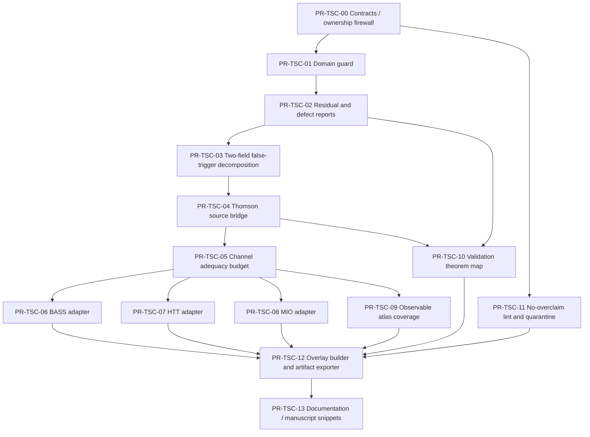

# TSC Active Service Upgrade for BASS / HTT / MIO
## SDD 기반 WBS 및 PR 실행계획

**Version**: v1.0-tsc-active-service  
**Date**: 2026-04-20  
**Document role**: self-contained SDD / WBS / PR list. 이 문서는 TSC를 단순 수학적 형식화 또는 사후 검증 계층에 머물게 하지 않고, BASS/HTT/MIO가 실제 산출물을 만들 때 능동적으로 도움을 주는 bounded service layer로 업그레이드하기 위한 구현 계획이다.

---

## 0. Executive summary

기존 SSoT는 유지한다. 즉 full transport closure와 runtime reduction authority는 BASS/characteristics 쪽에 있고, HTT는 model-dependent inference owner이며, MIO는 model-independent observatory/certificate owner다. TSC는 이 권한 구조를 침범하면 안 된다.

하지만 TSC를 지금처럼 “Teff chart, admissibility, no-overclaim check” 정도로만 두면 너무 소극적이다. Teff-characteristics 정리군은 이미 더 강한 engineering service를 정당화한다. 특히 trace residual이 Thomson source error를 제어하고, source error가 propagated field와 TT/TE/EE/BB spectrum adequacy로 이어지는 정리 사슬이 있으므로, TSC는 다음을 능동적으로 제공할 수 있다.


a) BASS에 대해: trace-source bridge, trace residual budget, source/propagation split labels, chart-domain guard, upgrade recommendation을 제공한다. 최종 `allow_reduction`은 여전히 BASS만 내린다.

b) HTT에 대해: posterior/evidence를 건드리지 않고, likelihood input bundle에 붙는 channel burden, source adequacy caveat, response validity flag, scalar-only overclaim warning을 제공한다.

c) MIO에 대해: MIO certificate에 source/domain/channel caveat를 붙이고, model-independent diagnostics가 trace-covered인지 spin-2/high-residual dependent인지 분류한다. MIO truth certificate나 posterior로 승격하지 않는다.

d) common/observable atlas에 대해: 모든 result card에 `TscAdequacyOverlay`를 붙여서, “이 결과는 trace source까지 안전한가?”, “propagation validation은 아직 pending인가?”, “two-field upgrade가 필요한가?”, “BB/family-identification claim은 금지인가?”를 artifact metadata로 남긴다.

핵심 설계 문장:

\[
\boxed{
\text{TSC is an active trace-source adequacy service, not a runtime authority, posterior owner, or spin-2 solver.}
}
\]

---

## 1. Source-grounded constraints

이 절은 계획 전체의 상위 제약이다. 이후 PR은 이 제약을 깨면 실패로 본다.

### 1.1 Teff / characteristics ontology

Full state transport는 characteristics가 담당한다. Teff는 full transport law의 대체물이 아니라 trace/intensity block 위의 reduced statistical chart, exact source bridge, diagnostic layer다.

수학적으로는 full photon sector를 최소한 다음처럼 분해한다.

\[
\mathscr H_\gamma
=
\mathscr H_{\rm tr}
\oplus
\mathscr H_{\rm sp2}
\oplus
\mathscr H_{\rm high}.
\]

여기서 TSC가 직접 의미론을 갖는 곳은 \(\mathscr H_{\rm tr}\), 즉 trace/intensity block이다. Spin-2 block과 high residual block은 TSC가 지우거나 대체하면 안 된다.

### 1.2 Ambient defect와 projected defect의 구분

TSC diagnostic은 “현재 projected reconstruction error”와 “instantaneous off-manifold leakage”를 혼동하면 안 된다.

Ambient defect:

\[
\Delta_t(g)=U_t(g)-S_t(g)
\]

는 1차에서 normal source를 본다.

\[
\dot\Delta_0(g)=Q_g\mathcal G(g).
\]

반면 projected defect:

\[
\mathcal E_t(g)=\Pi(U_t(g))-S_t(g)
\]

는 일반적으로 1차에서 사라지고 보통 2차부터 열린다.

따라서 TSC의 `trace_residual`, `ambient_defect_rate`, `projected_reconstruction_error`는 별도 필드여야 한다. 하나의 `error` 값으로 합치면 안 된다.

### 1.3 Trace-source adequacy theorem의 engineering 의미

Trace intensity를

\[
I(\hat e)=I_{\Theta,\eta}(\hat e)+\delta I(\hat e)
\]

로 쓰고, Thomson source quadrupole을

\[
\mathcal S_{\rm Th}[I]_{ab}
=-\frac{n_e\sigma_T}{10}\left\langle I(\hat e)e_{\langle a}e_{b\rangle}\right\rangle_\Omega
\]

로 두면, 선형성 때문에

\[
\mathcal S_{\rm Th}[I]
=
\mathcal S_{\rm Th}[I_{\Theta,\eta}]
+
\mathcal S_{\rm Th}[\delta I].
\]

따라서 on-manifold이면 source bridge는 정확하다.

\[
\delta I=0
\Rightarrow
\mathcal S_{\rm Th}[I]
=
\mathcal S_{\rm Th}[I_{\Theta,\eta}].
\]

그리고 \(\mathcal Q_2\)가 bounded이면 source error는 trace residual로 제어된다.

\[
\|\mathcal S_{\rm Th}[I]-\mathcal S_{\rm Th}[I_{\Theta,\eta}]\|_{\rm scr}
\le
\frac{n_e\sigma_T}{10}
\|\mathcal Q_2\|_{\rm op}
\|\delta I\|_{\rm tr}.
\]

이 식이 TSC를 단순 chart checker에서 active source-adequacy service로 올리는 핵심 근거다.

### 1.4 Source → field → spectrum adequacy chain

TSC가 직접 field propagation을 수행하지는 않는다. 하지만 TSC는 source mismatch budget을 BASS/HTT/MIO가 소비할 수 있는 형태로 넘길 수 있다.

Linear propagated field error:

\[
E(t)=\int_0^t \mathcal U(t,s)\delta S(s)\,ds,
\]

따라서

\[
\|E(t)\|
\le
M\int_0^t e^{\omega(t-s)}\|\delta S(s)\|\,ds.
\]

Semilinear regime에서는 Lipschitz 상수 \(L_\mathcal F\) 아래

\[
\|E(t)\|
\le
\exp(L_\mathcal F t)
\int_0^t\|\delta S(s)\|\,ds
\]

가 기본 budget form이다.

Spectrum adequacy는 채널별로 분해된다.

- TT: trace block adequacy 지배.
- EE: trace-source adequacy + spin-2 propagation adequacy.
- BB: spin-2/high residual adequacy. Trace semantics alone으로 제어 금지.
- TE: trace-side와 spin-2-side mixed adequacy.

따라서 TSC는 `source_budget`까지는 강하게 말할 수 있고, `field_budget`과 `spectrum_budget`은 BASS/validation layer가 제공한 propagation constants 또는 validation status가 있을 때에만 조건부로 말할 수 있다.

### 1.5 Paper I-V scope constraints

Paper I의 tangency diagnostic은 per-ray, instantaneous, collision-side energy-mode test다. 이는 necessary diagnostic이지 global kinetic adequacy proof가 아니다.

Paper II는 direction-dependent chemical potential \(\eta(\hat e)\)가 non-redundant degree of freedom임을 보여준다. 그러므로 TSC는 one-field mismatch를 곧장 off-manifold failure로 해석하지 말고, two-field \((\Theta,\eta)\) upgrade로 제거 가능한 tangent component인지 먼저 분해해야 한다.

Paper III는 Gram-Hessian identity, Pythagorean decomposition, two-field tangency structure를 제공한다. 따라서 TSC의 upgrade advisor는 ad hoc threshold가 아니라 tangent decomposition과 identifiability metric을 사용해야 한다.

Paper IV는 observable semantics와 reconstructive adequacy를 준다. TSC report에는 `observable_reconstruction_status`와 `local_jacobian_sigma_min` 같은 field가 있어야 한다.

Paper V는 가장 중요한 scope boundary를 준다. Teff/TSC는 intensity-side transparency와 nonlinear Thomson source parameterisation을 제공하지만, \(E_{A_\ell}\), \(B_{A_\ell}\) multipole evolution을 parameterise하지 않는다. 따라서 TSC가 full polarization solver나 observed-sky E/B phenomenology를 claim하면 실패다.

---

## 2. Target upgrade: TSC as Active Adequacy Service

### 2.1 기존 TSC 정의

기존 정의:

\[
\text{TSC}=	ext{Trace Semantics Controller}.
\]

역할:

- one-field / two-field Teff chart 관리,
- source bridge,
- admissibility,
- upgrade recommendation,
- no-overclaim diagnostic.

### 2.2 업그레이드된 정의

새 구현상 정의:

\[
\boxed{
\text{TSC}=	ext{Trace-source Semantics and Adequacy Service}.
}
\]

이 이름을 package name으로 바꿀 필요는 없다. `tsc`라는 package 이름은 유지한다. 다만 SDD 안에서 TSC의 active service responsibilities를 명확히 한다.

TSC는 다음 6개 service를 제공한다.

1. **Chart service**: one-field, two-field, future higher-field chart registry와 domain guard.
2. **Residual service**: Laguerre \(n\ge2\) residual, ambient/projected defect distinction, blockwise residual origin classification.
3. **Source bridge service**: \(I_{\Theta,\eta}\to \mathcal S_{\rm Th}\) nonlinear trace-source bridge와 source-error bound.
4. **Adequacy budget service**: trace-source budget, source-to-field pre-budget, channel responsibility overlay.
5. **Upgrade advisor service**: one-field sufficient / two-field recommended / full resolved trace required / invalid-domain block.
6. **Artifact caveat service**: HTT/MIO/BASS/Atlas artifacts에 붙는 TSC adequacy overlay, no-overclaim lint, quarantine reason.

### 2.3 Authority boundary

TSC가 **할 수 있는 것**:

- source adequacy를 측정한다.
- chart domain을 검증한다.
- one-field vs two-field upgrade를 추천한다.
- trace-covered observable과 spin-2-dependent observable을 분리한다.
- result artifact에 caveat와 warning을 붙인다.
- BASS/HTT/MIO가 소비할 수 있는 structured service output을 낸다.

TSC가 **할 수 없는 것**:

- BASS의 `allow_reduction`을 최종 결정한다.
- HTT posterior/evidence를 직접 수정하거나 합산한다.
- MIO certificate를 truth certificate로 승격한다.
- full spin-2 propagation을 대체한다.
- BB/family identification/BiPoSH morphology를 Teff trace semantics만으로 claim한다.
- scalar-only result를 Bianchi geometry detection으로 승격한다.

---

## 3. SSoT-preserving interaction model

### 3.1 Common ownership table

| Package | SSoT authority | TSC가 제공하는 도움 | TSC가 침범하면 안 되는 영역 |
|---|---|---|---|
| BASS / bass_py | runtime/reduction decision, exact/forward transport labels, source adequacy consumption | trace-source bridge, q_tr budget, admissibility report, recommended source/propagation status | final allow/block, exact transport, spin-2 propagation |
| HTT | model-dependent likelihood, posterior, evidence, template fit, local/global discrimination | likelihood caveats, channel adequacy flags, response validity warnings, scalar-only overclaim guard | posterior reweighting by default, evidence summation, model ranking ownership |
| MIO | model-independent observatory report, coherence/tension/residual certificate | certificate caveats, diagnostic-only vs production-readable source coverage, trace/spin-2 responsibility labels | truth certification, posterior/evidence, model adjudication |
| common/contracts | owner/scope/claim-tier/manifest schemas | `TscAdequacyOverlay`, schema validation, no-overclaim vocabulary | physics computation |

### 3.2 Dataflow diagram

```text
BASS SolverCoreOutput / ObservableVector / AtlasEntryLite
        |
        v
TSC Active Service
  - ChartDomainReport
  - TraceResidualReport
  - SourceBridgeReport
  - ChannelAdequacyBudget
  - UpgradeRecommendation
  - TscAdequacyOverlay
        |
        +--> BASS RuntimeReductionDecision input
        |       (BASS owns final allow/block)
        |
        +--> HTT LikelihoodInputBundle caveats
        |       (HTT owns posterior/evidence)
        |
        +--> MIO MioCertificate enrichment
        |       (MIO owns diagnostic/certificate)
        |
        +--> ArtifactManifest / ClaimLedger
                (common owns schema)
```

### 3.3 Source / propagation / observable split

TSC must preserve the following split everywhere.

```text
source adequate        = trace-source bridge and q_tr budget pass
propagation validated  = BASS/validation layer confirms spin-2/high propagation status
observable adequate    = channelwise validation passes for TT/TE/EE/BB or declared subset
```

Allowed combined labels:

- `source_adequate__propagation_validated`
- `source_adequate__propagation_pending`
- `source_inadequate__propagation_not_evaluated`
- `source_invalid_domain__blocked`
- `trace_ok__spin2_required`
- `trace_only__bb_claim_forbidden`
- `two_field_recommended__one_field_warn`
- `full_resolved_trace_required`

Forbidden combined labels:

- `tsc_validated_full_polarization`
- `tsc_validated_bianchi_family`
- `source_adequate_implies_observable_adequate`
- `mio_truth_certified_by_tsc`
- `htt_evidence_corrected_by_tsc` unless explicitly represented as an HTT-owned nuisance model.

---

## 4. Core data contracts

All contracts should be frozen dataclasses or Pydantic models. The first implementation can use dataclasses to reduce dependency burden.

### 4.1 Enums

```python
Owner = Literal["BASS", "HTT", "MIO", "TSC", "COMMON"]
ClaimTier = Literal["exploratory", "conditional", "validated", "blocked"]
TscChart = Literal["one_field", "two_field", "higher_field", "full_resolved_trace"]
TscChartStatus = Literal[
    "valid_one_field",
    "valid_two_field",
    "two_field_recommended",
    "higher_field_recommended",
    "full_resolved_trace_required",
    "invalid_domain",
]
SourceStatus = Literal["source_adequate", "source_warn", "source_inadequate", "source_blocked", "source_not_evaluated"]
PropagationStatus = Literal["propagation_validated", "propagation_pending", "propagation_failed", "propagation_not_applicable"]
Channel = Literal["TT", "TE", "EE", "BB", "TB", "EB", "BiPoSH", "template", "scalar_summary"]
```

### 4.2 `TscDomainReport`

```python
@dataclass(frozen=True)
class TscDomainReport:
    chart: TscChart
    theta_min: float
    eta_max: float | None
    be_eta_nonpositive: bool | None
    weight_simplex_ok: bool
    jacobian_sigma_min: float | None
    domain_margin: float
    status: TscChartStatus
    blocking_reasons: tuple[str, ...]
    manifest: ArtifactManifest
```

Invariants:

- `theta_min > 0` for any production chart use.
- BE case requires `eta_max <= 0`.
- Inverse/reconstruction requires `jacobian_sigma_min >= sigma_min_floor` if a local inverse is used.
- If any invariant fails, `status="invalid_domain"` and downstream artifacts must be blocked or diagnostic-only.

### 4.3 `TscResidualReport`

```python
@dataclass(frozen=True)
class TscResidualReport:
    chart: TscChart
    laguerre_n_ge_2_norm: float
    ambient_defect_rate: float | None
    projected_defect_estimate: float | None
    onefield_residual: float | None
    twofield_residual: float | None
    eta_tangent_fraction: float | None
    trace_residual_q_tr: float | None
    spin2_residual: float | None
    high_residual: float | None
    residual_origin: Literal["trace", "eta_tangent", "spin2", "high", "mixed", "unknown"]
    labels: tuple[str, ...]
    manifest: ArtifactManifest
```

Hard rule: `spin2_residual` can be logged by TSC only as an imported resolved-block metric from BASS/validation. TSC does not compute spin-2 adequacy by reducing it.

### 4.4 `TscSourceBridgeReport`

```python
@dataclass(frozen=True)
class TscSourceBridgeReport:
    source_name: Literal["thomson_trace_quadrupole", "other"]
    chart: TscChart
    q2_norm: float
    source_error_bound: float | None
    nonlinear_dipole_quartic_correction: float | None
    eta_correction_indicator: float | None
    on_manifold_exact: bool
    source_status: SourceStatus
    required_bass_primitives: tuple[str, ...]
    labels: tuple[str, ...]
    manifest: ArtifactManifest
```

Minimum labels:

- `trace_source_exact_on_manifold`
- `trace_source_bound_available`
- `eta_correction_small`
- `eta_correction_not_small`
- `linear_bridge_underestimates_risk`
- `source_bridge_not_applicable`

### 4.5 `TscChannelAdequacyBudget`

```python
@dataclass(frozen=True)
class TscChannelAdequacyBudget:
    channel: Channel
    trace_budget: float | None
    spin2_budget: float | None
    high_budget: float | None
    source_to_field_bound: float | None
    spectrum_bound_linear: float | None
    spectrum_bound_quadratic: float | None
    source_status: SourceStatus
    propagation_status: PropagationStatus
    claim_ceiling: ClaimTier
    labels: tuple[str, ...]
    manifest: ArtifactManifest
```

Channel responsibility defaults:

| Channel | TSC direct coverage | Required non-TSC coverage | Default claim ceiling |
|---|---|---|---|
| TT | trace adequacy | BASS observable map validation | conditional |
| EE | trace-source adequacy | spin-2 propagation validation | conditional |
| TE | trace + spin-2 mixed | mixed-channel validation | conditional |
| BB | none beyond caveat | spin-2/high residual validation | blocked for TSC-only |
| BiPoSH / morphology | caveat only unless trace-source subset declared | BASS/HTT/MIO covariance path | exploratory/conditional |
| template/family identification | caveat only | HTT/BASS morphology path | blocked for TSC-only |

### 4.6 `TscUpgradeRecommendation`

```python
@dataclass(frozen=True)
class TscUpgradeRecommendation:
    current_chart: TscChart
    recommended_chart: TscChart
    reason: Literal[
        "eta_tangent_false_trigger",
        "spectral_distortion_residual",
        "invalid_domain",
        "jacobian_near_singular",
        "source_error_bound_exceeded",
        "spin2_required",
        "high_residual_required",
        "stable_no_upgrade",
    ]
    severity: Literal["info", "warn", "block"]
    dwell_time_required: float | None
    hysteresis_state: str | None
    labels: tuple[str, ...]
    manifest: ArtifactManifest
```

### 4.7 `TscAdequacyOverlay`

```python
@dataclass(frozen=True)
class TscAdequacyOverlay:
    domain_report: TscDomainReport
    residual_report: TscResidualReport
    source_bridge_report: TscSourceBridgeReport | None
    channel_budgets: tuple[TscChannelAdequacyBudget, ...]
    upgrade_recommendation: TscUpgradeRecommendation
    no_overclaim_flags: dict[str, bool]
    quarantine_reasons: tuple[str, ...]
    public_caveat_snippet: str
    manifest: ArtifactManifest
```

Hard rule:

\[
\boxed{
\text{Every serious BASS/HTT/MIO artifact must either attach a TscAdequacyOverlay or explicitly declare TSC-not-applicable.}
}
\]

---

## 5. SDD module plan

### 5.1 `src/tsc/contracts.py`

Purpose: define TSC dataclasses and enum aliases, but no physics computation.

Inputs: common `ArtifactManifest`, `Owner`, `ClaimTier`.  
Outputs: TSC report objects.  
Tests:

- schema roundtrip,
- immutability,
- owner must be `TSC`,
- manifest required,
- forbidden fields absent.

### 5.2 `src/tsc/admissibility/domain.py`

Purpose: chart-domain checks.

Functions:

```python
check_theta_positive(theta_samples, floor=0.0) -> DomainFlag
check_be_eta_nonpositive(eta_samples) -> DomainFlag
check_weight_simplex(weights, atol) -> DomainFlag
check_jacobian_sigma_min(J, floor) -> DomainFlag
build_domain_report(...) -> TscDomainReport
```

No source bridge may run in production mode unless `TscDomainReport.status != "invalid_domain"`.

### 5.3 `src/tsc/residuals/laguerre.py`

Purpose: Paper I-style \(n\ge2\) energy-mode diagnostic and collision-side tangency metric.

Functions:

```python
laguerre_coefficients(source_or_residual, basis, weight) -> np.ndarray
n_ge_2_norm(coeffs) -> float
tangency_status(norm, threshold) -> Literal["tangent", "warn", "non_tangent"]
```

Important distinction: collision-field residual and state residual are different inputs. Function names must include `collision_` or `state_` when needed.

### 5.4 `src/tsc/residuals/blockwise.py`

Purpose: direct-sum residual origin classification.

Functions:

```python
classify_residual_origin(trace_q, spin2_q, high_q, thresholds) -> ResidualOrigin
ambient_vs_projected_defect_report(...) -> TscResidualReport
```

Hard rule: pure spin-2 perturbation must not trigger trace upgrade.

### 5.5 `src/tsc/charts/twofield_decomposition.py`

Purpose: one-field false-trigger removal and two-field upgrade diagnostics.

Functions:

```python
compute_eta_tangent_fraction(onefield_residual, twofield_residual) -> float
recommend_twofield_upgrade(...) -> TscUpgradeRecommendation
```

Acceptance: if two-field residual drops while eta-tangent fraction is high, output `two_field_recommended`, not `full_resolved_trace_required`.

### 5.6 `src/tsc/source/thomson_bridge.py`

Purpose: exact nonlinear intensity-side Thomson source bridge.

Functions:

```python
intensity_from_theta(theta, T0, xi, eta=None) -> IntensitySamples
quadrupole_from_intensity(intensity_samples, directions, weights) -> PSTF2
thomson_source_from_quadrupole(q2, ne, sigma_T) -> PSTF2
source_error_bound(delta_I_norm, q2_op_norm, ne, sigma_T) -> float
build_source_bridge_report(...) -> TscSourceBridgeReport
```

Include one-field blackbody fast path:

\[
I_\Theta=c_\xi T_0^4\Theta^4.
\]

Include two-field path:

\[
I_{\Theta,\eta}=T_0^4\Theta^4 I^{(3)}_\xi(\eta).
\]

Include risk flag:

- if \(A\) dipole is moderate and linear bridge is requested, emit `linear_bridge_underestimates_risk`.

### 5.7 `src/tsc/budget/source_to_channel.py`

Purpose: convert source residual bound into channel responsibility budget.

Functions:

```python
source_to_field_prebudget(source_error_bound, propagator_norm_bound=None) -> float | None
channel_budget_TT(...)
channel_budget_EE(...)
channel_budget_TE(...)
channel_budget_BB(...)
build_channel_budgets(...) -> tuple[TscChannelAdequacyBudget, ...]
```

If no propagation constant or validation status is provided, set `propagation_status="propagation_pending"` and do not emit a validated spectrum bound.

### 5.8 `src/tsc/control/upgrade_advisor.py`

Purpose: hysteretic diagnose -> recommend, not diagnose -> decide.

Functions:

```python
recommend_chart_transition(domain_report, residual_report, source_report, config) -> TscUpgradeRecommendation
apply_hysteresis(previous_state, current_signal, config) -> HysteresisState
```

No direct solver mode switch. The result is consumed by BASS or a user-facing controller.

### 5.9 `src/tsc/audit/no_overclaim.py`

Purpose: textual and metadata-level claim guard.

Checks:

- `full polarization solved by TSC` forbidden.
- `BB controlled by Teff/TSC trace` forbidden.
- `Bianchi family identified by TSC` forbidden.
- `source adequate implies observable adequate` forbidden.
- `MIO truth certificate` forbidden.
- `TSC corrected HTT evidence` forbidden unless HTT-owned nuisance model explicitly exists.

### 5.10 `src/tsc/adapters/bass_runtime.py`

Purpose: BASS-facing adapter.

Input:

- BASS trace samples,
- BASS source primitives,
- validation labels,
- propagation status.

Output:

- `TscAdequacyOverlay`,
- BASS-consumable `SourceAdequacySuggestion`, not final decision.

### 5.11 `src/tsc/adapters/htt_inference.py`

Purpose: HTT-facing adapter.

Output:

- `HttTscCaveatBundle`,
- channel validity flags,
- likelihood-input caveats,
- scalar-only geometry overclaim warnings.

Hard rule: no automatic posterior/evidence arithmetic.

### 5.12 `src/tsc/adapters/mio_certificate.py`

Purpose: MIO-facing adapter.

Output:

- `MioTscAdequacyFields`,
- `diagnostic_only` triggers,
- public caveat snippets.

Hard rule: no truth certification.

### 5.13 `src/tsc/validation/theorem_map.py`

Purpose: theorem/proof obligation -> test/runbook mapping.

Data:

```python
TheoremTestLink(
    theorem="T20_trace_source_adequacy",
    tests=("B2", "C1", "C2"),
    metrics=("trace_residual", "source_error", "spectrum_error"),
    required_artifacts=("metrics", "passfail", "summary"),
)
```

This allows validation artifacts to say which theorem they are actually testing.

### 5.14 `src/tsc/reports/overlay_builder.py`

Purpose: single public entrypoint.

```python
build_tsc_overlay(
    chart_state,
    trace_samples,
    source_primitives,
    residual_inputs,
    validation_context,
    artifact_manifest,
) -> TscAdequacyOverlay
```

This is the entrypoint BASS/HTT/MIO should call.

---

## 6. Package interaction upgrades

### 6.1 BASS interaction upgrade

#### Current problem

BASS is the canonical runtime owner, but without a structured TSC service the source/propagation split can be represented inconsistently. Some artifacts may silently imply that a Teff/trace source bridge validates full polarization or downstream spectra.

#### Upgrade

BASS receives `TscAdequacyOverlay` as advisory input. BASS then emits `RuntimeReductionDecision` and final source/propagation labels.

BASS-side consumption rule:

```text
TSC SourceBridgeReport.source_status
  -> BASS SourceAdequacyConsumer
  -> BASS RuntimeReductionDecision
  -> BASS ValidationLabelEmitter
```

But:

```text
TSC never writes RuntimeReductionDecision.allow_reduction directly.
```

#### New BASS labels enabled

- `trace_source_bridge_exact_on_manifold`
- `trace_source_bound_available`
- `trace_source_inadequate`
- `source_adequate_propagation_pending`
- `mixed_channel_propagation_pending`
- `bb_requires_spin2_validation`
- `twofield_upgrade_recommended_by_tsc`
- `invalid_trace_chart_blocked_by_bass`

#### Immediate scientific gain

BASS outputs become more interpretable. A low-ell run can say not only “spectrum produced” but also “TT trace-side adequacy is validated; EE source is trace-controlled but spin-2 propagation is pending; BB claim blocked.”

### 6.2 HTT interaction upgrade

#### Current problem

HTT owns model-dependent inference, but scalar templates, low-ell features, and response blocks may be fed into likelihoods without explicit source/domain adequacy caveats. This creates overclaim risk, especially for local/global discrimination and family identification.

#### Upgrade

HTT receives `HttTscCaveatBundle` generated from `TscAdequacyOverlay`.

HTT may use TSC output in three ways:

1. **Artifact caveat**: attach source/domain/channel caveats to posterior/evidence products.
2. **Likelihood scope guard**: block likelihood modes whose required source/channel validation is missing.
3. **Optional nuisance model**: only if explicitly declared in HTT, TSC source-error bound may be introduced as an HTT-owned nuisance parameter or covariance inflation term.

Default is caveat/guard only, not posterior arithmetic.

#### HTT-specific rules

- If input observable is TT scalar summary and TSC trace source passes, HTT may label source-side trace adequacy as conditional.
- If input observable uses EE/TE, HTT must require spin-2 propagation status from BASS/validation in addition to TSC source status.
- If input observable uses BB, BiPoSH, or family morphology, TSC can only emit caveats; HTT must rely on BASS/MIO/observable validation.
- If local boost/global tilt discrimination uses scalar amplitude only, TSC must trigger `scalar_only_discrimination_insufficient` caveat.

### 6.3 MIO interaction upgrade

#### Current problem

MIO is a model-independent observatory, but MIO certificate fields can become too vague unless they record which diagnostics are trace-covered, source-covered, propagation-covered, or only morphology/covariance-covered.

#### Upgrade

MIO receives `MioTscAdequacyFields`.

MIO certificate receives:

```python
source_caveats: list[str]
channel_responsibility: dict[str, str]
tsc_domain_status: str
tsc_upgrade_hint: str | None
trace_source_adequacy: str
propagation_status_required: list[str]
```

MIO can then distinguish:

- model-independent trace/source diagnostic,
- model-independent morphology diagnostic,
- diagnostic-only result,
- production-readable result with validation provenance.

MIO still does not output posterior/evidence/truth.

### 6.4 Observable atlas interaction upgrade

TSC attaches a coverage map to each `ObservableVector` and `AtlasEntryLite`.

Example:

```yaml
observable: BiPoSH_L2_lowell
trace_source_covered_by_tsc: partial
spin2_required: true
morphology_claim_owner: HTT_or_MIO
family_identification_by_tsc: false
claim_ceiling_without_covariance: exploratory
```

This makes the thin observable atlas safer: morphology novelty is preserved, but scalar trace semantics is not overextended.

---

## 7. Adversarial audit

This section states the hostile review before the final PR plan.

### 7.1 Attack: “You made TSC a hidden runtime owner.”

Risk: If TSC emits `source_adequate` and downstream code treats it as `allow_reduction=True`, SSoT is broken.

Fix: TSC emits only suggestions and overlays. BASS consumes them and emits final `RuntimeReductionDecision`. Tests must assert that no TSC module imports or writes BASS runtime decision fields.

### 7.2 Attack: “TSC is silently correcting HTT posterior.”

Risk: If TSC source error becomes a posterior weight outside HTT, HTT evidence loses model-dependent ownership.

Fix: Default TSC-to-HTT path is caveat/guard only. Numerical incorporation of TSC uncertainty must be represented as an HTT-owned nuisance/covariance model with its own config, manifest, and likelihood label.

### 7.3 Attack: “MIO certificate became truth certificate.”

Risk: TSC adequacy language may make MIO look like it certifies physical truth.

Fix: MIO fields say `diagnostic`, `production-readable`, or `diagnostic-only`, never `true`. No `certified_model`, no `detected_bianchi`, no `posterior_probability` fields in MIO/TSC interface.

### 7.4 Attack: “Trace-source adequacy was conflated with propagation adequacy.”

Risk: The most likely scientific overclaim. TSC can make a Thomson source bridge exact on-manifold, but EE/BB still require spin-2 propagation.

Fix: `source_status` and `propagation_status` are separate required fields. `source_adequate__propagation_pending` is a legal label. `source_adequate__observable_validated` requires BASS/validation proof.

### 7.5 Attack: “TSC overclaims BB or BiPoSH.”

Risk: Because full covariance and BiPoSH extensions are now important, one might be tempted to use TSC as the morphology engine.

Fix: TSC has only coverage/caveat role for BB/BiPoSH/family identification. HTT/MIO/BASS own morphology/covariance paths.

### 7.6 Attack: “One-field diagnostics trigger unnecessary upgrades.”

Risk: Paper III says one-field residual can contain missing \(\eta\)-tangent component. Treating it as real off-manifold failure causes false alarms.

Fix: Upgrade advisor must run one-field/two-field decomposition before recommending full resolved trace. It must report `eta_tangent_false_trigger` separately.

### 7.7 Attack: “The validation green-light is too generic.”

Risk: Passing a unit test might be treated as publication-grade adequacy.

Fix: Every validation artifact must preserve theorem target, layer A/B/C/R, metric keys, and pass/warn/fail. Publication-grade requires channel-relevant validation, not generic CI success.

### 7.8 Attack: “TSC becomes too large and delays novelty.”

Risk: A full standalone Teff solver or higher-field hierarchy would be expensive and not necessary for current BASS/HTT/MIO novelty.

Fix: Defer standalone solver. Implement service outputs first: domain, residual, source bridge, budgets, overlays, adapters.

---

## 8. Refined plan after audit

After pruning, TSC v1 should implement only the following active capabilities.

1. **P0**: contracts, domain guard, no-overclaim lint.
2. **P0/P1**: residual reports with ambient/projected distinction and one-field/two-field decomposition.
3. **P1**: nonlinear Thomson trace-source bridge and source-error bound.
4. **P1**: BASS adapter that passes suggestions without taking decision authority.
5. **P1/P2**: channel adequacy budget, with propagation pending supported.
6. **P2**: HTT/MIO adapters for caveats and claim-tier labels.
7. **P2**: theorem-to-test validation registry and artifact overlay builder.

Explicitly deferred:

- standalone Teff PDE solver,
- full polarised Teff solver,
- BB control by trace semantics,
- Bianchi family identification by TSC,
- automatic HTT posterior correction,
- production-grade high-ell claims,
- higher-field hierarchy beyond interface placeholders.

---

## 9. WBS wave plan

### Wave T0 — SSoT firewall and schemas

Goal: make it impossible for TSC to become hidden authority.

Outputs:

- `TscDomainReport`, `TscResidualReport`, `TscSourceBridgeReport`, `TscChannelAdequacyBudget`, `TscUpgradeRecommendation`, `TscAdequacyOverlay`.
- owner/scope/claim-tier tests.
- forbidden import tests.

### Wave T1 — Domain and admissibility

Goal: prevent inverse/reconstruction/source bridge use outside chart domain.

Outputs:

- \(\Theta>0\) checks.
- BE \(\eta\le0\) checks.
- weight simplex checks.
- Jacobian \(\sigma_{\min}\) checks.
- domain margin reports.

### Wave T2 — Residual and defect diagnostics

Goal: separate collision/state residual, ambient/projected defect, trace/spin-2/high origin.

Outputs:

- Laguerre residual diagnostic.
- blockwise residual origin classification.
- one-field/two-field false-trigger decomposition.

### Wave T3 — Source bridge service

Goal: provide exact nonlinear trace-source bridge and source error bound.

Outputs:

- one-field blackbody bridge.
- two-field bridge.
- Thomson quadrupole source report.
- linear-bridge underestimation warning.

### Wave T4 — Channel adequacy budget

Goal: expose what TSC can and cannot support for TT/TE/EE/BB/BiPoSH.

Outputs:

- source-to-field prebudget.
- channel responsibility table.
- propagation pending labels.
- TSC-only BB block.

### Wave T5 — BASS adapter

Goal: let BASS consume TSC information while preserving BASS ownership.

Outputs:

- `SourceAdequacySuggestion`.
- BASS validation label hooks.
- source/propagation split tests.

### Wave T6 — HTT adapter

Goal: let HTT use TSC caveats in likelihood products and discrimination reports.

Outputs:

- `HttTscCaveatBundle`.
- scalar-only geometry caveat.
- optional nuisance model protocol.

### Wave T7 — MIO adapter

Goal: let MIO certificates display trace/source/domain caveats clearly.

Outputs:

- `MioTscAdequacyFields`.
- diagnostic-only triggers.
- public caveat snippets.

### Wave T8 — Validation and artifact integration

Goal: every TSC-supported claim has theorem/test/artifact provenance.

Outputs:

- theorem-to-test registry.
- runbook-compatible metrics.
- pass/warn/fail artifacts.
- overlay builder.

### Wave T9 — Documentation and manuscript hooks

Goal: generate tables and captions from artifacts, not hand-written caveats.

Outputs:

- `docs/tsc_active_service_sdd.md`.
- `docs/tsc_claim_ledger.md`.
- `docs/tsc_channel_responsibility_table.md`.
- manuscript caveat snippets.

---

## 10. PR dependency graph



---

## 11. Detailed PR list

## PR-TSC-00 — Contracts, ownership firewall, and SSoT guard

**Priority**: P0  
**Depends on**: common contracts / artifact manifest if already present. Otherwise this PR adds minimal local stubs and later migrates to common.

### Goal

Freeze TSC as an active advisory service without runtime/persistence authority.

### SDD delta

Add TSC service contracts and owner boundary tests. No physics computation yet.

### Files

```text
src/tsc/contracts.py
src/tsc/__init__.py
src/common/ownership.py                 # only if not already present
src/common/artifact_manifest.py          # only if not already present
docs/tsc_claim_ledger.md
tests/tsc/test_contracts_schema.py
tests/tsc/test_tsc_owner_no_runtime_authority.py
tests/tsc/test_tsc_overlay_requires_manifest.py
tests/tsc/test_tsc_forbidden_imports.py
```

### WBS

1. Define TSC dataclasses.
2. Define legal labels and forbidden labels.
3. Add import-direction test: `tsc` may import `common`, but may not import BASS runtime decision writer, HTT posterior writer, or MIO truth/evidence objects.
4. Add `Owner.TSC` manifest requirement.
5. Add `docs/tsc_claim_ledger.md` with allowed/forbidden statements.

### Tests

- `test_tsc_report_owner_is_tsc`
- `test_tsc_overlay_has_manifest`
- `test_tsc_cannot_write_runtime_decision`
- `test_tsc_cannot_import_htt_evidence_writer`
- `test_tsc_cannot_import_mio_certificate_truth_fields`

### Definition of done

- All TSC service outputs are structured and manifest-backed.
- No TSC output contains final decision fields like `allow_reduction`, `posterior_weight`, `truth_certified`, or `bianchi_family_detected`.

### Rollback / kill criterion

Rollback if contracts duplicate common schemas in an incompatible way. In that case, move shared enum definitions to `common/contracts.py` and keep TSC-specific classes in `tsc/contracts.py`.

---

## PR-TSC-01 — Chart domain and admissibility guard

**Priority**: P0  
**Depends on**: PR-TSC-00

### Goal

Make it impossible to run production TSC inverse/source bridge outside the admissible chart domain.

### SDD delta

Implement `TscDomainReport` generation.

### Files

```text
src/tsc/admissibility/domain.py
src/tsc/admissibility/realizability.py
src/tsc/charts/domain_report.py
tests/tsc/test_domain_theta_positive.py
tests/tsc/test_domain_be_eta_nonpositive.py
tests/tsc/test_domain_weight_simplex.py
tests/tsc/test_domain_jacobian_sigma_min.py
tests/tsc/test_inverse_blocks_invalid_domain.py
```

### WBS

1. Implement \(\Theta>0\) sample check.
2. Implement BE \(\eta\le0\) sample check.
3. Implement quadrature weight simplex check.
4. Implement optional `sigma_min(J)` check for local inverse/reconstruction.
5. Implement domain margin computation.
6. Return `invalid_domain` status with blocking reasons.
7. Add production-mode guard decorator for source bridge and inverse routines.

### Tests

- `theta_min <= 0` blocks production.
- BE `eta_max > 0` blocks production.
- invalid weights block quadrature-dependent source bridge.
- `sigma_min < floor` sets `jacobian_near_singular` warning or block depending config.

### Definition of done

- Any TSC production service requiring a chart refuses invalid domain input.
- Diagnostic mode may run but must mark result `diagnostic_only`.

### Scientific output enabled

No direct result yet. This PR prevents bad results.

---

## PR-TSC-02 — Residual and defect reports

**Priority**: P0/P1  
**Depends on**: PR-TSC-01

### Goal

Make TSC diagnostics physically meaningful by separating state residual, collision residual, ambient defect rate, projected reconstruction error, and block origin.

### SDD delta

Implement `TscResidualReport`.

### Files

```text
src/tsc/residuals/laguerre.py
src/tsc/residuals/blockwise.py
src/tsc/residuals/defect_report.py
tests/tsc/test_laguerre_nge2_norm.py
tests/tsc/test_collision_vs_state_residual_not_conflated.py
tests/tsc/test_ambient_projected_defect_separation.py
tests/tsc/test_pure_spin2_does_not_trigger_trace_residual.py
tests/tsc/test_mixed_residual_origin_classification.py
```

### WBS

1. Implement Laguerre basis projection helper.
2. Implement `n_ge_2_norm` diagnostic.
3. Add separate input types for collision field vs state residual.
4. Implement ambient/projected defect report fields.
5. Implement blockwise origin classifier: trace, eta_tangent, spin2, high, mixed, unknown.
6. Add tests using synthetic residual vectors.

### Tests

- Collision residual and state residual with same numerical values still retain different semantic labels.
- Pure spin-2 residual produces no trace upgrade recommendation.
- Ambient defect can be nonzero while projected defect first-order estimate is zero.

### Definition of done

- Downstream modules can no longer say just “TSC error”; they must identify residual type and origin.

---

## PR-TSC-03 — One-field/two-field false-trigger decomposition and upgrade advisor

**Priority**: P1  
**Depends on**: PR-TSC-02

### Goal

Use the two-field \((\Theta,\eta)\) structure to distinguish genuine off-manifold residual from missing tangent degree of freedom.

### SDD delta

Implement two-field decomposition and `TscUpgradeRecommendation`.

### Files

```text
src/tsc/charts/twofield_decomposition.py
src/tsc/control/upgrade_advisor.py
src/tsc/control/hysteresis.py
tests/tsc/test_twofield_reduces_onefield_false_trigger.py
tests/tsc/test_eta_tangent_fraction.py
tests/tsc/test_upgrade_advisor_recommends_twofield_before_full_resolved.py
tests/tsc/test_upgrade_hysteresis_no_chatter.py
```

### WBS

1. Implement residual comparison: one-field vs two-field.
2. Define `eta_tangent_fraction`.
3. Define thresholds: `eta_tangent_fraction_warn`, `residual_block_floor`, `full_resolved_threshold`.
4. Implement recommendation states.
5. Implement hysteresis and dwell-time logic.
6. Ensure recommendations are advisory only.

### Tests

- If two-field residual is much smaller, recommendation is `two_field_recommended`.
- If two-field residual remains high, recommendation can be `full_resolved_trace_required`.
- Near-threshold noise does not cause repeated switching.

### Definition of done

- TSC can reduce false alarms and produce meaningful upgrade advice without controlling runtime.

---

## PR-TSC-04 — Nonlinear Thomson trace-source bridge

**Priority**: P1  
**Depends on**: PR-TSC-01, PR-TSC-02

### Goal

Operationalize the intensity-side nonlinear source bridge so BASS/HTT/MIO artifacts can know whether their source semantics are trace-covered.

### SDD delta

Implement `TscSourceBridgeReport` for Thomson trace quadrupole.

### Files

```text
src/tsc/source/thomson_bridge.py
src/tsc/source/quadrupole_projector.py
src/tsc/source/source_error_bound.py
src/tsc/source/twofield_eta_correction.py
tests/tsc/test_thomson_on_manifold_exactness.py
tests/tsc/test_source_error_bound_scales_with_delta_I.py
tests/tsc/test_quartic_dipole_generates_quadrupole.py
tests/tsc/test_linear_bridge_underestimation_warning.py
tests/tsc/test_twofield_eta_correction_indicator.py
```

### WBS

1. Implement angular quadrature projector \(\mathcal Q_2[I]\).
2. Implement one-field blackbody intensity \(I=c_\xi T_0^4\Theta^4\).
3. Implement two-field intensity \(I=T_0^4\Theta^4I^{(3)}_\xi(\eta)\).
4. Implement Thomson source from quadrupole.
5. Implement source error bound.
6. Emit warnings if linear bridge is requested outside small-amplitude regime.
7. Emit eta-correction smallness indicator when \(\eta\) is used.

### Tests

- On-manifold bridge gives zero source mismatch against direct intensity quadrupole.
- Source error bound is monotone in \(\|\delta I\|\).
- Finite dipole produces quartic \(A^2\) contribution to quadrupole.
- Linear bridge warning fires for moderate dipole amplitude.

### Definition of done

- TSC becomes useful to BASS source assembly without pretending to propagate polarization.

### Scientific output enabled

- Source decomposition table.
- Trace-source adequacy status in low-ell polarization runs.

---

## PR-TSC-05 — Source-to-channel adequacy budget

**Priority**: P1/P2  
**Depends on**: PR-TSC-04

### Goal

Translate source bridge information into channel responsibility labels for TT/TE/EE/BB/BiPoSH artifacts.

### SDD delta

Implement `TscChannelAdequacyBudget`.

### Files

```text
src/tsc/budget/source_to_field.py
src/tsc/budget/channel_responsibility.py
src/tsc/budget/spectrum_prebudget.py
tests/tsc/test_channel_tt_trace_budget.py
tests/tsc/test_channel_ee_requires_spin2_propagation.py
tests/tsc/test_channel_bb_blocks_tsc_only_claim.py
tests/tsc/test_channel_te_mixed_budget.py
tests/tsc/test_source_adequate_propagation_pending_label.py
```

### WBS

1. Implement channel responsibility defaults.
2. Implement source-to-field prebudget if propagator norm is available.
3. Implement propagation pending status when no BASS validation is attached.
4. Implement TT/EE/TE/BB channel budget constructors.
5. Add BiPoSH/morphology coverage caveat fields.

### Tests

- TT can be trace-covered conditional on source and observation map validation.
- EE cannot be validated by trace source alone.
- BB TSC-only claim is blocked.
- TE budget has both trace and spin-2 components.

### Definition of done

- Any result artifact can display channel-specific TSC coverage.

---

## PR-TSC-06 — BASS adapter and runtime handoff

**Priority**: P1  
**Depends on**: PR-TSC-05

### Goal

Allow BASS to consume TSC source/domain/upgrade suggestions while preserving BASS as final runtime owner.

### SDD delta

Add BASS-facing adapter. This PR may require small BASS changes to accept `SourceAdequacySuggestion`.

### Files

```text
src/tsc/adapters/bass_runtime.py
src/bass/runtime/source_adequacy_consumer.py      # patch only
src/bass/runtime/validation_label_emitter.py      # patch only
tests/tsc/test_bass_adapter_no_allow_reduction.py
tests/bass/test_bass_consumes_tsc_suggestion.py
tests/bass/test_bass_final_decision_owner.py
tests/bass/test_source_propagation_split_with_tsc.py
```

### WBS

1. Define `SourceAdequacySuggestion` as TSC -> BASS handoff object.
2. BASS consumes source status and domain report.
3. BASS emits final labels.
4. Add test ensuring TSC cannot set `allow_reduction`.
5. Add source adequate / propagation pending scenario.

### Tests

- BASS can block invalid chart even if TSC ran in diagnostic mode.
- BASS labels `source_adequate__propagation_pending` when appropriate.
- Final decision owner remains BASS.

### Definition of done

- BASS has richer source labels but unchanged authority structure.

---

## PR-TSC-07 — HTT inference caveat adapter

**Priority**: P2  
**Depends on**: PR-TSC-05

### Goal

Attach TSC adequacy/caveat information to HTT likelihood, posterior, evidence, and discrimination products without modifying posterior/evidence outside HTT.

### SDD delta

Add HTT-facing caveat bundle.

### Files

```text
src/tsc/adapters/htt_inference.py
src/htt/interface/tsc_caveats.py              # patch or new file
src/htt/infer/likelihood_scope_guard.py       # patch or new file
tests/tsc/test_htt_adapter_no_posterior_math.py
tests/htt/test_likelihood_blocks_missing_channel_validation.py
tests/htt/test_scalar_only_geometry_caveat.py
tests/htt/test_optional_tsc_nuisance_owned_by_htt.py
```

### WBS

1. Define `HttTscCaveatBundle`.
2. Add likelihood scope guard hooks.
3. Add scalar-only geometry claim caveat.
4. Add optional nuisance protocol stub, disabled by default.
5. Add manifest propagation to HTT outputs.

### Tests

- TSC caveats attach to HTT posterior artifact.
- TSC does not change evidence unless HTT-owned nuisance config is explicit.
- Scalar-only likelihood cannot output direction-inclusive geometry claim.

### Definition of done

- HTT products become safer and more interpretable without losing model-dependent ownership.

---

## PR-TSC-08 — MIO certificate adapter

**Priority**: P2  
**Depends on**: PR-TSC-05

### Goal

Let MIO certificates display TSC domain/source/channel caveats and diagnostic-only triggers.

### SDD delta

Add MIO-facing adequacy fields.

### Files

```text
src/tsc/adapters/mio_certificate.py
src/mio/interface/tsc_fields.py               # patch or new file
src/mio/diagnostics/caveats.py                # patch
tests/tsc/test_mio_adapter_no_truth_language.py
tests/mio/test_mio_certificate_tsc_fields.py
tests/mio/test_diagnostic_only_when_tsc_propagation_pending.py
tests/mio/test_mio_no_posterior_from_tsc.py
```

### WBS

1. Define `MioTscAdequacyFields`.
2. Map TSC overlay into MIO caveats.
3. Add diagnostic-only trigger when source/domain/propagation status is insufficient.
4. Add public caveat snippet generator.

### Tests

- No `truth`, `detected`, `posterior` language appears in MIO/TSC adapter output.
- MIO certificate can report source caveat and channel responsibility.

### Definition of done

- MIO reports become more honest and useful without collapsing into HTT inference.

---

## PR-TSC-09 — Observable atlas coverage map

**Priority**: P2  
**Depends on**: PR-TSC-05

### Goal

Mark each ObservableVector/AtlasEntryLite feature by TSC coverage: trace-covered, source-covered, spin-2-required, morphology-only, or not applicable.

### SDD delta

Add TSC coverage map for observable atlas.

### Files

```text
src/tsc/adapters/observable_atlas.py
src/common/observable_coverage.py             # patch or new file
tests/tsc/test_observable_coverage_tt.py
tests/tsc/test_observable_coverage_biposh.py
tests/tsc/test_observable_coverage_family_identification_block.py
tests/common/test_observable_vector_requires_coverage_or_na.py
```

### WBS

1. Define coverage categories.
2. Map scalar summaries to trace/source coverage.
3. Map EE/TE to mixed coverage.
4. Map BB/BiPoSH/template/family to caveat-only unless external validation is attached.
5. Add coverage field to atlas artifacts.

### Tests

- BiPoSH cannot be marked TSC-validated.
- Family identification cannot be marked TSC-supported.
- Scalar TT source can be marked conditionally trace-covered.

### Definition of done

- Observable atlas can use TSC as a safe caveat/coverage layer.

---

## PR-TSC-10 — Validation theorem map and runbook integration

**Priority**: P2  
**Depends on**: PR-TSC-02, PR-TSC-04, PR-TSC-05

### Goal

Ensure every TSC claim has a theorem/proof-obligation/test mapping and standard run artifacts.

### SDD delta

Implement theorem-to-test registry and validation artifact schema.

### Files

```text
src/tsc/validation/theorem_map.py
src/tsc/validation/run_artifacts.py
src/tsc/validation/passfail.py
docs/tsc_validation_map.md
tests/tsc/test_theorem_map_contains_core_tests.py
tests/tsc/test_validation_artifacts_required_keys.py
tests/tsc/test_passfail_three_state.py
```

### WBS

1. Encode theorem/test links: T20 source adequacy, T25/T26 propagation, T30/T31 channel adequacy, T27 realizability.
2. Encode required outputs: config, metrics, summary, log, figure, passfail.
3. Validate standard metric keys.
4. Add pass/warn/fail semantics.
5. Add expected-failure flag for regime exits.

### Tests

- Missing `trace_residual` metric fails source adequacy validation.
- Missing `spin2_residual` metric fails EE/BB channel validation.
- Missing passfail file prevents publication-grade status.

### Definition of done

- TSC validation claims become reproducible and theorem-targeted.

---

## PR-TSC-11 — No-overclaim lint and quarantine

**Priority**: P0/P2  
**Depends on**: PR-TSC-00

### Goal

Prevent text, metadata, or artifact labels from overstating TSC scope.

### SDD delta

Add linter and quarantine hooks.

### Files

```text
src/tsc/audit/no_overclaim.py
src/tsc/audit/quarantine.py
docs/tsc_forbidden_phrases.yml
tests/tsc/test_no_overclaim_spin2.py
tests/tsc/test_no_overclaim_bianchi_family.py
tests/tsc/test_no_overclaim_source_implies_observable.py
tests/tsc/test_quarantine_invalid_overlay.py
```

### WBS

1. Implement forbidden phrase registry.
2. Scan artifact metadata and generated snippets.
3. Produce `quarantine_reasons` if violation found.
4. Block publication-grade export if quarantine nonempty.
5. Allow explicitly marked theoretical discussion exceptions only in docs, not result artifacts.

### Tests

- `TSC validates BB` fails.
- `TSC identifies Bianchi family` fails.
- `source adequate therefore observable adequate` fails.
- Quarantined artifact cannot be exported as publication-grade.

### Definition of done

- Claim hygiene is enforced mechanically.

---

## PR-TSC-12 — Overlay builder and artifact exporter

**Priority**: P2  
**Depends on**: PR-TSC-06, PR-TSC-07, PR-TSC-08, PR-TSC-09, PR-TSC-10, PR-TSC-11

### Goal

Provide a single public TSC service entrypoint and attach overlays to BASS/HTT/MIO artifacts.

### SDD delta

Implement `build_tsc_overlay` and artifact exporters.

### Files

```text
src/tsc/reports/overlay_builder.py
src/tsc/reports/public_snippets.py
src/tsc/reports/json_export.py
tests/tsc/test_overlay_builder_full_path.py
tests/tsc/test_overlay_public_snippet.py
tests/tsc/test_overlay_quarantine_blocks_publication.py
tests/integration/test_bass_htt_mio_tsc_overlay_roundtrip.py
```

### WBS

1. Build overlay from domain, residual, source, budget, upgrade, audit reports.
2. Export JSON and markdown summary.
3. Attach to BASS output artifact.
4. Attach to HTT posterior/evidence artifact as caveat.
5. Attach to MIO certificate artifact as adequacy fields.
6. Run integration roundtrip.

### Tests

- Full overlay contains all required nested reports.
- Invalid domain produces public caveat and publication block.
- Propagation pending appears in public snippet.
- Integration roundtrip preserves owner boundaries.

### Definition of done

- TSC is now an active service layer in the stack.

---

## PR-TSC-13 — Documentation, SDD sync, and manuscript snippets

**Priority**: P2/P3  
**Depends on**: PR-TSC-12

### Goal

Make the upgraded TSC role visible in docs and manuscripts without inviting overclaim.

### Files

```text
docs/tsc_active_service_sdd.md
docs/tsc_channel_responsibility_table.md
docs/tsc_validation_map.md
docs/tsc_public_caveats.md
docs/manuscript_snippets/tsc_scope_boundary.md
docs/manuscript_snippets/source_vs_propagation.md
docs/manuscript_snippets/channel_responsibility.md
```

### WBS

1. Write self-contained TSC active-service SDD.
2. Generate channel responsibility table from code constants.
3. Generate claim ledger from no-overclaim registry.
4. Write manuscript-ready caveat snippets.
5. Add docs consistency test if doc generator exists.

### Definition of done

- The repo documentation states TSC's active role and hard limits in the same language as artifacts.

---

## 12. Cross-PR acceptance matrix

| Acceptance requirement | PRs responsible | Blocking? |
|---|---|---|
| TSC cannot own runtime allow/block | 00, 06 | yes |
| TSC cannot modify HTT posterior/evidence by default | 00, 07 | yes |
| MIO certificate remains diagnostic, not truth | 00, 08 | yes |
| \(\Theta>0\), BE \(\eta\le0\) guarded | 01 | yes |
| Collision/state residual separated | 02 | yes |
| Ambient/projected defect separated | 02 | yes |
| One-field false triggers decomposed | 03 | no, but required before production two-field claims |
| Nonlinear Thomson source bridge available | 04 | yes for TSC source claims |
| Source/propagation split preserved | 05, 06 | yes |
| BB TSC-only claim blocked | 05, 11 | yes |
| BiPoSH/family identification TSC-only claim blocked | 09, 11 | yes |
| Validation artifacts include runbook keys | 10 | yes for publication-grade |
| Overlay attached or TSC-not-applicable declared | 12 | yes |

---

## 13. Minimal implementation order

For maximum short-term payoff and minimum code churn, implement in this order:

1. PR-TSC-00 contracts and firewall.
2. PR-TSC-01 domain guard.
3. PR-TSC-11 no-overclaim lint, at least metadata-level.
4. PR-TSC-02 residual reports.
5. PR-TSC-04 Thomson bridge.
6. PR-TSC-05 channel budget.
7. PR-TSC-06 BASS adapter.
8. PR-TSC-12 overlay builder minimal path.
9. PR-TSC-07/08 HTT/MIO adapters.
10. PR-TSC-10 validation map.
11. PR-TSC-03 two-field advisor refinement.
12. PR-TSC-09 observable atlas coverage.
13. PR-TSC-13 docs/manuscript snippets.

Rationale: domain/no-overclaim prevents harm first; source bridge and channel budget create novelty; adapters make it useful to the other packages.

---

## 14. Validation campaigns enabled

### Campaign V-TSC-B1: one-field vs two-field false trigger

Goal: quantify how often one-field residual is actually missing \(\eta\)-tangent structure.

Artifacts:

- `metrics_B1_false_trigger.json`
- `summary_B1_false_trigger.md`
- `fig_onefield_vs_twofield_residual.png`
- `passfail_B1_false_trigger.json`

### Campaign V-TSC-B2: trace-source adequacy

Goal: verify \(q_{\rm tr}\to\delta S_{\rm Th}\).

Artifacts:

- `metrics_B2_trace_source.json`
- `fig_source_error_vs_trace_residual.png`
- `table_source_bound_saturation.md`

### Campaign V-TSC-B3: resolved spin-2 invisibility

Goal: pure spin-2 perturbations must not trigger trace source failure.

Artifacts:

- `metrics_B3_spin2_invisibility.json`
- `summary_B3_spin2_invisibility.md`

### Campaign V-TSC-C2/C3/C4: channel responsibility

Goal: EE/TE/BB channel budgets respect source/propagation split.

Artifacts:

- `table_channel_responsibility_validation.md`
- `fig_ee_source_vs_propagation.png`
- `fig_bb_spin2_necessity.png`
- `fig_te_mixed_budget.png`

### Campaign V-TSC-R1/R2/R3: realizability and switching

Goal: \(\Theta>0\), BE \(\eta\le0\), no chatter.

Artifacts:

- `metrics_R1_theta_positivity.json`
- `metrics_R2_be_eta.json`
- `metrics_R3_hysteresis.json`

---

## 15. Concrete result packs after this upgrade

### Result Pack TSC-A — Source adequacy dashboard

Question: which BASS/HTT/MIO outputs are trace-source safe, and which are propagation-pending?

Outputs:

- `table_tsc_source_propagation_status.md`
- `fig_trace_source_bound_by_run.pdf`
- `fig_source_vs_propagation_matrix.pdf`

### Result Pack TSC-B — Two-field upgrade map

Question: where does \(\eta\) remove false alarms?

Outputs:

- `table_onefield_twofield_residual_drop.md`
- `fig_eta_tangent_fraction_heatmap.pdf`
- `table_upgrade_recommendations.md`

### Result Pack TSC-C — Channel responsibility map

Question: which channels are trace-covered, spin-2-dependent, or blocked for TSC-only claims?

Outputs:

- `table_channel_responsibility.md`
- `fig_tsc_channel_claim_ceiling.pdf`

### Result Pack TSC-D — HTT/MIO caveat-enriched reports

Question: do HTT/MIO result cards carry source/domain/channel caveats?

Outputs:

- `htt_result_card_with_tsc_overlay.json`
- `mio_certificate_with_tsc_fields.json`
- `table_claim_tier_before_after_tsc_overlay.md`

---

## 16. Final definition of done

This TSC upgrade is complete when:

1. Every TSC service output has a manifest, owner, scope, claim tier, and production status.
2. TSC cannot write BASS runtime decisions.
3. TSC cannot alter HTT posterior/evidence unless HTT explicitly owns a nuisance model.
4. TSC cannot create MIO truth/posterior/evidence fields.
5. Domain guard blocks invalid production use.
6. Residual reports separate state/collision residual and ambient/projected defect.
7. Source bridge report gives nonlinear Thomson trace-source status and error bound.
8. Channel budgets explicitly separate TT, EE, TE, BB responsibility.
9. BB/BiPoSH/family-identification TSC-only claims are mechanically blocked.
10. BASS consumes TSC suggestions without losing final authority.
11. HTT and MIO artifacts receive caveats without ownership collapse.
12. Validation artifacts preserve theorem links, metric keys, and pass/warn/fail status.
13. Manuscript snippets and figure/table captions can be generated from artifact metadata.

---

## 17. Final recommendation

The right near-term move is not to make TSC bigger as a solver. It is to make TSC **more connected as an adequacy service**.

The useful upgrade is:

\[
\boxed{
\text{TSC: chart/domain/residual/source/budget/caveat service}
\quad\text{feeding}\quad
\text{BASS, HTT, MIO without taking their authority.}
}
\]

This preserves SSoT, improves claim hygiene, and gives the other three codebases immediately useful information: BASS gets source semantics, HTT gets likelihood caveats, MIO gets certificate caveats, and the observable atlas gets a trace/spin-2/morphology coverage map.

