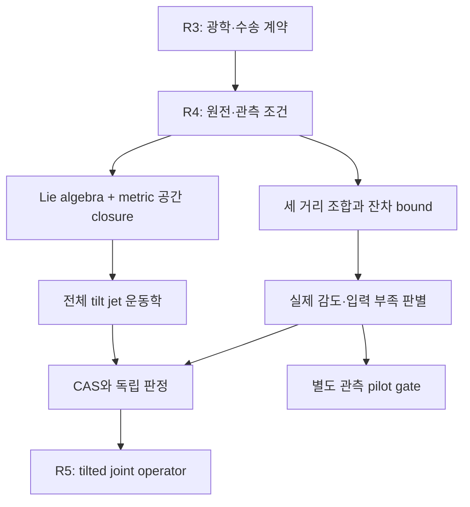

# R4 DAG와 재개 계약

## 닫힌 작업과 열린 gate

과학 의미: 두 closure branch를 독립적으로 관리한다. Homogeneous normal은 ω=A=0의 제한된 congruence; tilted branch의 beta/time jets와 관측 branch의 frame/peculiar-source inputs는 추가로 필요하다. 그림의 화살표는 증거 의존성이지 이미 empirical gate가 통과됐다는 뜻이 아니다.

## 다음 연구루프 prompt

ROLE=CONTINUATION_THEORY_RESEARCH
PROJECT=MES_TENSOR_OPTICAL_COMPARISON
BASE=R4_ALGEBRAIC_SPATIAL_CLOSURE_AND_COMPENSATED_OBSERVABLES
NO_ODE_PDE_BOLTZMANN_EVOLUTION=TRUE
NO_PRODUCTION_MUTATION=TRUE
VIGILODE_DEPENDENCY=NONE

R4/MES_R4_REPORT_KO.md, closure_derivation.md, INDEPENDENT_REVIEW.md, PREREGISTRATION.json, verification raw results, SOURCE_PROVENANCE.json, state/RESEARCH_STATE.json을 읽고 시작하라. R3와 R4에서 끝난 유도·검산을 반복하지 말고 현재 identity만 확인하라. 모델에 맞는 research harness를 적용하고 실제 source 및 새 계산 증거를 보존한다.

우선 목표: 주어진 homogeneous Lie algebra C와 positive metric h, geometric extrinsic curvature K, tetrad time gauge, beta와 beta_dot에서 R4의 exact kinematic adapter를 STF/axial/vector blocks의 finite operator로 정리한다. 특정 Bianchi 이름을 고를 필요는 없다. β=0의 normal closure와 finite β의 time-jet mixing을 분리한다.

1. 하나의 동일시점 joint input domain을 명시한다. Metric positivity, |β|≤β*<1, Einstein/matter compatibility를 가정·검증·미해결로 분류한다.
2. R3 일차 radiation identity에 넣을 때 남는 시간 multipole derivative·source·nonlinear remainder를 정확히 열거한다. 같은 방정식을 양쪽에서 써서 독립 관측인 것처럼 만들지 않는다.
3. 새 bound가 항상 finite인지 또는 어느 최소 time/source allowance에서 finite인지 explicit image 또는 반례로 결정한다. 방향·부호·상관을 보존하며 morphology를 norm으로 미리 줄이지 않는다.
4. 최소 한 비가환 algebra와 비영 tilt의 exact algebraic witness를 lightweight CAS로 검산한다. 이는 실제 우주의 선택된 Bianchi 모형이나 ODE 해를 뜻하지 않는다.
5. 같은 latent state에서 기존 MES reference body를 유지하며 T,Q_outer,F_amp와 D=100(1−sqrt(F_amp))의 set-valued output까지 실제로 작성한다. 관측값이 없다면 sensitivity fixture라고 표시한다. θ와 β에 없는 보편적 MES ceiling을 만들어내지 않는다.
6. 한 명의 후보 생성과 분리된 독립 reviewer가 bounded theory claim을 판정하면 종료한다. Meta-audit recursion 금지.

별도 observational lane은 Paine2020/후속 galaxy catalog의 원문·distance definition·covariance·mask·frame을 먼저 검증하는 경우에만 연다. D=cz/Hfid를 써서 다시 H를 측정하는 순환을 금지한다. Shell 평균에서는 <1/D>와 <D> 및 Peano kernel을 실제 window로 계산한다. Unverified uniform M 또는 source bias를 0으로 놓고 observed percentage를 게시하지 않는다.

반환에는 실제 유도/CAS 결과, 최초 오류, 수정, independent decision, 미해결 empirical 조건을 분리하고 보고서 및 재현 패킷을 저장하라.
